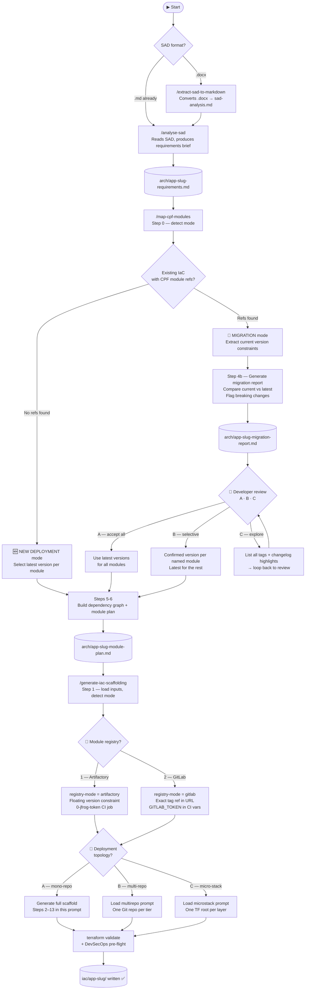

# IaC_Terraform_Agent_4LMP

A reusable GitHub Copilot agent collection that scaffolds production-ready Azure Infrastructure as Code for applications migrating to the LSEG Managed Platform (LMP), using LSEG's Cloud Product Framework (CPF) Terraform modules.

The agent is **not tied to any single application**. Add this folder as a workspace root alongside the application's own repo and open both together as a VS Code multi-root workspace.

---

## Contents

| Folder | What it contains |
|---|---|
| `prompts/` | 3 prompt files covering the full SAD → CPF → IaC scaffolding workflow |
| `skills/` | 2 reusable skills: SAD extractor and CPF schema regenerator |
| `instructions/` | Workspace-level copilot instructions + composite module guidelines |
| `scripts/` | Python + PowerShell helper scripts used by the skills |
| `templates/` | CPF schemas (252 modules), ADRs, patterns, DevSecOps checklist, canonical IaC layout |

---

## Getting Started

The toolkit's Copilot instructions, prompts, and skills live in its own `.github/` folder. VS Code auto-discovers them whenever `IaC_Terraform_Agent_4LMP` is a workspace root — **nothing needs to be copied into your app repo**.

### Step 1 — Clone both repos as siblings

Both repos must sit in the same parent folder:

```
my-workspace/
├── IaC_Terraform_Agent_4LMP/    ← this toolkit
└── my-app/                       ← your application repo
```

```bash
mkdir my-workspace && cd my-workspace
git clone <agents-library-url>       # IaC_Terraform_Agent_4LMP/ lands here
git clone <your-app-repo-url> my-app
```

### Step 2 — Create the `.code-workspace` file

Create `my-app.code-workspace` in the parent folder (`my-workspace/`). Include the
`arch/` sibling folder — this is where the SAD `.docx` lives and where all agent
outputs (Markdown briefs, module plans) are written, keeping the app repo root
dedicated to IaC code only:

```json
{
  "folders": [
    { "name": "IaC_Terraform_Agent_4LMP", "path": "./IaC_Terraform_Agent_4LMP" },
    { "name": "my-app",                   "path": "./my-app" },
    { "name": "arch",                     "path": "./arch" }
  ]
}
```

Then open it in VS Code:

```bash
code my-app.code-workspace
```

All three roots will appear in the Explorer panel. Copilot Chat will automatically pick up the toolkit's instructions, prompts (`/analyse-sad`, `/map-cpf-modules`, `/generate-iac-scaffolding`), and skills.

### Step 3 — Place your SAD document

Create an `arch/` folder **next to** (not inside) your app repo and drop your SAD there:

```
my-workspace/
├── IaC_Terraform_Agent_4LMP/
├── my-app/                     ← IaC code only
└── arch/
    └── MyApp-SAD-v1.0.docx     ← drop your SAD here
```

The agent and extractor script auto-discover the first `.docx` in `../arch/` (relative to
the app repo root) and write all outputs back to the same folder.

### Step 4 — Run the workflow

Open Copilot Chat (`Ctrl+Alt+I`) and run the prompts in order:

| Command | When to use | Output |
|---|---|---|
| `/extract-sad-to-markdown` | Only if SAD is a `.docx` — converts it to Markdown | `arch/sad-analysis.md` |
| `/analyse-sad` | Reads the SAD and produces a requirements brief | `arch/<app-slug>-requirements.md` |
| `/map-cpf-modules` | Maps each service to a CPF Terraform module; detects new vs migration mode | `arch/<app-slug>-module-plan.md` (always) · `arch/<app-slug>-migration-report.md` (migration mode only) |
| `/generate-iac-scaffolding` | Generates full Terraform project + GitLab CI pipeline | `<app-repo>/iac/<app-slug>/` |

> **All intermediate outputs** (`sad-analysis.md`, `*-requirements.md`, `*-module-plan.md`) land
> in the shared `arch/` folder and are never committed to the IaC repo.

#### Specifying a custom input or output folder

By default every prompt looks for inputs in `../arch/` and writes outputs there.
If your SAD lives elsewhere, pass `--arch` and/or `--out` directly in your Copilot Chat message:

```
/analyse-sad
```
> Uses default `../arch/` for both input and output.

```
/analyse-sad --arch C:\repos\myapp\docs
```
> Reads the SAD from `C:\repos\myapp\docs\` and writes the requirements brief there too.

```
/analyse-sad --arch C:\repos\myapp\docs --out C:\repos\myapp\arch
```
> Reads from `docs\`, writes the requirements brief to `arch\`.

```
/analyse-sad C:\repos\myapp\docs\MyApp-SAD-v1.0.docx
```
> A bare `.docx` path is treated as a direct file reference; outputs go next to the file.

The agent echoes the resolved paths before proceeding so you can confirm them.

---

## Agent Reasoning Flow

The agent runs in three sequential phases. Each phase has internal decision branches that affect what gets generated and which versions are used. Understanding these branches helps you know exactly what to expect at each step.

### Full pipeline at a glance



---

### Phase 1 — SAD Analysis (`/analyse-sad`)

The agent reads the Solution Architecture Document and extracts every Azure service, Landing Zone dependency, environment list, and platform constraint into a structured Markdown brief. There are no interactive decisions in this phase — it runs to completion and writes `arch/<app-slug>-requirements.md`.

**If your SAD is a Word document**, run `/extract-sad-to-markdown` first. This converts the `.docx` to plain Markdown so that Copilot can read it without losing table or heading structure.

---

### Phase 2 — CPF Module Mapping (`/map-cpf-modules`)

This is the most complex phase. It contains two nested decision points.

#### Decision 1 — New deployment vs. Migration mode

At the very start (Step 0), the agent searches the app repo's `iac/` folder for
existing Terraform files that reference CPF module sources:

```
# looks for both Artifactory (current) and legacy GitLab (older) source formats
grep -r "artifactory.lseg.com/app-51310-terraform-module-rel__cpf" iac/
grep -r "gitlab.dx1.lseg.com/app/app-51310" iac/
```

| Search result | Mode | Behaviour |
|---|---|---|
| No CPF references found | **New deployment** | Maps each service to a CPF module, selects the **latest available version** for every module. Writes `module-plan.md` and stops. |
| CPF references found | **Migration** | Maps services, extracts current version constraints from the existing files, generates a migration report, and **pauses for developer review** before writing the plan. |

#### New deployment mode — version selection

The agent queries `@cpf-genie get all tags for <module-name>` for each selected module and pins the latest release as the version floor:

```hcl
# example — latest tag is 0.9.1
source  = "artifactory.lseg.com/app-51310-terraform-module-rel__cpf/azure-prdsvc-terraform-subnet/azure"
version = ">= 0.9.1, < 1.0.0"
```

No developer interaction is required — the agent writes `module-plan.md` directly.

#### Migration mode — version review (Step 4b)

The agent builds a comparison table of every CPF module in use:

| Module | Current constraint | Latest | Change type | Breaking changes |
|---|---|---|---|---|
| `azure-prdsvc-terraform-keyvault` | `>= 1.1.0, < 2.0.0` | `1.2.3` | patch | None |
| `azure-prdsvc-terraform-postgresql` | `>= 1.0.0, < 2.0.0` | `2.1.0` | **MAJOR** | New required input; renamed output |

This is saved to `arch/<app-slug>-migration-report.md`. The agent then **stops and presents
the following choice** to the developer:

```
📋 CPF Module Migration Review — arch/<app-slug>-migration-report.md

A — Accept all recommended upgrades (use latest versions for all modules)
B — Accept updates selectively (tell me which modules to upgrade)
C — Explore available versions for a specific module (see all tags + changelog)
```

#### Decision 2 — Developer version selection (A / B / C)

```
Developer choice → Outcome
─────────────────────────────────────────────────────────────────────────────
A (accept all)    All modules pinned to their latest release in module-plan.md
B (selective)     Named modules use developer-specified version; rest use latest
C (explore)       Agent lists all tags with changelog highlights for the named
                  module, then loops back to A / B / C — repeat until confirmed
```

Only after the developer confirms their selection does the agent proceed to build
the dependency graph (Step 5) and write `module-plan.md` (Step 6).

#### Outputs of Phase 2

| File | Always written | Migration mode only |
|---|---|---|
| `arch/<app-slug>-module-plan.md` | ✅ | ✅ |
| `arch/<app-slug>-migration-report.md` | — | ✅ |

---

### Phase 3 — IaC Scaffolding (`/generate-iac-scaffolding`)

#### How mode propagates from Phase 2

The agent checks for `arch/<app-slug>-migration-report.md` at startup:

| File present? | Mode | Version rule in Step 10 |
|---|---|---|
| No | New deployment | Call `@cpf-genie latest tag` for any module without a recorded version |
| Yes | Migration | Use developer-confirmed version from the report; **do not** override with a newer tag |

#### Decision 3 — Module registry (`<registry-mode>`)

Immediately after the topology choice, the agent asks how Terraform should resolve CPF modules:

```
Registry choice → Source format generated
──────────────────────────────────────────────────────────────────────────────────────────
1 (Artifactory)  source  = "artifactory.lseg.com/app-51310-terraform-module-rel__cpf/…/azure"
                 version = ">= <tag>, < <next-major>.0.0"
                 CI: adds 0-jfrog-token vault job + .jfrog-config terraformrc anchor

2 (GitLab)       source = "git::https://gitlab.dx1.lseg.com/app/app-51310/…/<module>.git?ref=<tag>"
                 No version constraint — tag is locked in the URL
                 CI: no JFrog job; GITLAB_TOKEN must be pre-configured in project settings
```

If migration mode is active and the existing IaC already uses one format, the agent
defaults the suggestion to match — but always confirms with the developer first.

#### Decision 4 — Deployment topology (A / B / C)

Before creating any file, the agent asks the developer to choose how the IaC
repositories should be structured:

```
Topology → Structure
──────────────────────────────────────────────────────────────────────────────────────────
A (mono-repo)    All composite module groups in one Git repo, one TF state per environment
                 Best for: simplicity, deploy-all-together releases
                 → Steps 2–13 run in this prompt

B (multi-repo)   Each composite group gets its own Git repo, pipeline, and TF state
                 Best for: per-tier RBAC, independent release cadences
                 → Hands off to generate-iac-scaffolding-multirepo.prompt.md

C (micro-stack)  One Git repo; each infrastructure layer is a separate TF root with its
                 own state. Layers are sequenced by a stack-orchestrator CI pipeline.
                 Best for: > 50 CPF modules, > 8 groups, plan time > 10 min, multi-team
                 → Hands off to generate-iac-scaffolding-microstack.prompt.md
```

The **CPF module count** (from the module plan) auto-narrows the sensible choice:

| Module count | Forced layout within chosen topology |
|---|---|
| < 10 | Flat `terraform/main.tf` (all CPF calls in one file) |
| 10 – 50 | Composite layout (`terraform/modules/<group>/`) |
| > 50 or Micro-Stack signals | Escalate — confirm Option C |

#### Validation gate (mandatory)

After all files are written, the agent runs:

```bash
terraform init -backend=false
terraform validate
```

All errors must be resolved before the summary is printed. A scaffold that fails
`terraform validate` will fail in the GitLab CI pipeline on first run.

---

## Prerequisites

| Requirement | Details |
|---|---|
| VS Code | Latest stable release |
| GitHub Copilot + Copilot Chat | Agent/chat support enabled (v0.22+) |
| `cpf-genie` VS Code extension | Optional — for manual module enrichment; the agent reads `templates/cpf-schemas/` directly without it |
| Python 3.9+ | Required only for `/extract-sad-to-markdown` to pre-process a SAD `.docx` |
| PowerShell 7+ | Required only if regenerating CPF schemas via `scripts/Generate-CpfSchemas.ps1` |

Install the Python dependency for the SAD extractor (run once):
```bash
pip install python-docx
```

---

## Templates Reference

The `templates/` folder is the agent's shared knowledge base. **Always load indexes, not raw files** — the templates folder contains 783 files; loading everything would exhaust the context window.

| Path | What the agent uses it for |
|---|---|
| `templates/INDEX.md` | Master navigation index — agent loads this first |
| `templates/cpf-schemas/_catalog.json` | 252 CPF module schemas — consulted during `/map-cpf-modules` |
| `templates/adrs/INDEX.md` | 18 ADRs summarised (network, compute, monitoring, data) |
| `templates/patterns/INDEX.md` | 70+ LMP migration patterns with CPF module cross-references |
| `templates/DevSecOps-Checklist/INDEX.md` | Security rules + IaC evaluation checklist |
| `templates/PLATFORM-GUIDES-INDEX.md` | Networking topology, Azure regions, subnet CIDR ranges |
| `templates/infrastructure-main/` | Canonical Terraform project layout (flat + composite) |

---

## Scripts Reference

| Script | Language | When to run | How to run |
|---|---|---|---|
| `scripts/Extract-SadToMarkdown.py` | Python | Convert SAD `.docx` before `/analyse-sad` | From your **app repo root**: `python ../IaC_Terraform_Agent_4LMP/scripts/Extract-SadToMarkdown.py` — auto-discovers `.docx` in `../arch/` and writes outputs there. Pass `--sad <path>` and/or `--out <path>` to override. |
| `scripts/Generate-CpfSchemas.ps1` | PowerShell | Regenerate `templates/cpf-schemas/` after CPF module updates | From the **toolkit root**: `pwsh scripts/Generate-CpfSchemas.ps1` |

---

## AI Credit Estimation

GitHub Copilot consumes **premium requests** (one per chat turn) when running this agent. Estimates below are based on measured file sizes of all context loaded per phase.

### How estimates are calculated

Each phase loads a fixed set of files into the model context window plus variable content (SAD document, generated outputs). Total token consumption = fixed context + variable content + generated output. Each user-initiated chat turn (including agent decision gates) counts as **1 premium request**.

**Fixed context loaded per session:**

| Component | ~Tokens | Loaded in |
|---|---|---|
| `copilot-instructions.md` | 13,000 | Every turn |
| `analyse-sad.prompt.md` | 8,800 | Phase 1 |
| `_catalog.json` (252 CPF modules) | 19,000 | Phase 2 |
| `generate-iac-scaffolding.prompt.md` | 16,000 | Phase 3 |
| `generate-iac-scaffolding-microstack.prompt.md` | 7,400 | Phase 3 (S3 only) |
| `adrs/INDEX.md` + `patterns/INDEX.md` + `DevSecOps/INDEX.md` | 14,800 | Phase 1 + 3 |
| `map-cpf-schema-*` sub-prompts (5 tier agents) | 11,200 | Phase 2 |
| `iac-composite-modules.md` | 7,500 | Phase 3 (S2/S3) |

### Scenario baseline (new deployment, SAD already in `.md`, no re-generation)

| | **S1 — ≤ 20 resources** | **S2 — ≤ 50 resources** | **S3 — > 100 resources** |
|---|---|---|---|
| Resource types | IaaS + PaaS | IaaS + PaaS + CaaS | IaaS + PaaS + CaaS + FaaS |
| Est. CPF modules | 8–15 | 20–35 | 40–70 |
| IaC layout | Flat / Composite | Composite (Option A/B) | Micro-Stack (Option C) |
| Phase 1 `/analyse-sad` | ~43K tokens / 3 turns | ~51K tokens / 3 turns | ~68K tokens / 3–4 turns |
| Phase 2 `/map-cpf-modules` | ~50K tokens / 2 turns | ~65K tokens / 2 turns | ~91K tokens / 3 turns |
| Phase 3 `/generate-iac-scaffolding` | ~60K tokens / 2–3 turns | ~98K tokens / 3–6 turns | ~157K tokens / 8–12 turns |
| **Total tokens** | **~168K** | **~234K** | **~346K** |
| **Premium requests** | **~6–8** | **~10–15** | **~18–25** |

> Phase 2 is an orchestrator that spawns up to 7 parallel sub-agents (one per service tier). Each sub-agent loads only its tier's schemas (≤ 15 schemas), keeping individual context windows small even for large applications.

> Add ~15–30K tokens and 1–2 turns if the SAD is a `.docx` file (Phase 0 `/extract-sad-to-markdown` runs first).

### Variance by developer behaviour

The following actions increase token and premium request consumption beyond the baseline:

| # | Action | Extra tokens | Extra turns | Notes |
|---|---|---|---|---|
| 1 | SAD is `.docx` — Phase 0 extract triggered | +15–30K | +1–2 | Avoidable: pre-convert to `.md` |
| 2 | Migration mode (existing IaC detected) | +20–50K | +2–4 | Adds `map-cpf-migration-diff` sub-agent + human gate |
| 3 | Option C loop per module version explored | +8–10K | +1 per module | Phase 2 human gate choice C |
| 4 | cpf-genie snippet pasted per service | +1K | 0 | Inline context; improves module accuracy |
| 5 | Architecture diagram analyzed (vision) | +1.5K per image | 0 | Phase 1 Pass 2 |
| 6 | "Explain why this module" question | +3K output | +1 per ask | Any phase |
| 7 | "Show trade-offs for topology A/B/C" | +10K output | +1 | Phase 3 decision |
| 8 | ADR / pattern deep-dive request | +8K | +1 | Any phase |
| 9 | Partial re-generation (1 module) | +25–35% Phase 3 | +1–2 | Most common cause of budget overrun |
| 10 | Full IaC re-generation | +65–80% Phase 3 | +3–5 | Topology or naming rework |
| 11 | `terraform validate` failure + fix cycle | +20–30K | +1–2 per cycle | Phase 3 mandatory gate |
| 12 | Topology change mid-session (A→B or B→C) | +20–40K | +2–3 | Decide topology before Phase 3 |
| 13 | Additional requirements added mid-session | +5K per addition | +1 per add | Any phase |

### Scenario ranges including variance

| Behaviour | **S1 — ≤ 20 resources** | **S2 — ≤ 50 resources** | **S3 — > 100 resources** |
|---|---|---|---|
| 🟢 **Lean** — SAD in `.md`, new deploy, accepts first output | ~120K / **4–5 reqs** | ~165K / **7–9 reqs** | ~240K / **11–16 reqs** |
| 🟡 **Baseline** — workflow as designed | ~168K / **6–8 reqs** | ~234K / **10–15 reqs** | ~346K / **18–25 reqs** |
| 🟠 **Extended** — migration mode + 3 explains + 1 partial re-gen | ~270K / **13–19 reqs** | ~375K / **20–28 reqs** | ~555K / **30–42 reqs** |
| 🔴 **Heavy** — multiple re-gens + validate failures + topology change | ~420K / **22–30 reqs** | ~585K / **30–42 reqs** | ~870K / **50–72 reqs** |

**Re-generation is the dominant cost driver.** A single full re-generation adds 65–80% of Phase 3 baseline cost. Resolve topology, naming conventions, and module version decisions *before* running `/generate-iac-scaffolding` to stay in the 🟡 Baseline band.

---

## Contributing

To update CPF schemas after a module change:
1. Update the relevant `templates/cpf/<module-name>/index.md`
2. From the `IaC_Terraform_Agent_4LMP/` folder, run: `pwsh scripts/Generate-CpfSchemas.ps1`
3. Commit both the updated `index.md` and the regenerated schemas in `templates/cpf-schemas/`

To refresh all CPF schemas directly from LSEG GitLab (requires a valid GitLab PAT):
```powershell
pwsh scripts/Fetch-GitLab.ps1 -GitLabToken "<your-pat>"
```
