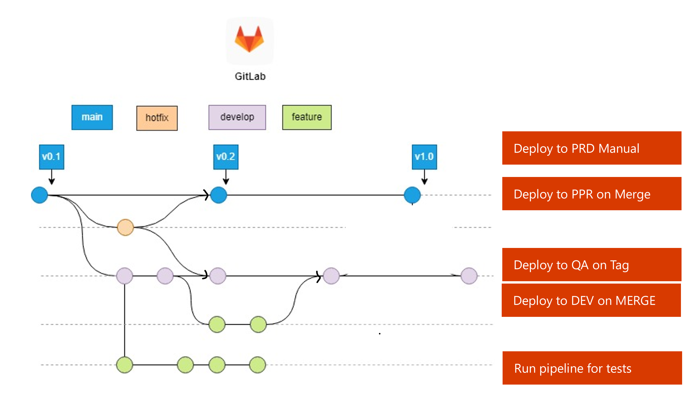

# Deployment Process and Strategies

## Deployment Strategies
Choosing the right deployment strategy is crucial for ensuring smooth updates, minimizing downtime, and maintaining system stability during production releases. The deployment process itself—covering build, versioning, and publishing—remains largely the same across strategies, but the approach to deployment can vary based on your application’s needs, the complexity of your infrastructure, and your business goals. Here’s a breakdown of three common deployment strategies:

### **1. Blue-Green Deployment**
Blue-Green deployment involves maintaining two identical production environments (Blue and Green), with only one active at any given time. The new version gets deployed to the inactive environment. Once verified, traffic is switched to the new environment, ensuring a smooth transition.  
- **When to Use:** This is ideal for applications that require zero downtime and need the ability to quickly roll back to the previous version if something goes wrong.  
- **Pros:** Zero downtime and quick rollback. Since traffic is switched between identical environments, you can test in production without impacting users.  
- **Cons:** It requires maintaining two full production environments, which can be resource-heavy. Automation of this process is also complex, as the pipeline must ensure both environments stay in sync.  
- **How It Works:** Deploy to the inactive environment (Green), verify it works as expected, and switch traffic over from Blue to Green. This ensures an immediate rollback if needed.
- **Branching Implication and Considerations -** Blue-Green deployments typically require a stable release branch that represents the version to be deployed. Developers might merge changes into this branch after thorough testing.
    - Feature branches can be merged into the release branch, ensuring a clean and tested version is deployed to the inactive environment.
    - Hotfixes or emergency changes might be handled through a dedicated branch to maintain the stability of both environments.
- **Repository Implication and Considerations:** 
    - Monorepo: Works well if multiple services need to be deployed together in a coordinated manner. 
    - Multi-Repo: Requires careful orchestration across repositories. If multiple services depend on each other, you’ll need additional tooling or communication to synchronize deployments.

### **2. Rolling Deployment**  
Rolling deployment gradually updates your application on a set of servers or instances, with a subset still running the old version while the new version gets rolled out incrementally.  
- **When** to Use: Ideal for systems that must remain available at all times, and where you need to avoid downtime while progressively updating.  
- **Pros:** Rolling updates ensure there is always a portion of the app running the old version, reducing downtime. It's suitable for microservices or applications with multiple instances that need continuous availability.  
- **Cons:** Rollbacks are more complicated since you have to undo the update on individual instances, rather than switching between entire environments. Managing versions during the deployment process can get tricky, especially if your update involves database changes or major infrastructure changes.  
- **How It Works:** You gradually roll out the new version across the fleet of instances, monitoring the performance of each as it gets updated. Once the rollout completes, all instances are running the latest version.
- **Branching Implication and Considerations -**  A trunk-based branching strategy often aligns well with rolling deployments, as small, incremental updates are pushed continuously to production.
    - Developers merge changes frequently to the main branch, ensuring code is always ready for incremental deployment.
    - Continuous integration (CI) and continuous deployment (CD) pipelines play a critical role in managing the incremental rollout.
    - Feature toggles or flags might be used to manage partially complete features in the codebase during a rollout.
- **Repository Implication and Considerations:** 
    - Monorepo: Rolling out updates across multiple services can be managed centrally, but it requires strong automation to avoid updating incompatible services simultaneously. 
    - Multi-Repo: Rolling deployments for individual services are straightforward since changes are scoped to a single repository. However, if dependencies exist, you’ll need mechanisms to ensure compatibility.

### **3. Canary Deployment**  
Canary deployment releases the new version to a small, controlled subset of users or servers before rolling it out to the entire user base. It’s used to test new features or updates in a real-world environment, but with minimal risk to the production system.  
- **When to Use:** Best suited for testing features or new updates in production with the least amount of user disruption. Ideal for testing the waters before a full deployment.  
- **Pros:** By limiting the exposure of the new version to only a fraction of users, you can quickly detect issues without impacting the broader user base.  
- **Cons:** Requires complex monitoring and traffic management. You’ll need robust tooling to route traffic to the canary group and handle any issues that arise.  
- **How It Works:** Direct a small percentage of traffic to the canary instances, verify performance and user feedback, and then gradually increase the percentage of traffic to the new version if no issues are detected.
- **Branching Implication and Considerations -**  Canary deployments often benefit from feature branch workflows or trunk-based strategies, depending on the size and scope of changes being released.
    - Feature branches are merged into the main branch after testing, with canary deployments used to test these changes in production for a small subset of users.
    - Feature flags are often critical to selectively enabling new features for specific users or regions during the canary phase.
 - The branching strategy must allow for quick rollbacks or adjustments if issues are detected in the canary phase.
- **Repository Implication and Considerations:** 
    - Monorepo: Effective when deploying coordinated changes across multiple services. Canary instances can be tested with combined changes from multiple components. 
    - Multi-Repo: Easier to manage when individual services have separate release cycles, allowing granular control over what is canaried and when.

### **4. ...and many others**

Apart from these three widely used deployment strategies there are many varians, like: 
- **Shadow Deployment**: In shadow deployments, a new version of an application runs in parallel with the current version, but its traffic is not directed to real users. Instead, it handles the same input as the live version and processes it in the background (i.e., “shadows” the live application). This is used to validate performance, accuracy, and stability.
- **Dark Launch**: A dark launch is similar to a canary deployment but with a twist: the new version is deployed to production, but it is not exposed to users directly. Instead, only internal stakeholders or a small group of users can access it, or specific API endpoints are activated without impacting the broader user base.
- **Immutable Deployment**: Immutable deployment involves deploying entirely new instances of an application for every release, as opposed to updating existing instances. This ensures that the environment is identical every time, removing potential issues from configuration drift or legacy changes.

## Deployment Process
**Note on LMP Migration**

In the context of the LSEG and LMP migration, it is essential to recognize that each deployment strategy has its own set of benefits, depending on the complexity of the system, the capabilities of the application team, and the level of risk you're willing to take. When choosing a strategy, carefully weigh the trade-offs and ensure it aligns with LSEG processes, as well as the tools you are using, such as GitLab and Azure. Another key factor to consider is the team topology, as this can influence how the deployment strategy should be implemented. For instance when an application has different support groups that are responsible for application and infrastructure deployment, in that scenario use a multi-repo setup to satisfy RBAC needs.

To make a well-informed decision, we recommend collaborating with the application team to create a **deployment process view** that clearly outlines the steps from the **first commit** to **production deployment**. This approach will help prevent potential lock-ins with Infrastructure-as-Code (IaC) and CI/CD pipelines at cut-over time, ensuring that the deployment process aligns with both the RACI of the team and any technical requirements they may have. This collaborative process ensures that changes can be made to the IaC in a way that meets the needs of both the team and the overall project.

**Deployment process considerations**

- Define a Branching Strategy that fits your technology stack and operations
- Ensure all the mandatory elements are implemented:
    - Use the Global Compliance Framework (GCF): https://gitlab.dx1.lseg.com/ci/stable/compliance/global-compliance-framework
    - Use CPF modules for infra deployments: https://gitlab.dx1.lseg.com/app/app-51310/azure/prdsvc
    - Guidelines on howto
        - Use patterns for Infra-as-Code and Code Rollback: https://app.pages.dx1.lseg.com/app-51723/migration-patterns/mig-pat-source-to-target/patterns/development-platform/0032-managing-iac-and-package-rollback/
        - Use patterns for Managing Versions of Code & Configuration: https://app.pages.dx1.lseg.com/app-51723/migration-patterns/mig-pat-source-to-target/patterns/development-platform/0033-managing-releasable-versions/
        - Use patterns for Managing Terraform Artefacts: https://app.pages.dx1.lseg.com/app-51723/migration-patterns/mig-pat-source-to-target/patterns/development-platform/0034-terraform-artefacts/ 
        - Use Patterns for Managing Segregation of Duties via Gitlab: https://app.pages.dx1.lseg.com/app-51723/migration-patterns/mig-pat-source-to-target/patterns/development-platform/0035-segregation-of-duties/
    - Follow the guidelines in the SCF: https://confluence.refinitiv.com/display/PSAR/Security+Control+Framework+-+WIP    
- Determine **how** code moves from initial commit to the main branch
    - Who is responsible for the deployment to the environments
    - When is code deployed to an environment
    - How to secure and safeguard code quality
    - How testing is done
  Below is an actual example picture that outlines the aformentioned elements
  
    - Green circle: Developer creates a branch to do a code change, on every commit to this branch automated testing takes place (for instance GCF)
    - From Green cirlcle to Purple circle: Developer makes a MR which merges the codechanges to the develop branch. After completed MR a deploymnet is done to the **Dev** environment
    - After successfull testing the Dev branch is tagged so that the testing team can do all of the testing based on the new code
    - From Purple circle to Blue Circle: a MR is created to add the code to the main branch. The MR also triggers a deployment to the PPR environment
    - Finally after the tests are completed on the PPR environment a manual deployment is done to the PRD environment
