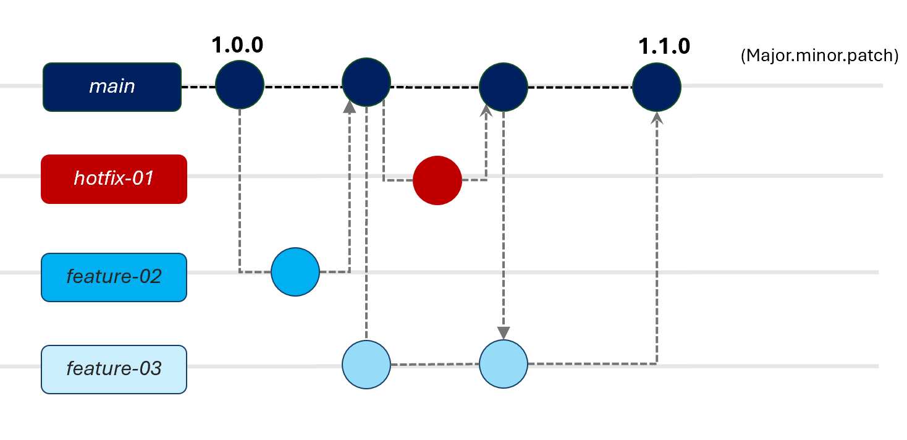
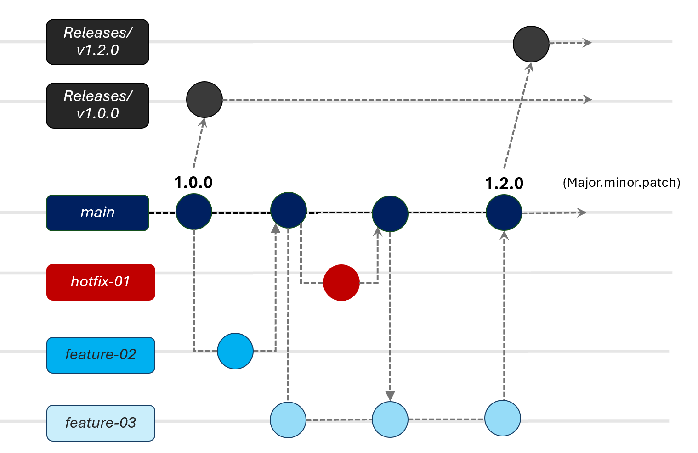
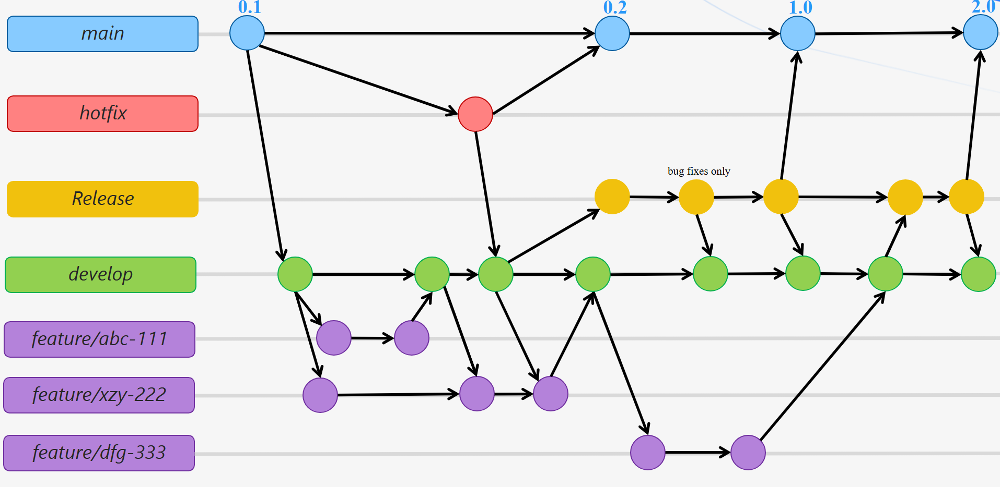

# 🌿 Branching Strategies: Trunk-Based Development vs GitFlow
 
A good branching strategy enables safe, scalable, and efficient collaboration across teams. While **simple, lightweight workflows** are ideal, they may not be suitable for every project—especially in environments with strict release cycles or multiple live versions.

It's important to consider your application lifecycle and other requirements when designing your branching strategy, as choosing the correct strategy will enable safe and efficient release of changes.
 
This guide compares two widely used models: **Trunk-Based Development (TBD)** and **GitFlow**.
 
 
## 🚀 Trunk-Based Development (TBD)
 
All developers integrate into a single main branch (`main` or `trunk`), often using short-lived feature branches that are merged frequently.
 

 
### ✅ When to Use
 
- Teams practicing **continuous integration** and **continuous delivery**
- Projects with **frequent releases** and a **single live production version**
- Small to mid-sized teams with **strong automation discipline**
 
### 🔧 Key Practices
 
1. **Single Branch:** Code is integrated directly into `main`
2. **Short-Lived Feature Branches:** If used, they are merged quickly (daily or faster)
3. **Feature Toggles:** Used to hide incomplete features in production
4. **Automated Testing:** Every commit triggers automated tests
5. **Release Branches (optional):** Created temporarily to stabilize a release
6. **Hotfix Branches:** Created from `main` for urgent production issues, merged back after resolution
 
### ✔️ Advantages
 
- Simplifies merge logic and reduces long-lived branches
- Encourages rapid feedback and integration
- Supports high-velocity CI/CD workflows
 
### ⚠️ Drawbacks
 
- Requires strong test coverage and CI pipelines
- If not using release branches, incomplete or buggy features can leak into production if not well-guarded with feature toggles
- Less ideal if you maintain multiple active production versions
 

## 📦 Extending Trunk-Based Development (TBD) with Release Branches
 
While pure Trunk-Based Development (TBD) avoids long-lived branches, many teams adapt it by introducing **temporary release branches** to support stabilization, QA, and controlled deployments — without sacrificing the benefits of rapid integration.

 
### 🧩 Why Extend TBD with Release Branches?
Pure TBD enables CI/CD and rapid deployment of changes to production. However, in practice, teams often need a stable window to:
- Perform testing on a stable version of the branch without receiving new changes or blocking `main`
- Deploy features in a **predictable, scheduled release**
- If necessary, support temporary **code freeze** periods
 
### 🔧 How It Works
 
1. A release branch (e.g., `release/1.5`) is created from `main` at a cut-off point.
2. Final **bug fixes and test adjustments** are made directly in the release branch.
3. Critical fixes on `main` can be cherry-picked or merged into the release branch if needed, but otherwise, development changes are not merged from main after the release branch is cut.
4. Once deployed:
   - Merge the release branch back into `main` (and possibly a `maintenance` branch if applicable).
   - Tag the release (e.g., `v1.5.0`).
   - Delete the release branch.
 
### ✔️ Benefits
 
- Enables **ongoing development** to continue on `main`
- Supports **QA or sign-off gates** before release
- Allows **short-term parallelization** without long-lived divergence
 
### ⚠️ Considerations
 
- Keep release branches **short-lived** — ideally under a week
- Avoid merging features directly into release branches
- Ensure CI/CD pipelines run on both `main` and release branches
- Merge hotfixes made in release back into `main` to avoid divergence
 
> 🔄 This model blends TBD’s fast flow with GitFlow’s release rigor, providing a good balance for teams scaling up or working in regulated environments.

 
## 🧩 GitFlow
 
GitFlow introduces structured long-lived branches to manage development, testing, releases, and hotfixes.
 

 
### ✅ When to Use
 
- Projects with **scheduled releases** and **multiple supported versions**
- Teams that need **clear isolation between development and production**
- Applications with **manual QA**, **regression cycles**, or regulated processes
 
### 🔧 Key Branches
 
- **`main` (or `master`)** – Stable production-ready code
- **`develop`** – Integration branch for feature development
- **Feature branches** – Created from `develop`, merged back when complete
- **Release branches** – Created from `develop` for final QA and release prep
- **Hotfix branches** – Created from `main` for urgent production issues
 
### ✔️ Advantages
 
- Clear separation of development, testing, and release phases
- Easy to maintain **multiple release lines**
- Helps teams isolate unstable or in-progress work from production
 
### ⚠️ Drawbacks
 
- More complex to manage, especially with small teams
- Increases merge overhead and time to release
- Can introduce delays without strong automation

## 🧠 Choosing the Right Strategy
 
| Scenario | Recommended Strategy |
|----------|----------------------|
| Rapid iteration, single live version, strong CI | **Trunk-Based Development** |
| Multiple live versions, scheduled releases, manual QA | **GitFlow** |
| Small, experienced team with automation | **TBD** |
| Larger or regulated team needing process separation | **GitFlow** |
 
> ✳️ Your branching strategy should evolve with your team. Start simple, and scale complexity only when your process demands it.

## 🛠️ Implementing in GitLab
 
Both strategies can be implemented using GitLab CI/CD pipelines and **branch-specific rules**.
 
- Use `only/except` or `rules:` in `.gitlab-ci.yml` to trigger jobs by branch
- Example GitFlow implementation: [GitLab Rules Examples](GITLAB_GIT_FLOW.md)
 
---
 
