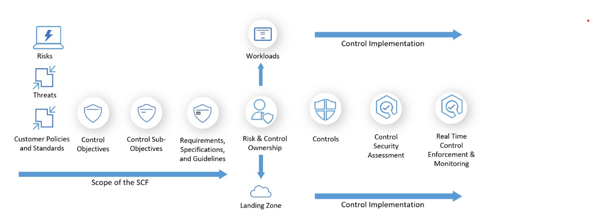

# Security Practices
## Table of Contents

- [Secure By Design](#secure-by-design)
    - [What is SCF](#what-is-scf)
    - [Leverage SCF](#how-do-we-leverage-scf)
- [Application Security](#application-security)
- [Secret Management](#secret-management)
- [Secure By Default](#secure-by-default)

## Secure By Design

As we move applications to cloud we should know threats that may exist based on the current design. For these threats, we will have risk driven cloud native security controls. This drives technical control design and implementation of security controls.

### What is SCF?

The Security Control Framework (SCF) prescribes risk driven security control objectives aligned to a specific risk profile. The SCF contains protective and detective controls to secure the confidentiality and integrity of data and cloud-based applications. Typical controls in the SCF are controls such as:

- Identity Protection
- Data Encryption
- Threat Protection and Vulnerability Management
- Platform and resource auditing

The following diagram gives you a conceptual view of SCF.  
[SCF Terminology](https://dev.azure.com/LSEGroup/FoundationBoards/_wiki/wikis/Cloud%20Security%20Control%20Framework/3121/Introduction)

### How do we leverage SCF?
SCF implementation and risk assessment entails two key components to ensure that 
 - Design and implementation of security controls establish the required security levels 
 - Bring residual risk levels to an acceptable level.

#### SCF Security Risk Assessment
For each threat in the [SCF Threat Catalog](https://dev.azure.com/LSEGroup/FoundationBoards/_wiki/wikis/Cloud%20Security%20Control%20Framework/3152/Threat-Catalog) and mapped risks in the [SCF Risk Catalog](https://dev.azure.com/LSEGroup/FoundationBoards/_wiki/wikis/Cloud%20Security%20Control%20Framework/3127/Risk-Catalog), all linked [SCF Control Objectives](https://dev.azure.com/LSEGroup/FoundationBoards/_wiki/wikis/Cloud%20Security%20Control%20Framework/3079/Control-Objectives) controls must be assessed to validate if the set of complementary control objectives mitigate a single threat and linked LSEG risks to an acceptable level. 

The risk assessment of the SCF control objectives is a point in time assessment that is bound to the release of the SCF, and is subsequently leveraged by control implementation owners to enable a consistent and traceable approach for designing, implementing, and assessing technical controls at scale.

#### SCF Implementation
SCF control implementation owners must identify the applicable SCF Controls and control sub-objectives for their applicable implementation layer (Cloud Foundation/Landing Zone, clear listed cloud product, application/workload). Some SCF control sub-objectives can be the responsibly of other teams like the Identity and Access Management Team and GSOC. The technical control design must meet SCF control sub-objective through documentation review, and the implementation/deployment must correspond with the technical design and evidence effectiveness.

When trying to implement the SCF controls for any application please create a copy of the [SCF implementation tracker](https://dev.azure.com/LSEGroup/FoundationBoards/_wiki/wikis/Cloud%20Security%20Control%20Framework/3150/SCF-Control-Implementation-Tracker) to track the current state and the design decisions. The controls that are expected to be implemented can then be created as ADO work items for the application
 
## Application Security
Here are the cyber Minimimum Entry Criteria that the application must adhere to during the migration.
[Cyber Minimum Entry Criteria](https://lsegroup.sharepoint.com/:x:/r/sites/ats/_layouts/15/Doc.aspx?sourcedoc=%7BA6594950-20BB-492D-B585-C8F976B5FE23%7D&file=2888825445AzureLZHostedApps-CyberMinimumEntryCriteria-v3_2_0_2-FINAL.xlsx&action=default&mobileredirect=true)
This covers the areas like
- Network Security
- Software Security
- Protection of Data
- Penetration testing
- Secure Configuration
- Secure Administration
- Security Management
- Hardened Configuration
- Logging and Monitoring
- Avalability and Resilience
- Architectural Incident Readiness
- Identity and Access management

 
## Secret Management
Secret management is the process of securely storing, accessing, and managing sensitive information like passwords, API keys, and certificates. It is crucial for each application team irrerespective of any repo as it helps prevent unauthorized access, reduces the risk of data breaches, and ensures the security of applications and infrastructure. In LSEG we use vaults managements tools like Hashicorp and Azure Key vault for storing secrets 

**What needs be stored in vaults**

 Application secrets(eg Artifactory/Application password , API keys, 3rd party service credentials etc)
 Certificates (eg: SSL/TLS and thier private keys, Root CA Certifactes etc )
 Secrets for Microservices and Containers (eg:service accounts keys/token etc)

**General Guidelines** (From Devops Enablement HUB )

   Don't store secrets in source control, ever. Probably the most important fundamental rule of secret management. You should never upload any secrets to a version control system such as git. If you do anyways this can lead to several issues such as:

- The secret being available to everybody that has at least read access on the repository
- The inability to effectively remove secrets from source control after they've been added once as they become part of the repository's history
- The spread of secrets across many different copies through branches that you may not be aware of
- The automatic raise of security incidents in case a secret scanner tool picks up on the credential
- Do not print the secrets in pipeline logs if its done for testing perspective remove the snippet and rotate the original value at it's source, be it a new secret, key or certificate to truly render the original value invalid

**When and Which vault management tool to use:**

| Scenario                           | Use HashiCorp Vault  | Use Azure Key Vault  |
|---------------------------------   |--------------------- |----------------------|
| Multi-cloud or hybrid workloads    | ✅                   | ❌                   |
| Azure-only workloads               | ❌                   | ✅                   |
| Dynamic secrets                    | ✅                   | ❌                   |
| Advanced policies and workflows    | ✅                   | ❌                   |
| Cost-sensitive for Azure resources | ❌                   | ✅                   |
| Compliance tied to Azure regions   | ❌                   | ✅                   |
| PKI management                     | ✅                   | ✅                   |
 

## Secure By Default

Cyber Security Engagement team performs certain checks on the application as part of the Service Transition process.

This is to verify that key cyber security controls are correctly implemented by the system/application that is in production.

The detailed list of checks and how to initiate the checks is available here [Cyber Pre Go Live checks](https://lsegroup.sharepoint.com/sites/CyberSecurity/SitePages/Cyber-Security---Pre-Go-Live-Checks%20(Archive).aspx)
