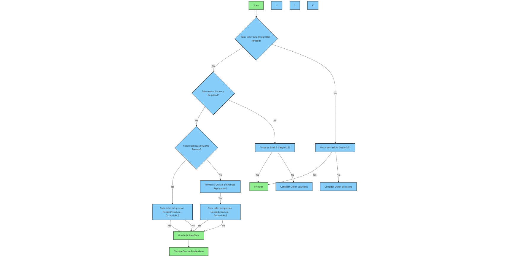

        

Document Metadata

|  |  |
|----|----|
| Identifier | **`LMP-ADR-0018`** |
| Type | **ADR** |
| Status | **Published** |
| Approvals | LMP Migration Architecture Approval |
| Published on | **July 21, 2025** |
| Valid From | **July 21, 2025** |
| Authors |   |
| Tags | Data Management |
| Technology Capabilities | Platform / Data / Data Management / Integration & Distribution |

# Use Oracle Goldengate for low latency Change Data Capture and Cross System Streaming Solution<a href="#use-oracle-goldengate-for-low-latency-change-data-capture-and-cross-system-streaming-solution" class="headerlink" title="Permanent link">¶</a>

## Context and Problem Statement<a href="#context-and-problem-statement" class="headerlink" title="Permanent link">¶</a>

Modern enterprises require real-time, reliable, and scalable data movement across diverse systems for analytics, operational resilience, and digital innovation. However, selecting the right data integration and Change Data Capture (CDC) solution involves trade-offs between real-time replication performance, data transformation capabilities, ease of deployment, and cost.

## Key Considerations<a href="#key-considerations" class="headerlink" title="Permanent link">¶</a>

Fivetran and Striim are primarily ETL tools, with a focus on transformation, often performed in batches. This can result in lower real-time streaming capabilities compared to Oracle GoldenGate. GoldenGate's primary focus is replication, with minimal transformation, enabling high real-time performance. The choice between them depends heavily on the use case: whether the priority is pure real-time streaming or if significant data transformation is also required. Oracle GoldenGate for Distributed Applications and Analytics is a separate component, specifically designed for replicating to data lakes and integrating with big data frameworks.

## Decision Drivers<a href="#decision-drivers" class="headerlink" title="Permanent link">¶</a>

- **Ultra-Low Latency Real-time Replication:** When sub-second latency for replicating transactional data is absolutely critical for operational systems, high availability, or disaster recovery.
- **Strict Transactional Data Consistency:** When maintaining data integrity and consistency across replicated systems is paramount, leveraging its log-based CDC.
- **Strong Oracle Ecosystem Integration:** When the environment heavily relies on Oracle databases, benefiting from optimized performance and support for Oracle-specific features.
- **Mission-Critical Reliability:** For demanding, mission-critical environments where data loss or inconsistency is unacceptable, relying on GoldenGate's proven stability.
- **Granular Control and Customization (if needed):** When a high degree of control and customization over the replication process is required, allowing for complex filtering and routing.
- **Replication to Data Lakes / Big Data:** When replicating data to data lakes (e.g., Azure Data Lake) or integrating with big data frameworks (e.g., Databricks) is a key requirement, consider Oracle GoldenGate for Distributed Applications and Analytics.

## Considered Options<a href="#considered-options" class="headerlink" title="Permanent link">¶</a>

- Oracle GoldenGate
- Fivetran
- Striim

| Feature | Oracle GoldenGate | Fivetran | Striim |
|----|----|----|----|
| **Primary Focus** | Real-time CDC & Replication | Automated ELT | Real-time Data Integration & Streaming |
| **Data Processing** | Primarily Replication, Some Transform | ELT (Load then Transform) | ETL & ELT with strong stream processing |
| **Real-time** | Excellent, Sub-second Latency | Supports CDC, but often higher latency | Excellent, Sub-second Latency |
| **Ease of Use** | More Complex, Steeper Learning Curve | Very Easy, No-Code Approach | Moderate, GUI with scripting options |
| **Connectors** | Wide range, strong Oracle integration, Azure Data Lake, Databricks | Large library of pre-built SaaS connectors, Azure Data Lake, | Good range, tools for custom connectors, Azure Data Lake, Databricks |
| **Heterogeneous Support** | Excellent | Good | Good |
| **Multi-Upstream Support** | Yes | Limited/No Direct Support | Potential with Custom Logic |
| **Scalability** | Highly Scalable & Reliable | Highly Scalable & Reliable | Highly Scalable & Reliable |
| **Pricing** | CPU/Server Based, Can be Expensive | Monthly Active Rows (MAR), Variable Costs | Event/vCPU Based, Can be Expensive |
| **Typical Use Cases** | HA/DR, Operational Analytics, Migration, Data Lakes (with GoldenGate | SaaS Data to Warehouse, BI, Data Lakes | Real-time Analytics, Fraud Detection, IoT, Data Lakes |
| **Transformation Focus** | Minimal | High | High |
| **Data Lake Integration** | Strong (with GoldenGate for Distributed Applications and Analytics) | Good | Good |

## Detailed Comparison<a href="#detailed-comparison" class="headerlink" title="Permanent link">¶</a>

### Oracle GoldenGate<a href="#oracle-goldengate" class="headerlink" title="Permanent link">¶</a>

- **Focus:** Primarily designed for real-time Change Data Capture (CDC) and data replication, making it ideal for operational and high-availability scenarios. It excels at moving transactional data with minimal delay.
- **Data Processing:** Primarily focuses on replicating data between systems with some capabilities for basic transformations. It's not primarily built for complex in-flight data manipulation.
- **Real-time Capabilities:** Offers strong real-time data movement with sub-second latency by capturing changes directly from transaction logs, minimizing impact on source systems.
- **Connectors:** Supports a broad range of databases (both Oracle and non-Oracle), operating systems, and some big data platforms. It boasts deep integration with the Oracle ecosystem and increasingly supports cloud-based data lakes like Azure Data Lake and Databricks.
- **Heterogeneous Support:** One of GoldenGate's key strengths is its ability to seamlessly replicate data between diverse database platforms (e.g., Oracle to SQL Server, MySQL to PostgreSQL). This makes it highly versatile for organizations with heterogeneous data landscapes.
- **Multi-Upstream Support:** Oracle GoldenGate offers robust support for consolidating data from multiple upstream source systems into a single target. This "many-to-one" replication capability is crucial for building integrated data views and data warehouses from disparate sources.
- **Ease of Use:** Traditionally considered more complex to set up and manage, particularly the classic architecture. The newer microservices architecture aims to simplify deployments but still involves a learning curve.
- **Scalability and Reliability:** Highly scalable and reliable, engineered for mission-critical environments requiring fault tolerance and data consistency.
- **Pricing:** Typically based on the number of CPUs or servers, which can become expensive for large-scale deployments.
- **Use Cases:** - Real-time data replication for disaster recovery and high availability across heterogeneous databases. - Feeding data warehouses and data lakes (including Azure Data Lake and Databricks) with transactional data from multiple, diverse source systems (using GoldenGate for Distributed Applications and Analytics). - Real-time data integration for operational dashboards and decision-making in heterogeneous environments. - Database migrations with minimal downtime across different database platforms.

### Fivetran<a href="#fivetran" class="headerlink" title="Permanent link">¶</a>

- **Focus:** Primarily focused on automated data movement (ELT - Extract, Load, Transform) from a wide array of SaaS applications, databases, and files to cloud data warehouses. Its core strength lies in its ease of use and extensive library of pre-built connectors.
- **Data Processing:** Operates primarily on an ELT model. Data is extracted and loaded directly into the destination data warehouse before transformations are applied (often using separate tools like dbt). While it supports CDC, it generally operates in batch mode, which can result in higher latency compared to GoldenGate or Striim for real-time requirements.
- **Real-time Capabilities:** Offers CDC capabilities for some sources, but updates are often hourly or daily, making it less suitable for applications demanding immediate data synchronization.
- **Connectors:** Boasts a vast library of over 700 fully managed, pre-built connectors for numerous SaaS applications, databases, and file storage solutions. Fivetran also supports data lakes like Azure Data Lake and Databricks, enabling data consolidation for analytics and machine learning.
- **Heterogeneous Support:** Offers good support for connecting to various database systems as sources and targets for data warehousing purposes.
- **Multi-Upstream Support:** Typically focuses on individual source-to-target pipelines. Direct, built-in support for pulling data from multiple independent upstream sources into a single pipeline might be limited or require separate pipeline configurations.
- **Ease of Use:** Renowned for its user-friendly interface and straightforward setup, requiring minimal to no coding. This makes it accessible to a wider range of users.
- **Scalability and Reliability:** Highly scalable and reliable, with a strong emphasis on automated pipeline management and self-healing features.
- **Pricing:** Based on Monthly Active Rows (MAR), which can lead to unpredictable costs depending on data volume and how Fivetran internally tracks data. Costs can increase significantly with higher data volumes and the need for lower latency updates.
- **Use Cases:** - Centralizing data from various SaaS applications and databases into a cloud data warehouse for analytics. - Simplifying data integration processes for business intelligence. - Empowering data analysts to access and query data without extensive ETL knowledge. - Loading data into data lakes like Azure Data Lake and Databricks for advanced analytics and machine learning.

### Striim<a href="#striim" class="headerlink" title="Permanent link">¶</a>

- **Focus:** Designed for real-time data integration and streaming analytics. It excels at ingesting, processing, and delivering data in real-time with sub-second latency.
- **Data Processing:** Supports both ETL and ELT paradigms with robust in-flight stream processing capabilities. It utilizes a SQL-like language (TQL) and a visual flow designer to enable complex transformations, filtering, enrichment, and aggregation of streaming data.
- **Real-time Capabilities:** Its core strength lies in its ability to ingest and process data in real-time from diverse sources, including databases (via CDC), message queues, log files, and IoT devices.
- **Connectors:** Offers a good selection of connectors for databases, cloud platforms (AWS, Azure, GCP), data lakes, and messaging systems. Striim supports integration with data lakes like Azure Data Lake and Databricks for real-time data delivery. It also provides tools and SDKs for building custom connectors to less common sources.
- **Heterogeneous Support:** Demonstrates good capability in connecting to and processing data from various heterogeneous systems in real-time.
- **Multi-Upstream Support:** While its real-time processing capabilities allow for handling data from multiple streams, the direct, out-of-the-box "pull" support from multiple independent databases into a single unified stream might require specific configuration and potentially custom logic within the Striim flow.
- **Ease of Use:** Provides a graphical user interface for designing streaming data pipelines, which can simplify development. However, mastering the flow designer and TQL might require more technical expertise than Fivetran's no-code approach.
- **Scalability and Reliability:** Architected for scalability and reliability in real-time data processing environments, featuring mechanisms like auto-recovery and comprehensive monitoring.
- **Pricing:** Pricing models can be based on the volume of events processed per month or per vCPU for self-managed deployments. Paid deployments can range into thousands of dollars per month depending on scale and features.
- **Use Cases:** - Building real-time dashboards and operational intelligence systems across heterogeneous data sources. - Implementing fraud detection and anomaly detection solutions on streaming data from various systems. - Enabling real-time data warehousing and analytics in diverse data landscapes, including cloud-based data lakes. - Processing and analyzing data streams from IoT devices and integrating them with enterprise data. - Real-time data ingestion to data lakes like Azure Data Lake and Databricks.

## Decision Outcome<a href="#decision-outcome" class="headerlink" title="Permanent link">¶</a>

Oracle GoldenGate is the preferred choice when real-time transactional data replication with sub-second latency is critical, especially in heterogeneous database environments. Its robust support for diverse platforms is a key advantage. For replicating to data lakes and integrating with big data, Oracle GoldenGate for Distributed Applications and Analytics should be considered. While Fivetran excels in ease of use for SaaS data, and Striim offers powerful real-time stream processing, neither provides the same level of low-latency, heterogeneous replication and data lake integration as Oracle GoldenGate. Therefore, for organizations prioritizing these capabilities, GoldenGate offers a powerful and reliable solution.

### Consequences<a href="#consequences" class="headerlink" title="Permanent link">¶</a>

- **Oracle GoldenGate:** - *Benefits:* - Provides high-performance, real-time data replication, ensuring data consistency and minimizing downtime for critical systems. - Supports complex heterogeneous environments. - Integration with data lakes (with GoldenGate for Distributed Applications and Analytics). - *Drawbacks:* Can be complex to implement and manage, requiring specialized skills. Higher upfront and ongoing costs due to licensing and infrastructure requirements. - *Cost Implications:* High upfront investment in software licensing and potentially specialized hardware. Ongoing costs for maintenance, support, and skilled personnel to manage the environment.
- **Fivetran:** - *Benefits:* - Simplifies data integration with its no-code approach and pre-built connectors, enabling quick setup and reducing the need for extensive engineering resources. - Supports loading data to data lakes. - *Drawbacks:* Less suitable for real-time, low-latency use cases. Pricing can become unpredictable and expensive with high data volumes. - *Cost Implications:* Costs are directly tied to data volume through Monthly Active Rows (MAR). While initial setup is simple, costs can scale rapidly with increased data, especially for organizations with large or rapidly growing datasets.
- **Striim:** - *Benefits:* - Enables real-time data integration and streaming analytics, supporting complex transformations and enriching data in-flight. - Supports real-time data ingestion to data lakes. - *Drawbacks:* Requires more technical expertise compared to Fivetran. Pricing can be high for large-scale, high-throughput deployments. - *Cost Implications:* Pricing is based on events processed or vCPU usage, which can become expensive for high-volume, high-velocity data streams. The need for specialized developers to implement and manage Striim can also add to the overall expense.

### Confirmation<a href="#confirmation" class="headerlink" title="Permanent link">¶</a>

The decision is validated by the D&A architecture community, the LMP architecture community, and Data Platform Engineering team.

## Choosing Oracle GoldenGate - Decision Flow<a href="#choosing-oracle-goldengate-decision-flow" class="headerlink" title="Permanent link">¶</a>

Please see the source-to-target Pattern. 

- [Oracle Goldengate Documentation](https://docs.oracle.com/en/middleware/goldengate/index.html)
- [FiveTran Documentation](https://fivetran.com/docs)
- [STRIIM](https://www.striim.com/docs/)

    November 24, 2025      August 20, 2025 

 Previous 

Contributing

 Next 

Use Mimecast as a secure email service

Made with <a href="https://squidfunk.github.io/mkdocs-material/" target="_blank" rel="noopener">Material for MkDocs</a>

