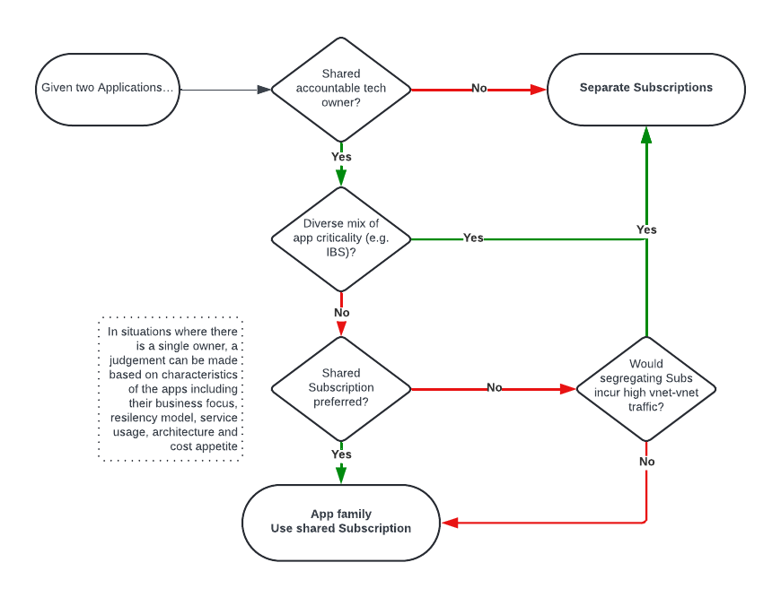

        

Document Metadata

|  |  |
|----|----|
| Identifier | **`LMP-ADR-0006`** |
| Type | **ADR** |
| Status | **Published** |
| Approvals | LMP Migration Architecture Approval |
| Published on | **May 07, 2024** |
| Valid From | **May 25, 2024** |
| Authors |   |
| Tags | Foundation Platform |
| Technology Capabilities | Delivery / Operations / Deployment & Administration |

# Prefer a Subscription per Application family-Environment (or App-Environment, if no Application family exists)<a href="#prefer-a-subscription-per-application-family-environment-or-app-environment-if-no-application-family-exists" class="headerlink" title="Permanent link">¶</a>

## Context and Problem Statement<a href="#context-and-problem-statement" class="headerlink" title="Permanent link">¶</a>

Given the scale of the LMP migration, it has been imperative to conserve [RFC 1918 addresses](https://en.wikipedia.org/wiki/Private_network).

As a solution to this ( see [ADR 0005 Packet Filtering and Network Address Translation](../../network/0005-packet-filtering-and-nat/)), the Foundation Landing Zone design employs an Azure Firewall per spoke Subscription.

A consequence of this architecture is the high fixed cost per Subscription. As some examples:

| Service | Monthly Cost | Annual Cost |
|----|----|----|
| **Azure Firewall** (Premium, one unit, before data charges) | \$1,277.50 | \$15,330 |
| **Azure API Management** (Premium SKU, one base unit) | \$2,795.17 | \$33,542 |
| **Azure Cache for Redis** (Enterprise tier, E10/12Mb) | \$1,150.48 | \$13,806 |
| **Azure Database for PostgreSQL** (Flexible server, 16 vCore) | \$1,203.71 | \$14,445 |
| **Azure SQL Managed Instance** (ZRS, 16 vCore, instance pools, 1 year reserved) | \$2,611,60 | \$31,339 |

## Decision Drivers<a href="#decision-drivers" class="headerlink" title="Permanent link">¶</a>

The decision is driven by requirements to:

- Minimise costs
- Minimise "blast radius" (the scale of the negative impact of a hypothetical bad configuration, change, deployment, etc.)
- Ensure that Subscriptions have a single, contactable owner in the case of a security incident, outage or other significant event
- Minimise cross-Subscription connectivity & data transfer
- Minimise duplication of capabilities across Subscriptions, e.g. caching of same data
- Ensure that applications can be efficiently operated (e.g. observability, maintenance, troubleshooting)
- Ensure that application cost can be efficiently managed (e.g. cost allocation & reporting)
- Ensure that applications be be secured efficiently (e.g. by limiting read and write access to the right teams)
- Ensure that automation is efficiently achievable (for infrastructure & application deployment and maintenance)

## Considered Options<a href="#considered-options" class="headerlink" title="Permanent link">¶</a>

- Subscription per Application
- Subscription per Application-Environment
- Subscription per Application family-Environment
- Resource Group per Application per domain
- Subscription per Application Operations Team
- Subscription per domain
- Subscription per Multi-tenant Compute Environment

## Decision Outcome<a href="#decision-outcome" class="headerlink" title="Permanent link">¶</a>

Two recommended options:

1.  Subscription per Application-Environment
2.  Subscription per Application family-Environment

Whilst not yet available, a Subscription per Multi-tenant Compute Environment (such as a multi-tenant Kubernetes platform) is also a reasonable pattern, provided it were suitably engineered and operated.

### Consequences<a href="#consequences" class="headerlink" title="Permanent link">¶</a>

- Good, because we promote Subscription sharing where suitable, reducing costs
- Neutral, because many applications are likely to need a Subscription per App-Environment
- Neutral, because the fixed Azure Firewall cost is still likely to be high

## Pros and Cons of the Options<a href="#pros-and-cons-of-the-options" class="headerlink" title="Permanent link">¶</a>

### Subscription per Application Environment<a href="#subscription-per-application-environment" class="headerlink" title="Permanent link">¶</a>

Example compression ratio - 1:1 - assumed to be the default option. This should also be the default option for applications for which blast radius reduction is of high importance, such as Important Business Services (IBS).

- Good, because a Subscription is a simple boundary for RBAC, Cost Management, Security and Telemetry
- Good, because Dev/QA/Pre-Prod/Prod environments maintain segregation of duties
- Good, because roles can be granted at Subscription scope, enabling creation of services that assume Subscription-level access
- Good, because blast radius is minimised
- Bad, because greater number of Subscriptions incur greater fixed costs
- Bad, because greater numbers of Subscriptions are more complex to operate and maintain

### Subscription per Application family-Environment<a href="#subscription-per-application-family-environment" class="headerlink" title="Permanent link">¶</a>

Example compression ratio - 1:4 (assuming 4 Applications per Application family). This should be the general advice for most applications that have shareable components.

- Good, because a Subscription is a simple boundary for RBAC, Cost Management, Security and Telemetry
- Good, because fixed costs are reduced a little
- Good, because an Application family must have a single owner
- Good, because the Foundation platform can already support such a model (it already supports "Primary"/"Secondary" and "Parent"/"Child" models)
- Neutral, because there is currently no LeanIX-native mechanism to model an Application family; it would need to be modelled separately in ServiceNow (as "Primary"/"Secondary" is today). The future option is retained, to create "Application family IDs" in LeanIX, to automate some of the Subscription management

### Subscription per Application (across environments)<a href="#subscription-per-application-across-environments" class="headerlink" title="Permanent link">¶</a>

Example compression ratio - 1:4 (assuming Dev, QA, Pre-Prod, Prod)

- Good, because fixed costs are reduced a little
- Neutral, because although App Service Deployment Slots provide a native way of promoting applications between environments, we have not forecasted significant App Service usage
- Bad, because we often want greater segregation of duties (between app teams in Dev and operations teams in Prod)
- Bad, because blast radius is high (e.g. dev change at greater risk of impact production)

### Resource Group per Application per domain<a href="#resource-group-per-application-per-domain" class="headerlink" title="Permanent link">¶</a>

Example compression ratio - 1:20 (assuming 20 domain-aligned applications)

- Good, because fixed costs are reduced significantly
- Neutral, because it can be easier to grant Azure Policy exceptions but more difficult to manage those exceptions as a result
- Neutral, because greater tagging discipline would be needed in order to determine an Owner in the case of an event, but tag discipline should be high anyway
- Bad, because Resource Groups cannot contain all Azure Services (some, such as Azure Kubernetes Service, Synapse Analytics, Purview and Databricks create managed Resource Groups, increasing RBAC and automation complexity e.g. by requiring an "on behalf of" pattern where sophisticated pipelines deploy services on a application team's behalf) and we have forecasted significant AKS usage
- Bad, because teams cannot autonomously create Resource Groups to organise their resources
- Bad, because RBAC is more complicated to manage when compared with Subscription-as-scope
- Bad, because cost is more complicated to manage when compared with Subscription-as-scope (e.g. for services shared by all applications in the Subscription)
- Bad, because Subscription quotas would need an additional layer of governance (in case of competition between apps)
- Bad, because blast radius is high (e.g. Subscription-level change might impact multiple apps)

### Subscription per Application Operations Team<a href="#subscription-per-application-operations-team" class="headerlink" title="Permanent link">¶</a>

Example: multiple instances of the same application, e.g. when delivering SaaS to customers

- Neutral, because relatively few applications will follow this pattern
- Neutral, because instances of applications that *do* follow this pattern will likely be considered as *the same application* (according to their Application ID), and thus fall into one of the other patterns

### Subscription per domain<a href="#subscription-per-domain" class="headerlink" title="Permanent link">¶</a>

Example compression ratio - 1:20 (assuming 20 domain-aligned applications)

- Good, because fixed costs are reduced significantly
- Neutral, because it can be easier to grant Azure Policy exceptions but more difficult to manage those exceptions as a result
- Neutral, because cost is more complicated to apportion, but domains could be chosen based on cost and ownership
- Neutral, because we may recommend a similar approach for e.g. APIM, but that design is also primarily driven by cost
- Bad, because RBAC is more complicated to manage when compared with Subscription-as-scope
- Bad, because blast radius is high (e.g. Subscription-level change might impact multiple apps)

### Subscription per Multi-tenant Compute Environment<a href="#subscription-per-multi-tenant-compute-environment" class="headerlink" title="Permanent link">¶</a>

Example: multi-tenant, managed Kubernetes platform. Compression ratio - 1:100 (assuming 100 managed applications)

- Good, because fixed costs are reduced dramatically
- Good, because greater standardisation, pattern re-use and knowledge sharing
- Neutral, because such a platform does not yet exist
- Neutral, because more complex to isolate individual workloads, although Kubernetes is operated in this way in many firms
- Neutral, because additional shared services (e.g. DBaaS) may also be required or may also need a Subscription home
- Bad, because blast radius is high (e.g. Subscription-level change might impact multiple apps)

## More Information<a href="#more-information" class="headerlink" title="Permanent link">¶</a>

### Existing Decisions & Reference Material<a href="#existing-decisions-reference-material" class="headerlink" title="Permanent link">¶</a>

- [LSEG Operational Data - Application Definition - LMP](https://lsegroup.sharepoint.com/:p:/r/teams/LSEGLMPAppMigrationApprovers/Shared%20Documents/Architecture%20Docs%20-%20Proposals,%20Strategies%20etc/LSEG%20Operational%20Data%20-%20Application%20Definition%20-%20LMP.pptx?d=w4c71a677cae7435c97a7d296e9f7891f&csf=1&web=1&e=orbaAX)
- [STAR DA-047 - Multiple Apps in a Single Cloud Account](https://lsegroup.sharepoint.com/:w:/r/teams/LMFoundationFM/Shared%20Documents/General/02%20Design%20Docs/3%20Management,%20Cost,%20Governance%20%26%20Policy/STAR%20DA-047%20Multiple%20Apps%20in%20Single%20Cloud%20Account.docx?d=w16c2ece18d4c47c9870ff620ec84587b&csf=1&web=1&e=RfgQ10)
- [STAR DA-307 - Subscription Vending and Application Onboarding via Foundation Services Automation](https://lsegroup.sharepoint.com/:w:/r/teams/LSEGLMPAppMigrationApprovers/Shared%20Documents/Architecture%20Docs%20-%20Proposals,%20Strategies%20etc/LMP%20Architecture%20TOR%200.0.1.docx?d=w9a96c749784a4b0ca6d10d41ffa312d1&csf=1&web=1&e=eVwXaJ)
- [Heritage Refinitiv Elektron Data Platform ("EDP") AWS Account Strategy](https://confluence.refinitiv.com/pages/viewpage.action?spaceKey=FA&title=EDP+AWS+Account+Strategy)
- [D&A Subscription sharing strawman](https://lucid.app/lucidchart/4005bf3a-fa13-4d90-930c-cead13888f21/edit?invitationId=inv_c036f66c-8a90-471f-9ec3-34925c33b3ba&page=Lk6Ox58RwJUS#)

<!-- -->

- The existing Foundation platform already supports multiple apps per Subscription, via two approaches: 1. (Strongly Preferred) Primary Application + Additional Applications, via SNOW [process](https://lsegroup.sharepoint.com/sites/CloudCentral/SitePages/LMP-Azure---Additional-Application-Onboarding-to-existing-Subscriptions.aspx?xsdata=MDV8MDJ8fDU5YmNiMDkxNjVhYjRkYTc1NzhkMDhkYzljZmU1NTI0fDI4N2U5ZjBlOTFlYzRjZjBiN2E0YzYzODk4MDcyMTgxfDB8MHw2Mzg1NTc4NjMzNDM4MzkxMTd8VW5rbm93bnxWR1ZoYlhOVFpXTjFjbWwwZVZObGNuWnBZMlY4ZXlKV0lqb2lNQzR3TGpBd01EQWlMQ0pRSWpvaVYybHVNeklpTENKQlRpSTZJazkwYUdWeUlpd2lWMVFpT2pFeGZRPT18MXxMMk5vWVhSekx6RTVPbVF4WkRJeU5EWmhMVEU0T0dFdE5HWTBaUzFpTnpVekxUSXdZekF5WXpFNE1ETm1OVjltTldRNFlXVmlOUzAxTlRBMkxUUmhZekV0WW1Sak5pMDNNR014WWpCak5qQTROMk5BZFc1eExtZGliQzV6Y0dGalpYTXZiV1Z6YzJGblpYTXZNVGN5TURFNE9UVXpNemd3T1E9PXwyNDQxNmI4ZDAxNzk0NDYxZjUyYjA4ZGM5Y2ZlNTUyMXxjNGE5OGIyNjk1MTA0Mjg0ODVkYTY3YTU0OGRhZDBhMw%3D%3D&sdata=TTcvQzlmdXJHNUFXTlpoTHFrdWZsY0FGaHN2cXVIdmoyeXdKQXhxQkgrYz0%3D&ovuser=287e9f0e-91ec-4cf0-b7a4-c63898072181%2CPaul.Murphy1%40lseg.com&OR=Teams-HL&CT=1720189537018&clickparams=eyJBcHBOYW1lIjoiVGVhbXMtRGVza3RvcCIsIkFwcFZlcnNpb24iOiI1MC8yNDA1MzEwMTQyMSIsIkhhc0ZlZGVyYXRlZFVzZXIiOmZhbHNlfQ%3D%3D) 2. (Strongly Discouraged) Parent-Child Application modelling

### Proposed Decision Tree driven by new Application Definition<a href="#proposed-decision-tree-driven-by-new-application-definition" class="headerlink" title="Permanent link">¶</a>

    December 17, 2025      May 9, 2024 

 Previous 

Use Azure Immutable Blob Storage as Audit Log Destination for LMP Applications

 Next 

Prefer a Subscription per Application family / Environment, unless Application is Quarantined

Made with <a href="https://squidfunk.github.io/mkdocs-material/" target="_blank" rel="noopener">Material for MkDocs</a>

