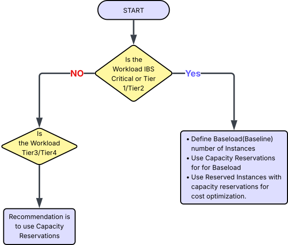

 ![](data:image/svg+xml;base64,PHN2ZyB4bWxucz0iaHR0cDovL3d3dy53My5vcmcvMjAwMC9zdmciIHZpZXdib3g9IjAgMCA1MTIgNTEyIj48IS0tISBGb250IEF3ZXNvbWUgRnJlZSA3LjAuMCBieSBAZm9udGF3ZXNvbWUgLSBodHRwczovL2ZvbnRhd2Vzb21lLmNvbSBMaWNlbnNlIC0gaHR0cHM6Ly9mb250YXdlc29tZS5jb20vbGljZW5zZS9mcmVlIChJY29uczogQ0MgQlkgNC4wLCBGb250czogU0lMIE9GTCAxLjEsIENvZGU6IE1JVCBMaWNlbnNlKSBDb3B5cmlnaHQgMjAyNSBGb250aWNvbnMsIEluYy4tLT48cGF0aCBmaWxsPSJjdXJyZW50Q29sb3IiIGQ9Im05OS4zIDI1Ni4xIDY5LjQtMTE5LjljLTUuNi0xMi4yLTguOC0yNS44LTguOC00MC4yIDAtNTMgNDMtOTYgOTYtOTZzOTYgNDMgOTYgOTZjMCAxNC4zLTMuMSAyNy45LTguOCA0MC4ybDQ0LjQgNzYuN2MtMjMuMSAyNi01My43IDQ1LjEtODguNCA1My44TDI1NiAxOTEuOWwtNjguMSAxMTcuNmMyMS41IDYuOCA0NC4zIDEwLjUgNjguMSAxMC41IDcwLjcgMCAxMzMuOC0zMi43IDE3NC45LTg0IDExLjEtMTMuOCAzMS4yLTE2IDQ1LTVzMTYgMzEuMiA1IDQ1QzQyOC4yIDM0MS44IDM0NyAzODQgMjU2LjEgMzg0Yy0zNS40IDAtNjkuNC02LjQtMTAwLjctMTguMWwtNTYuNyA5Ny44Yy00LjcgOC4xLTExLjcgMTQuNy0yMC4xIDE4LjlsLTU1LjQgMjcuN2MtNSAyLjUtMTAuOSAyLjItMTUuNi0uN1MwIDUwMS41IDAgNDk2di01NS40YzAtOC40IDIuMi0xNi43IDYuNS0yNC4xbDYwLTEwMy43Yy0xMi44LTExLjItMjQuNi0yMy41LTM1LjMtMzYuOC0xMS4xLTEzLjgtOC44LTMzLjkgNS00NXMzMy45LTguOCA0NSA1YzUuNyA3LjEgMTEuOCAxMy44IDE4LjIgMjAuMXptMjgxLjggMTUxLjhjMzIuNS0xMyA2Mi40LTMxIDg4LjktNTIuOWwzNS42IDYxLjVjNC4yIDcuMyA2LjUgMTUuNiA2LjUgMjQuMVY0OTZjMCA1LjUtMi45IDEwLjctNy42IDEzLjZzLTEwLjYgMy4yLTE1LjYuN2wtNTUuNC0yNy43Yy04LjQtNC4yLTE1LjQtMTAuOC0yMC4xLTE4Ljl6TTI1NiAxMjhhMzIgMzIgMCAxIDAgMC02NCAzMiAzMiAwIDEgMCAwIDY0IiAvPjwvc3ZnPg==)    

Document Metadata

|  |  |
|----|----|
| Identifier | **`LMP-ADR-0025`** |
| Type | **ADR** |
| Status | **Draft** |
| Published on | **August 19, 2024** |
| Authors |   |
| Tags | Compute on Demand |
| Technology Capabilities | Delivery / Operations / IT Service Management / Capacity Management |

# Azure Capacity Reservations for Critical Workloads<a href="#azure-capacity-reservations-for-critical-workloads" class="headerlink" title="Permanent link">¶</a>

## Context and Problem Statement<a href="#context-and-problem-statement" class="headerlink" title="Permanent link">¶</a>

As part of our cloud infrastructure strategy, we rely heavily on Azure Virtual Machines (VMs) to support critical workloads across data and analytics platforms. These workloads demand predictable performance and guaranteed availability, especially during peak periods or disaster recovery scenarios.

Standard VM provisioning has led to capacity constraints and deployment delays. Azure Capacity Reservations allow us to reserve compute capacity in specific regions and availability zones for selected VM sizes, ensuring availability when needed.

### Real-World Scenarios<a href="#real-world-scenarios" class="headerlink" title="Permanent link">¶</a>

- If Azure region runs out of capacity due to high demand, any action that deallocates a VM (updating a golden image) may result in losing the capacity to another user.
- If the host hypervisor fails, the VM may not be reallocated without a reservation.
- Capacity Reservations provide SLA-backed guarantees that VMs can be reallocated and gain priority over standard deployments.

## Decision Drivers<a href="#decision-drivers" class="headerlink" title="Permanent link">¶</a>

- High availability and disaster recovery requirements
- Predictable usage patterns for Tier 1, Tier2 and IBS workloads
- Performance sensitivity of critical applications
- Need for cost optimization and governance
- Centralized infrastructure planning and control

## Decision Outcome<a href="#decision-outcome" class="headerlink" title="Permanent link">¶</a>

We will adopt a tiered and cost-optimized strategy for VM provisioning using **Azure Capacity Reservations** in combination with **Azure Reserved Instances**:

- **Tier 1, Tier 2, and IBS Critical Workloads** should define a **baseline (baseload) number of instances** required for continuous operation . These baseline instances should use **Capacity Reservations** to guarantee availability and **Reserved Instances** to optimize cost (Strongly recommended).

<!-- -->

- **Elastic or Max Capacity** (used during peak loads or scaling events) can be provisioned using **Spot VMs** or **On-Demand VMs**, depending on workload tolerance and cost considerations.

<!-- -->

- **Tier 3,Tier 4 and Tier 5 Workloads** may decide based on specific requirements and could use **Capacity Reservations** for baseline workloads to ensure availability and reduce risk.

### Example Scenario<a href="#example-scenario" class="headerlink" title="Permanent link">¶</a>

A Tier 1 analytics platform requires 20 VMs for baseline operations and can scale up to 50 VMs during peak hours.

- The team reserves 20 VMs using **Azure Capacity Reservations** to ensure guaranteed availability.
- These 20 VMs are also covered by **Azure Reserved Instances** to reduce cost.
- The additional 30 VMs are provisioned using **Spot** or **On-Demand VMs** to handle elastic demand.

This strategy ensures high availability, cost efficiency, and disaster recovery readiness. It also protects against real-world risks such as:

- Losing VM capacity during image updates or deallocation
- Inability to reallocate VMs after hypervisor failure
- Competing with other users during regional capacity shortages

## Consequences<a href="#consequences" class="headerlink" title="Permanent link">¶</a>

- **Good**: Guaranteed availability for critical workloads
- **Good**: Improved deployment reliability and disaster recovery performance
- **Good**: Cost optimization through strategic reservation planning
- **Bad**: Potential underutilization if reservations are not actively managed
- **Bad**: Requires governance and quarterly review

## Confirmation<a href="#confirmation" class="headerlink" title="Permanent link">¶</a>

Implementation will be confirmed through:

- Quarterly reviews by the Cloud Infrastructure team
- Monitoring usage and reservation alignment
- Integration with cost management and governance tools

## More Information<a href="#more-information" class="headerlink" title="Permanent link">¶</a>

### Implementation Plan<a href="#implementation-plan" class="headerlink" title="Permanent link">¶</a>

1.  Identify eligible workloads
2.  Define reservation scope (VM sizes, regions, zones)
3.  Define baseline instance requirements for Tier 1, Tier2 and IBS workloads
4.  Create Capacity Reservations for baseline
5.  Monitor and adjust quarterly
6.  Integrate with cost management and governance processes

### References<a href="#references" class="headerlink" title="Permanent link">¶</a>

- [Azure Capacity Reservations Overview](https://learn.microsoft.com/en-us/azure/virtual-machines/capacity-reservation-overview)
- [Modify Reservations](https://learn.microsoft.com/en-us/azure/virtual-machines/capacity-reservation-modify)
- [Associate VMs](https://learn.microsoft.com/en-us/azure/virtual-machines/capacity-reservation-associate-vm)
- [Terraform Registry](https://registry.terraform.io/providers/hashicorp/azurerm/latest/docs/resources/capacity_reservation)

    September 22, 2025      September 22, 2025 

 Previous 

ADR: Lower Environment Shutdown for Cost Optimisation

 Next 

Use Azure Firewall for Traffic Filtering and Network Address Translation

Made with <a href="https://squidfunk.github.io/mkdocs-material/" target="_blank" rel="noopener">Material for MkDocs</a>

