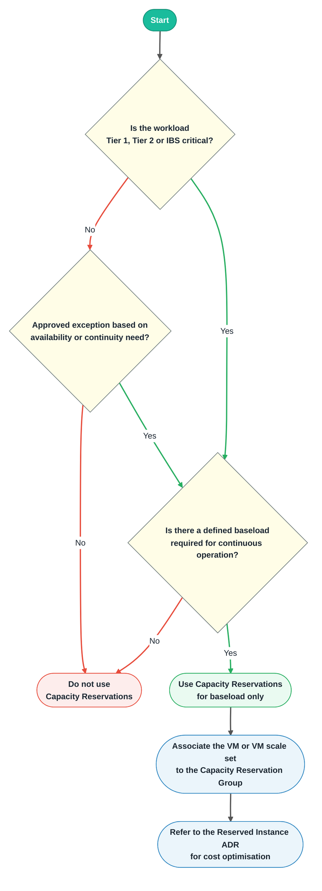

# Azure Capacity Reservations for Critical Workloads

## Context and Problem Statement

As part of our cloud infrastructure strategy, we rely heavily on Azure Virtual Machines (VMs)
 to support critical workloads across data and analytics platforms. These workloads demand predictable performance and
 guaranteed availability, especially during peak periods or disaster recovery scenarios.

Standard VM provisioning can lead to capacity constraints and deployment delays.
 Azure Capacity Reservations allow us to reserve compute capacity in specific regions and
 availability zones for selected VM sizes, ensuring availability when needed.

This ADR is about **capacity assurance**. Cost optimisation through Azure Reserved Instances is covered separately
 in the relevant [Azure Reserved Instance ADR](https://devportal.lseg.com/catalog/default/pattern/lmp-patterns-and-adrs-registry/docs/adrs/foundation-platform/0017-reserved-instances-for-production-baseload/).

## Real-World Scenarios

- If an Azure region runs out of capacity due to high demand, any action that deallocates a VM,
 such as updating a golden image, may result in losing that capacity.
- If the host hypervisor fails, the VM may not be reallocated without a reservation.
- Capacity Reservations provide SLA-backed guarantees that VMs can be reallocated and gain priority over standard deployments.

> **Note:** Capacity Reservations are billed for the reserved capacity the moment they are created regardless
 > of if the virtual machines or scale sets are running. Additionally, resources must be linked to the capacity reservations
 > group to use the capacity allocation.

## Decision Drivers

- High availability and disaster recovery requirements
- Predictable usage patterns for Tier 1, Tier 2 and IBS workloads
- Performance sensitivity of critical applications
- Centralised infrastructure planning and control

## Decision Outcome

We will adopt a targeted and cost-aware strategy for **Production VM provisioning** using Azure Capacity Reservations,
 with Azure Reserved Instances used in combination for cost optimisation where reservations are expected
to be long-lived (12 months or more).

Application teams **MUST** first identify:

- **baseload**: the minimum number of instances continuously required for operation
- **elastic load**: variable demand driven by autoscale, peak events, batch windows, failover patterns, or temporary growth

- Tier 1, Tier 2 and IBS critical workloads **SHOULD** define a baseload number of instances required for continuous operation.

- Defined baseloads for Tier 1, Tier 2 and IBS critical workloads **SHOULD** use Capacity Reservations where
guaranteed availability is required.

- Lower-tier workloads, including Tier 3, Tier 4 and Tier 5, **SHOULD NOT** use Capacity Reservations unless
a clear availability or continuity requirement is evidenced.

- Capacity Reservations **MUST NOT** be used for elastic, autoscaled, burst, intermittent, or theoretical maximum demand.

- Capacity Reservations are intended for Production workloads only. They **MUST NOT** be used for lower
 environments unless required for:
    - short-lived ephemeral validation before Production deployment, where the reservation is deleted immediately after
   testing; or
    - an approved DR pattern where a lower environment is intentionally hosted in the standby region and can be detached,
   reattached, or repurposed to support Production recovery during a DR or recovery event.

- If a Capacity Reservation is created, the intended VM or VM scale set **MUST** be explicitly associated to the
Capacity Reservation Group so that the reservation is consumed.

- Where stable baseload is identified, application teams **SHOULD** consider Azure Reserved Instances
for cost optimisation in line with the separate Reserved Instance ADR.

## Example Scenario

A Tier 1 analytics platform requires 20 VMs for baseline operations and can scale up to 50 VMs during peak hours.

- The team defines 20 VMs as the baseload required for continuous operation.
- The team uses Azure Capacity Reservations for those 20 baseline VMs to ensure guaranteed availability.
- The team uses Reserved Instance for these 20 VMs to reduce cost, see [Azure Reserved Instance ADR](https://devportal.lseg.com/catalog/default/pattern/lmp-patterns-and-adrs-registry/docs/adrs/foundation-platform/0017-reserved-instances-for-production-baseload/).
- The additional 30 VMs are provisioned using on-demand or other suitable compute options to handle elastic demand.

This approach supports high availability, cost awareness and disaster recovery readiness while avoiding unnecessary
reserved capacity for non-baseload demand. It also protects against real-world risks such as:

- Losing VM capacity during image updates or deallocation
- Inability to reallocate VMs after hypervisor failure
- Competing with other users during regional capacity shortages

## Capacity Reservation Decision Tree

## Consequences

### Good

- Guaranteed availability for critical workloads that require reserved capacity
- Improved deployment reliability and disaster recovery performance
- Clear focus on defined baseload rather than peak or elastic demand
- Better alignment between capacity assurance and separate cost optimisation decisions

### Bad

- Capacity Reservations incur cost whether they are used or unused, so poor sizing or failure to consume
 the reservation can create unnecessary spend
- Potential underutilisation if reservations are not actively managed
- Requires governance and periodic review

## References

- [Azure Capacity Reservations Overview](https://learn.microsoft.com/en-us/azure/virtual-machines/capacity-reservation-overview)
- [Modify a Capacity Reservations](https://learn.microsoft.com/en-us/azure/virtual-machines/capacity-reservation-modify)
- [Associate VMs](https://learn.microsoft.com/en-us/azure/virtual-machines/capacity-reservation-associate-vm)
- [Terraform Registry](https://registry.terraform.io/providers/hashicorp/azurerm/latest/docs/resources/capacity_reservation)

