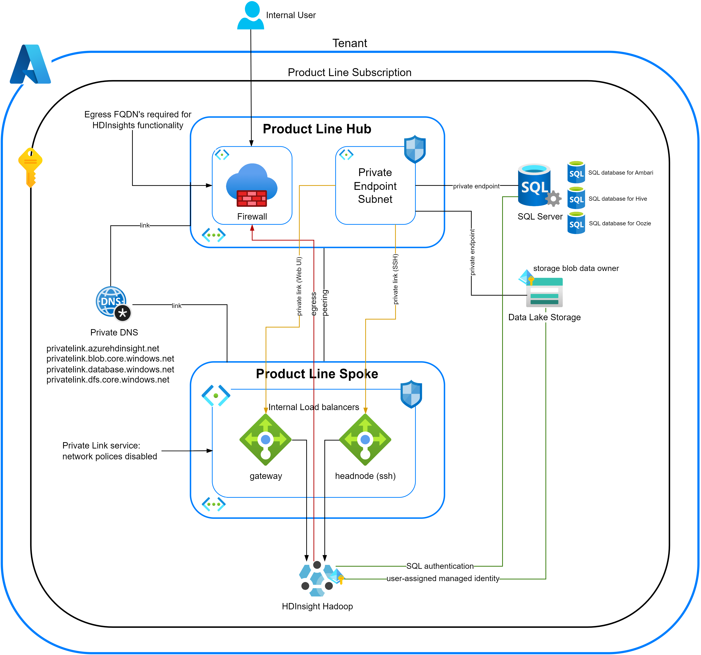

        

Document Metadata

|  |  |
|----|----|
| Identifier | **`LMP-PAT-0074`** |
| Type | **Technical Design Pattern** |
| Status | **Published** |
| Approvals | LMP Migration Architecture Approval |
| Governance Reference | **** |
| Pattern Source Repo |  |
| Published on | **June 11, 2025** |
| Valid From | **July 01, 2025** |
| Authors |   |
| Tags | Data Analytics & Visualizations |
| Technology Capabilities | Platform / Data / Data Analytics & Visualizations |

# HD Insight Hadoop Cluster Pattern<a href="#hd-insight-hadoop-cluster-pattern" class="headerlink" title="Permanent link">¶</a>

## Introduction<a href="#introduction" class="headerlink" title="Permanent link">¶</a>

Azure HDInsight is a cloud based big data analytics service that enables processing and analytics of large datasets. It leveraged open-source frameworks like Hadoop, Spark, Hive, Kafka, and others. HDInsight enabled you to create optimized clusters for these technologies, providing enterprise-grade security, reliability, and scalability within the Azure environment.

### Context<a href="#context" class="headerlink" title="Permanent link">¶</a>

The pattern will assist migration execution teams in the LMP program to efficiently deploy and manage Hadoop clusters using Azure HDInsight. This service provides a scalable, cost-effective, and secure environment for big data processing. By leveraging HDInsight, teams can focus on data analysis and insights without the overhead of managing infrastructure. The integration with Azure services such as Azure Datalake Storage and Azure Virtual Network ensures seamless data access and enhanced security. Additionally, HDInsight's compatibility with popular big data tools and frameworks allows for flexible and robust data processing solutions.

## Scope<a href="#scope" class="headerlink" title="Permanent link">¶</a>

This Pattern currently focuses on the hadoop cluster. Other available cluster are HDInsight spark cluster, Kafka cluster, interactive query cluster and HBase cluster.

## Use Cases<a href="#use-cases" class="headerlink" title="Permanent link">¶</a>

- LSEG Application that need to process and transform large volumes of structured or unstructured data from various sources.

<!-- -->

- Businesses required a scalable and cost-effective solution for storing and querying large datasets for business intelligence and reporting.

<!-- -->

- Application that are connected with numerous devices generated massive streams of real-time data that needed to be ingested, processed, and analyzed.

## Architectural Design<a href="#architectural-design" class="headerlink" title="Permanent link">¶</a>

The design involves deploying an HDInsight Hadoop cluster with the necessary infrastructure to support big data processing and analytics. This includes provisioning data lake storage, configuring a Virtual Network for secure communication, and setting up cluster scaling policies to optimize resource usage. The design also incorporates Azure Monitor for comprehensive monitoring and logging of cluster activities.

### Key Considerations<a href="#key-considerations" class="headerlink" title="Permanent link">¶</a>

#### Azure HDInsight clusters should use encryption at host to encrypt data at rest<a href="#azure-hdinsight-clusters-should-use-encryption-at-host-to-encrypt-data-at-rest" class="headerlink" title="Permanent link">¶</a>

- Enabling encryption at host helps protect and safeguard data to meet organizational security and compliance commitments. When enabled encryption at host, data stored on the VM host is encrypted at rest and flows encrypted to the Storage service.
- Encryption at rest which needs customer managed keys (keys from keyvault) is not required for Azure HDInsight Hadoop cluster at this point. Encryption at Host is based on Platform Managed Keys and does not need a customer-deployed Azure Key Vault.

#### Private DNS zone needs to be created to enable private link connectivity to Azure services used by HDInsight cluster<a href="#private-dns-zone-needs-to-be-created-to-enable-private-link-connectivity-to-azure-services-used-by-hdinsight-cluster" class="headerlink" title="Permanent link">¶</a>

- **privatelink.azurehdinsight.net**: This allows the HDInsight cluster to connect privately (via Private Link) to HDInsight control plane endpoints (like cluster management, monitoring, and other APIs).
- **privatelink.blob.core.windows.net**: Used for private access to Azure Blob Storage, which HDInsight often uses as default storage.
- **privatelink.database.windows.net**: Enables private access to Azure SQL Database, which HDInsight can use for Hive metastore or other metadata services.
- **privatelink.dfs.core.windows.net**: Required for private access to Azure Data Lake Storage Gen2.

#### Disable network polices for private link service on Hadoop subnet<a href="#disable-network-polices-for-private-link-service-on-hadoop-subnet" class="headerlink" title="Permanent link">¶</a>

Disabling `privateEndpointNetworkPolicies` on the Hadoop subnet allows:

- The Private Endpoint to be created and function correctly.
- DNS resolution and traffic flow to the private IP of the endpoint without interference from NSG/UDR rules. Without this, HDInsight cluster wouldn’t be able to communicate with services like Blob Storage or SQL Database via Private Link.

#### Create SQL Server and databases with private endpoint<a href="#create-sql-server-and-databases-with-private-endpoint" class="headerlink" title="Permanent link">¶</a>

- SQL authentication is required as it is currently the supported method for this connection. HDInsight uses SQL authentication to connect to Azure SQL DB Hive metastore.

#### Create User-assigned managed identity and provide storage blob data owner<a href="#create-user-assigned-managed-identity-and-provide-storage-blob-data-owner" class="headerlink" title="Permanent link">¶</a>

- Azure HDInsight supports only user-assigned managed identities. HDInsight doesn't support system-assigned managed identities.
- Creating a User Assigned Managed Identity (UAMI) and assigning it the `Storage Blob Data Owner` role is a key step for secure, fine-grained access to Azure Data Lake Storage (ADLS) Gen2 from an Azure HDInsight cluster.
- The UAMI acts as the identity of the cluster to authenticate securely with ADLS — without embedding secrets or keys.
- Follow the [hdinsight-managed-identities](https://learn.microsoft.com/en-us/azure/hdinsight/hdinsight-managed-identities) for more details.

#### Add outbound FQDN's to Azure Firewall to restrict outbound traffic<a href="#add-outbound-fqdns-to-azure-firewall-to-restrict-outbound-traffic" class="headerlink" title="Permanent link">¶</a>

When outbound traffic is restricted (e.g. by using Azure Firewall, NSG, or Route Tables) to secure HDInsight cluster, some required FQDNs must be explicitly allowed. These are critical for the cluster to function because HDInsight depends on multiple Azure services and public endpoints for control plane and data plane operations. Follow the [hdinsight-restrict-outbound-traffic](https://learn.microsoft.com/en-us/azure/hdinsight/hdinsight-restrict-outbound-traffic) for more details.

### Security Controls<a href="#security-controls" class="headerlink" title="Permanent link">¶</a>

HD Insight Hadoop Cluster [security controls](https://gitlab.dx1.lseg.com/app/app-51285/cloud-security-controls/azure-clear-listing/-/blob/main/azure/services/Microsoft.HDInsight/clusters/kind/Hadoop/v2.0.0/markdown/serviceControls.md?ref_type=heads)

### Benefits of Azure HDInsights Hadoop Cluster<a href="#benefits-of-azure-hdinsights-hadoop-cluster" class="headerlink" title="Permanent link">¶</a>

- **Fully Managed Service:** Azure handled the complexities of cluster setup, configuration, patching, and monitoring, reducing operational overhead and allowing users to focus on data analysis.
- **Easy Deployment:** Clusters could be provisioned quickly without the need to install or manage hardware.
- **Scalability:** Users could easily scale the number of nodes up or down based on workload demands, optimizing costs.
- **Cost-Effectiveness:** The pay-as-you-go model allowed users to pay only for the compute resources they consumed. Decoupled storage and compute enabled independent scaling and cost optimization.
- **Integration with Azure Ecosystem:** Seamlessly integrated with other Azure services like Azure Storage (Blob and Data Lake Storage), Azure SQL Database, Azure Data Factory, and Azure Monitor, creating comprehensive data solutions.
- **Support for Open-Source Frameworks:** Provided a managed environment for popular big data frameworks like Apache Hadoop, Spark, Hive, Kafka, HBase, and others, ensuring compatibility and access to a rich ecosystem of tools and libraries.
- **Security and Compliance:** Offered enterprise-grade security features, including Azure Virtual Network integration, encryption at rest and in transit, integration with Azure Active Directory, and compliance with various industry standards.
- **Global Availability:** Available in numerous Azure regions worldwide, ensuring proximity to data and users.
- **High Availability:** Offered features like multiple head nodes and gateway nodes to minimize downtime within a region.

## Further Reading<a href="#further-reading" class="headerlink" title="Permanent link">¶</a>

[HDInsight Hadoop Cluster Security Controls](https://gitlab.dx1.lseg.com/app/app-51285/cloud-security-controls/azure-clear-listing/-/blob/main/azure/services/Microsoft.HDInsight/clusters/kind/Hadoop/v2.0.0/markdown/serviceControls.md?ref_type=heads)

    December 17, 2025      May 28, 2025 

 Previous 

If a general purpose Service Mesh is required, use Istio

 Next 

Selection of LMP Tenant and Environment

Made with <a href="https://squidfunk.github.io/mkdocs-material/" target="_blank" rel="noopener">Material for MkDocs</a>

