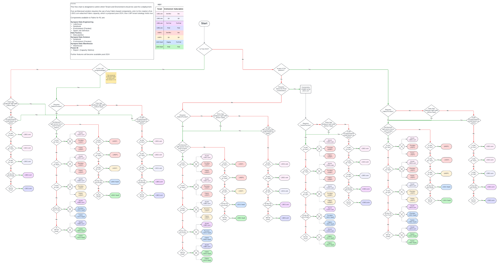

        

Document Metadata

|  |  |
|----|----|
| Identifier | **`LMP-PAT-0022`** |
| Type | **Technology Selection Pattern** |
| Status | **Published** |
| Approvals | LMP Migration Architecture Approval |
| Published on | **August 28, 2024** |
| Valid From | **August 21, 2024** |
| Authors |   |
| Tags | Application Hosting |
| Technology Capabilities | Delivery / Operations / Deployment & Administration |

# Selection of LMP Tenant and Environment<a href="#selection-of-lmp-tenant-and-environment" class="headerlink" title="Permanent link">¶</a>

## Compatibility<a href="#compatibility" class="headerlink" title="Permanent link">¶</a>

This advice relates to the Tenants and Environments available in the LMP Azure/Fabric platform and their usage. As such, it is only relevant to projects looking to use either the LMP Azure tenants or the LMP SaaS capacities.

## Recommended Target<a href="#recommended-target" class="headerlink" title="Permanent link">¶</a>

This document is designed to allow Solution Architects (and development teams) to identify which LMP Tenant and which Environment within that tenant that they should select to deploy assets to, based on the intended usage patterns and the proposed architecture for the Application being designed/developed. The target tenant/environment is dependent on the context of whether the App is proposed as part of a strategic LSEG.com deployment or as part of the LSEG SaaS platform, whether the App requires on-prem/legacy AWS connectivity (and whether it is pre- or post-R1, where SaaS tenants are proposed to get on-prem/legacy AWS connectivity) and whether there Data Gravity from related applications/data stores would influence the deployment location.

## Authoritative references<a href="#authoritative-references" class="headerlink" title="Permanent link">¶</a>

| Reference Type | Reference | Relevance to guidance | Comments |
|----|----|----|----|
| Strategy | [STAR LMP SIA Environments Tenancy Design v1.2 - working update version](https://lsegroup.sharepoint.com/:w:/r/teams/LMDataPlatform/Shared%20Documents/CH%20-%20Tech%20Architecture/Working%20Docs/Solution%20Designs%20(SADs-STARs-etc)/LMP%20SIA%20Tenancy%20(LMSP1,%20SaaS,%20etc)/STAR%20LMP%20SIA%20Environments%20Tenancy%20Design%20v1.2.docx?d=w2eaafee3420a4a949546ab0bf8aed631&csf=1&web=1&e=hFeIzB) | Defines the usage of the Tenants within the SIA strategic platform |  |
| Strategy | [LMP Fabric Enterprise Landing Zone and Op Model Design](https://lsegroup.sharepoint.com/:w:/r/teams/LMFoundationFM/Shared%20Documents/NEW%20-%20Fabric%20and%20Purview%20design/LMP%20Fabric%20Enterprise%20Landing%20Zone%20and%20Op%20Model%20Design.docx?d=wbb5bde9b9ad341fe8370e0e29cda3f45&csf=1&web=1&e=T5SzKO) | Defines the usage of Fabric/Purview Capacities at a strategic level |  |

## Decision Tree Diagrams<a href="#decision-tree-diagrams" class="headerlink" title="Permanent link">¶</a>

**Tenant/Subscription Selector** This is used for identifying the target Tenant(or SaaS subscription) for an Application  **Environment Selector** This is used for identifying the target Environment for an Application within a Tenant (or SaaS subscription) based upon the stage of the development lifecycle 

## Considerations<a href="#considerations" class="headerlink" title="Permanent link">¶</a>

- **Strategic Production Target**: For business reasons, an Application may be targeted at the SaaS platform or to LSEG.com, despite it leading to increased complexity/dependency of architecture (i.e. lack of on-prem connectivity for SaaS tenants pre-R1 and likely for all of 2024 leads to the need to "stage" data in LSEG.com via existing connectivity)
- **Data Sources**: If an application requires data from On-Prem or Legacy AWS, then there is a current reliance on LSEG.com connectivity that will remain until SaaS subscriptions (LMSP1 and LSEG SaaS have such connectivity enabled - this is out of scope for R1 and likely for all of 2024.
- **"Data Gravity"**: An application may have no inherent need to be deployed to the SaaS subscriptions, but may be closely linked to applications which reside on SaaS due to high levels of read/write traffic to/from SaaS applications, for example. In order to minimise data entry/exit costs across the SaaS/Azure tenant boundary layer, it would make sense to cluster the applications together. Similarly, support and access patterns for an application may influence the choice to deploy to SaaS, as opposed to LSEG.com, despite the application architecture itself not having any specific dependency on SaaS-hosted tooling.

    May 30, 2025      September 11, 2024 

 Previous 

HD Insight Hadoop Cluster Pattern

 Next 

Java Application Servers

Made with <a href="https://squidfunk.github.io/mkdocs-material/" target="_blank" rel="noopener">Material for MkDocs</a>

