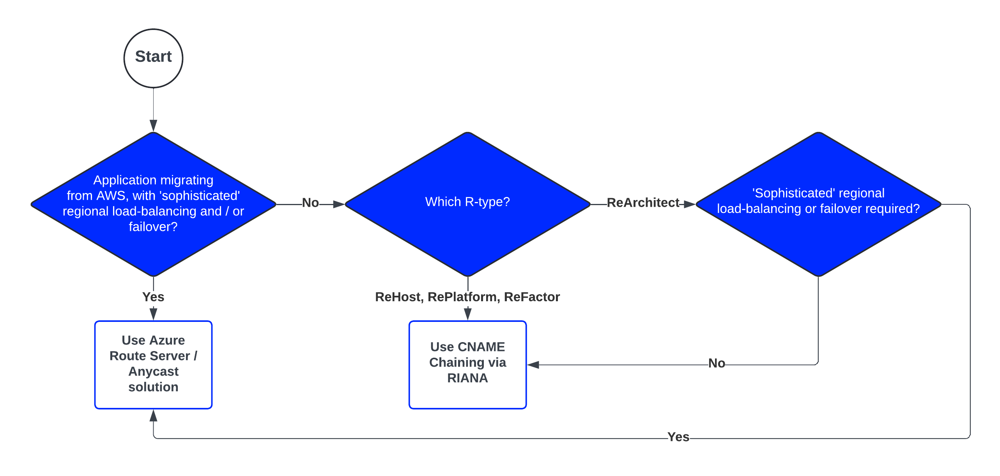

        

Document Metadata

|  |  |
|----|----|
| Identifier | **`LMP-PAT-0031`** |
| Type | **Functional Design Pattern** |
| Status | **Published** |
| Approvals | LMP Migration Architecture Approval |
| Published on | **February 25, 2025** |
| Valid From | **September 27, 2024** |
| Authors |   |
| Tags | Business Continuity & Disaster Recovery |
| Technology Capabilities | Delivery / Security & Compliance / Business Continuity & Disaster Recovery |

# Regional Failover for Private Services<a href="#regional-failover-for-private-services" class="headerlink" title="Permanent link">¶</a>

## Compatibility<a href="#compatibility" class="headerlink" title="Permanent link">¶</a>

This pattern is for multi-region applications looking to employ regional failover, but without exposure to public Internet, i.e. for private services. For Internet-based services requiring regional failover and routing, see other Azure services such as TrafficManager or FrontDoor.

These applications may be currently leveraging a variety of different implementations, including home-grown capabilities on-premise such as the Compass Failover tools, SFA, etc. These are generally reasonably basic in nature, can leverage healthchecks on pools of servers, and involve healthcheck-based or tool-invoked modification of virtual URLs to enable data centre failover. In AWS, typically a combination of AWS Route53 with Load Balancers are used and regional load balancing and failover is, in some cases, more sophisticated. Some teams employ latency-based routing, geo-based routing, static failover-based routing, or a combination. Teams often use CSP consoles or scripts that can set regional pools to unhealthy, for manual invocation.

The recommended target will depend on both context and features that are required, but it is expecting DNS / CNAME Chaining will cater for the vast majority of use-cases.

## Recommended Target<a href="#recommended-target" class="headerlink" title="Permanent link">¶</a>

The recommended guidance varies depending on a combination of the context of the migrating application, and any new requirements in the event the application is being re-architected (Re-Architect R-type), but in summary two targets:

- [DNS / CNAME Chaining via RIANA](https://manage.riana.refinitiv.com/)
- [Azure Route Server / Anycast](https://lsegroup.sharepoint.com/:w:/r/teams/LMFoundationFM/_layouts/15/Doc.aspx?sourcedoc=%7B511B6E76-9FBB-4E8C-B10E-328A67BC9045%7D&file=PoC%20DA-123%20LMP%20Anycast%20to%20Shared%20Service%20Pattern%20v0.2.docx&wdLOR=c3706838C-EB64-E04A-BAF9-81CFA65037D0&action=default&mobileredirect=true) - note this option is not currently available

For CNAME chaining, see [this](https://dev.azure.com/LSEGroup/Migration/_wiki/wikis/Migration.wiki/6830/DNS-Resolution-Network-traffic-Inbound-flow-for-apps-deployed-in-Azure) simple example with assumed single region consumers, and live-standby regional setup. For multi-regioned consumers and a live-live setup, multiple CNAMEs can be used to direct traffic to the local region under normal operation.

See [RIANA guides](https://lsegroup.sharepoint.com/teams/RIANA/SitePages/Guides-&-Tutorials.aspx), for self-service creation of A records, CNAMEs, and use of API for manual invocation scripts.

## Decision Tree Diagram<a href="#decision-tree-diagram" class="headerlink" title="Permanent link">¶</a>

## Notable Differences<a href="#notable-differences" class="headerlink" title="Permanent link">¶</a>

|  | DNS | Azure Route Server / Anycast |
|----|----|----|
| **Manual Failover** | Yes via scripts or RIANA | Yes (via TBD) |
| **Automated Failover** | Yes via component healthchecks | Yes via configured healthchecks |
| **Latency-based Routing** | No | Yes |

## Considerations<a href="#considerations" class="headerlink" title="Permanent link">¶</a>

- The Azure Route Server / Anycast [solution](https://lsegroup.sharepoint.com/:w:/r/teams/LMFoundationFM/_layouts/15/Doc.aspx?sourcedoc=%7B511B6E76-9FBB-4E8C-B10E-328A67BC9045%7D&file=PoC%20DA-123%20LMP%20Anycast%20to%20Shared%20Service%20Pattern%20v0.2.docx&wdLOR=c3706838C-EB64-E04A-BAF9-81CFA65037D0&action=default&mobileredirect=true), still under consideration, would be a centrally-managed capability operating from Hub subscriptions. As of Q1 2025 no implementation is planned, but [the request is tracked](https://jira.refinitiv.com/browse/PCP-25410).

## Further Reading<a href="#further-reading" class="headerlink" title="Permanent link">¶</a>

- [LMP DNS Resolution](https://dev.azure.com/LSEGroup/Migration/_wiki/wikis/Migration.wiki/6830/DNS-Resolution-Network-traffic-Inbound-flow-for-apps-deployed-in-Azure)
- [Azure Route Server background](https://github.com/adstuart/azure-routeserver-anycast)

    May 30, 2025      October 1, 2024 

 Previous 

AKS+Redis+PostgreSQL Application Pattern

 Next 

Azure Site Recovery for DR Pattern

Made with <a href="https://squidfunk.github.io/mkdocs-material/" target="_blank" rel="noopener">Material for MkDocs</a>

