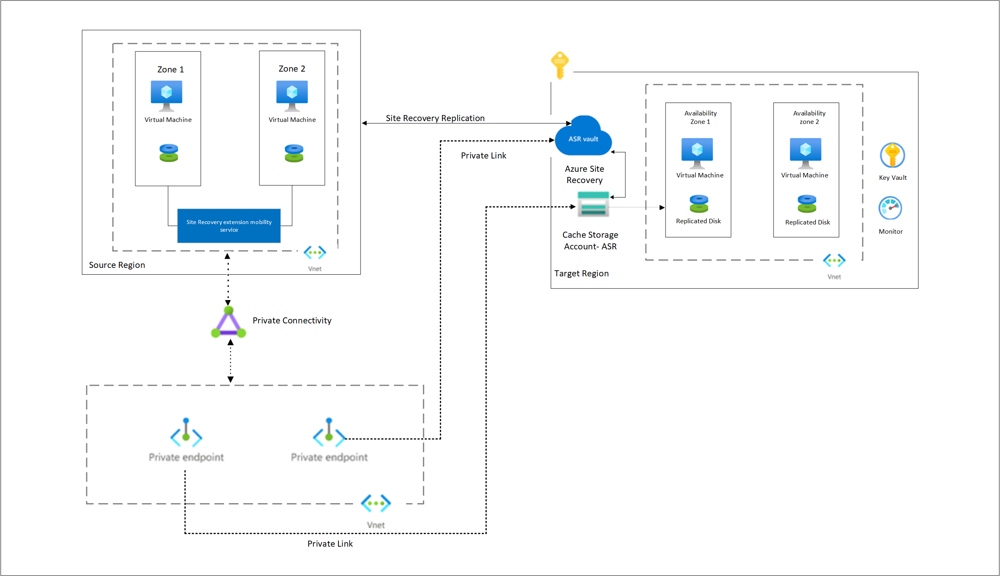

        

Document Metadata

|  |  |
|----|----|
| Identifier | **`LMP-PAT-0063`** |
| Type | **Technical Design Pattern** |
| Status | **Published** |
| Approvals | LMP Migration Architecture Approval |
| Governance Reference | **** |
| Pattern Source Repo |  |
| Published on | **October 30, 2025** |
| Valid From | **October 30, 2025** |
| Authors |   |
| Tags | Business Continuity & Disaster Recovery |
| Technology Capabilities | Delivery / Security & Compliance / Business Continuity & Disaster Recovery |

# Azure Site Recovery for DR Pattern<a href="#azure-site-recovery-for-dr-pattern" class="headerlink" title="Permanent link">¶</a>

- Many applications (EDBOR,People authority,Officers & Director)in the LMP require ASR architectures.
- This architecture require for DR solution within the application Subscription.
- ASR is a fully managed recovery service that allows to create active-active/active-passive DR solution.
- This pattern describes the Site Recovery capabilities of VM from one region to another region by using ASR.
- Application that were developed with Active-Active, Now for LMP they are planning to migrate it to active-passive.
- This configuration will save cost and operational/adminoverhead by using ASR tool as a Disaster recovery option.
- All the resources should be in the non-routable virtual network with private endpoints for all the services.
- Which includes Virtual Machines, Managed disks, and Storage Account, guarded with Network Security Groups.
- This achitecture should use private link connectivity for private access.

| Template details |                          |
|------------------|--------------------------|
| Template name    | Pattern Technical Design |

| Pattern details |  |
|----|----|
| \[Application tier\]<a href="#fn:azure-resiliency-design" class="footnote-ref">1</a> compatibility | `TBC` |
| \[Data classification\]<a href="#fn:information-classification-standard" class="footnote-ref">2</a> supported | `TBC` |
| LSEG Division applicability | `TBC` |

## Pattern Value Proposition<a href="#pattern-value-proposition" class="headerlink" title="Permanent link">¶</a>

The pattern will help across migration execution teams in the LMP program to easily deploy a Site recovery solution. Applications can be deployed to secondary region as a part of disaster recovery by using recovery service vault.

### Expected use<a href="#expected-use" class="headerlink" title="Permanent link">¶</a>

For applications that require site recovery architectures for active-active/active-passive replication as a DR solution.

### Unsuitable use<a href="#unsuitable-use" class="headerlink" title="Permanent link">¶</a>

Not suitable for applications that do not require real-time site recovery to secondary region.

### Key requirements<a href="#key-requirements" class="headerlink" title="Permanent link">¶</a>

| Area | Capability |
|----|----|
| Availability | Provide opinion on ZRS High Availability and multi-region Fault tolerant designs. |
| Data protection | Data at rest and transit encryption. |

## Pattern Value Assessment<a href="#pattern-value-assessment" class="headerlink" title="Permanent link">¶</a>

| Value Dimension                                  | Score  |
|--------------------------------------------------|--------|
| Frequency of re-use                              | 2      |
| Developer Productivity                           | 32     |
| Assurance Value: Information & Data Architecture | Medium |
| Assurance Value: Security Architecture           | Medium |
| Assurance Value: Technology                      | Medium |

Assurance Value considers:

- Minimum Entry Criteria coverage e.g. Security Architecture MEC
- Automated assurance compatibility e.g. enforcement via Azure Policy

## Pattern Design<a href="#pattern-design" class="headerlink" title="Permanent link">¶</a>

The design contains deploying an Azure recovery service vault with private endpoint and private link services

### Architecture Decisions<a href="#architecture-decisions" class="headerlink" title="Permanent link">¶</a>

See [LMP Migration Patterns and ADRs](https://app.pages.dx1.lseg.com/app-51723/migration-patterns/mig-pat-source-to-target/).

### Services used<a href="#services-used" class="headerlink" title="Permanent link">¶</a>

MEC relevance: ALZ.MEC7

| \# | Service | Details including SKU | Reference |
|----|----|----|----|
| 1 | Azure Recovery Service Vault |  | [azure-prdsvc-terraform-recoveryservicesvault](https://gitlab.dx1.lseg.com/app/app-51310/azure/prdsvc/terraform/azure-prdsvc-terraform-recoveryservicesvault) |
| 2 | Azure Storage Account |  | [azure-prdsvc-terraform-storageaccount](https://gitlab.dx1.lseg.com/app/app-51310/azure/prdsvc/terraform/azure-prdsvc-terraform-storageaccount) |
| 3 | Azure Private endpoint |  | [Private Endpoint Pattern on DXOne](https://gitlab.dx1.lseg.com/app/app-51310/azure/prdsvc/terraform/azure-prdsvc-terraform-privateendpoint) |
| 4 | User Assigned Identities |  | [azure-prdsvc-terraform-userassignedidentity](https://gitlab.dx1.lseg.com/app/app-51310/azure/prdsvc/terraform/azure-prdsvc-terraform-userassignedidentity) |
| 5 | Azure Role Assignment |  | [azure-prdsvc-terraform-roleassignment](https://gitlab.dx1.lseg.com/app/app-51310/azure/prdsvc/terraform/azure-prdsvc-terraform-roleassignment) |
| 6 | Network Security Group |  | [Network Security Group Pattern on DXOne](https://gitlab.dx1.lseg.com/app/app-51310/azure/prdsvc/terraform/azure-prdsvc-terraform-networksecuritygroup) |
| 7 | Subnet |  | [Subnet Pattern on DXOne](https://gitlab.dx1.lseg.com/app/app-51310/azure/prdsvc/terraform/azure-prdsvc-terraform-subnet) |
| 8 | Azure Key Vault with private endpoint Pattern | Premium | [Key Vault Private Endpoint Pattern on DXOne](https://gitlab.dx1.lseg.com/app/app-51310/azure/prdsvc/terraform/azure-prdsvc-terraform-keyvault) |

### Quality Assurance<a href="#quality-assurance" class="headerlink" title="Permanent link">¶</a>

- Pattern repository is created using the standard scaffolding process defined by the CPF and the metadata associated with the pattern is maintained in the centralized repository.
- Pattern utilizes clear listed cloud products that comply with the LSEG security controls.
- Pattern leverage CPF product validation pipelines to ensure consistency, and compliance during the deployment process.
- These pipelines likely include automated checks and tests to verify adherence to standards and best practices.
- Pipeline includes code scanning using approved tools like semgrep, checkov, kics, and secret detection to identify and address potential security vulnerabilities, issues, and other code quality concerns.
- Pattern is tested in both private and public Landing zones archetypes, ensuring compatibility and functionality across different deployment environments.
- Pattern is tested for various deployment options, ensuring they can be deployed in different configurations to meet the application requirements, these deployment options will be documented in the readme file in the patterns DXOne repository.

### Deployment Constraints<a href="#deployment-constraints" class="headerlink" title="Permanent link">¶</a>

- Site recovery doesn't allow replication to secondary region when public access is enabled and connected through Private Endpoints.
- Private endpoints can pnly be created for new RSV that don't have any items registered for them.
- Private endpoints need to be created before adding any items to the vault.
- Private endpoints for cache storage account can only be created on General Purpose v2 type storage accounts.

### Non-Viable Configurations as per LSEG Standards<a href="#non-viable-configurations-as-per-lseg-standards" class="headerlink" title="Permanent link">¶</a>

- **Publicly Accessible Endpoints**: Any endpoint that requires public access is non-viable due to security constraints.
- **Endpoints without VNet Integration**: Endpoints that do not support VNet integration are non-viable as they do not meet the security requirements.

## Reliability View<a href="#reliability-view" class="headerlink" title="Permanent link">¶</a>

Resources:

- [LSEG Azure Resiliency Design Guideline](https://lsegroup.sharepoint.com/:w:/r/teams/LSEGLMPAppMigrationApprovers/Shared%20Documents/Architecture%20Docs%20-%20Proposals,%20Strategies%20etc/Azure%20Resiliency%20Design%20Guideline%20v0.5.docx?d=wf885c5b4691d4c3d94823f4e01d9e126&csf=1&web=1&e=IpvBNF).
- [Azure Well-Architected Reliability design principles](https://learn.microsoft.com/en-us/azure/well-architected/reliability/principles).

The following components with the SKUs provide high availability.

| Service | Sku | Availability | Remarks |
|----|----|----|----|
| Storage Account | Storage V2 ZRS | Resilient from Zone failures | Azure manages the zonal fail over |
| Azure Recovery Service Vault | GRS | Resilient to regional outage | During regional outage, which Azure manages failovers internally it will be read only until the failover complete. |

### Service Level Achievement<a href="#service-level-achievement" class="headerlink" title="Permanent link">¶</a>

| Scenario | SLA | SLO | RTO | RPO | Cost factor | Design details |
|----|----|----|----|----|----|----|
| Standard | 99.9% |  | \< 4 hrs | Near Zero | 1 | Use of Zone Redundant components. |
| High Availability | 99.99% |  | 2-8 hrs | Near Zero |  |  |

### Recovery Pattern<a href="#recovery-pattern" class="headerlink" title="Permanent link">¶</a>

It is highly recommended to employ non-paired Azure regions as both primary and secondary deployment sites.

Please find the below paired region link,

<https://learn.microsoft.com/en-us/azure/reliability/regions-list> <https://learn.microsoft.com/en-us/azure/reliability/regions-paired>

This strategy combined with distinct zone-redundant deployments for services in each region. Relying on paired regions introduces potential challenges.like.

1\) Microsoft-managed failovers that might not meet desired Recovery Time Objectives (RTOs). 2) Customer-initiated failovers to paired regions are not generally available, limiting control during critical events.

To ensure seamless application recovery, Azure Site Recovery (ASR) workloads should be deployed in the secondary region. This aligns with overall application disaster recovery strategies. This also ensure a more robust and scalable business continuity solution.

Pattern consumers must consider the data replication strategies across the region.

<table>
<colgroup>
<col style="width: 33%" />
<col style="width: 33%" />
<col style="width: 33%" />
</colgroup>
<thead>
<tr>
<th>Recovery Pattern</th>
<th>Design compatibility</th>
<th>Comments</th>
</tr>
</thead>
<tbody>
<tr>
<td>Active-Active 
(Tiers 1, 2)</td>
<td>[x]</td>
<td>Consumer should use non paired regions for deploying stand alone ZRS resources and manage the fail overs and data replication.</td>
</tr>
<tr>
<td>Active-Passive 
(Tiers 1, 2, 3)</td>
<td>[x]</td>
<td>Consumer should use non paired regions for deploying stand alone ZRS resources and manage the fail overs and data replication.</td>
</tr>
<tr>
<td>Warm Standby 
(Tiers 2, 3, 4)</td>
<td>[x]</td>
<td>Consumer should use non paired regions for deploying stand alone ZRS resources and manage the fail overs and data replication.</td>
</tr>
</tbody>
</table>

## Security View<a href="#security-view" class="headerlink" title="Permanent link">¶</a>

Resources:

- [LSEG Secure Design Principles](https://confluence.refinitiv.com/display/PSAR/Secure+Design+Principles)
- [LSEG LMP Secure Design Patterns](https://confluence.refinitiv.com/display/PSAR/LMP+-+Secure+Design+Patterns)
- [Azure Well-Architected Security design principles](https://learn.microsoft.com/en-us/azure/well-architected/security/principles).

1.  Pattern disables public accesses of the Azure services and use Private Endpoints.
2.  Services which have VNet Integration are enabled for the same.
3.  User Identities should be given access only via manual process which should be laid down separately using PIM / PAM. The process as such would be out of scope for this pattern.

### Access Control - LSEG Users and Systems<a href="#access-control-lseg-users-and-systems" class="headerlink" title="Permanent link">¶</a>

MEC relevance: MEC-V3_2-19, MEC-V3_2-20

| Access Type | Role(s) | Destination(s)/Servers | Authentication method(s) | Server-side credential protection (if not using a Group-wide approved AuthN system) |
|----|----|----|----|----|
| LSEG End Users | NA | NA | NA | NA(Not intended for end-users only to be used by applications) |
| IT Operations Users | Contributor | DR region servers and Storage account | Entra ID PIM |  |
| Internal applications / Service Account / Robotic Process Accounts | Key Vault Secrets Officer | Azure Key Vault | Entra ID |  |

### Secret / Password Protection<a href="#secret-password-protection" class="headerlink" title="Permanent link">¶</a>

MEC relevance: SEC.MEC-V3_2-26

<table>
<colgroup>
<col style="width: 50%" />
<col style="width: 50%" />
</colgroup>
<thead>
<tr>
<th>Concern</th>
<th>Response</th>
</tr>
</thead>
<tbody>
<tr>
<td>Secrets storage</td>
<td>[x] Azure Key Vault 
[ ] Other:</td>
</tr>
<tr>
<td>Secrets distribution</td>
<td>[ ] Distributed at deployment time 
[x] Retrieved on demand</td>
</tr>
<tr>
<td>Secrets protection</td>
<td>[x] Local vault or secure store on host 
[ ] Stored on host's local file system (either as separate file or part of a configuration file) 
[ ] Held in memory only</td>
</tr>
</tbody>
</table>

### Data at Rest Protection<a href="#data-at-rest-protection" class="headerlink" title="Permanent link">¶</a>

MEC relevance: SEC.MEC-V3_2-25, MEC-V3_2-23

<table>
<colgroup>
<col style="width: 50%" />
<col style="width: 50%" />
</colgroup>
<thead>
<tr>
<th>Concern</th>
<th>Response</th>
</tr>
</thead>
<tbody>
<tr>
<td>Encryption deployment level</td>
<td>[x] Storage (e.g. full disk encryption, SAN encryption) - using customer managed keys 
[ ] Transparent database encryption 
[ ] Application (e.g. column-level encryption)</td>
</tr>
<tr>
<td>Encryption key usage</td>
<td>[x] Symmetric key 
[ ] Asymmetric key pair 
<code>Provide details of encryption algorithm, cipher, key lengths:</code> 
 
</td>
</tr>
<tr>
<td>Key generation</td>
<td>[ ] HSM (FIPS-140 Level 3 or above) 
[x] Azure Key Vault 
[ ] Other (describe below)</td>
</tr>
<tr>
<td>Key storage</td>
<td>[ ] HSM (FIPS-140 Level 3 or above) 
[x] Azure Key Vault 
[ ] Other (describe below)</td>
</tr>
</tbody>
</table>

### Data at transit Protection<a href="#data-at-transit-protection" class="headerlink" title="Permanent link">¶</a>

- TLS encryption: - All data sent to and from primary to secondary region is automatically encrypted using TLS . - This is the industry-standard for secure communication over the internet.
- Additional configuration needed: - By default, RSV uses TLS encryption for data in transit automatically,

### Data Backup<a href="#data-backup" class="headerlink" title="Permanent link">¶</a>

MEC relevance: SEC.MEC-V3_2-27

<table>
<colgroup>
<col style="width: 50%" />
<col style="width: 50%" />
</colgroup>
<thead>
<tr>
<th>Concern</th>
<th>Response</th>
</tr>
</thead>
<tbody>
<tr>
<td>Backup technology</td>
<td>[ ] Atlas 
[x] Azure backup 
[ ] Other 
[ ] No - provided by SaaS solution</td>
</tr>
<tr>
<td>Backup protection against unauthorised modification/deletion</td>
<td><code>Provide details</code></td>
</tr>
<tr>
<td>Backup access management</td>
<td><code>Provide details</code></td>
</tr>
</tbody>
</table>

## Operational Excellence View<a href="#operational-excellence-view" class="headerlink" title="Permanent link">¶</a>

- Azure Site Recovery is crucial for simplifying recovery within our non-paired,zone-redundant design.  
- Deploying ASR workloads with applications in the secondary region creates a unified recovery system.
- ASR replication ensures minimal data loss during disasters,enabling granular failovers for rapid service restoration.
- Automated recovery plans in ASR reduce manual effort, minimizing errors and accelerating the mean time to recovery.
- ASR's testing allows plan validation,ensuring effectiveness and identifying issues proactively,boosting confidence.
- Leveraging ASR in architecture enhances resilience, reduces recovery times and achieves higher operational excellence.

See [Azure Well-Architected Operational Excellence design principles](https://learn.microsoft.com/en-us/azure/well-architected/operational-excellence/principles).

### DevOps Practices<a href="#devops-practices" class="headerlink" title="Permanent link">¶</a>

MEC relevance: DEV.MEC\*

NA

#### Software Development Practices<a href="#software-development-practices" class="headerlink" title="Permanent link">¶</a>

NA

#### Safe Deployment Practices<a href="#safe-deployment-practices" class="headerlink" title="Permanent link">¶</a>

NA

### Monitoring and Observability<a href="#monitoring-and-observability" class="headerlink" title="Permanent link">¶</a>

Pattern supports Monitoring and observability during replication of resources. storage and dependent services are assigning following tags required for datadog monitoring.

<table class="highlighttable">
<colgroup>
<col style="width: 50%" />
<col style="width: 50%" />
</colgroup>
<tbody>
<tr>
<td class="linenos">

<pre><code>1
2</code></pre>

</td>
<td class="code">

<pre><code> mnd-applicationid = &quot;app-${var.app_id}&quot;
cloud_provider = &quot;azure&quot;</code></pre>

</td>
</tr>
</tbody>
</table>

1.  Logging of Azure Resource Log (Diagnostic logs) is to be handled centrally managed policy as per STAR mentioned in Datadog design doc and observability doc.
2.  Application teams are needed to onboard the app to Datadog platform.
3.  Integration with Datadog will be centrally managed and will be complete transparent to application teams deploying the pattern.
4.  As per current design, audit/ security logs will be sent to Log Analytics workspace in Hub Network through central policy of Landing Zone.
5.  Monitoring and alert process is the ownership of application team, application team is recommended to make desired dashboards and implement alert mechanism so that application events which indicate security issues are identified and have been communicated.

MEC relevance: ALZ.MEC5

`Provide details to support any MEC exception requests here`

## Cost Optimisation View<a href="#cost-optimisation-view" class="headerlink" title="Permanent link">¶</a>

`Describe how the pattern design includes features that contribute to the cost optimisation of any consuming application.`

| Scenario                                       | Average Monthly Cost |
|------------------------------------------------|----------------------|
| Highly Available Solution with Zone Redundancy | \$500                |
| Regional Replication with GRS                  | \$600                |

MEC relevance: ALZ.MEC4

See [Azure Well-Architected Cost Optimization design principles](https://learn.microsoft.com/en-us/azure/well-architected/cost-optimization/principles).

## Performance Efficiency View<a href="#performance-efficiency-view" class="headerlink" title="Permanent link">¶</a>

`Describe how the pattern design includes features that contribute to the performance efficiency any consuming application.`

See [Azure Well-Architected Performance Efficiency design principles](https://learn.microsoft.com/en-us/azure/well-architected/performance-efficiency/principles).

## Client Migration View<a href="#client-migration-view" class="headerlink" title="Permanent link">¶</a>

`Include any details relevant to the migration of clients from existing to LMP infrastructure`

## Minimum Entry Criteria (MEC) compliance<a href="#minimum-entry-criteria-mec-compliance" class="headerlink" title="Permanent link">¶</a>

**Criteria ID, Criteria Title** - as per MEC baseline.

**Compliance** - indicate whether the design is:

- compliant (🟢) or
- non-compliant (🔴) or
- the criteria is not applicable (🟡)

**Explanation** - provide evidence / commentary to support the Compliance assessment.

### Cyber Security MEC<a href="#cyber-security-mec" class="headerlink" title="Permanent link">¶</a>

MEC baseline: [2888825445AzureLZHostedApps-CyberMinimumEntryCriteria-v3_2_0_2-FINAL](https://lsegroup.sharepoint.com/sites/ats/SiteAssets/SitePages/LMP-Migration-Architecture/2888825445AzureLZHostedApps-CyberMinimumEntryCriteria-v3_2_0_2-FINAL.xlsx?web=1)

| Criteria ID | Criteria Title | Compliance | Explanation |
|----|----|----|----|
| MEC-V3_2-1 | Web Application Firewall | 🟡 | The pattern cannot be applied to Internet facing solutions, the architecture is defined to run in a private endpoint connection hosted in a non-routable network. |
| MEC-V3_2-2 | Segmentation | 🟢 | The architecture document shows dirfferent mechanisms creating trust boundaries like the subscriptions, the network separations via private endpoints and other means. |
| MEC-V3_2-3 | Anti-malware Deployment | 🟡 | The current policies running in LMP ensure Defender for Cloud's Defender for Storage is deployed in storage accounts. Crowdstrike is not available to deploy there. |
| MEC-V3_2-4 | Vulnerability Management Tooling | 🟡 | The current policies running in LMP ensure Defender for Cloud's Defender for Storage is deployed in storage accounts. Qualys is not available to deploy there. |
| MEC-V3_2-5 | Hardened Configuration | 🟢 | The IAAS components in use in the pattern will be build from hardened golden image. |
| MEC-V3_2-6 | Secure Configuration - Containers | 🟢 | The IAAS components in use in the pattern will be build from hardened golden |
| MEC-V3_2-7 | Static Code Assessment | 🟢 | The deployment code is stored in DX1, where continuous code assessments are done. Additional code to build the applications on top of the pattern needs to be checked in to ensure that the scanning is in place. |
| MEC-V3_2-8 | Software Currency | 🟢 | The components in use in the pattern are IAASS so the deployed software is evergreen. |
| MEC-V3_2-9 | Software Vulnerability Assessment | 🟢 | No open-source components are being deployed as part of the pattern. |
| MEC-V3_2-10 | Patch Management | 🟡 | Software patching is part of the cloud platform services. This process is done without interruptions to the service. |
| MEC-V3_2-11 | Resilient Architectures for Ease of Patch Application and Incident Preparedness | 🟡 | Software patching is part of the cloud platform services. This process is done without interruptions to the service. |
| MEC-V3_2-12 | Rapid Perimeter Blocking Request | 🟢 | The pattern contains only cloud-native components. These can be isolated via the firewalls or other mechanisms in the underlying architecture. |
| MEC-V3_2-13 | Infrastructure as Code Implementation | 🟢 | The pattern deployment will be made via DX1 standard process. |
| MEC-V3_2-14 | Protocols | 🟢 | The pattern is focused on cloud-native component. The pattern components communicate internally in Azure which is always using encryption. |
| MEC-V3_2-15 | Confidentiality In Transit | 🟢 | All the pattern components communicate internally in Azure which is always using encryption. |
| MEC-V3_2-16 | Compensating Controls for Non-Compliant Applications | 🟡 | Builds concept does not apply to the patterns. |
| MEC-V3_2-17 | Internal API Authentication | 🟡 | The pattern does not expose any APIs. |
| MEC-V3_2-18 | Client Access | 🟡 | The pattern is not meant to be used by end-user connections, it's always meant to be used by applications. |
| MEC-V3_2-19 | Workforce Authentication - Approved SSO Methods | 🟡 | The pattern is not meant to be used by end-user connections, it's always meant to be used by applications. |
| MEC-V3_2-20 | Approved IAM Authorisation Patterns | 🟢 | The internal users' access to the solution provided by the pattern requires the use of roles as defined in the SAD. Separate roles are defined to access the actual key and the Key Vault metadata. |
| MEC-V3_2-21 | Access Certification - Internal Users | 🟡 | Applications consuming the pattern should manage this integration. |
| MEC-V3_2-22 | Secure Administration: Access Path | 🟡 | The privileged access management is explicitly out of scope for the pattern. It needs to be fulfilled by the application using the pattern. |
| MEC-V3_2-23 | Credential Rotation | 🟢 | All systems must be ready in configuration and standard procedures, to rotate any credentials that are known or suspected to have been compromised. |
| MEC-V3_2-24 | Customer Authentication - Authentication Methods | 🟢 | The pattern is not customer facing. The applications need to cater for the authentication. The pattern allows for the use of passwords, which is not compliant with this MEC, but it states that the password should only be stored in the Key Vault |
| MEC-V3_2-25 | Confidentiality At Rest | 🟢 | The pattern defines the encryption mechanisms for data at rest. |
| MEC-V3_2-26 | Secrets Management | 🟢 | Key Vault is used for secrets storage in the pattern. |
| MEC-V3_2-27 | Appropriate Backups | 🟢 | TAll components for an application must be backed up in accordance with the requirements of the Backup Data Retention Standard |
| MEC-V3_2-28 | Application Log Collection | 🟢 | Logging of Azure Resource Log (Diagnostic logs) is to be handled centrally managed policy as per Datadog design doc and observability doc |
| MEC-V3_2-29 | Log Event Awareness | 🟡 | The infrastructure events are always taken to the GSOC by the Azure backend. The pattern does not need to comply specifically. |
| MEC-V3_2-30 | Extrinsic Security Assurance | 🟡 | The pattern does not expose any Internet facing resources that can be tested against Penetration testing. |

### Other MEC<a href="#other-mec" class="headerlink" title="Permanent link">¶</a>

MEC baseline: [FoundationPillar-MinimumEntryCriteria-v0_2](https://lsegroup.sharepoint.com/:x:/r/teams/LMFoundationFM/Shared%20Documents/General/00%20Foundation%20Mgmt/00.%20Foundation%20Management%20Office/03.%20MEC/Foundation%20Pillar-MinimumEntryCriteria-v0_2.xlsx?d=wa885d4265ff8405b951637f2eb533e2f&csf=1&web=1&e=dS4Yz2)

| Criteria ID | Criteria Title | Compliance | Explanation |
|----|----|----|----|
| ALZ.MEC1 | Application Identification |  |  |
| ALZ.MEC2 | Asset Tagging and Naming |  |  |
| ALZ.MEC3 | Obtain Governance approval and ID |  |  |
| ALZ.MEC4 | Cost-Efficiency and budget |  |  |
| ALZ.MEC5 | Application Observability |  |  |
| ALZ.MEC6 | Disaster Recovery Plan and Test |  |  |
| ALZ.MEC7 | Whitelisted Services and Regions |  |  |
| ALZ.MEC8 | Application runbooks and playbooks |  |  |
| ALZ.MEC9 | Use of DNS |  |  |
| ALZ.MEC10 | RIANA for DNS namespace management |  |  |
| ALZ.MEC11 | Connectivity management |  |  |
| ALZ.MEC12 | RIANA for IP private address space management |  |  |
| ALZ.MEC13 | Application service IP addressing for private line customer access |  |  |
| ALZ.MEC14 | Predict application bandwidth consumption |  |  |
| ALZ.MEC15 | Understand application connectivity dependencies |  |  |
| ALZ.MEC16 | Instrument application to provide network telemetry |  |  |
| DEV.MEC19.1 | DXOne CI/CD Platform used |  |  |
| DEV.MEC19.2 | Automated Testing |  |  |
| DEV.MEC19.3 | Automated Code Security Analysis |  |  |
| DEV.MEC19.4 | Automated Artifact Security Analysis |  |  |
| DEV.MEC19.5 | Automated IaC Security Analysis |  |  |
| DEV.MEC19.6 | CI/CD Change Management Integration |  |  |

------------------------------------------------------------------------

1.  

    <https://lsegroup.sharepoint.com/:w:/r/teams/LSEGLMPAppMigrationApprovers/_layouts/15/Doc.aspx?sourcedoc=%7B4791AECB-781E-47C0-9665-0143A2C168CD%7D&file=Azure%20Resiliency%20Design%20Guideline.docx&action=default&mobileredirect=true&DefaultItemOpen=1> <a href="#fnref:azure-resiliency-design" class="footnote-backref" title="Jump back to footnote 1 in the text">↩︎</a>

    

2.  

    <https://lsegroup.sharepoint.com/sites/ats/Shared%20Documents/Forms/AllItems.aspx?id=%2Fsites%2Fats%2FShared%20Documents%2FStandards%2FLSEG%20Standards%2FInformation%20Security%2FApproved%2FLSEG%20Cyber%20Security%20Standard%20%2D%20Information%20Classification%20Handling%20%28v2%2E0%29%2Epdf&parent=%2Fsites%2Fats%2FShared%20Documents%2FStandards%2FLSEG%20Standards%2FInformation%20Security%2FApproved> <a href="#fnref:information-classification-standard" class="footnote-backref" title="Jump back to footnote 2 in the text">↩︎</a>

    

    January 19, 2026      September 5, 2025 

 Previous 

Regional Failover for Private Services

 Next 

Mimecast Technical Architecture

Made with <a href="https://squidfunk.github.io/mkdocs-material/" target="_blank" rel="noopener">Material for MkDocs</a>

