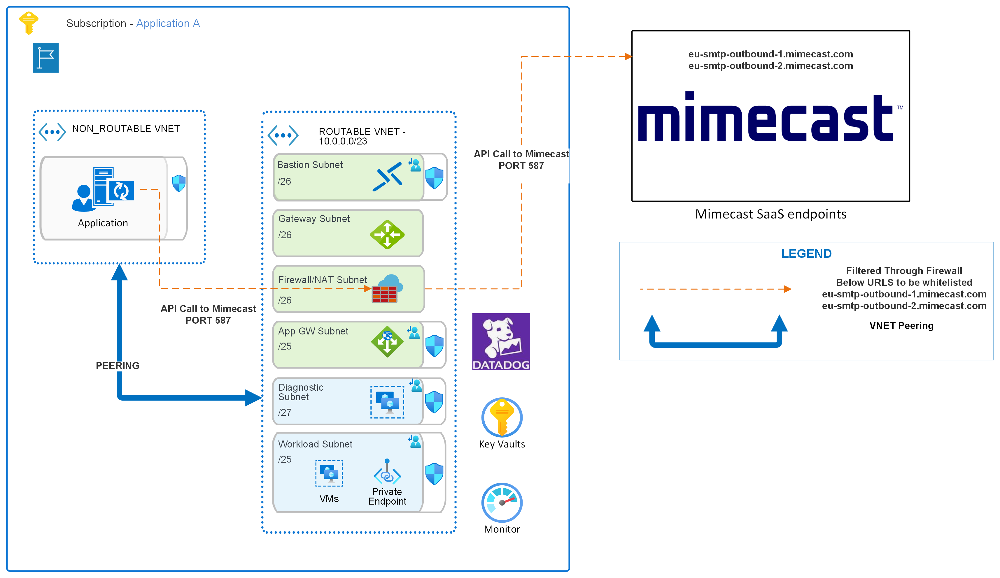

        

Document Metadata

|  |  |
|----|----|
| Identifier | **`LMP-PAT-0037`** |
| Type | **Technical Design Pattern** |
| Status | **Published** |
| Approvals | LMP Migration Architecture Approval |
| Governance Reference | **** |
| Pattern Source Repo |  |
| Published on | **October 19, 2024** |
| Valid From | **November 06, 2024** |
| Authors |   |
| Tags | Communication |
| Technology Capabilities | Workplace / Communication & Collaboration / Communication |

# Mimecast Technical Architecture<a href="#mimecast-technical-architecture" class="headerlink" title="Permanent link">¶</a>

## Relevant ADRs<a href="#relevant-adrs" class="headerlink" title="Permanent link">¶</a>

- [LMP-ADR-0001: Use Mimecast as a secure email service](../../../adrs/communication/0001-use-mimecast-for-email/)

## Mimecast Integration for Email Services<a href="#mimecast-integration-for-email-services" class="headerlink" title="Permanent link">¶</a>

Mimecast is compatible with virtualized and public cloud environments, provided that the operating system and capacity requirements are met, and specific features are not utilized. If these conditions are satisfied and the application is not being re-architected, Mimecast remains a viable solution in the cloud.

### Mimecast Network Flow<a href="#mimecast-network-flow" class="headerlink" title="Permanent link">¶</a>

Mimecast is a cloud services, the SMTP servers are accessible over Public FQDNs. The traffic from the application to the Mimecast SMTP endpoints will flow through the Azure Firewall deployed in the Spoke subscriptions. The following diagram illustrates the networking setup:

There are three components to this setup: the routeable, non-routeable, and Mimecast SaaS, along with the firewalls. When an application sends an API call to Mimecast, it originates within the non-routeable VNet and is then forwarded to the Azure Firewall located in the routeable VNet. Azure Firewall based on the allow listed rules forwards traffic to the Mimecast SaaS endpoints. The URLs listed below must be whitelisted in the firewall for this process to function correctly:

- `eu-smtp-outbound-1.mimecast.com`
- `eu-smtp-outbound-2.mimecast.com`

These URLs correspond to the Mimecast SaaS endpoints, connection is over `port 587` which needs to be `allowed` on the Azure firewall as a network rule.

### Mimecast Authentication and Authorization<a href="#mimecast-authentication-and-authorization" class="headerlink" title="Permanent link">¶</a>

To ensure secure access to Mimecast services, proper authentication and authorization mechanisms must be in place. Mimecast uses a combination of API keys and user credentials to authenticate requests and authorize actions. Follow these steps to set up authentication and authorization:

1.  Use a username and password to authenticate; approved domains include `*@mrelay.lseg.com`, `*@refinitiv.com`, `*@lseg.com`, and you need to get the credentials from the Mimecast team.

2.  Store the credentials securely using environment variables or a secure vault, like Azure Key Vault.

3.  Integrate these credentials with your application ensuring all communications use TLS 1.2 or above.

4.  Test to make sure authentication and authorization work as expected. Suggested SDKs for integration:

    \- **Python**: Use the `requests` library. - **Java**: Utilize the `HttpClient` library. - **Node.js**: Leverage the `axios` or `request` libraries. - **.NET**: Use the `HttpClient` class. - **Ruby**: The `rest-client` gem.

By following these steps, app teams can securely integrate Mimecast into their applications for sending emails.

For more details, refer to the [Mimecast API Documentation](https://developer.services.mimecast.com/).

Application Teams must follow the Security Design Pattern for email Authentication - [`SP 0036 - Email-Authentication`](https://confluence.refinitiv.com/display/PSAR/Secure+Design+Patterns+-+Catalogue).

### How to use and Configure Mimecast<a href="#how-to-use-and-configure-mimecast" class="headerlink" title="Permanent link">¶</a>

1.  Raise a ServiceNow request at [O365 Engineering Service Request](https://lseg.service-now.com/now/nav/ui/classic/params/target/com.glideapp.servicecatalog_cat_item_view.do%3Fv%3D1%26sysparm_id%3D1a7dfd4497b70dd041c03d9e2153afe7).

2.  Select `"Mimecast"` for the subject matter field.

3.  Identify the Mailbox to be Configured as the "From" ID:

    a\. The following existing domains are approved for use in Mimecast:

    \- `*@mrelay.lseg.com` - `*@refinitiv.com` - `*@lseg.com` For a complete list, contact the Mimecast team. Points of contact are mentioned below.

    b\. If a new mailbox is required, follow the process outlined in the [O365 Engineering Service Request](https://lseg.service-now.com/now/nav/ui/classic/params/target/com.glideapp.servicecatalog_cat_item_view.do%3Fv%3D1%26sysparm_id%3D1a7dfd4497b70dd041c03d9e2153afe7). Select "Mimecast" for the subject matter field. Note that this process can take up to one month. Provide details in the request regarding the audience for which emails need to be sent.

4.  The team will share the Mimecast credentials as part of the request.

5.  Configuration for Outgoing Emails:

    In case Application needs to send outgoing emails to within LSEG and outside LSEG users, details to be specified in the Mimecast request mentioned above.

6.  Application team to ensure that the `Mimecast FQDNs` are allow-listed in the `spoke firewalls` for network rules. The `port` to be used is `587`. SRE Tickets needs to be raised to allow-list these FQDN's .

- `eu-smtp-outbound-1.mimecast.com`
- `eu-smtp-outbound-2.mimecast.com`

<table class="highlighttable">
<colgroup>
<col style="width: 50%" />
<col style="width: 50%" />
</colgroup>
<tbody>
<tr>
<td class="linenos">

<pre><code>1
2</code></pre>

</td>
<td class="code">

<pre><code>Note: Based on the cutover dates, teams can raise requests for Mimecast. In case of delays, teams can contact the appropriate support channels.
POC: @Nair, Shivalakshmi / @Jackson, Iain Fred Fuller / @Sarkar, Monami</code></pre>

</td>
</tr>
</tbody>
</table>

- [Can we use ACS as target Azure service for SES service for one of our applications? - LSEG Stack Overflow](https://lseg.stackenterprise.co/questions/19863)

<!-- -->

- [How to use Mimecast in Azure Greenfield for LMP - LSEG Stack Overflow](https://lseg.stackenterprise.co/articles/19865)

### Further Reading for Mimecast Integration for Email Services<a href="#further-reading-for-mimecast-integration-for-email-services" class="headerlink" title="Permanent link">¶</a>

- [Mimecast Email Security](https://www.mimecast.com/content/email-security/)
- [Mimecast Email Archiving](https://www.mimecast.com/content/email-archiving/)
- [Mimecast Threat Protection](https://www.mimecast.com/content/threat-protection/)
- [Mimecast Overview](https://www.mimecast.com/content/email-security/)
- [Mimecast API Documentation](https://www.mimecast.com/developer/documentation/)
- [Azure Key Vault Documentation](https://learn.microsoft.com/en-us/azure/key-vault/general/)
- [AWS Secrets Manager Documentation](https://docs.aws.amazon.com/secretsmanager/latest/userguide/intro.html)
- [Transport Layer Security (TLS)](https://en.wikipedia.org/wiki/Transport_Layer_Security)
- [ServiceNow Documentation](https://docs.servicenow.com/)
- [Azure Entra Documentation](https://learn.microsoft.com/en-us/azure/active-directory/fundamentals/active-directory-whatis)
- [Azure Virtual Network Documentation](https://learn.microsoft.com/en-us/azure/virtual-network/virtual-networks-overview)
- [Azure Firewall Documentation](https://learn.microsoft.com/en-us/azure/firewall/overview)
- [Mimecast Authentication and Authorization](https://community.mimecast.com/s/article/Managing-Authentication-and-Authorization)
- [API Key Management Best Practices](https://www.cloudflare.com/learning/security/api/what-is-api-security/)
- [Audit Logging Best Practices](https://www.splunk.com/en_us/data-insider/what-is-audit-logging.html)
- [Secure API Development](https://owasp.org/www-project-api-security/)

    May 23, 2025      November 4, 2024 

 Previous 

Azure Site Recovery for DR Pattern

 Next 

AWS Lambda to Azure Functions

Made with <a href="https://squidfunk.github.io/mkdocs-material/" target="_blank" rel="noopener">Material for MkDocs</a>

