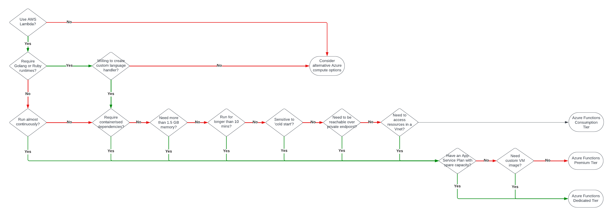

        

Document Metadata

|  |  |
|----|----|
| Identifier | **`LMP-PAT-0001`** |
| Type | **Technology Selection Pattern** |
| Status | **Published** |
| Approvals | LMP Migration Architecture Approval |
| Published on | **March 05, 2024** |
| Valid From | **June 08, 2024** |
| Authors |   |
| Tags | Compute on Demand |
| Technology Capabilities | Infrastructure / Compute / Compute on Demand |

# AWS Lambda to Azure Functions<a href="#aws-lambda-to-azure-functions" class="headerlink" title="Permanent link">¶</a>

## Compatibility<a href="#compatibility" class="headerlink" title="Permanent link">¶</a>

Advice pertains to Azure Functions Runtime version 4.x.

## Recommended Target<a href="#recommended-target" class="headerlink" title="Permanent link">¶</a>

Azure Functions is a serverless compute service that allows you to run event-triggered code without having to explicitly provision or manage infrastructure.

It supports multiple programming languages, including C#, JavaScript, Python, and PowerShell, making it possible to port many, but not all, Lambda use cases.

Azure Functions integrates well with other Azure services such as Azure Storage, Azure Event Hubs, and Azure Cosmos DB via declarative bindings – a slightly different programming model to AWS Lambda.

## Decision Tree Diagram<a href="#decision-tree-diagram" class="headerlink" title="Permanent link">¶</a>

## Notable Differences<a href="#notable-differences" class="headerlink" title="Permanent link">¶</a>

<table>
<colgroup>
<col style="width: 25%" />
<col style="width: 25%" />
<col style="width: 25%" />
<col style="width: 25%" />
</colgroup>
<thead>
<tr>
<th></th>
<th></th>
<th>AWS Lambda</th>
<th>Azure Functions</th>
</tr>
</thead>
<tbody>
<tr>
<td>🟢</td>
<td><strong>Cost</strong> 
(non-provisioned Lamba vs Azure Consumption Plan)</td>
<td>By GB-s 
 
By fixed storage allocation 
 
By fixed memory allocation</td>
<td>By GB-s 
 
Storage Account charged separately 
 
By varying memory allocation</td>
</tr>
<tr>
<td>🔴</td>
<td><strong>Cost</strong> 
(Premium Plan)</td>
<td></td>
<td>Premium Plan required for virtual network integration, extended timeouts, warm instances, longer timeouts, more memory.</td>
</tr>
<tr>
<td>🟢</td>
<td><strong>Memory</strong></td>
<td>128MB – 10GB<a href="#fn:1" class="footnote-ref">2</a></td>
<td>1.5 GB+<a href="#fn:2" class="footnote-ref">3</a></td>
</tr>
<tr>
<td>🟢</td>
<td><strong>Timeouts</strong></td>
<td>3 sec – 15 mins</td>
<td>5 mins – unlimited 
- 230 sec max for http triggers<a href="#fn:4" class="footnote-ref">4</a></td>
</tr>
<tr>
<td>🔴</td>
<td><strong>Concurrency</strong></td>
<td>Instance per request<a href="#fn:5" class="footnote-ref">5</a></td>
<td>Multiple invocations per instance<a href="#fn:6" class="footnote-ref">6</a></td>
</tr>
<tr>
<td>🟡</td>
<td><strong>Scaling</strong></td>
<td>By request</td>
<td>By host</td>
</tr>
<tr>
<td>🟢</td>
<td><strong>Runtimes</strong></td>
<td></td>
<td>No Golang or Ruby</td>
</tr>
<tr>
<td>🟢</td>
<td><strong>Storage</strong></td>
<td>Ephemeral 512MB – 10GB<a href="#fn:7" class="footnote-ref">7</a></td>
<td>Storage Account mandatory</td>
</tr>
<tr>
<td>🟡</td>
<td><strong>Programming Model</strong></td>
<td>Handlers passed context and event</td>
<td>Trigger (e.g queue, timer, http) 
 
Declarative, extensible input/output bindings (e.g. to Blob Storage, Cosmos, etc.)<a href="#fn:8" class="footnote-ref">8</a></td>
</tr>
<tr>
<td>🟢</td>
<td><strong>Operating Systems</strong></td>
<td>Linux</td>
<td>Windows or Linux</td>
</tr>
<tr>
<td>🟢</td>
<td><strong>Deployment</strong></td>
<td>Decouple via Layers</td>
<td>Decouple via Azure Files</td>
</tr>
</tbody>
</table>

## Considerations<a href="#considerations" class="headerlink" title="Permanent link">¶</a>

- **Language Compatibility**: Unlike AWS Lambda, Azure Functions does not have out of the box support for Ruby or Go. It is possible to engineer a solution with [custom handlers](https://learn.microsoft.com/en-us/azure/azure-functions/functions-custom-handlers), but consider whether this is the right alternative for your team. Whilst the effort involved to create a custom handler might be relatively low - similar to implementing an API handler in the given language outside of Functions - there are, according to the documentation, trade-offs to consider including the potential for increased cold starts.
- **Orchestration**: Azure Functions offers [Durable Functions](https://learn.microsoft.com/en-us/azure/azure-functions/durable/durable-functions-overview?tabs=in-process%2Cnodejs-v3%2Cv1-model&pivots=csharp) as a code-first solution for stateful functions. See also the designer-first, integration-rich [Azure Logic Apps](https://learn.microsoft.com/en-us/azure/azure-functions/functions-compare-logic-apps-ms-flow-webjobs?toc=%2Fazure%2Fazure-functions%2Fdurable%2Ftoc.json) for workflow orchestration.
- **Concurrency**: the Lambda concurrency model is different, With an instance per request being created, plus the ( premium) option for provisioned concurrency, throughput is arguably more predictable/stable. In Azure Functions, where execution is on shared compute, it is possible that instances may compete for resources. This may become even more apparent with languages like Python that have naturally single threaded runtimes. In these scenarios, consider increasing the number of workers and, ideally, refactoring to use asynchronous code.

## Alternatives<a href="#alternatives" class="headerlink" title="Permanent link">¶</a>

- **Kubernetes Event Driven Autoscaling ("KEDA")**<a href="#fn:10" class="footnote-ref">1</a> can be used to scale pods, including Azure Function containers, on general-purpose Kubernetes clusters including those with specific node pools (such as GPUs). KEDA **moved to the CNCF 'Graduated' maturity level** on August 22, 2023.
- **Knative**, a CNCF-hosted Kubernetes-based serverless platform, was accepted to CNCF on March 2, 2022 at the **' Incubating'** maturity level.
- **OpenFaaS** provides a similar ability to run scale-to-zero functions on Kubernetes. They offer enterprise support and commercial pricing.

## Further Reading<a href="#further-reading" class="headerlink" title="Permanent link">¶</a>

- Microsoft’s [Azure Functions documentation](https://learn.microsoft.com/en-us/azure/azure-functions/)
- [Cloud Product Framework: Linux Function App](https://gitlab.dx1.lseg.com/app/app-51310/azure/prdsvc/terraform/azure-prdsvc-terraform-linuxfunctionapp)
- [Cloud Product Framework: Windows Function App](https://gitlab.dx1.lseg.com/app/app-51310/azure/prdsvc/terraform/azure-prdsvc-terraform-windowsfunctionapp)

------------------------------------------------------------------------

1.  

    <https://keda.sh>\] <a href="#fnref:10" class="footnote-backref" title="Jump back to footnote 1 in the text">↩︎</a>

    

2.  

    <https://docs.aws.amazon.com/lambda/latest/dg/configuration-function-common.html#configuration-memory-console> <a href="#fnref:1" class="footnote-backref" title="Jump back to footnote 2 in the text">↩︎</a>

    

3.  

    <https://learn.microsoft.com/en-us/azure/azure-functions/functions-scale#service-limits> <a href="#fnref:2" class="footnote-backref" title="Jump back to footnote 3 in the text">↩︎</a>

    

4.  

    <https://learn.microsoft.com/en-us/azure/azure-functions/functions-versions?tabs=isolated-process%2Cv4&pivots=programming-language-python#timeout> <a href="#fnref:4" class="footnote-backref" title="Jump back to footnote 4 in the text">↩︎</a>

    

5.  

    <https://docs.aws.amazon.com/lambda/latest/dg/lambda-concurrency.html> <a href="#fnref:5" class="footnote-backref" title="Jump back to footnote 5 in the text">↩︎</a>

    

6.  

    <https://learn.microsoft.com/en-us/azure/azure-functions/functions-concurrency> <a href="#fnref:6" class="footnote-backref" title="Jump back to footnote 6 in the text">↩︎</a>

    

7.  

    <https://docs.aws.amazon.com/lambda/latest/dg/configuration-function-common.html#configuration-ephemeral-storage> <a href="#fnref:7" class="footnote-backref" title="Jump back to footnote 7 in the text">↩︎</a>

    

8.  

    <https://docs.aws.amazon.com/lambda/latest/dg/foundation-progmodel.html> <a href="#fnref:8" class="footnote-backref" title="Jump back to footnote 8 in the text">↩︎</a>

    

    May 30, 2025      March 5, 2024 

 Previous 

Mimecast Technical Architecture

 Next 

Azure Functions Service Pattern

Made with <a href="https://squidfunk.github.io/mkdocs-material/" target="_blank" rel="noopener">Material for MkDocs</a>

