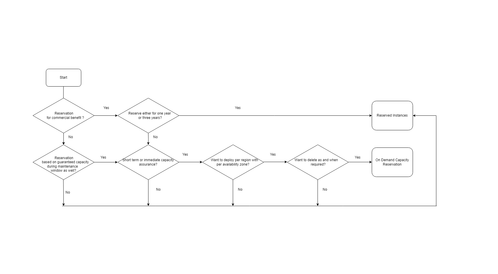

        

Document Metadata

|  |  |
|----|----|
| Identifier | **`LMP-PAT-0070`** |
| Type | **Technical Design Pattern** |
| Status | **Published** |
| Approvals | LMP Migration Architecture Approval |
| Governance Reference | **** |
| Pattern Source Repo |  |
| Published on | **October 12, 2024** |
| Valid From | **December 20, 2024** |
| Authors |   |
| Tags | Compute on Demand |
| Technology Capabilities | Infrastructure / Compute / Compute on Demand |

# On-demand capacity reservation<a href="#on-demand-capacity-reservation" class="headerlink" title="Permanent link">¶</a>

## Introduction<a href="#introduction" class="headerlink" title="Permanent link">¶</a>

On-demand capacity reservations in Azure provide a flexible way to reserve compute capacity without the long-term commitment of traditional reserved instances. This allows you to scale your resources up or down as needed, ensuring that you have the capacity to meet your workload demands.

Capacity reservation has some basic properties that are always defined at the time of creation:

*VM size*: Each reservation is for one virtual machine (VM) size. An example is Standard_D2s_v3.  
*Location*: Each reservation is for one location (region). If that location has availability zones, the reservation can also specify one of the zones.  
*Quantity*: Each reservation has a quantity of instances to be reserved.

### Context and Problem<a href="#context-and-problem" class="headerlink" title="Permanent link">¶</a>

During the patch management or reboot of the VM instance in LSEG environment, the VM are facing the capacity issue. To ensure the VMs have assured capacity in the subscription, there is a need to reserve capacity in Azure by using On Demand Capacity reservation.

Hence to proactively address potential capacity bottlenecks during VM maintenance operations in the LSEG environment, we suggest utilizing Azure's On-Demand Capacity Reservations. This will allocate dedicated capacity to the VMs, ensuring uninterrupted service delivery.

## Scope<a href="#scope" class="headerlink" title="Permanent link">¶</a>

The aim of this pattern is to:

Reserve compute capacity without the long-term commitment of traditional Reserved Instances. This feature is primarily applicable to Azure Virtual Machines.

## Use Cases<a href="#use-cases" class="headerlink" title="Permanent link">¶</a>

### Bursty Workloads<a href="#bursty-workloads" class="headerlink" title="Permanent link">¶</a>

- Allocate dedicated capacity to the VMs,so that the VM will not face the capacity issue after patching or reboot.

<!-- -->

- Providing capacity for sudden spikes in demand, such as during promotional events or unexpected traffic surges.

### Mission-Critical Workloads<a href="#mission-critical-workloads" class="headerlink" title="Permanent link">¶</a>

- Ensuring availability of critical applications during peak usage or maintenance windows. Guaranteeing consistent performance for business-critical services.

### Testing and Development Environments<a href="#testing-and-development-environments" class="headerlink" title="Permanent link">¶</a>

- Allocating dedicated capacity for testing and development activities.

<!-- -->

- Ensuring consistent performance for CI/CD pipelines and other development workflows.

## Functional Requirements<a href="#functional-requirements" class="headerlink" title="Permanent link">¶</a>

On-Demand Capacity Reservations in Azure provide a dynamic way to reserve compute capacity without the long-term commitment of traditional Reserved Instances. Here's the core components for implementing this feature:

### Core Components<a href="#core-components" class="headerlink" title="Permanent link">¶</a>

#### Capacity Reservation Group<a href="#capacity-reservation-group" class="headerlink" title="Permanent link">¶</a>

- A logical container for related capacity reservations.
- Defines the region and availability zone where the reservations will be allocated.

#### Capacity Reservations<a href="#capacity-reservations" class="headerlink" title="Permanent link">¶</a>

- Individual reservations within the group.
- Specify the VM size, quantity, and duration of the reservation.

#### Virtual Machines (VMs)<a href="#virtual-machines-vms" class="headerlink" title="Permanent link">¶</a>

- Instances of the reserved capacity.
- Deployed within the capacity reservation group to leverage the guaranteed capacity.

### Key Features<a href="#key-features" class="headerlink" title="Permanent link">¶</a>

• *Pay-as-you-go*: You only pay for the reserved capacity when it's in use.  
• *No Long-Term Commitment*: Create and delete reservations as needed, offering greater flexibility.  
• *SLA-Backed Capacity*: Once a reservation is created, Azure guarantees the availability of the reserved capacity, ensuring your workloads can run smoothly.  
• *Prioritized Access*: Your VMs using the reserved capacity have priority access to the reserved resources, minimizing the risk of capacity constraints.  
• *Cost Optimization*: While there are no upfront discounts like with reserved instances, on-demand capacity reservations can still help optimize costs by providing consistent pricing and avoiding unexpected spikes in usage.

### Benefits of capacity reservation<a href="#benefits-of-capacity-reservation" class="headerlink" title="Permanent link">¶</a>

• After deployment, capacity is reserved for your use and is always available within the scope of applicable service-level agreements (SLAs).  
• Capacity can be deployed and deleted at any time with no term commitment.  
• Capacity can be combined automatically with reserved instances to use term-commitment discounts.  

### Limitations and restrictions<a href="#limitations-and-restrictions" class="headerlink" title="Permanent link">¶</a>

• Creating capacity reservations requires a quota in the same manner as when you create VMs.  
• Creating capacity reservations is currently limited to certain VM series and sizes. The compute Resource SKUs list advertises the set of supported VM sizes.  
• The following VM series support the creation of capacity reservations:

- Av2
- B
- Bpsv2
- Bsv2 (Intel) and Basv2 (AMD)
- D and Ds series, v2 and newer; AMD and Intel
- Dadsv5
- Dav4 series
- Dasv4 and newer
- Ddv4 and v5 series
- Dds series, v4 and newer
- Dlsv5 and newer series
- Dldsv5 and newer series
- DCsv2 series
- DCasv5 and DCadsv5 series
- DCesv5 and DCedsv5 series
- ECasv5 and ECadsv5 series
- ECesv5 and ECedsv5 series
- Dplsv5 and newer series
- Dps and Dpds series, v5 and newer
- Dplds series, v5 and newer
- Eps and Epds series, v5 and newer
- E series, all versions; AMD and Intel
- Eav4 and Easv4 series
- Easv5 and Eadsv5 series
- Ebdsv5 and Ebsv5 series
- Ed and Eds series, v4 and newer
- F series, all versions
- Fx series
- Lsv3 (Intel) and Lasv3 (AMD)

### How to Use On-Demand Capacity Reservations<a href="#how-to-use-on-demand-capacity-reservations" class="headerlink" title="Permanent link">¶</a>

1.  Create a Capacity Reservation Group: This groups together related reservations for easier management.
2.  Create Capacity Reservations: Specify the VM size, region, availability zone, and quantity of instances to reserve.
3.  Deploy VMs: When deploying VMs, assign them to the created capacity reservation group.

## Decision Tree Diagram<a href="#decision-tree-diagram" class="headerlink" title="Permanent link">¶</a>

### Difference between on-demand capacity reservation and reserved instances<a href="#difference-between-on-demand-capacity-reservation-and-reserved-instances" class="headerlink" title="Permanent link">¶</a>

| On-demand capacity reservation | Reserved Instances |
|----|----|
| No term commitment required. Can be created and deleted as per the customer requirement. | Fixed-term commitment of either 1 or 3 years. |
| Can be deployed per region or per availability zone. | Only available at the regional level. |
| Charged at pay-as-you-go rates for the underlying VM size | Significant cost savings over pay-as-you-go rates |
| Provides capacity guarantee in the specified location (region or availability zone). | Doesn't provide a capacity guarantee. Customers can choose Capacity priority to gain better access, but that option doesn't carry an SLA. |

## Further Reading<a href="#further-reading" class="headerlink" title="Permanent link">¶</a>

[Capacity Reservation Documentation - MS Learn](https://learn.microsoft.com/en-us/azure/virtual-machines/capacity-reservation-overview#difference-between-on-demand-capacity-reservation-and-reserved-instances)

    February 18, 2025      December 19, 2024 

 Previous 

Azure Functions Service Pattern

 Next 

Machine learning workloads migration to Azure

Made with <a href="https://squidfunk.github.io/mkdocs-material/" target="_blank" rel="noopener">Material for MkDocs</a>

