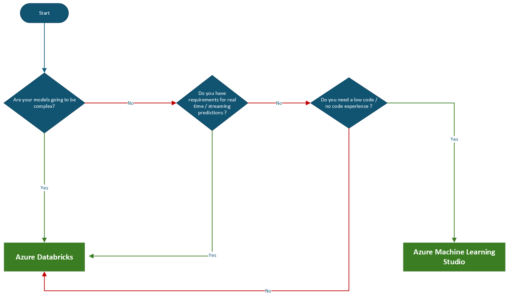

        

Document Metadata

|  |  |
|----|----|
| Identifier | **`LMP-PAT-0047`** |
| Type | **Technology Selection Pattern** |
| Status | **Published** |
| Approvals | LMP Migration Architecture Approval |
| Published on | **November 29, 2024** |
| Valid From | **December 17, 2024** |
| Authors |   |
| Tags | Data Analytics & Visualizations |
| Technology Capabilities | Platform / Application / Decision Intelligence & Automation / Machine Learning |

# Machine learning workloads migration to Azure<a href="#machine-learning-workloads-migration-to-azure" class="headerlink" title="Permanent link">¶</a>

## Compatibility<a href="#compatibility" class="headerlink" title="Permanent link">¶</a>

This advice pertains to the choice of options to migrate machine learning workloads to Microsoft Azure.

## Recommended Target<a href="#recommended-target" class="headerlink" title="Permanent link">¶</a>

Azure Data Bricks , Azure Machine Learning Studio

## Decision Tree Diagram<a href="#decision-tree-diagram" class="headerlink" title="Permanent link">¶</a>

## Notable Differences<a href="#notable-differences" class="headerlink" title="Permanent link">¶</a>

<table>
<colgroup>
<col style="width: 25%" />
<col style="width: 25%" />
<col style="width: 25%" />
<col style="width: 25%" />
</colgroup>
<thead>
<tr>
<th></th>
<th></th>
<th>Azure Data Bricks</th>
<th>Azure Machine Learning Studio</th>
</tr>
</thead>
<tbody>
<tr>
<td>🟢</td>
<td><strong>Cost</strong> 
</td>
<td>May be on a higher price side, if considering for low data sizes</td>
<td>Cost effective since there are options to choose from varied compute options</td>
</tr>
<tr>
<td>🟢</td>
<td><strong>Scalability</strong></td>
<td>Optimized Autoscaling allows clusters to scale up and down more aggressively based on the load.</td>
<td>Azure provides built-in autoscaling options for most of the compute options. Optimized and autoscaling single and multi-node clusters (including GPU) are available to efficiently run ML jobs.</td>
</tr>
<tr>
<td>🟢</td>
<td><strong>Ease of Use</strong></td>
<td>Would need expertise in setting up and running. Caters mostly to professionals</td>
<td>Azure ML provides better user interface that facilitates easy starting for a novice user. It has ability to cater different skillset consumers including code first (notebooks / IDEs), low-code(Auto ML) and no-code(Designer) options as well.</td>
</tr>
<tr>
<td>🟢</td>
<td><strong>Inferencing</strong></td>
<td>Advised to use MLFLow for deploying ML models. Models can be accessed directly with couple of lines of code for bacth / streaming inference</td>
<td>On-demand inferencing across the cloud and edge for both batch and real time inferencing.</td>
</tr>
<tr>
<td>🟢</td>
<td><strong>Model Registry</strong></td>
<td>MLFlow model registry for consistent, secure model deployment and management. Models are made available in a consistent, open format for deployment from the ML Flow registry to Kubernetes, cloud or OSS inference services.</td>
<td>A central repository for the entire organization. Full lineage for models.</td>
</tr>
<tr>
<td>🟢</td>
<td><strong>Azure Services Integration</strong></td>
<td>Azure Databricks has can be integrated with Azure Machine learning via MLFlow</td>
<td>Azure Machine Learning pipelines allow for versioned model retraining and batch scoring pipelines that easily be integrated with other tools , including Azure Data Factory.</td>
</tr>
</tbody>
</table>

## Considerations<a href="#considerations" class="headerlink" title="Permanent link">¶</a>

Databricks and Machine Learning Studio can be used in conjunction where Azure Databricks would perform training experiment in parallel (say 100 runs), and azure ml workspace that runs model experiment through a lot of trained models.

- **Alternative Technology**: As per the general LMP approach, general strategy is to prefer Azure native technology where possible and where appropriate to the use case. The referenced guidance covers these scenarios in depth. If alternatives are needed for specific architectural challenges, they would be treated as exceptional. As and when exceptions crop up, and where merited, they will be added to this pattern.

## Further Reading<a href="#further-reading" class="headerlink" title="Permanent link">¶</a>

- [Azure Data Bricks Clear Listing](https://gitlab.dx1.lseg.com/app/app-51285/cloud-security-controls/azure-clear-listing/-/blob/main/azure/services/Microsoft.Databricks/workspaces/v1.0.0/markdown/serviceControls.md?ref_type=heads)
- [Azure Machine Learning Studio Clear Listing](https://gitlab.dx1.lseg.com/app/app-51285/cloud-security-controls/azure-clear-listing/-/blob/main/azure/services/Microsoft.MachineLearningServices/workspaces/v2.0.0/markdown/serviceControls.md?ref_type=heads)

## References<a href="#references" class="headerlink" title="Permanent link">¶</a>

- [Azure Data Bricks for Machine Learning](https://learn.microsoft.com/en-us/azure/databricks/machine-learning/) \*[Azure Machine Learning](https://learn.microsoft.com/en-us/azure/machine-learning/overview-what-is-azure-machine-learning?view=azureml-api-2)

    May 30, 2025      December 2, 2024 

 Previous 

On-demand capacity reservation

 Next 

Spark migration to Azure

Made with <a href="https://squidfunk.github.io/mkdocs-material/" target="_blank" rel="noopener">Material for MkDocs</a>

