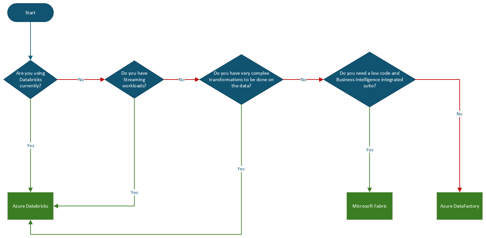

        

Document Metadata

|  |  |
|----|----|
| Identifier | **`LMP-PAT-0053`** |
| Type | **Technology Selection Pattern** |
| Status | **Published** |
| Approvals | LMP Migration Architecture Approval |
| Published on | **November 15, 2024** |
| Valid From | **December 17, 2024** |
| Authors |   |
| Tags | Data Analytics & Visualizations |
| Technology Capabilities | Platform / Data / Data Analytics & Visualizations |

# Spark migration to Azure<a href="#spark-migration-to-azure" class="headerlink" title="Permanent link">¶</a>

## Compatibility<a href="#compatibility" class="headerlink" title="Permanent link">¶</a>

This advice pertains to the choice of options to migrate and orchestrate Spark Jobs in Microsoft Azure.

## Recommended Target<a href="#recommended-target" class="headerlink" title="Permanent link">¶</a>

Azure Data Bricks, Microsoft Fabric, Azure Data Factory.

## Decision Tree Diagram<a href="#decision-tree-diagram" class="headerlink" title="Permanent link">¶</a>

## Notable Differences<a href="#notable-differences" class="headerlink" title="Permanent link">¶</a>

<table>
<colgroup>
<col style="width: 20%" />
<col style="width: 20%" />
<col style="width: 20%" />
<col style="width: 20%" />
<col style="width: 20%" />
</colgroup>
<thead>
<tr>
<th></th>
<th></th>
<th>Azure Data Bricks</th>
<th>Microsoft Fabric (Fabric is available in LMSP1 and LSEG SaaS but not LSEG.com at the time of writing)</th>
<th>Azure Data Factory</th>
</tr>
</thead>
<tbody>
<tr>
<td>🟡</td>
<td><strong>Cost</strong></td>
<td>Pricing is based on DataBricks Units (DBUs), which combine compute and storage costs. 
 
Spot VMs can help reduce costs.</td>
<td>Pay as you go go and reserved pricing available(which is cheaper). 
 
Price would vary based on SKU and Capacity Units (CU). 
 
There would be separate price for OneLake storage and networking.</td>
<td>Pay as you go model based on pipeline activities, data movement and data volume.ADF is generally cost-effective for straightforward ETL tasks, but may become expensive for complex use cases.</td>
</tr>
<tr>
<td>🟡</td>
<td><strong>Scalability</strong></td>
<td>High scalability for big data. 
 
Supports autoscaling of clusters.</td>
<td>Scalable for data integration, analytics and business Intelligence. 
 
As of writing only P SKU s have auto scaling feature.</td>
<td>Scales well for orchestrating pipelines across data sources.</td>
</tr>
<tr>
<td>🟢</td>
<td><strong>Ease of Use</strong></td>
<td>Relies on code in notebooks. 
Collaborative notebooks and streamlined work flows for data scientists and engineers.</td>
<td>Integrated experience with modern data factory features. 
 
Low code experience for the engineers.</td>
<td>Easy to orchestrate with a drag and drop interface.</td>
</tr>
<tr>
<td>🟢</td>
<td><strong>Integration</strong></td>
<td>Integrates with other Azure services like Azure Data Lake, Synapse Analytics, Azure Machine learning etc.</td>
<td>Integrates with a wide range for Microsoft services and third party tools.</td>
<td>Seamless integration with other Azure Services with 'Activities'.</td>
</tr>
<tr>
<td>🟡</td>
<td><strong>Language Support</strong></td>
<td>Python 
Scala 
SQL 
R</td>
<td>Python 
Scala 
SQL 
R</td>
<td>No code.</td>
</tr>
<tr>
<td>🟡</td>
<td><strong>Performance</strong></td>
<td>Optimized for high-performance data analytics and machine learning. 
 
Built on top of latest Apache spark engine with DBX Runtime around which provides high performance.</td>
<td>Optimized for high-performance data operations and analytics.</td>
<td>Efficient for ETL tasks and data movements.</td>
</tr>
<tr>
<td>🟢</td>
<td><strong>Orchestration</strong></td>
<td>Workflows can be used for orchestrations.</td>
<td>Orchestrates spark jobs within a broader analytics and BI framework.</td>
<td>Built for data pipeline orchestration. 
 
Supports orchestration of spark jobs via DataBricks / Synapse / HDInsight integrations. 
 
Visual drag and drop interface for orchestration.</td>
</tr>
<tr>
<td>🟢</td>
<td><strong>Spark Version</strong></td>
<td>Spark Version 3.5.0</td>
<td>Spark 3.5.0</td>
<td>-</td>
</tr>
<tr>
<td>🟡</td>
<td><strong>Best Use cases</strong></td>
<td>If Team is already working on DataBricks on prem or another cloud provider, Azure DataBricks can be used since team is already knows it and has less or zero learning curve. 
 
Complex data engineering, machine learning and big data analytics.</td>
<td>Unified data analytics and BI use cases. 
 
Best for all in one data platform, with low code.</td>
<td>ETL, data integration and pipeline orchestration.There is an option named - DataFlows used for data transformations which runs spark under the hood. This will be a drag and drop experience. (For migrating existing spark jobs in code - would need to connect to DataBricks / Synapse.</td>
</tr>
</tbody>
</table>

## Considerations<a href="#considerations" class="headerlink" title="Permanent link">¶</a>

For a unified data experience with business intelligence clubbed with low code experience for data workflows Microsoft Fabric would be a good choice along with machine learning integrations. The new feature of OneLake could help getting data from on prem, multi cloud vendors on to a same data lake for further analytics. **Note: Microsoft Fabric is still not available in Greenfield, Fabric is available in LMSP1 and LSEG SaaS** **but not LSEG.com at the time of writing. Hence this document would recommend to consult with Foundation,** **further in case if the decision goes to the use of Fabric.**

For any high complexity transformations and efficient spark job processing Azure DataBricks can be leveraged especially if there are existing clusters, and it can give more control as well compared to others. If the current team is well versed with DataBricks On premises or any other cloud, Azure DataBricks would be a great option to look for. Azure DataBricks also has use cases for data scientists and machine learning with latest Apache spark engine and DBX runtime.

It is to be noted that the Data Flows in Azure DataFactory uses on demand spark compute behind the scenes which is managed by Azure. It can only be useful for simple transformations which ADF has support for. If there are simple jobs where customer wanted low code experience this would be a good tool to look for.Other than that it is advised to use ADF for Data Ingestion and orchestration tool.

- **Alternative Technology**: As per the general LMP approach, general strategy is to prefer Azure native technology where possible and where appropriate to the use case. The referenced guidance covers these scenarios in depth. If alternatives are needed for specific architectural challenges, they would be treated as exceptional. As and when exceptions crop up, and where merited, they will be added to this pattern.

## Further Reading<a href="#further-reading" class="headerlink" title="Permanent link">¶</a>

- [Azure DataBricks Clear Listing](https://gitlab.dx1.lseg.com/app/app-51285/cloud-security-controls/azure-clear-listing/-/blob/main/azure/services/Microsoft.Databricks/workspaces/v1.0.0/markdown/serviceControls.md?ref_type=heads)
- [Azure Data Factory Clear Listing](https://gitlab.dx1.lseg.com/app/app-51285/cloud-security-controls/azure-clear-listing/-/blob/main/azure/services/Microsoft.DataFactory/factories/v1.1.0/markdown/serviceControls.md?ref_type=heads)
- [Microsoft Fabric Clear Listing](https://gitlab.dx1.lseg.com/app/app-51285/cloud-security-controls/azure-clear-listing/-/blob/main/azure/services/Microsoft.Fabric/capacities/markdown/serviceControls.md?ref_type=heads)

## References<a href="#references" class="headerlink" title="Permanent link">¶</a>

[DataBricks-SpotVMS](https://techcommunity.microsoft.com/t5/analytics-on-azure-blog/azure-databricks-and-azure-spot-vms-save-cost-by-leveraging/ba-p/2374187)

[Fabric Capacity Billing](https://learn.microsoft.com/en-gb/azure/cost-management-billing/reservations/fabric-capacity)

[Fabric Features](https://learn.microsoft.com/en-us/fabric/enterprise/fabric-features)

[Azure Data Factory](https://learn.microsoft.com/en-us/fabric/data-factory/)

    May 30, 2025      December 13, 2024 

 Previous 

Machine learning workloads migration to Azure

 Next 

Azure Databricks Technical Design Pattern

Made with <a href="https://squidfunk.github.io/mkdocs-material/" target="_blank" rel="noopener">Material for MkDocs</a>

