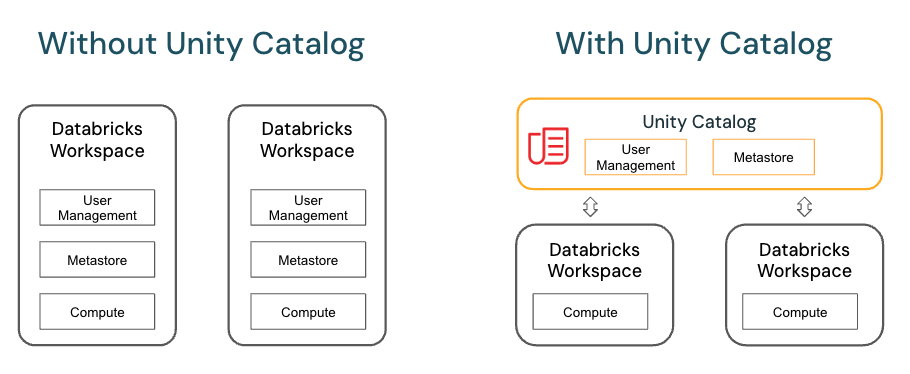

        

Document Metadata

|  |  |
|----|----|
| Identifier | **`LMP-PAT-0078`** |
| Type | **Technical Design Pattern** |
| Status | **Published** |
| Approvals | LMP Migration Architecture Approval |
| Governance Reference | **** |
| Pattern Source Repo |  |
| Published on | **March 30, 2026** |
| Valid From | **March 30, 2026** |
| Authors |   |
| Tags | Data Analytics & Visualizations |
| Technology Capabilities | Platform / Data / Data Analytics & Visualizations |

# Azure Databricks Technical Design Pattern<a href="#azure-databricks-technical-design-pattern" class="headerlink" title="Permanent link">¶</a>

## Description<a href="#description" class="headerlink" title="Permanent link">¶</a>

This document provides a standardized approach for designing data processing and analytics solutions using Azure Databricks. It guides the creation of data-driven architectures for orchestrating data movement and transformation, supporting applications that require scalable analytics capabilities.

Key characteristics:

- Cloud-based analytics and data processing platform
- Support for notebook-based workflows using Apache Spark
- Integration with Azure data services (Data Factory, SQL Database)
- Private link connectivity for secure access
- Implementation within non-routable virtual networks with private endpoints
- Network security group protection for all PaaS services

This design specifically addresses LMP migration requirements where applications need data processing and analytics capabilities while maintaining LSEG's security and networking standards.

## Architecture Overview<a href="#architecture-overview" class="headerlink" title="Permanent link">¶</a>

The Azure Databricks design includes the following key components:

### High Level Design<a href="#high-level-design" class="headerlink" title="Permanent link">¶</a>

The following diagram illustrates the complete Azure Databricks solution architecture, showing the integration between all components and data flow patterns.

This high-level design demonstrates how Azure Databricks integrates with various Azure services to provide a comprehensive data analytics and processing platform. The architecture shows the complete data lifecycle from ingestion through processing to consumption.

### Core Components<a href="#core-components" class="headerlink" title="Permanent link">¶</a>

- **Azure Databricks Account**: Primary service managing the Databricks environment
- **Azure Databricks Workspace**: Collaborative environment for data engineering and machine learning
- **Data Lake & Delta Lake**: Storage layers for raw and processed data
- **Managed Resource Group**: Contains managed identities, storage, and other essential resources
- **Access Connectors**: Mandatory components facilitating secure connectivity between services

### High-Level Architecture<a href="#high-level-architecture" class="headerlink" title="Permanent link">¶</a>

Azure Databricks operates with a control plane and a compute plane, ensuring efficient data processing and management.

- **Control Plane**: Manages backend services and the web application within your Azure Databricks account.
- **Compute Plane**: Processes data and can be categorized into: - **Serverless Compute Plane**: Runs in a compute layer within your Azure Databricks account, providing network isolation and security. - **Classic Compute Plane**: Runs in your Azure subscription, offering natural isolation within each customer's virtual network.

### Networking Architecture<a href="#networking-architecture" class="headerlink" title="Permanent link">¶</a>

Azure Databricks requires implementation in accordance with LSEG's security and networking standards. All Databricks workspaces and compute resources should be deployed within non-routable VNets, with private endpoints for all PaaS services.

The design implements a secure networking model with the following structure:

#### Routable Virtual Network<a href="#routable-virtual-network" class="headerlink" title="Permanent link">¶</a>

- Private Endpoints for Data Lake and Databricks Workspace/API
- Jump Box & Bastion for secure workspace administration access

#### Non-Routable Virtual Network<a href="#non-routable-virtual-network" class="headerlink" title="Permanent link">¶</a>

- **Databricks Private Subnet**: Contains Databricks Compute Clusters and DBFS mounts
- **Databricks Public Subnet**: Additional Compute Cluster resources

#### Serverless Networking Architecture<a href="#serverless-networking-architecture" class="headerlink" title="Permanent link">¶</a>

For serverless compute workloads, Azure Databricks provides a simplified networking model that reduces infrastructure management overhead while maintaining security standards.

The serverless networking model offers:

- **Reduced Infrastructure Management**: No need to manage virtual networks for compute resources
- **Enhanced Security**: Built-in network isolation and security controls
- **Simplified Connectivity**: Streamlined connection to Azure services through managed endpoints
- **Cost Optimization**: Pay-per-use model with automatic scaling

### Reference Architecture<a href="#reference-architecture" class="headerlink" title="Permanent link">¶</a>

All components shown in the architecture diagram are required unless explicitly stated otherwise. This design is prescriptive: Azure Databricks Account, Workspace, Data Lake/Delta Lake, Managed Resource Group, and Networking Layers (Routable/Non-Routable VNets) are all mandatory for LSEG implementations.

#### Resource Components<a href="#resource-components" class="headerlink" title="Permanent link">¶</a>

| Component                  | Description                                    |
|----------------------------|------------------------------------------------|
| Azure Databricks Account   | Manages the Databricks environment             |
| Azure Databricks Workspace | Collaborative workspace for users              |
| Data Lake                  | Stores structured and unstructured data        |
| Delta Lake                 | Provides ACID transactions for data processing |
| Key Vault                  | Securely stores secrets and credentials        |
| Managed Identity           | Handles authentication for Azure resources     |
| Compute Clusters           | Processes large-scale data workloads           |
| Private/Public Subnets     | Separate network layers for secure operations  |

#### Data Flow<a href="#data-flow" class="headerlink" title="Permanent link">¶</a>

1.  Data is ingested into the Data Lake from various sources.
2.  Delta Lake manages structured transformations and transactions.
3.  Databricks Compute Clusters process and analyze data.
4.  Processed data is stored back into Data Lake or other storage.
5.  API endpoints enable interaction with applications and services.

### Security Implementation<a href="#security-implementation" class="headerlink" title="Permanent link">¶</a>

- **Conditional Access**: Required for all users accessing Databricks
- **Key Vault Integration**: Manages secrets and secure credentials
- **Managed Identity**: Provides secure authentication without exposing credentials
- **Private Endpoints**: Ensures API and data access are limited to private networks
- **Customer-Managed Keys**: Data at rest encryption using Azure Key Vault

### Key Features<a href="#key-features" class="headerlink" title="Permanent link">¶</a>

- Private link connectivity for all PaaS services
- Network Security Group protection
- Support for Apache Spark data processing
- Integration with Azure Data Factory and SQL Database
- Automated cluster management capabilities
- Multi-language Support: Python, Scala, SQL, R support
- Delta Lake Integration: ACID transactions for big data workloads
- MLflow Integration: Machine learning lifecycle management

### Design Constraints<a href="#design-constraints" class="headerlink" title="Permanent link">¶</a>

This design implements Azure Databricks following LSEG security and networking standards with specific configuration requirements.

### Access Connectors<a href="#access-connectors" class="headerlink" title="Permanent link">¶</a>

**Access Connectors**: Access connectors are mandatory components in this design. They must be used to facilitate secure and efficient connectivity between Databricks and other Azure services (such as storage accounts and databases). All access connectors must be configured with managed identities and appropriate permissions, following LSEG security standards.

- **What are Access Connectors?**: Access connectors act as intermediaries that manage the connection between various services, such as databases, storage accounts, and analytics platforms like Azure Databricks. They provide a standardized way to connect and interact with these services.
- **How to Use Access Connectors**: - **Configuration**: Access connectors need to be configured with the necessary credentials and permissions to access the target services. This often involves setting up managed identities, service principals, or other authentication mechanisms. - **Integration**: Once configured, access connectors can be integrated into your workflows and applications.

## Implementation Considerations<a href="#implementation-considerations" class="headerlink" title="Permanent link">¶</a>

### Expected Use Cases<a href="#expected-use-cases" class="headerlink" title="Permanent link">¶</a>

- Real-time data processing and analytics
- Integration with legacy systems
- Regulatory compliance for data processing
- Application environments requiring Databricks capabilities

### Unsuitable Use Cases<a href="#unsuitable-use-cases" class="headerlink" title="Permanent link">¶</a>

- Applications without real-time data processing requirements
- Simple data storage scenarios that don't require advanced analytics capabilities

### High Availability<a href="#high-availability" class="headerlink" title="Permanent link">¶</a>

- Supports availability zones for zonal resilience
- Geo-failover managed by Azure for paired regions
- Client-side failover is not supported

### Recovery Patterns<a href="#recovery-patterns" class="headerlink" title="Permanent link">¶</a>

- **Active-Passive**: Supported with non-paired regions and standalone ZRS resources
- **Warm Standby**: Supported with managed failover and data replication
- **Active-Active**: Not supported due to service limitations

## Unity Catalog<a href="#unity-catalog" class="headerlink" title="Permanent link">¶</a>

Unity Catalog provides centralized data governance and security capabilities for Azure Databricks workspaces. This section outlines the key features and implementation considerations for Unity Catalog integration.

### Unity Catalog Architecture<a href="#unity-catalog-architecture" class="headerlink" title="Permanent link">¶</a>

The following diagram illustrates how Unity Catalog integrates with Azure Databricks to provide centralized data governance across multiple workspaces.

Unity Catalog creates a unified data governance layer that spans across all Databricks workspaces, providing consistent security policies, access controls, and data lineage tracking. This architecture enables organizations to manage data assets centrally while maintaining workspace-level flexibility.

### Unity Catalog Features<a href="#unity-catalog-features" class="headerlink" title="Permanent link">¶</a>

- **Define once, secure everywhere**: Unity Catalog offers a single place to administer data access policies that apply across all workspaces.
- **Standards-compliant security model**: Unity Catalog's security model is based on standard ANSI SQL and allows administrators to grant permissions in their existing data lake using familiar syntax, at the level of catalogs, schemas (also called databases), tables, and views.
- **Built-in auditing and lineage**: Unity Catalog automatically captures user-level audit logs that record access to your data. Unity Catalog also captures lineage data that tracks how data assets are created and used across all languages.
- **Data discovery**: Unity Catalog lets you tag and document data assets, and provides a search interface to help data consumers find data.
- **System tables**: Unity Catalog lets you easily access and query your account's operational data, including audit logs, billable usage, and lineage.

### Implementation Considerations<a href="#implementation-considerations_1" class="headerlink" title="Permanent link">¶</a>

- **Centralized Access Control**: Unity Catalog enables centralized access control across multiple workspaces, providing consistent security policies and simplified administration.
- **Enhanced Auditing and Lineage**: Built-in auditing and lineage tracking capabilities provide comprehensive data governance without requiring additional custom solutions.
- **Unified Data Discovery**: Unity Catalog provides a unified search interface for data assets across all workspaces, improving data discoverability and collaboration.
- **ANSI SQL Security Model**: The standards-compliant security model based on ANSI SQL allows administrators to use familiar syntax for permission management.

### Integration with LSEG Security Standards<a href="#integration-with-lseg-security-standards" class="headerlink" title="Permanent link">¶</a>

Unity Catalog integrates with LSEG security requirements by:

- Supporting Azure Active Directory integration for authentication
- Enabling fine-grained access controls aligned with data classification requirements
- Providing comprehensive audit trails for compliance and security monitoring
- Supporting data lineage tracking for regulatory requirements

For more information on Unity Catalog visit - [Unity Catalog](https://learn.microsoft.com/en-us/azure/databricks/data-governance/unity-catalog/)

## Architecture Decisions<a href="#architecture-decisions" class="headerlink" title="Permanent link">¶</a>

See [LMP Migration Patterns and ADRs](https://app.pages.dx1.lseg.com/app-51723/migration-patterns/mig-pat-source-to-target/).

| Reference | Description | Considered Options | Sources used | Recommended Options | Consequences (pros/cons) |
|----|----|----|----|----|----|
| [Microsoft.Databricks/accounts clear-listing](https://gitlab.dx1.lseg.com/app/app-51285/cloud-security-controls/azure-clear-listing/-/blob/main/azure/services/Microsoft.Databricks/Accounts/v2.0.0/markdown/serviceControls.md?ref_type=heads) | IP Access Lists are in public preview - pattern will be updated when clearlisting is revisited when feature is GA | NA | NA | NA | NA |

## Security Considerations<a href="#security-considerations" class="headerlink" title="Permanent link">¶</a>

### Network Security<a href="#network-security" class="headerlink" title="Permanent link">¶</a>

- **Private Link**: Use Azure Private Link to connect securely to Azure Databricks without exposing data to the public internet.
- **VNet Injection**: Deploy Azure Databricks in your own virtual network (VNet) to control network traffic and enforce security policies.
- **Network Security Groups (NSGs)**: Apply NSGs to restrict network traffic to and from Azure Databricks.

### Identity and Access Management<a href="#identity-and-access-management" class="headerlink" title="Permanent link">¶</a>

- **Azure Active Directory (AAD)**: Integrate with AAD for user authentication and role-based access control (RBAC).
- **Managed Identities**: Use managed identities for secure access to Azure resources without managing credentials.
- **Conditional Access**: Restrict resource access based on conditions with Conditional Access for Data Plane.
- **Service Principals**: Manage application identities securely and automatically.

### Data Protection<a href="#data-protection" class="headerlink" title="Permanent link">¶</a>

- **Encryption**: Data at rest is encrypted using customer-managed keys (CMK) in Azure Key Vault
- **Secrets Management**: Store and manage secrets in Azure Key Vault, and retrieve them securely within Databricks.
- **Data in Transit**: Encrypt sensitive data in transit using TLS
- **Customer-Managed Keys**: Azure Databricks supports customer-managed keys (CMKs) to enhance data protection and control access

## Further Reading<a href="#further-reading" class="headerlink" title="Permanent link">¶</a>

- [Azure DataBricks Clear Listing](https://gitlab.dx1.lseg.com/app/app-51285/cloud-security-controls/azure-clear-listing/-/blob/main/azure/services/Microsoft.Databricks/workspaces/v1.0.0/markdown/serviceControls.md?ref_type=heads)

    April 13, 2026      February 27, 2026 

 Previous 

Spark migration to Azure

 Next 

Data-as-a-Service Publishing Pattern

Made with <a href="https://squidfunk.github.io/mkdocs-material/" target="_blank" rel="noopener">Material for MkDocs</a>

