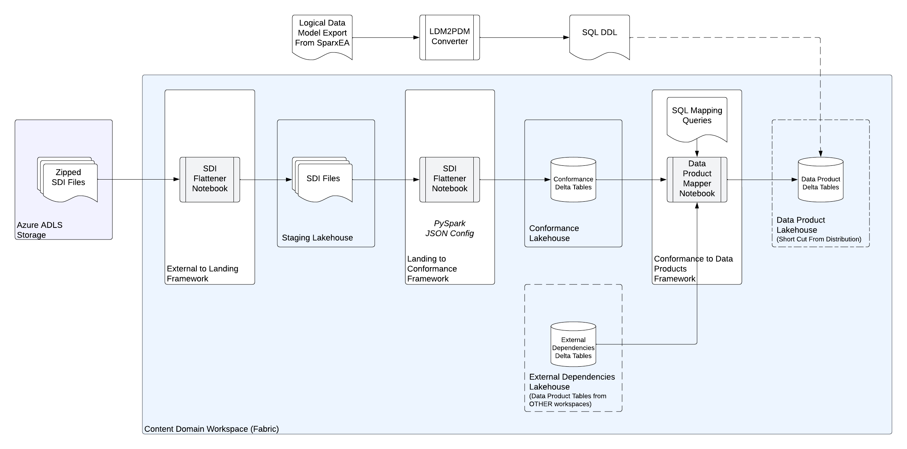

        

Document Metadata

|  |  |
|----|----|
| Identifier | **`LMP-PAT-0029`** |
| Type | **Functional Design Pattern** |
| Status | **Published** |
| Approvals | LMP Migration Architecture Approval |
| Published on | **September 05, 2024** |
| Valid From | **September 11, 2024** |
| Authors |   |
| Tags | Data Management |
| Technology Capabilities | Platform / Data / Data Management |

# Data-as-a-Service Publishing Pattern<a href="#data-as-a-service-publishing-pattern" class="headerlink" title="Permanent link">¶</a>

## Introduction<a href="#introduction" class="headerlink" title="Permanent link">¶</a>

Data-as-a-Service represents the strategic approach for distributing non-real time data both internally within Data and Analytics as well as externally to feeds customers. To allow the platform to meet these strategic goals, we will need to establish a critical mass of content by loading as much data into the platform as quickly as possible. This will only be achievable if we can federate out the task of data publication to the various technical and content teams who own the existing data sources.

This pattern provides an approved path for federated teams to publish their data into the DaaS platform. It covers both what needs to be achieved to publish the data, as well as technical approaches and components that that can be re-used.

## Scope<a href="#scope" class="headerlink" title="Permanent link">¶</a>

This pattern is applicable to:

- Content Owners publishing their existing on premise SDI content into DaaS
- "Hydration" projects publishing data into DaaS from Azure
- "Transformed" DBoRs publishing their data into the DaaS platform
- Persisted Analytics teams publishing their data into the DaaS platform
- Common sourcing and collection tools publishing as-collected data into the DaaS platform

The scope of the pattern includes:

- Standard requirements a publisher must meet in terms of their data product design
- Currently supported technical mechanisms for publication
- Re-usable approaches and software components to transform data from existing sources

## Pattern Definition<a href="#pattern-definition" class="headerlink" title="Permanent link">¶</a>

For a content owner to publish their data into the platform they must:

1.  Design their data products in accordance with required standards
2.  Publish their data products via a supported publication mechanism
3.  Transform data from any existing or internal source into published data product

Key requirements and re-usable techniques to achieve each of these are described below.

### 1. Data Product Design<a href="#1-data-product-design" class="headerlink" title="Permanent link">¶</a>

The DaaS platform has adopted the Data Mesh concept of a [Data Product](https://lsegroup.sharepoint.com/teams/LMDataPlatform/Shared%20Documents/Forms/AllItems.aspx?id=%2Fteams%2FLMDataPlatform%2FShared%20Documents%2FCH%20%2D%20Tech%20Architecture%2FPublished%20Docs%2FStandards%20and%20Definitions%2FData%20as%20a%20Service%20Data%20Product%20Definition%20v1%2Epdf&viewid=cc9c9b3a%2D0706%2D4bf2%2D9023%2D4afc0b3897ef&parent=%2Fteams%2FLMDataPlatform%2FShared%20Documents%2FCH%20%2D%20Tech%20Architecture%2FPublished%20Docs%2FStandards%20and%20Definitions). In particular, it requires the data products to be owned, and that responsibility for the usability and quality of data product lies with the owner. This includes responsibility to make sure the data products are intuitive to use, are consistent and interoperable with other data products and are aligned to DaaS platform standards.

#### Requirements<a href="#requirements" class="headerlink" title="Permanent link">¶</a>

The design of a data product must ensure:

1.  Data products comply with Content Marketplace standards - particularly the [Permanent Identifier](https://lsegroup.sharepoint.com/teams/ContentMarketplace/Shared%20Documents/Forms/AllItems.aspx?id=%2Fteams%2FContentMarketplace%2FShared%20Documents%2FPolicies%2C%20Standards%20and%20Guidelines%2FPermanent%20Identifier%20Standard%20v4%2Epdf&parent=%2Fteams%2FContentMarketplace%2FShared%20Documents%2FPolicies%2C%20Standards%20and%20Guidelines) and [Federated Mastering](https://lsegroup.sharepoint.com/teams/ContentMarketplace/Shared%20Documents/Forms/AllItems.aspx?id=%2Fteams%2FContentMarketplace%2FShared%20Documents%2FPolicies%2C%20Standards%20and%20Guidelines%2FFederated%20Mastering%20Standards%20v10%2Epdf&parent=%2Fteams%2FContentMarketplace%2FShared%20Documents%2FPolicies%2C%20Standards%20and%20Guidelines) standards.
2.  Data products must have an associated logical model which aligns with and connects to the rest of the Refinitiv Logical Model.
3.  Data products must adhere to [Physical Data Model standards](https://lsegroup.sharepoint.com/:w:/r/teams/LMDataPlatform/Shared%20Documents/CH%20-%20Tech%20Architecture/Working%20Docs/PDM%20Standard%20v1.2.docx?d=w2e4c472b5b984d67afb3606c02e742c7&csf=1&web=1&e=netRNu).
4.  Individual data tables in the distribution layers must be organised according to entities and grouped according to the data categories of the [Data Catalogue](https://thesource.lseg.com/thesource/asset?id=40400).

Note that 1,2 and 3 apply to core LSEG mastered data, and do not apply to "as-collected" data products.

#### Implementation Approaches<a href="#implementation-approaches" class="headerlink" title="Permanent link">¶</a>

To ensure consistency, compliance and interoperability, the underlying data that will be published as part of the data product should have a logical model produced which connects it to the rest of the Content Marketplace/[Refinitiv Logical Model](https://lsegroup.sharepoint.com/teams/RefinitivLogicalModel) data model. This is done by contacting the D&A Information Architecture team.

Within Release 1, a Physical Data Model Generator tool has been developed to allow Physical Data Models to be auto-created from Logical Data Models exported from EA Sparx. The tool is designed to produce models that are consistent with key elements of the Physical Data Model standards.

This [PDM Generator](https://gitlab.dx1.lseg.com/app/app-51783/lmp/-/blob/main/data-platform/content/docs/adrs/2023-06-22-content-dz-pdm-generation.md) can be used to create a first draft data model for the data product which can be refined as necessary. Note this and many subsequent links require access to app-51783 in DX1.

### 2. Data Publication<a href="#2-data-publication" class="headerlink" title="Permanent link">¶</a>

To ensure decoupling between publishers and the platform, the longer term approach for publishing data will be via some sort of [publishing interface](https://gitlab.dx1.lseg.com/app/app-51783/lmp/-/blob/main/data-platform/docs/adrs/2023-06-19-interface-between-publishers-and-distribution-platform.md?ref_type=heads). For Release 1, a tactical decision was made to await feature enhancements to Fabric to minimise the amount of bespoke development required to implement such an interface. As a result shortcuts are used to allow publishers to [write data](https://gitlab.dx1.lseg.com/app/app-51783/lmp/-/blob/main/data-platform/docs/adrs/2023-11-07-integration-between-ingest-and-distribution-pns-for-r1.md) directly into the distribution workspaces. At the moment this is the only support approach for publishing data into DaaS.

#### Requirements<a href="#requirements_1" class="headerlink" title="Permanent link">¶</a>

The requirements for data publication into the DaaS platform are:

1.  Delta tables must be created in the appropriate distribution workspace and lakehouse based on the organisation requirements above. Delta tables must have the Change Data Feed enabled to allow distribution components and consumers to identify what data has changed.
2.  Shortcuts must be created into the workspaces in which the data publication pipelines will operate.
3.  The publisher must not delete history from these tables (e.g. by performing vacuum operations). The distribution components are responsible for managing any history deletions. A PG Feature Ask is in place to allow this restriction to be enforced.

#### Implementation Approaches<a href="#implementation-approaches_1" class="headerlink" title="Permanent link">¶</a>

Table and shortcut creation is managed by the Ingest team. Configurations are maintained in the [data-domains folders in the distribution code in DX1](https://gitlab.dx1.lseg.com/app/app-51783/lmp/-/tree/main/data-platform/distribution/data-domains/companydata/party/pdm).

### 3. Data Transformation<a href="#3-data-transformation" class="headerlink" title="Permanent link">¶</a>

In general, data will need to be transformed into the target data product model from some other source model. The technology and approach for performing this transformation is not mandated. The objective of the publishing interface described above is to decouple publishers from the platform to ensure they are not constrained.

That said, a number of re-usable frameworks have been developed which can be used to accelerate data transformation and publication compared to starting from scratch.

#### Requirements<a href="#requirements_2" class="headerlink" title="Permanent link">¶</a>

The requirements for data transformation include:

1.  Loading data from any existing "off platform" sources
2.  Standardising the representation of the source data into a common form such as delta tables
3.  Combining with other existing data products from other producers where necessary
4.  Identifying changes in the various input data sources
5.  Mapping the various data updates into the target data model and updating the impacted data product records

#### Implementation Approaches<a href="#implementation-approaches_2" class="headerlink" title="Permanent link">¶</a>

A number of different frameworks are available for data publication technical teams to transform data from a variety of sources into their target data products published into the DaaS platform. These frameworks are implemented as data pipelines in Fabric, which can be brought together into an overall pipeline per data domain. They implement a medallion type architecture with a landing layer to store input files, a conformance layer to standardise data representation as a set of delta tables, and a data product layer for the finalised data output. These frameworks are outlined below with links to more detailed descriptions and code repositories, as well as sample configurations.

##### External to Landing<a href="#external-to-landing" class="headerlink" title="Permanent link">¶</a>

The [External to Landing](https://gitlab.dx1.lseg.com/app/app-51783/lmp/-/tree/main/data-platform/content/components/external-to-landing) framework sources feed data files from external (to Fabric) storage, decompresses those files if needed, and stores them in a [standardised directory structure](https://gitlab.dx1.lseg.com/app/app-51783/lmp/-/blob/main/data-platform/content/docs/adrs/2023-06-12-design-of-landing-layer.md) within the Landing Lakehouse. It accesses the files via a shortcut in Fabric pointing to ADLS Gen 2 storage in Azure. Moving source files from on-premise to Azure storage will be covered in a different pattern.

##### Landing to Conformance<a href="#landing-to-conformance" class="headerlink" title="Permanent link">¶</a>

The [Landing to Conformance](https://gitlab.dx1.lseg.com/app/app-51783/lmp/-/blob/main/data-platform/content/components/landing-to-conformance/docs/adrs/2023-09-08-landing-to-conformance-framework.md) framework processes incoming files in the landing layer, and stores the data updates into a series of append only delta tables in the conformance lakehouse. Many of the input file sources for Release 1 are hierarchical XML files, and so these structures result in the creation of multiple different tables depending on the level of nesting. The rows in each of these conformance tables represent the change operations to the data, along with traceability back to the individual update files containing those changes.

##### Conformance to Data Product<a href="#conformance-to-data-product" class="headerlink" title="Permanent link">¶</a>

The main transformation processing happens within the [Conformance to Data Products](https://gitlab.dx1.lseg.com/app/app-51783/lmp/-/blob/main/data-platform/content/docs/adrs/2023-07-06-conformance-to-dataproducts-mapper.md) framework. This framework identifies changes in the conformance layer tables, transforms them to the target data product model via a SQL mapping statement, and merges the results into the target data product delta tables (which as per 2 above are shortcuts into the distribution workspaces).

There may be dependencies on data products from other domains - for example on Value Domain enumeration tables to allow both a PermID and code to be published in the output data product. These input data product tables are queried via shortcuts into an "external dependencies" lakehouse.

The transformation configurations include:

- definitions of input and output tables including primary keys and sort keys
- how to identify the scope of actions (inserts, updates or deletes) from the conformance layer tables
- how to identify discrete validity periods when combining multiple tables
- and the actual SQL mapping statement for each output table

These configurations are held under the individual data domains for example [Organisation Authority](https://gitlab.dx1.lseg.com/app/app-51783/lmp/-/tree/main/data-platform/content/data-domains/oa/conformance-to-dataproducts/config)

##### Segmentation and Enrichment<a href="#segmentation-and-enrichment" class="headerlink" title="Permanent link">¶</a>

[Segmentation tables](https://gitlab.dx1.lseg.com/app/app-51783/lmp/-/blob/main/data-platform/docs/adrs/2024-01-08-standardised-segmentation-patterns.md?ref_type=heads) are used to mark up the data products with the dimensions used to permission the data product tables. Enrichment tables are additions to the data products to simplify querying for very common use cases. Both of these may be considered part of the data product, and can be generated as part of the same [Conformance to Data Products framework](https://gitlab.dx1.lseg.com/app/app-51783/lmp/-/blob/main/data-platform/content/docs/adrs/2023-09-25-segmentation-tables.md).

However, their nature means they typically have many more external dependencies from multiple different data domains. As a result they are currently operated from within a separate pipeline which may be triggered less frequently or at different times to the main data pipeline.

## Further Reading<a href="#further-reading" class="headerlink" title="Permanent link">¶</a>

- [Data-as-a-Service Data Product Definition](https://lsegroup.sharepoint.com/teams/LMDataPlatform/Shared%20Documents/Forms/AllItems.aspx?id=%2Fteams%2FLMDataPlatform%2FShared%20Documents%2FCH%20%2D%20Tech%20Architecture%2FPublished%20Docs%2FStandards%20and%20Definitions%2FData%20as%20a%20Service%20Data%20Product%20Definition%20v1%2Epdf&viewid=cc9c9b3a%2D0706%2D4bf2%2D9023%2D4afc0b3897ef&parent=%2Fteams%2FLMDataPlatform%2FShared%20Documents%2FCH%20%2D%20Tech%20Architecture%2FPublished%20Docs%2FStandards%20and%20Definitions)
- [PermID Standard](https://lsegroup.sharepoint.com/teams/ContentMarketplace/Shared%20Documents/Forms/AllItems.aspx?id=%2Fteams%2FContentMarketplace%2FShared%20Documents%2FPolicies%2C%20Standards%20and%20Guidelines%2FPermanent%20Identifier%20Standard%20v4%2Epdf&parent=%2Fteams%2FContentMarketplace%2FShared%20Documents%2FPolicies%2C%20Standards%20and%20Guidelines)
- [Federated Mastering Standard](https://lsegroup.sharepoint.com/teams/ContentMarketplace/Shared%20Documents/Forms/AllItems.aspx?id=%2Fteams%2FContentMarketplace%2FShared%20Documents%2FPolicies%2C%20Standards%20and%20Guidelines%2FFederated%20Mastering%20Standards%20v10%2Epdf&parent=%2Fteams%2FContentMarketplace%2FShared%20Documents%2FPolicies%2C%20Standards%20and%20Guidelines)
- [Physical Data Model Standards v1.2](https://lsegroup.sharepoint.com/:w:/r/teams/LMDataPlatform/Shared%20Documents/CH%20-%20Tech%20Architecture/Working%20Docs/PDM%20Standard%20v1.2.docx?d=w2e4c472b5b984d67afb3606c02e742c7&csf=1&web=1&e=netRNu)
- [Data Publication Principles](https://gitlab.dx1.lseg.com/app/app-51783/lmp/-/blob/main/data-platform/docs/adrs/2023-11-06-data_publication_principles.md)

    May 30, 2025      September 25, 2024 

 Previous 

Azure Databricks Technical Design Pattern

 Next 

Data-as-a-Service Consumption Pattern

Made with <a href="https://squidfunk.github.io/mkdocs-material/" target="_blank" rel="noopener">Material for MkDocs</a>

