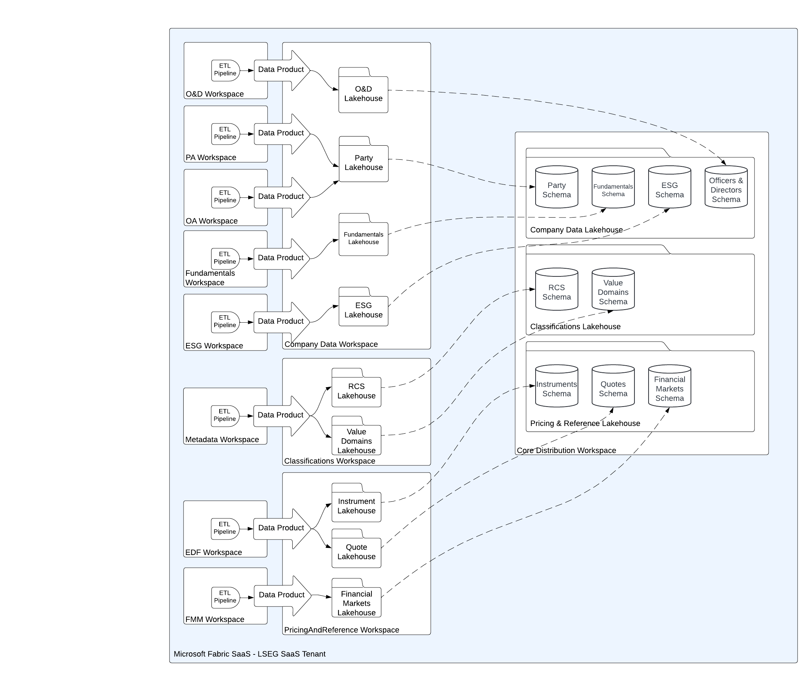

        

Document Metadata

|  |  |
|----|----|
| Identifier | **`LMP-PAT-0036`** |
| Type | **Functional Design Pattern** |
| Status | **Published** |
| Approvals | LMP Migration Architecture Approval |
| Published on | **October 10, 2024** |
| Valid From | **October 16, 2024** |
| Authors |   |
| Tags | Data Management |
| Technology Capabilities | Platform / Data / Data Management |

# Data-as-a-Service Consumption Pattern<a href="#data-as-a-service-consumption-pattern" class="headerlink" title="Permanent link">¶</a>

## Introduction<a href="#introduction" class="headerlink" title="Permanent link">¶</a>

Data-as-a-Service (DaaS) represents the strategic approach for distributing non-real time data both internally within Data and Analytics as well as externally to feeds customers. Internally, it will eventually replace the use of SDIs to replicate data and the use of CCC as a cross content query capability for a wide variety of internal use cases. The initial focus of Release 1 of DaaS has been on customer consumption patterns, and while we want to re-use the same capabilities internally and externally (i.e. "eating our own dog food"), we recognise that there are some limitations that may restrict their usefulness.

This pattern provides guidance and approved designs for teams to consume data from the DaaS platform. It reflects the current state of maturity immediately post Release 1. In some cases these patterns are dependent on additional implementation work post Release 1.

## Scope<a href="#scope" class="headerlink" title="Permanent link">¶</a>

This pattern is applicable to Internal products and applications needing:

- to query data within DaaS
- to replicate data from DaaS into their own data stores
- to access data from Microsoft Fabric

The scope of the pattern includes:

- definition of available consumption mechanisms and the types of use case it supports
- outline of pros and cons of the different mechanisms
- a statement on whether the consumption mechanism is approved for internal use
- summary of any required implementation work to make the mechanisms approved

## Pattern Definition<a href="#pattern-definition" class="headerlink" title="Permanent link">¶</a>

The following consumption patterns are available for use:

### 1. Customer SQL Endpoint<a href="#1-customer-sql-endpoint" class="headerlink" title="Permanent link">¶</a>

Create consumer specific workspace with permissioned views configured via SQL End Point. Additional “Internal Products” defined in PRM and provisioned via “non-commercial” workflows.

#### Pros<a href="#pros" class="headerlink" title="Permanent link">¶</a>

- PRM based access control is enforced
- Allows query access to any available data
- Provides resource isolation across consumers
- Eating our own dog food

#### Cons<a href="#cons" class="headerlink" title="Permanent link">¶</a>

- Requires additional product and segment definitions
- Does not support access to “change data feed”
- Could result in over provisioning of capacities
- No Spark access to data
- AAA Provisioning flows need to be built

#### Recommendation<a href="#recommendation" class="headerlink" title="Permanent link">¶</a>

This pattern is approved for use but currently requires manual provisioning of the consumer workspace and service principal identity immediately post Release 1.

### 2. Customer Feed Files<a href="#2-customer-feed-files" class="headerlink" title="Permanent link">¶</a>

Leverage existing Bulk capabilities to generate “product” feed files. Internal products and segments may need to be defined within PRM. AAA accounts are needed by consumers to access the feed files.

#### Pros<a href="#pros_1" class="headerlink" title="Permanent link">¶</a>

- Additional “Internal Products” defined in PRM and provisioned via “non-commercial” workflows
- PRM based access control is enforced
- Supports replication of data and access to changes
- Eating our own dog food

#### Cons<a href="#cons_1" class="headerlink" title="Permanent link">¶</a>

- Requires additional product and segment definitions
- Schedules may delay data availability
- CSV file formats are problematic to use due to weak data typing
- AAA Provisioning flows need to be built

#### Recommendation<a href="#recommendation_1" class="headerlink" title="Permanent link">¶</a>

It is recommended that internal consumers hold off using the product feed files until a strongly typed format (e.g. Parquet) of feed files is introduced. Such a format could also be the basis of other distribution mechanisms such as Customer Data Shares (see 5 below).

### 3. Shared Distribution SQL Endpoint<a href="#3-shared-distribution-sql-endpoint" class="headerlink" title="Permanent link">¶</a>

The recent support within Fabric of three part naming allows all LSEG content to be brought together into a single workspace in a well organised manner. This eliminates the need for having multiple duplicate shortcuts of the same data within different workspaces as has been necessary during the development of Release 1.

This consumption mechanism requires some work to create a central distribution workspace. The data from the existing distribution workspaces (CompanyData. Classifications and PricingAndReferenceData) must be shortcut into corresponding lakehouses and schemas as shown in Figure 1.

Figure 1 - Required Configuration of Core Distribution Workspace

The SQL end point of this workspace should be made available to internal consumers, and can be made available for all internal users using their lseg.com credentials. This SQL end point should also be used for applications such as PRM to access data, and should (over time) become the point from which any additional downstream shortcuts are established.

Duplicate shortcuts - notably Value Domains - within the upstream distribution workspaces should eventually be removed.

#### Pros<a href="#pros_2" class="headerlink" title="Permanent link">¶</a>

- Allows query across all data in the platform
- A single shared capacity is more cost-effective for ad-hoc usage
- Can support all internal users – e.g. business users and other use cases e.g. PRM
- Could support with internal credentials
- Removes ambiguity about which shortcut copy should be referenced e.g. in PRM definitions
- Allows clean up of shortcut duplication

#### Cons<a href="#cons_2" class="headerlink" title="Permanent link">¶</a>

- By-passes PRM based access control – all or nothing
- Risk of capacity resource starvation for production use cases
- Does not support access to “change data feed”
- No Spark access to data

#### Recommendation<a href="#recommendation_2" class="headerlink" title="Permanent link">¶</a>

This is the recommended consumption mechanisms for ad-hoc query use cases across the business and for relatively infrequent production access. Implementation of the Core Distribution Workspace should be prioritised as soon as possible.

### 4. Ad-hoc Shortcuts<a href="#4-ad-hoc-shortcuts" class="headerlink" title="Permanent link">¶</a>

Create shortcuts as required from distribution data sources into consumer workspaces.

#### Pros<a href="#pros_3" class="headerlink" title="Permanent link">¶</a>

- Supports Spark access
- Supports Change Data Feed
- Provides (compute) resource isolation for consumers

#### Cons<a href="#cons_3" class="headerlink" title="Permanent link">¶</a>

- By-passes PRM based access control – on shortcut provisioning
- Tight coupling of consumers to core delta tables without clear tracking of dependencies
- Difficult to manage and support
- Not supported by access group definitions which would allow write-access by default
- May run in to shortcut limits

#### Recommendation<a href="#recommendation_3" class="headerlink" title="Permanent link">¶</a>

This approach is not approved as an internal use pattern due to likely proliferation of tightly coupled consumers. This will make any changes to any upstream processing pipelines extremely risky, and reduce the velocity of platform development.

### 5. Customer Data Share<a href="#5-customer-data-share" class="headerlink" title="Permanent link">¶</a>

While a customer data share was originally discussed for Release 1, this was subsequently de-scoped, in part due to uncertainty on whether underlying "One Security" capabilities would support the enforcement of permissions, or whether the permissioned data would need to be materialised for each customer or product.

Distributing data to customers via "data shares" is still an attractive direction in a variety of different cloud technologies, and so progressing such a solution for internal use cases helps lay the groundwork for a customer facing solution, while allowing some of the more complex permissioning use cases to be deferred.

An initial internal release would automate the creation of read-only shortcuts from the defined distribution points ( the Core Distribution Workspace described above), and, in the future, support the permissions filtering of the underlying data in a similar way to the bulk feed files are currently generated, although using a delta/parquet output format.

#### Pros<a href="#pros_4" class="headerlink" title="Permanent link">¶</a>

- Supports Spark access
- Supports Change Data Feed
- Provides (compute) resource isolation for consumers
- Drives forward customer data share capability
- PRM based access control is enforced (if included in initial scope)

#### Cons<a href="#cons_4" class="headerlink" title="Permanent link">¶</a>

- Additional development work required to achieve
- Need to materialise various permissions profiles (in the absence of a one security based solution)

#### Recommendation<a href="#recommendation_4" class="headerlink" title="Permanent link">¶</a>

This consumption approach is recommended over Ad Hoc shortcuts described in 4. The implementation of required capabilities - in particular APIs to manage and control the shortcuts, and basic permissions filtering - should be prioritised post Release 1.

    May 30, 2025      October 11, 2024 

 Previous 

Data-as-a-Service Publishing Pattern

 Next 

Architectural Selection for Large Volume File Migration from On-Premises to Azure

Made with <a href="https://squidfunk.github.io/mkdocs-material/" target="_blank" rel="noopener">Material for MkDocs</a>

