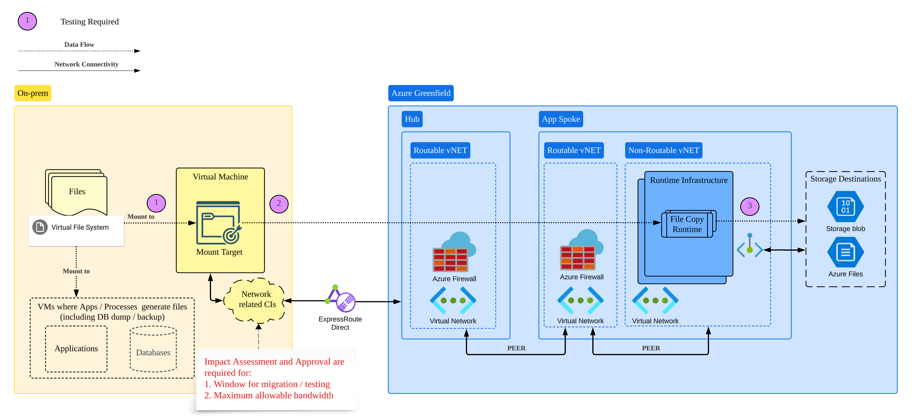

        

Document Metadata

|  |  |
|----|----|
| Identifier | **`LMP-PAT-0044`** |
| Type | **Technology Selection Pattern** |
| Status | **Published** |
| Approvals | LMP Migration Architecture Approval |
| Published on | **December 12, 2024** |
| Valid From | **December 12, 2024** |
| Authors |   |
| Tags | Data Management |
| Technology Capabilities | Platform / Data / Data Management |

# Architectural Selection for Large Volume File Migration from On-Premises to Azure<a href="#architectural-selection-for-large-volume-file-migration-from-on-premises-to-azure" class="headerlink" title="Permanent link">¶</a>

## Context and Problem<a href="#context-and-problem" class="headerlink" title="Permanent link">¶</a>

Many migration projects need to copy large (e.g. size between 10GB to 10+TB) or extra large (larger than tens of TB) file sets from on-prem to Azure storage destinations, before they can cut over to the new Azure-based workload. The following scenarios are frequently observed:

- Historical files ingested from 3rd party files. They need to be available for future data curation/aggregation process and workflows.
- Historical files generated in respond to customer requests, stored in a form ready to be distributed to customers upon requests.
- Database dumps which represent a snapshot of database contents.

Such scenarios are typically single-way, one-off file copy operations rather than regular and continuous BAU workloads. There are a few choices from Azure that could be used for the data transfer solution:

- Network-based data transfer mechanisms: - Scripted transfer via intermediate compute node, e.g. Azure VM + NFS Mount + AzCopy, etc.. - Managed data pipeline, e.g. Azure Data Factory. - Other migration options for niche use cases (i.e. other solutions mentioned in ['Choose an Azure solution for data transfer'](https://learn.microsoft.com/en-us/azure/storage/common/storage-choose-data-transfer-solution)) from Azure Blob Storage Documentation.
- Offline disk transfer (e.g. [Azure Databox](https://learn.microsoft.com/en-us/azure/databox/)).

Engineering teams need determine the technology choice from these options, and need balance the potential contentions among the below factors:

- Network and Hardware capacity.
- Acceptable duration of the file migration.
- Projected duration for the migration.
- Risks to other mission-critical workloads relying on the shared infrastructures.

## Scope<a href="#scope" class="headerlink" title="Permanent link">¶</a>

This pattern is designed to help engineering teams determine the suitable architecture in consistent ways for the fore-mentioned file migration scenarios. It will cover key considerations required for the decision-making process, guidance for estimating network transfer durations, and pointers to other Reference Architecture patterns for secure and consistent design.

## Out-of-scope<a href="#out-of-scope" class="headerlink" title="Permanent link">¶</a>

This pattern will not specify architecture design for each recommended file migration pattern. They will be covered by separate patterns over time, and links will be included when they are ready.

## Solution<a href="#solution" class="headerlink" title="Permanent link">¶</a>

### High Level Triage<a href="#high-level-triage" class="headerlink" title="Permanent link">¶</a>

It's sensible to triage your migration architecture before diving into this pattern. Please consider the below questions:

#### 1. Network or Offline Migration?<a href="#1-network-or-offline-migration" class="headerlink" title="Permanent link">¶</a>

**PREREQUISITE TO ANY NETWORK-BASED DATA MIGRATION:** Please work with both Data Center and Cloud Network team to understand the available bandwidth, and agree the migration window and allowable bandwidth for your file migration.

If the total volume is larger than **10 TB**, network-based file transfer will likely take days or weeks **if you can only preserve less than 1Gbps bandwidth, even if you are approved to use the bandwidth for the entire migration window**. In such case, you may want consult LMP Architecture team for high level triage, to see if special arrangement for premium bandwidth or offline / physical transfer via Databox are required.

Note: the below table from Microsoft (<https://learn.microsoft.com/en-us/azure/storage/common/storage-solution-large-dataset-low-network>) can help understand how long your migration is likely to take.

**Remember they are theoretical numbers under perfect situations.**

#### 2. BAU Business Process or Ad-hoc Operation?<a href="#2-bau-business-process-or-ad-hoc-operation" class="headerlink" title="Permanent link">¶</a>

If your data migration is part of a regular BAU process, this pattern may not solve your problem, as it doesn't cover additional requirements (e.g. operational resilience) and it relies on pre-approved, one-off migration window and allowable bandwidth rather than something you can use regularly.

### Detailed Analysis<a href="#detailed-analysis" class="headerlink" title="Permanent link">¶</a>

Before you start designing the solution, the below information should be gathered and analyzed in order to determine the most appropriate architecture:

1.  Do you need to apply ETL to any of the file contents during the migration?
2.  What are your source data center location and your target Azure region?
3.  What's the approved connectivity type and bandwidth for network-based network migration, between your DC and target Azure region?
4.  What's the approved file migration window? What's your desired target migration duration?
5.  File set characteristics: 1. Are there active modifications to existing files in the file set? 2. What's the total volume, rough number of files, average size? 3. Will there have source file changes during the migration? What's the speed of file changes if they can't be stopped during the migration?

If network-based transfer is preferred following high level triage, use the below decision diagram to determine the suggested solutions:

### Test and Simulate Network-based Migration<a href="#test-and-simulate-network-based-migration" class="headerlink" title="Permanent link">¶</a>

#### Cloud Connectivity<a href="#cloud-connectivity" class="headerlink" title="Permanent link">¶</a>

- ExpressRoute Direct are available among on-prem Data Center and Azure Cloud Regions. The maximum available bandwidth depends on the source data center and your target cloud region, and the bandwidth are always shared by all subscriptions and across PROD and non-PROD environments, so you can't assume you can always use the maximum bandwidth available.
- At the time of writing, migrating data over internet is being accessed and we may update the pattern when the solution is approved.

#### Bandwidth and Testing<a href="#bandwidth-and-testing" class="headerlink" title="Permanent link">¶</a>

As suggested by Network Architecture team, the following components will affect your available bandwidth. These need to be considered in conjunction with approved bandwidth and time window for your data migration operation.

##### Factors May Affect Bandwidth<a href="#factors-may-affect-bandwidth" class="headerlink" title="Permanent link">¶</a>

- Source factors: - Limiting factors for the local data center (DC): local data store configuration, local VM, local ports on physical servers, switches, routers, etc., including peak hours on local hardware.
- Pipe factors: - Network connectivity between the local DC and the specific Azure region (10Gb or 100Gb), including peak hours on this link. - Azure Firewall SKU for the specific subscription. By default, it's the Standard SKU with a 2Gbps limit per subscription.
- Destination factors: - Various Azure SKUs have different limiting factors. For example, for Azure VMs - VM size & family (ranging from 1Gbps to 40Gbps, or even 100Gbps) - VM disk subsystems
- Traffic Control factors: i.e. any throttling or other policies enforced on the network or other hardware.

**Summary:** Actual bandwidth between your source and destination is determined by the most restrictive factors mentioned above. You may need conduct testing and simulation to better project your actual migration duration.

##### Test and Simulate Your Migration<a href="#test-and-simulate-your-migration" class="headerlink" title="Permanent link">¶</a>

Given the factors listed above, you may want test and verify the actual bandwidth and throughput as highlighted in the below diagram. The recommended architecture for network-based file transfer is explained as below:

##### Summary<a href="#summary" class="headerlink" title="Permanent link">¶</a>

- **Architecture:** Host your migration workload on Azure (pull files from on-prem). Provision or reuse on-prem VM to mount your on-prem file volumes and for Azure-based workloads to read files from.
- **Connectivity:** Leverage ExpressRoute Direct between your data center and cloud region, understand your approved maximum allowable network bandwidth and migration (or testing) window. Host your Azure migration workload in non-routable vNET and access your storage account via Private Endpoints.
- **Housekeeping**: Destroy your VMs used for the testing when no longer needed.

The actual throughput will also be affected by additional compute overhead, e.g. those occurring from your migration scripts. You may want to design test cases to simulate your actual migration workload to fine tune your solutions.

**Please remember the networks and other infrastructure hardware are shared by many services across production and non-production environments, so you MUST strictly follow approved time window and allowed bandwidth for your testing.**

## Further Reading<a href="#further-reading" class="headerlink" title="Permanent link">¶</a>

1.  [LMP-PAT-0045](https://app.pages.dx1.lseg.com/app-51723/migration-patterns/mig-pat-source-to-target/patterns/data-management/0045-azcopy-for-large-volume-file-migration-from-onprem-to-azure/): Using Azure AzCopy for Large Volume File Migration from On-Premises to Azure
2.  [Choose an Azure solution for data transfer](https://learn.microsoft.com/en-us/azure/storage/common/storage-solution-large-dataset-low-network)
3.  [Azure Databox Offline Transfer](https://learn.microsoft.com/en-us/azure/databox/)

    May 30, 2025      November 25, 2024 

 Previous 

Data-as-a-Service Consumption Pattern

 Next 

Using Azure AzCopy for Large Volume File Migration from On-Premises to Azure

Made with <a href="https://squidfunk.github.io/mkdocs-material/" target="_blank" rel="noopener">Material for MkDocs</a>

