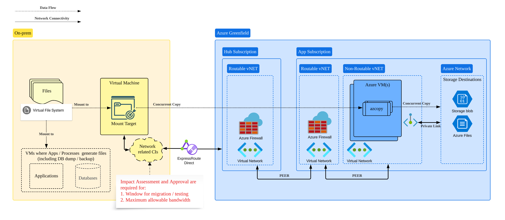

        

Document Metadata

|  |  |
|----|----|
| Identifier | **`LMP-PAT-0045`** |
| Type | **Technical Design Pattern** |
| Status | **Published** |
| Approvals | LMP Migration Architecture Approval |
| Governance Reference | **** |
| Pattern Source Repo |  |
| Published on | **December 12, 2024** |
| Valid From | **December 12, 2024** |
| Authors |   |
| Tags | Data Management |
| Technology Capabilities | Platform / Data / Data Management |

# Using Azure AzCopy for Large Volume File Migration from On-Premises to Azure<a href="#using-azure-azcopy-for-large-volume-file-migration-from-on-premises-to-azure" class="headerlink" title="Permanent link">¶</a>

## Context and Problem<a href="#context-and-problem" class="headerlink" title="Permanent link">¶</a>

As suggested in pattern [LMP-PAT-0044: Architectural Selection for Large Volume File Migration from On-Premises to Azure](../0044-architecture-selection-for-large-volume-file-migration/), AzCopy is the preferred cloud native technology for copying large volume files from on-premises file system to Azure storage destinations, providing:

1.  The approved maximum bandwidth, both within the data center and between your data center and the target cloud region, can be utilized throughout an appropriate migration time window.
2.  The projected migration duration is within the acceptable time window for your project.
3.  No ETL is required during the migration.
4.  Only requires one-way (on-prem to Azure) and one-off operation rather than regular and continuous BAU workloads.

**Please read and follow pattern [LMP-PAT-0044](../0044-architecture-selection-for-large-volume-file-migration/) to validate that AzCopy is a viable solution for your file migration.**

This pattern aims to provide engineering team a reusable, consistent and compliant reference architecture for designing and implementing the solution using AzCopy.

## Scope<a href="#scope" class="headerlink" title="Permanent link">¶</a>

1.  This pattern will include key architecture components that are required for AzCopy workload on Azure.
2.  It will cover AzCopy design considerations to support key non-functional requirements for large file migration.
3.  It will cover NFS protocol only.

## Out-of-scope<a href="#out-of-scope" class="headerlink" title="Permanent link">¶</a>

1.  This pattern assumes AzCopy is the right solution for your migration use case, it will not repeat the analysis covered in [Architectural Selection for Large Volume File Migration from On-Premises to Azure](../0044-architecture-selection-for-large-volume-file-migration/)
2.  It will not cover any design considerations for your specific functional requirements, e.g. how to catch up delta files after the initial load.
3.  It will not cover the design of your target storage destination.
4.  It will not cover detailed network design, which should be covered by seperate patterns or relavant specifications.

## Solution<a href="#solution" class="headerlink" title="Permanent link">¶</a>

### Summary<a href="#summary" class="headerlink" title="Permanent link">¶</a>

- **Architecture:** Use Azure VM(s) to host AZCopy workload. Provision or reuse on-prem VM to mount your on-prem file volumes and for AZCopy to read files from.
- **Technology:** Leverage AzCopy's advanced control to optimize your file copy, e.g. concurrency, throttling, etc.. AzCopy connectivity is encrypted by default since it uses HTTPS with TLS.
- **Connectivity:** Leverage ExpressRoute Direct between your data center and cloud region; understand your allowable network bandwidth and migration window; simulate and test your assumptions. Please also see section **Test and Simulate Network-based Migration** in [LMP-PAT-0044](../0044-architecture-selection-for-large-volume-file-migration/)
- **Housekeeping**: Destroy your VMs after the migration, if they are no longer needed.

### High Level Architecture<a href="#high-level-architecture" class="headerlink" title="Permanent link">¶</a>

Please refer to the below diagram for the high level architecture.

1.  Provision Azure VM(s) in Non-Routable vNET to host azcopy workloads. CPF Products (e.g. [azure-prdsvc-terraform-linuxvirtualmachine](https://gitlab.dx1.lseg.com/app/app-51310/azure/prdsvc/terraform/azure-prdsvc-terraform-linuxvirtualmachine)) should be used to provision your resources.
2.  Make sure your on-prem file storage is accessible via an on-prem Linux VM, and your Azure VM(s) have access to the mount targets in your on-prem Linux VM.
3.  Make sure your Azure VM(s) have access to your Azure storage account(s) via Private Endpoint.
4.  Use Azure Bastion Service to access your migration runtime i.e. Azure VM(s).

### Utilize AzCopy<a href="#utilize-azcopy" class="headerlink" title="Permanent link">¶</a>

Use AzCopy to simulate, test and finally implement your file migration. Microsoft Ignite site has comprehensive documents and examples to help optimize and troubleshoot AzCopy's performance.

Get yourself familiarized with [Optimize the performance of AzCopy v10 with Azure Storage](https://learn.microsoft.com/en-us/azure/storage/common/storage-use-azcopy-optimize) and [Find errors & resume jobs with logs in AzCopy (Azure Storage)](https://learn.microsoft.com/en-us/azure/storage/common/storage-use-azcopy-configure), you may want to consider look into the below topics:

- **Throttling:** Always limit/cap your throughput following pre-approved maximum bandwidth, as we operate in a shared environment.
- **Get prepared for file copy failures** as we are not operating in perfect environments. Resume your job when needed, leveraging AZCopy's plan file, log file, and the 'jobs resume' command.
- **Test and optimize your concurrency level** per Azure VM through managing the `AZCOPY_CONCURRENCY_VALUE` variable, as it may positively or negatively affect your throughput.
- **Multiple clients when needed:** Consider use multiple Azure VMs to parallelize your AzCopy jobs, if the maximum possible concurrency on a single client is not fast enough.
- **Sync additional files:** Consider prevent new files from being generated in the source file set during the migration. If it's not possible, consider leverage the **'sync'** option to copy new or changed files over, if only small set of ad-hoc files were generated or changed during the previous file migration.
- **Integrity and validation:** Consider use the **'--put-md5'** flag to calculate and store MD5 checksum during the upload, and follow this tutorial to validate the file integrity after the migration: [AzCopy data integrity and validation](https://github.com/Azure/azure-storage-azcopy/wiki/Data-integrity-and-validation). Please note there may have performance overheads for large volume files, test and configure your VM accordingly to accommodate the additional overhead.

## Further Reading<a href="#further-reading" class="headerlink" title="Permanent link">¶</a>

1.  [Optimize the performance of AzCopy v10 with Azure Storage](https://learn.microsoft.com/en-us/azure/storage/common/storage-use-azcopy-optimize)
2.  [Find errors & resume jobs with logs in AzCopy (Azure Storage)](https://learn.microsoft.com/en-us/azure/storage/common/storage-use-azcopy-configure)
3.  [Azure Storage AzCopy: Data integrity and validation](https://github.com/Azure/azure-storage-azcopy/wiki/Data-integrity-and-validation)

    February 18, 2025      November 25, 2024 

 Previous 

Architectural Selection for Large Volume File Migration from On-Premises to Azure

 Next 

Rights (PRM) metadata Consumption Pattern

Made with <a href="https://squidfunk.github.io/mkdocs-material/" target="_blank" rel="noopener">Material for MkDocs</a>

