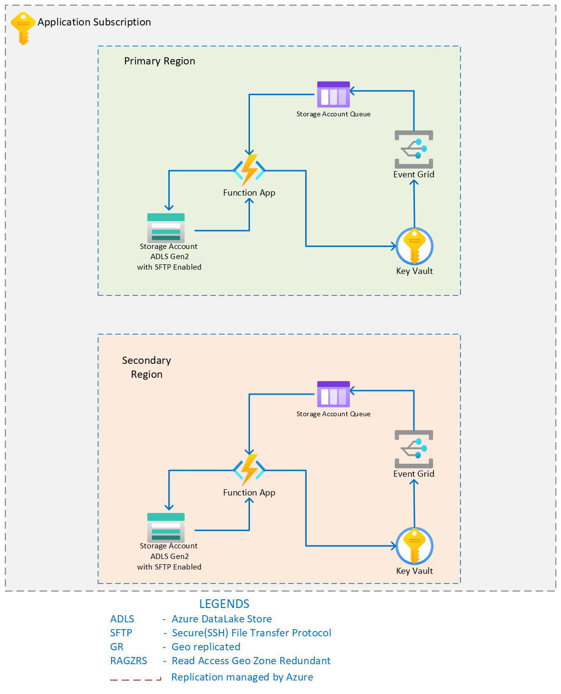

        

Document Metadata

|  |  |
|----|----|
| Identifier | **`LMP-PAT-0049`** |
| Type | **Deployable Pattern** |
| Status | **Published** |
| Approvals | CTEF (LMP ARB) |
| Governance Reference | **[GOVI0003463](https://lseg.service-now.com/x_lsegp_eag_governance_item.do?sys_id=c992ca27c38a1218d496d1cc05013162)** |
| Pattern Source Repo | <https://gitlab.dx1.lseg.com/app/app-51310/azure/prdsvcpat/terraform/azure-prdsvcpat-terraform-sftp> |
| Published on | **October 11, 2024** |
| Valid From | **January 23, 2025** |
| Authors |   |
| Tags | Data Management |
| Technology Capabilities | Platform / Data / Data Management |

# Secure File Transfer SFTP Service Pattern<a href="#secure-file-transfer-sftp-service-pattern" class="headerlink" title="Permanent link">¶</a>

- Legacy workloads often use traditional file transfer protocols such as SFTP and for custom solutions one would have to create virtual machines (VMs) in Azure to host an SFTP server, and then update, patch, manage, scale, and maintain a complex architecture.With SFTP support for Azure Blob Storage, SFTP support for Blob Storage accounts can be enabled and set up local user identities for authentication to connect to the storage account with SFTP via port 22.
- Many applications in the LMP migration have requirements for implementing SFTP solutions for data transfer.
- This pattern can be used to implement SFTP solution within application subscription where the source will be on-premises, AWS or Azure.
- The pattern discussed here is not meant to be a central SFTP service similar to MFT. It can be used for file sharing within the subscription, across subscription , aws , on-prem, but there will not be any connectivity outside this.
- Azure Blob Storage supports the SSH File Transfer Protocol (SFTP) and can be connected using an LSEG approved SFTP client in case of user identity access, which allows SFTP for file access, file transfer and file management. Please check [the documentation for more details](https://learn.microsoft.com/en-us/azure/storage/blobs/secure-file-transfer-protocol-support-connect) for more reference.
- For the application identities the local user identities created in the ADLS SFTP can be fetched from the keyvault and can be used programmatically in the application code.
- The current pattern provides an optional secret rotation automation component for the SFTP local user credentials to be rotated base on Secret Near Expiry event from the Azure Key Vault.
- If the consumer of the pattern creates, multiple SFTP storages, the same secret rotation infrastructure can be shared.
- The secret rotation infrastructure should be decoupled and must be able to work as its own with secrets for different SFTP storages under the same application subscription.
- All the resources should be in the non-routable virtual network. With private endpoints for all the PaaS services including Storage Account, Function App, Key Vault, Event Grid Topics in the private endpoint subnet guarded with Network Security Groups. If there are connectivity requirements from other subscriptions, on prem or aws then the private endpoints can be placed in the routable network.
- Function App should have virtual Network Integration enabled with a dedicated Integration Subnet. Function App Pattern should be leveraged here.

| Template details |                          |
|------------------|--------------------------|
| Template name    | Pattern Technical Design |

| Pattern details |  |
|----|----|
| \[Application tier\]<a href="#fn:azure-resiliency-design" class="footnote-ref">1</a> compatibility | `TBC` |
| \[Data classification\]<a href="#fn:information-classification-standard" class="footnote-ref">2</a> supported | `TBC` |
| LSEG Division applicability | `TBC` |

## Pattern Value Proposition<a href="#pattern-value-proposition" class="headerlink" title="Permanent link">¶</a>

The pattern will help across migration execution teams in the LMP program to easily deploy a SFTP solution on top of AzureBlob Storage (ADLS Gen 2) , which is a first class SFTP solution provided by Azure, for their applications along with automated secret rotation feature, for added security.

### Expected use<a href="#expected-use" class="headerlink" title="Permanent link">¶</a>

For secure FTP solution within application subscription where the source will be on-premises, AWS or Azure.

### Unsuitable use<a href="#unsuitable-use" class="headerlink" title="Permanent link">¶</a>

This pattern is not meant to be for a central SFTP service similar to MFT within LSEG.  
Not suitable for real-time data processing.

### Key requirements<a href="#key-requirements" class="headerlink" title="Permanent link">¶</a>

| Area | Capability |
|----|----|
| Availability | Provide opinions on ZRS High Availability and multi region Fault tolerant designs. |
| Data protection | Data at rest and transit encryption. |

## Pattern Value Assessment<a href="#pattern-value-assessment" class="headerlink" title="Permanent link">¶</a>

| Value Dimension                                  | Score  |
|--------------------------------------------------|--------|
| Frequency of re-use                              | 2      |
| Developer Productivity                           | 32     |
| Assurance Value: Information & Data Architecture | Medium |
| Assurance Value: Security Architecture           | Medium |
| Assurance Value: Technology                      | Medium |

Assurance Value considers:

- Minimum Entry Criteria coverage e.g. Security Architecture MEC
- Automated assurance compatibility e.g. enforcement via Azure Policy

## Pattern Design<a href="#pattern-design" class="headerlink" title="Permanent link">¶</a>

The design contains deploying an ADLS Gen 2 storage account with option to attach a secret rotation infrastructure which contains Event Grid Subscriptions, Storage Queue (Due to the limitations for EventGrid to deliver messages to Functions over private endpoint) and Function App.

 

### SFTP connections<a href="#sftp-connections" class="headerlink" title="Permanent link">¶</a>

An application can connect to the SFTP solution in the subscription by accessing the credentials stored in the KeyVault, where the authentication credentials(username/password or keys are stored on to). The application identity will be having the necessary permission (as mentioned in 'Access Control - LSEG Users and Systems' section of the document) to access the secrets and will be connecting to the private endpoint of the storage solution via port 22.If someone needs to connect to the SFTP from on premise or AWS , then it must be through the firewalls and port 22 needs to be opened in the firewalls. Please refer [the article](https://learn.microsoft.com/en-us/azure/storage/blobs/secure-file-transfer-protocol-support-connect) for more reference.

### SFTP Container Management<a href="#sftp-container-management" class="headerlink" title="Permanent link">¶</a>

The consumer of the pattern should take necessary decisions based on the application use cases on the container access management. Separate containers can be made within the SFTP storage account for each local user and access restrictions can be applied on the container level if isolation is required, or else if file sharing between local users are required same container can be used with different directories created for each local user, with a landing directory for each user. There is an option of Access Control List which allows to restrict accesses on the directories, but at the time of authoring the pattern it is not Generally Available, hence pattern will not suggest to ACL for now. When a subscription is shared, applications can configure different containers for application local users with access restrictions in place, so that it provides isolation.

### SFTP Diagnostic and Audit Trails<a href="#sftp-diagnostic-and-audit-trails" class="headerlink" title="Permanent link">¶</a>

The consumer of the pattern must make sure that the diagnostic settings are enabled for the SFTP storage to have the audit logs for SFTP related events.

### Architecture Decisions<a href="#architecture-decisions" class="headerlink" title="Permanent link">¶</a>

See [LMP Migration Patterns and ADRs](https://app.pages.dx1.lseg.com/app-51723/migration-patterns/mig-pat-source-to-target/).

<table>
<colgroup>
<col style="width: 20%" />
<col style="width: 20%" />
<col style="width: 20%" />
<col style="width: 20%" />
<col style="width: 20%" />
</colgroup>
<thead>
<tr>
<th>Description</th>
<th>Considered Options</th>
<th>Sources used</th>
<th>Recommended Options</th>
<th>Consequences (pros/cons)</th>
</tr>
</thead>
<tbody>
<tr>
<td>Secret Rotation (Please find the secret rotation infrastructure in Pattern Description section above.)</td>
<td>Automatic Secret Rotation 
 
Manual Secret Rotation</td>
<td></td>
<td>Automatic Secret Rotation</td>
<td>✅ Aligns with strategic LSEG goals for automated operations. 
⚠️ Will have cost implication since extra Azure resources would be deployed for the auto rotations.</td>
</tr>
<tr>
<td>Secret Rotation Infrastructure Configurations</td>
<td>Decoupled and configurable Secret Rotation Infrastructure 
 
Non configurable tightly coupled Secret Rotation Infrastructure</td>
<td></td>
<td>Decoupled and configurable Secret Rotation Infrastructure</td>
<td>✅ Less Management and cost.</td>
</tr>
<tr>
<td>KV Access</td>
<td>Only Application Identities 
 
Application Identity and User Identities</td>
<td><a href="https://confluence.refinitiv.com/display/PSAR/SP-LMP-0039+Tactical+PAM+-+Draft+-+WIP">Tactical PAM</a></td>
<td>Both Application and User identities. (User identities will be restricted using PIM / JIT access. Some applications might need users to access the FTP locations.)</td>
<td>✅ Better Security for unauthorized access. 
⚠️ User Access will be a Manual Process, which would need some education and to the users and setting up a defined process.</td>
</tr>
<tr>
<td>KeyVault to SFTP dependency</td>
<td>Single KeyVault for all SFTPs in the subscription. 
 
Provision a KeyVault linked to the SFTP to store credentials (One to One).</td>
<td><a href="https://confluence.refinitiv.com/display/PSAR/SP-LMP-0041+Secrets+Management">Secrets Management</a></td>
<td>Provision a KeyVault linked to the SFTP to store credentials (One to One).</td>
<td>✅ Reduced blast radius.</td>
</tr>
<tr>
<td>Authentication Options</td>
<td>Password Only 
 
KeyPairs only 
 
Password or KeyPairs</td>
<td><a href="https://confluence.refinitiv.com/display/PSAR/SP-012+-+Personal+and+Shared+Password+Management">Password sharing patterns</a> 
<a href="https://confluence.refinitiv.com/display/PSAR/SP-0072+-+Credential+Distribution+Pattern">Credential Distribution Pattern</a></td>
<td>KeyPairs is the recommended option. In case if keypairs are not supported(for legacy apps) passwords can be used but should be stored in Azure KeyVault and the <a href="https://confluence.refinitiv.com/display/PSAR/SP-012+-+Personal+and+Shared+Password+Management">password sharing patterns</a> within LSEG should be referred to.</td>
<td>✅ Including Passwords as well since there may be legacy application which may not support KeyPairs. Note: It is be the responsibility of consumer of the pattern to onboard to SailPoint for credential recertification.</td>
</tr>
<tr>
<td>Virus Scanning Options</td>
<td>Enable Defender for Cloud</td>
<td><a href="https://gitlab.dx1.lseg.com/app/app-51285/cloud-security-controls/azure-clear-listing/-/blob/main/azure/services/Microsoft.Security/defenderForCloud/v2.0.0/markdown/serviceControls.md?ref_type=heads#:~:text=Control%20Title%3A%20Defender%20for%20Storage,threats%20on%20Storage%20Accounts%20(Why)">Defender for Malware Scanning Policy Control</a></td>
<td>Enable Defender for Cloud</td>
<td>Note: Application teams should make sure Defender for cloud is enabled at subscription level and enabled for the storage.</td>
</tr>
</tbody>
</table>

### Services used<a href="#services-used" class="headerlink" title="Permanent link">¶</a>

MEC relevance: SEC.MEC-V3_2-14, MEC-V3_2-15, ALZ.MEC7

| Service | Details including SKU | Reference |
|----|----|----|
| Azure Storage Account | ADLS Gen 2 with Hierarchical namespaces and SFTP enabled | [Datalake store Pattern on DXOne](https://gitlab.dx1.lseg.com/app/app-51310/azure/prdsvc/terraform/azure-prdsvc-terraform-datalakestore) |
| Azure Function App Pattern | Pattern with Consumption Plan | [Linux Function App Pattern on DXOne](https://gitlab.dx1.lseg.com/app/app-51310/azure/prdsvcpat/terraform/azure-prdsvcpat-terraform-linuxfunctionapp) |
| Azure Key Vault with private endpoint Pattern | Premium | [Key Vault Private Endpoint Pattern on DXOne](https://gitlab.dx1.lseg.com/app/app-51310/azure/prdsvcpat/terraform/azure-prdsvcpat-terraform-keyvaultprivateendpoint) |
| Azure Event Grid System Topic |  | [Event Grid System Topic on DXOne](https://gitlab.dx1.lseg.com/app/app-51310/azure/prdsvc/terraform/azure-prdsvc-terraform-eventgridsystemtopic) |
| Azure Event Grid Event Subscription |  | [Event Grid Event Subscription on DXOne](https://gitlab.dx1.lseg.com/app/app-51310/azure/prdsvc/terraform/azure-prdsvc-terraform-eventgrideventsubscription) |
| User Assigned Identities |  | [User Assigned Identities Pattern on DXOne](https://gitlab.dx1.lseg.com/app/app-51310/azure/prdsvc/terraform/azure-prdsvc-terraform-userassignedidentity) |
| Azure Private endpoint |  | [Private Endpoint Pattern on DXOne](https://gitlab.dx1.lseg.com/app/app-51310/azure/prdsvc/terraform/azure-prdsvc-terraform-privateendpoint) |
| Azure Role Assignment |  | [Role Assignment Pattern on DXOne](https://gitlab.dx1.lseg.com/app/app-51310/azure/prdsvc/terraform/azure-prdsvc-terraform-roleassignment) |
| Network Security Group |  | [Network Security Group Pattern on DXOne](https://gitlab.dx1.lseg.com/app/app-51310/azure/prdsvc/terraform/azure-prdsvc-terraform-networksecuritygroup) |
| Route Table |  | [Route Table Pattern on DXOne](https://gitlab.dx1.lseg.com/app/app-51310/azure/prdsvc/terraform/azure-prdsvc-terraform-routetable) |
| Subnet |  | [Subnet Pattern on DXOne](https://gitlab.dx1.lseg.com/app/app-51310/azure/prdsvc/terraform/azure-prdsvc-terraform-subnet) |
| Azure Storage Account Queue |  | [Storage Account Pattern on DXOne](https://gitlab.dx1.lseg.com/app/app-51310/azure/prdsvcpat/terraform/azure-prdsvcpat-terraform-storagekeyvault) |

### Quality Assurance<a href="#quality-assurance" class="headerlink" title="Permanent link">¶</a>

- Pattern repository is created using the standard scaffolding process defined by the CPF and the metadata associated with the pattern is maintained in the centralized repository.
- Pattern utilizes clear listed cloud products that comply with the LSEG security controls.
- Pattern leverage CPF product validation pipelines to ensure consistency, and compliance during the deployment process.
- These pipelines likely include automated checks and tests to verify adherence to standards and best practices.
- Pipeline includes code scanning using approved tools like semgrep, checkov, kics, and secret detection to identify and address potential security vulnerabilities, issues, and other code quality concerns.
- Pattern is tested in both private and public Landing zones archetypes, ensuring compatibility and functionality across different deployment environments.
- Pattern is tested for various deployment options, ensuring they can be deployed in different configurations to meet the application requirements, these deployment options will be documented in the readme file in the patterns DXOne repository.

### Deployment Constraints<a href="#deployment-constraints" class="headerlink" title="Permanent link">¶</a>

- Traversing between containers or performing operations on multiple containers from the same connection are unsupported.
- There is no way to restore a soft-deleted blob with SFTP. The Undelete REST API must be used.
- Maximum file upload size via the SFTP endpoint is 500 GB.
- Customer-managed account failover is supported at the preview level in select regions. [Azure storage disaster recovery planning and failover](https://learn.microsoft.com/en-us/azure/storage/common/storage-disaster-recovery-guidance#hierarchical-namespace-hns). The pattern only supports General Availability (GA) features, hence won't be supported in this version, but can be included on future version, once the feature is in GA.
- To change the storage account's redundancy/replication settings, SFTP must be disabled. SFTP may be re-enabled once the conversion has completed.
- Special containers such as \$logs, \$blobchangefeed, \$root, \$web aren't accessible via the SFTP endpoint.
- Avoid blob or directory names that end with a dot (.), a forward slash (/), a backslash (), or a sequence or combination of the two. No path segments should end with a dot (.). [Naming and Referencing Containers, Blobs, and Metadata](https://learn.microsoft.com/en-us/rest/api/storageservices/naming-and-referencing-containers--blobs--and-metadata)
- To support SFTP on azure Blob Storage, you need a standard general-purpose v2 or premium block blob storage account.
- Event Grid System Topic doesn't allow to deliver Event to Azure Function when public access in disabled and connected through Private Endpoints. This would need to be bypassed with EventBus / Service Bus / Storage Queue. [Consuming Private Endpoints using Event Grid](https://learn.microsoft.com/en-us/azure/event-grid/consume-private-endpoints)
- Customer-manager planned failover and Customer-managed unplanned failover is currently In Preview for the Azure Datalake Gen2 storage.

## Reliability View<a href="#reliability-view" class="headerlink" title="Permanent link">¶</a>

Resources:

- [LSEG Azure Resiliency Design Guideline](https://lsegroup.sharepoint.com/:w:/r/teams/LSEGLMPAppMigrationApprovers/Shared%20Documents/Architecture%20Docs%20-%20Proposals,%20Strategies%20etc/Azure%20Resiliency%20Design%20Guideline%20v0.5.docx?d=wf885c5b4691d4c3d94823f4e01d9e126&csf=1&web=1&e=IpvBNF).
- [Azure Well-Architected Reliability design principles](https://learn.microsoft.com/en-us/azure/well-architected/reliability/principles).

The following components with the SKUs provide high availability.

<table>
<colgroup>
<col style="width: 25%" />
<col style="width: 25%" />
<col style="width: 25%" />
<col style="width: 25%" />
</colgroup>
<thead>
<tr>
<th>Service</th>
<th>Sku</th>
<th>Availability</th>
<th>Remarks</th>
</tr>
</thead>
<tbody>
<tr>
<td>Storage Account</td>
<td>Storage V2 ZRS</td>
<td>Resilient from Zone failures</td>
<td>Azure manages the zonal fail over</td>
</tr>
<tr>
<td>KeyVault</td>
<td>Premium</td>
<td>Resilient to Zonal and regional outages</td>
<td>During regional outage, which Azure manages failovers internally it will be read only until the failover complete.</td>
</tr>
<tr>
<td>Function App</td>
<td>Consumption plan</td>
<td>If deployed in cross region it will be resilient to regional outages.</td>
<td>Pattern consumers should deploy it in cross region as mentioned in the Recovery Pattern for high availability. Consumption plan doesn't support availability zones. These functions shouldn't be alive for long and only required during a secret expiry event hence consumption plan would be the best choice.</td>
</tr>
<tr>
<td>Event Grid System Topic</td>
<td></td>
<td>Resilient from Zonal failures. 
If deployed in region with region pairs it will be resilient to regional outages.</td>
<td>It supports availability zone out of the box if the region deployed to has availability zone support. 
For paired regions , Azure manages the geo fail over in case of any region outages. Client side fail over support is not supported for System Topics. <a href="https://learn.microsoft.com/en-us/azure/event-grid/custom-disaster-recovery-client-side">Client-side failover implementation in Azure Event Grid</a></td>
</tr>
</tbody>
</table>

### Service Level Achievement<a href="#service-level-achievement" class="headerlink" title="Permanent link">¶</a>

| Scenario | SLA | SLO | RTO | RPO | Cost factor | Design details |
|----|----|----|----|----|----|----|
| Standard | 99.9% |  | \< 4 hrs | Near Zero | 1 | Use of Zone Redundant components. |
| High Availability | 99.99% |  | 2-8 hrs | Near Zero |  |  |

### Recovery Pattern<a href="#recovery-pattern" class="headerlink" title="Permanent link">¶</a>

Pattern consumers should use non-paired regions as the primary and secondary region and is advised to use separate Zone redundant deployments for the services in each region. When paired regions are used Microsoft managed failovers may not be meeting the RTO s, and customer planned failovers are not in GA for ADLS Gen 2. Failing over to a paired region may cause capacity issues in case of a regional disaster, since many workloads will be struggling to find capacity in the paired region. The SFTP workloads will be deployed along with the applications which interacts with it in the secondary region and DR should be planned in line with application DR strategies. 

Pattern consumers must consider the data replication strategies across the region.

<table>
<colgroup>
<col style="width: 33%" />
<col style="width: 33%" />
<col style="width: 33%" />
</colgroup>
<thead>
<tr>
<th>Recovery Pattern</th>
<th>Design compatibility</th>
<th>Comments</th>
</tr>
</thead>
<tbody>
<tr>
<td>Active-Active 
(Tiers 1, 2)</td>
<td>[x]</td>
<td>Consumer should use non paired regions for deploying stand alone ZRS resources and manage the fail overs and data replication.</td>
</tr>
<tr>
<td>Active-Passive 
(Tiers 1, 2, 3)</td>
<td>[x]</td>
<td>Consumer should use non paired regions for deploying stand alone ZRS resources and manage the fail overs and data replication.</td>
</tr>
<tr>
<td>Warm Standby 
(Tiers 2, 3, 4)</td>
<td>[x]</td>
<td>Consumer should use non paired regions for deploying stand alone ZRS resources and manage the fail overs and data replication.</td>
</tr>
<tr>
<td>Pilot Light 
(Tiers 3, 4, 5)</td>
<td>[x]</td>
<td></td>
</tr>
</tbody>
</table>

## Security View<a href="#security-view" class="headerlink" title="Permanent link">¶</a>

Resources:

- [LSEG Secure Design Principles](https://confluence.refinitiv.com/display/PSAR/Secure+Design+Principles)
- [LSEG LMP Secure Design Patterns](https://confluence.refinitiv.com/display/PSAR/LMP+-+Secure+Design+Patterns)
- [Azure Well-Architected Security design principles](https://learn.microsoft.com/en-us/azure/well-architected/security/principles).

1.  Pattern disables public accesses of the PaaS services and use Private Endpoints.
2.  Services which has VNet Integration option are enabled. (eg: Function App endpoints).
3.  Local user account SFTP credentials for application accesses are stored in Azure Key Vault with access restricted by RBAC.
4.  User Identities should be given access only via manual process which should be laid down separately using PIM / PAM. The process as such would be out of scope for this pattern.

### Access Control - LSEG Users and Systems<a href="#access-control-lseg-users-and-systems" class="headerlink" title="Permanent link">¶</a>

MEC relevance: SEC.MEC-V3_2-19, MEC-V3_2-20

<table>
<colgroup>
<col style="width: 20%" />
<col style="width: 20%" />
<col style="width: 20%" />
<col style="width: 20%" />
<col style="width: 20%" />
</colgroup>
<thead>
<tr>
<th>Access Type</th>
<th>Role(s)</th>
<th>Destination(s)/Servers</th>
<th>Authentication method(s)</th>
<th>Server-side credential protection (if not using a Group-wide approved AuthN system)</th>
</tr>
</thead>
<tbody>
<tr>
<td>LSEG End Users</td>
<td>Key Vault Reader (Allows to read the metadata, doesn't allow to read any secrets) 
 
Key Vault Secret User</td>
<td>Azure Key Vault 
 
Specific Secret</td>
<td>Entra ID PIM</td>
<td></td>
</tr>
<tr>
<td>IT Operations Users</td>
<td>Reader 
 
Key Vault Secrets User</td>
<td>Storage Account 
 
Azure Key Vault</td>
<td>Entra ID -PIM / JIT (This should be a manual process to be laid down. Out of scope for the pattern.) Reader access for the IT Operations in case if they need to access the SFTP configurations in Azure Portal.</td>
<td></td>
</tr>
<tr>
<td>Internal applications /Service Account / Robotic Process Accounts</td>
<td>Key Vault Secrets Officer</td>
<td>Azure Key Vault</td>
<td>Entra ID</td>
<td></td>
</tr>
</tbody>
</table>

### Secret / Password Protection<a href="#secret-password-protection" class="headerlink" title="Permanent link">¶</a>

MEC relevance: SEC.MEC-V3_2-26

<table>
<colgroup>
<col style="width: 50%" />
<col style="width: 50%" />
</colgroup>
<thead>
<tr>
<th>Concern</th>
<th>Response</th>
</tr>
</thead>
<tbody>
<tr>
<td>Secrets storage</td>
<td>[x] Azure Key Vault 
[ ] Other: <code>Provide details here</code></td>
</tr>
<tr>
<td>Secrets distribution</td>
<td>[ ] Distributed at deployment time 
[x] Retrieved on demand</td>
</tr>
<tr>
<td>Secrets protection</td>
<td>[x] Local vault or secure store on host 
[ ] Stored on host's local file system (either as separate file or part of a configuration file) 
[ ] Held in memory only</td>
</tr>
</tbody>
</table>

### Data at Rest Protection<a href="#data-at-rest-protection" class="headerlink" title="Permanent link">¶</a>

MEC relevance: SEC.MEC-V3_2-25, MEC-V3_2-23

<table>
<colgroup>
<col style="width: 50%" />
<col style="width: 50%" />
</colgroup>
<thead>
<tr>
<th>Concern</th>
<th>Response</th>
</tr>
</thead>
<tbody>
<tr>
<td>Encryption deployment level</td>
<td>[x] Storage (e.g. full disk encryption, SAN encryption) - using customer managed keys 
[ ] Transparent database encryption 
[ ] Application (e.g. column-level encryption)</td>
</tr>
<tr>
<td>Encryption key usage</td>
<td>[x] Symmetric key 
[ ] Asymmetric key pair 
<code>Provide details of encryption algorithm, cipher, key lengths:</code> 
 
</td>
</tr>
<tr>
<td>Key generation</td>
<td>[ ] HSM (FIPS-140 Level 3 or above) 
[x] Azure Key Vault 
[ ] Other (describe below)</td>
</tr>
<tr>
<td>Key storage</td>
<td>[ ] HSM (FIPS-140 Level 3 or above) 
[x] Azure Key Vault 
[ ] Other (describe below)</td>
</tr>
<tr>
<td>Key rotation / deletion</td>
<td>Local user credentials in the keyvault will be rotated using the secret rotation infrastructure as mentioned in the start of the article.</td>
</tr>
</tbody>
</table>

### Data Backup<a href="#data-backup" class="headerlink" title="Permanent link">¶</a>

MEC relevance: SEC.MEC-V3_2-27

<table>
<colgroup>
<col style="width: 50%" />
<col style="width: 50%" />
</colgroup>
<thead>
<tr>
<th>Concern</th>
<th>Response</th>
</tr>
</thead>
<tbody>
<tr>
<td>Backup technology</td>
<td>[ ] Atlas 
[x] Azure backup 
[ ] Other 
[ ] No - provided by SaaS solution</td>
</tr>
<tr>
<td>Backup protection against unauthorised modification/deletion</td>
<td><code>Provide details</code></td>
</tr>
<tr>
<td>Backup access management</td>
<td><code>Provide details</code></td>
</tr>
</tbody>
</table>

## Operational Excellence View<a href="#operational-excellence-view" class="headerlink" title="Permanent link">¶</a>

`Describe how the pattern design includes features that contribute to the Operational Excellence of any consuming application.`

See [Azure Well-Architected Operational Excellence design principles](https://learn.microsoft.com/en-us/azure/well-architected/operational-excellence/principles).

### DevOps Practices<a href="#devops-practices" class="headerlink" title="Permanent link">¶</a>

MEC relevance: DEV.MEC\*

`Provide details to support any MEC exception requests here.`

#### Software Development Practices<a href="#software-development-practices" class="headerlink" title="Permanent link">¶</a>

`Include guidance/references on the software development practices relevant to the technologies included in this design.`

#### Safe Deployment Practices<a href="#safe-deployment-practices" class="headerlink" title="Permanent link">¶</a>

`Include guidance/references on the safe deployment practices relevant to the technologies included in this design.`

### Monitoring and Observability<a href="#monitoring-and-observability" class="headerlink" title="Permanent link">¶</a>

Pattern supports Monitoring and observability through DataDog, during deployment of SFTP storage and dependent services are assigning following tags required for datadog monitoring.

<table class="highlighttable">
<colgroup>
<col style="width: 50%" />
<col style="width: 50%" />
</colgroup>
<tbody>
<tr>
<td class="linenos">

<pre><code>1
2</code></pre>

</td>
<td class="code">

<pre><code> mnd-applicationid = &quot;app-${var.app_id}&quot;
cloud_provider = &quot;azure&quot;</code></pre>

</td>
</tr>
</tbody>
</table>

1.  Logging of Azure Resource Log (Diagnostic logs) is to be handled centrally managed policy as per STAR mentioned in Datadog design doc and observability doc.
2.  Application teams are needed to onboard the app to Datadog platform.
3.  Integration with Datadog will be centrally managed and will be complete transparent to application teams deploying the pattern.
4.  As per current design, audit/ security logs will be sent to Log Analytics workspace in Hub Network through central policy of Landing Zone.
5.  Monitoring and alert process is the ownership of application team, application team is recommended to make desired dashboards and implement alert mechanism so that application events which indicate security issues are identified and have been communicated.

MEC relevance: ALZ.MEC5

`Provide details to support any MEC exception requests here`

## Cost Optimisation View<a href="#cost-optimisation-view" class="headerlink" title="Permanent link">¶</a>

`Describe how the pattern design includes features that contribute to the cost optimisation of any consuming application.`

| Scenario                                           | Average Monthly Cost |
|----------------------------------------------------|----------------------|
| Highly Available Solution with Zone Redundancy     | \$500                |
| Fault Tolerant Multi Region deployment with RAGZRS | \$600                |

MEC relevance: ALZ.MEC4

See [Azure Well-Architected Cost Optimization design principles](https://learn.microsoft.com/en-us/azure/well-architected/cost-optimization/principles).

## Performance Efficiency View<a href="#performance-efficiency-view" class="headerlink" title="Permanent link">¶</a>

`Describe how the pattern design includes features that contribute to the performance efficiency any consuming application.`

See [Azure Well-Architected Performance Efficiency design principles](https://learn.microsoft.com/en-us/azure/well-architected/performance-efficiency/principles).

## Client Migration View<a href="#client-migration-view" class="headerlink" title="Permanent link">¶</a>

`Include any details relevant to the migration of clients from existing to LMP infrastructure`

## Minimum Entry Criteria (MEC) compliance<a href="#minimum-entry-criteria-mec-compliance" class="headerlink" title="Permanent link">¶</a>

**Criteria ID, Criteria Title** - as per MEC baseline.

**Compliance** - indicate whether the design is:

- compliant (🟢) or
- non-compliant (🔴) or
- the criteria are not applicable (🟡)

**Explanation** - provide evidence / commentary to support the Compliance assessment.

### Cybersecurity MEC<a href="#cybersecurity-mec" class="headerlink" title="Permanent link">¶</a>

MEC baseline: [2888825445AzureLZHostedApps-CyberMinimumEntryCriteria-v3_2_0_2-FINAL](https://lsegroup.sharepoint.com/sites/ats/SiteAssets/SitePages/LMP-Migration-Architecture/2888825445AzureLZHostedApps-CyberMinimumEntryCriteria-v3_2_0_2-FINAL.xlsx?web=1)

| Criteria ID | Criteria Title | Compliance | Explanation |
|----|----|----|----|
| MEC-V3_2-1 | Web Application Firewall | 🟡 | The pattern cannot be applied to Internet facing solutions, the architecture is defined to run in a private endpoint connection hosted in a non-routable network. |
| MEC-V3_2-2 | Segmentation | 🟢 | The architecture document shows different mechanisms creating trust boundaries like the subscriptions, the network separations via private endpoints and other means. |
| MEC-V3_2-3 | Anti-malware Deployment | 🟡 | The current policies running in LMP ensure Defender for Cloud's Defender for Storage is deployed in storage accounts. Crowdstrike is not available to deploy there. |
| MEC-V3_2-4 | Vulnerability Management Tooling | 🟡 | The current policies running in LMP ensure Defender for Cloud's Defender for Storage is deployed in storage accounts. Qualys is not available to deploy there. |
| MEC-V3_2-5 | Hardened Configuration | 🟡 | The components in use in the pattern are PaaS so the concept of build does not apply here. |
| MEC-V3_2-6 | Secure Configuration - Containers | 🟡 | The components in use in the pattern are PaaS so the concept of golden images does not apply here. |
| MEC-V3_2-7 | Static Code Assessment | 🟢 | The deployment code is stored in DX1, where continuous code assessments are done. Additional code to build the applications on top of the pattern needs to be checked in to ensure that the scanning is in place. |
| MEC-V3_2-8 | Software Currency | 🟡 | The components in use in the pattern are PaaS so the deployed software is evergreen. |
| MEC-V3_2-9 | Software Vulnerability Assessment | 🟢 | No open-source components are being deployed as part of the pattern. |
| MEC-V3_2-10 | Patch Management | 🟡 | Software patching is part of the cloud platform services. This process is done without interruptions to the service. |
| MEC-V3_2-11 | Resilient Architectures for Ease of Patch Application and Incident Preparedness | 🟡 | Software patching is part of the cloud platform services. This process is done without interruptions to the service. |
| MEC-V3_2-12 | Rapid Perimeter Blocking Request | 🟢 | The pattern contains only cloud-native components. These can be isolated via the firewalls or other mechanisms in the underlying architecture. |
| MEC-V3_2-13 | Infrastructure as Code Implementation | 🟢 | The pattern deployment will be made via DX1 standard process. |
| MEC-V3_2-14 | Protocols | 🟢 | The architecture diagram shows port 22 as the only mechanism to connect to SFTP |
| MEC-V3_2-15 | Confidentiality In Transit | 🟢 | All the pattern components communicate internally in Azure which is always using encryption. |
| MEC-V3_2-16 | Compensating Controls for Non-Compliant Applications | 🟡 | Builds concept does not apply to the patterns containing PaaS components. |
| MEC-V3_2-17 | Internal API Authentication | 🟡 | The pattern does not expose any APIs. |
| MEC-V3_2-18 | Client Access | 🟡 | The pattern is not meant to be used by end-user connections, it's always meant to be used by applications. |
| MEC-V3_2-19 | Workforce Authentication - Approved SSO Methods | 🟡 | The pattern is not meant to be used by end-user connections, it's always meant to be used by applications. |
| MEC-V3_2-20 | Approved IAM Authorisation Patterns | 🟢 | The internal users' access to the solution provided by the pattern requires the use of roles as defined in the SAD. Separate roles are defined to access the actual key and the Key Vault metadata. |
| MEC-V3_2-21 | Access Certification - Internal Users | 🟡 | Applications consuming the pattern should manage this integration. |
| MEC-V3_2-22 | Secure Administration: Access Path | 🟡 | The privileged access management is explicitly out of scope for the pattern. It needs to be fulfilled by the application using the pattern. |
| MEC-V3_2-23 | Credential Rotation | 🟢 | Key Vault credential rotation process stated in the pattern. |
| MEC-V3_2-24 | Customer Authentication - Authentication Methods | 🟢 | The pattern is not customer facing. The applications need to cater for the authentication. The pattern allows for the use of passwords, which is not compliant with this MEC, but it states that the password should only be stored in the Key Vault |
| MEC-V3_2-25 | Confidentiality At Rest | 🟢 | The pattern defines the encryption mechanisms for data at rest. |
| MEC-V3_2-26 | Secrets Management | 🟢 | Key Vault is used for secrets storage in the pattern. |
| MEC-V3_2-27 | Appropriate Backups | 🟢 | The pattern includes Azure Backup as the backup mechanism for the data. |
| MEC-V3_2-28 | Application Log Collection | 🟢 | The pattern contemplates the use of DataDog and Azure infrastructure logging. |
| MEC-V3_2-29 | Log Event Awareness | 🟡 | The infrastructure events are always taken to the GSOC by the Azure backend. The pattern does not need to comply specifically. |
| MEC-V3_2-30 | Extrinsic Security Assurance | 🟡 | The pattern does not expose any Internet facing resources that can be tested against Penetration testing. |

### Other MEC<a href="#other-mec" class="headerlink" title="Permanent link">¶</a>

MEC baseline: [FoundationPillar-MinimumEntryCriteria-v0_2](https://lsegroup.sharepoint.com/:x:/r/teams/LMFoundationFM/Shared%20Documents/General/00%20Foundation%20Mgmt/00.%20Foundation%20Management%20Office/03.%20MEC/Foundation%20Pillar-MinimumEntryCriteria-v0_2.xlsx?d=wa885d4265ff8405b951637f2eb533e2f&csf=1&web=1&e=dS4Yz2)

| Criteria ID | Criteria Title | Compliance | Explanation |
|----|----|----|----|
| ALZ.MEC1 | Application Identification |  |  |
| ALZ.MEC2 | Asset Tagging and Naming |  |  |
| ALZ.MEC3 | Obtain Governance approval and ID |  |  |
| ALZ.MEC4 | Cost-Efficiency and budget |  |  |
| ALZ.MEC5 | Application Observability |  |  |
| ALZ.MEC6 | Disaster Recovery Plan and Test |  |  |
| ALZ.MEC7 | Whitelisted Services and Regions |  |  |
| ALZ.MEC8 | Application runbooks and playbooks |  |  |
| ALZ.MEC9 | Use of DNS |  |  |
| ALZ.MEC10 | RIANA for DNS namespace management |  |  |
| ALZ.MEC11 | Connectivity management |  |  |
| ALZ.MEC12 | RIANA for IP private address space management |  |  |
| ALZ.MEC13 | Application service IP addressing for private line customer access |  |  |
| ALZ.MEC14 | Predict application bandwidth consumption |  |  |
| ALZ.MEC15 | Understand application connectivity dependencies |  |  |
| ALZ.MEC16 | Instrument application to provide network telemetry |  |  |
| DEV.MEC19.1 | DXOne CI/CD Platform used |  |  |
| DEV.MEC19.2 | Automated Testing |  |  |
| DEV.MEC19.3 | Automated Code Security Analysis |  |  |
| DEV.MEC19.4 | Automated Artifact Security Analysis |  |  |
| DEV.MEC19.5 | Automated IaC Security Analysis |  |  |
| DEV.MEC19.6 | CI/CD Change Management Integration |  |  |

------------------------------------------------------------------------

1.  

    <https://lsegroup.sharepoint.com/:w:/r/teams/LSEGLMPAppMigrationApprovers/_layouts/15/Doc.aspx?sourcedoc=%7B4791AECB-781E-47C0-9665-0143A2C168CD%7D&file=Azure%20Resiliency%20Design%20Guideline.docx&action=default&mobileredirect=true&DefaultItemOpen=1> <a href="#fnref:azure-resiliency-design" class="footnote-backref" title="Jump back to footnote 1 in the text">↩︎</a>

    

2.  

    <https://lsegroup.sharepoint.com/sites/ats/Shared%20Documents/Forms/AllItems.aspx?id=%2Fsites%2Fats%2FShared%20Documents%2FStandards%2FLSEG%20Standards%2FInformation%20Security%2FApproved%2FLSEG%20Cyber%20Security%20Standard%20%2D%20Information%20Classification%20Handling%20%28v2%2E0%29%2Epdf&parent=%2Fsites%2Fats%2FShared%20Documents%2FStandards%2FLSEG%20Standards%2FInformation%20Security%2FApproved> <a href="#fnref:information-classification-standard" class="footnote-backref" title="Jump back to footnote 2 in the text">↩︎</a>

    

    December 17, 2025      December 2, 2024 

 Previous 

Rights (PRM) metadata Consumption Pattern

 Next 

Enforcement of Content Segmentation and Entitlements

Made with <a href="https://squidfunk.github.io/mkdocs-material/" target="_blank" rel="noopener">Material for MkDocs</a>

