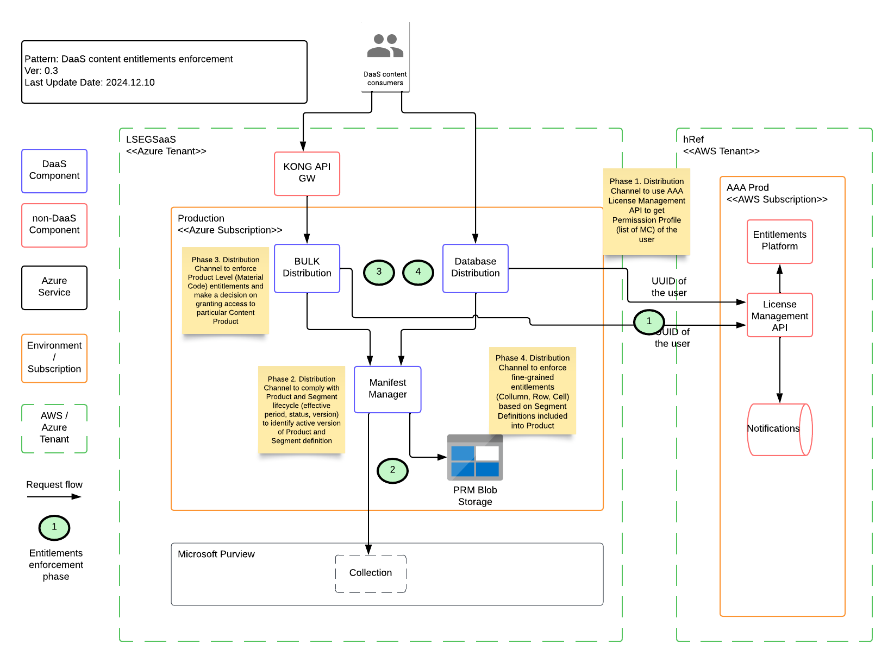

        

Document Metadata

|  |  |
|----|----|
| Identifier | **`LMP-PAT-0052`** |
| Type | **Functional Design Pattern** |
| Status | **Published** |
| Approvals | LMP Migration Architecture Approval |
| Published on | **December 03, 2024** |
| Valid From | **December 16, 2024** |
| Authors |   |
| Tags | Data Management |
| Technology Capabilities | Platform / Data / Data Management |

# Enforcement of Content Segmentation and Entitlements<a href="#enforcement-of-content-segmentation-and-entitlements" class="headerlink" title="Permanent link">¶</a>

## Introduction<a href="#introduction" class="headerlink" title="Permanent link">¶</a>

DaaS implements content distribution to consumers via multiple distribution channels. Each of these channels are responsible for enforcing DaaS Product Entitlements and Content Segmentation boundaries defined by Product and Rights Management (PRM).

## Scope<a href="#scope" class="headerlink" title="Permanent link">¶</a>

This pattern covers entitlements model for Content Products delivered over DaaS. It includes Product Level entitlements (Material Code) and Segment Level entitlements (PRM Segment definition) and responsibility for entitlements enforcement.

### Out of scope<a href="#out-of-scope" class="headerlink" title="Permanent link">¶</a>

- Authentication and Authorization of the customer (human and service accounts)
- EntraID accounts mapping to AAA account
- Provisioning of Commercial Products to consumers
- Application level entitlements (internal and external)
- Kong API GW entitlements (including access control to DaaS BULK API via PO)

## Entitlements enforcement steps<a href="#entitlements-enforcement-steps" class="headerlink" title="Permanent link">¶</a>

Each DaaS Distribution Channel to distribute content to external consumers must follow these steps:

- Obtain information about user's Permission Profile from AAA License Management API
- Check user entitlements on product level (Deployment Method of Material Code + Material Code presence in user's Permission Profile)
- Obtain information about PRM Segment Definitions included into products provisioned to consumers
- Track the lifecycle of PRM Segment and Product definitions (Effective period, updates, deprecation)
- Enforce fine-grained entitlements on Column / Row / Cell level using Segment Definition
- Track changes to user's permission profile (products provisioning and removal)

Entitlement enforcement steps are grouped into four phases:

### Phase 1 - Obtain user's Permission Profile<a href="#phase-1-obtain-users-permission-profile" class="headerlink" title="Permanent link">¶</a>

DaaS components should use [AAA License Management API](https://confluence.refinitiv.com/display/PCS/License+Management+API+V2-+Design+Specification) (part of AAA Provisioning Platform) to get information about user's Permission Profile. Permission Profile should include information about Material Codes assigned to specific users and "Deployment Method" for each of the Material Code.

Sample fragment of AAA License Management API response:

<table class="highlighttable">
<colgroup>
<col style="width: 50%" />
<col style="width: 50%" />
</colgroup>
<tbody>
<tr>
<td class="linenos">

<pre><code> 1
 2
 3
 4
 5
 6
 7
 8
 9
10
11
12
13
14
15
16
17
18
19
20
21
22</code></pre>

</td>
<td class="code">

<pre><code>{
  &quot;licenseEntitlements&quot;: [
    {
      &quot;licenseId&quot;: &quot;3fa85f64-5717-4562-b3fc-2c963f66afa6&quot;,
      &quot;accountId&quot;: &quot;GEUS2-57138&quot;,
      &quot;product&quot;: {
        &quot;id&quot;: &quot;string&quot;,
        &quot;deploymentMethod&quot;: &quot;string&quot;,
        &quot;name&quot;: &quot;string&quot;,
        &quot;description&quot;: &quot;string&quot;,
        &quot;addOn&quot;: true,
        &quot;productFamily&quot;: &quot;string&quot;,
        &quot;category&quot;: &quot;string&quot;
      },
      &quot;version&quot;: 0,
      &quot;licenseEntitlementId&quot;: &quot;3fa85f64-5717-4562-b3fc-2c963f66afa6&quot;,
      &quot;uuid&quot;: &quot;string&quot;,
      &quot;username&quot;: &quot;string&quot;,
      &quot;status&quot;: &quot;string&quot;
    }
  ]
}</code></pre>

</td>
</tr>
</tbody>
</table>

Deployment Methods for DaaS:

| ID  | Name     | Description                |
|-----|----------|----------------------------|
| 9   | BULK     | DaaS BULK Distribution     |
| 10  | DATABASE | DaaS Database Distribution |

Other AAA API's (ACL API, ODPS or Entitlements Platform API) should NOT be used to obtain user's permission profile because they don't include all required information about Material Codes and "Deployment Method".

### Phase 2 - Build snapshot of PRM active Products and Segments version<a href="#phase-2-build-snapshot-of-prm-active-products-and-segments-version" class="headerlink" title="Permanent link">¶</a>

PRM Product and Segment definitions has own lifecycle status controlled by:

- Effective Period of Segment and Product definition (Effective From, Effective To fields)
- Status of the Product version

DaaS components are responsible for:

- identifying active version of Product and Segment based on fields EffectiveFrom, EffectiveTo, Status
- handling status of segment s and products "Active", "Cancelled" and "End Of Life"
- handling segment and product version promotion according to the active period

### Phase 3 - Product level (coarse-grained) entitlements enforcement<a href="#phase-3-product-level-coarse-grained-entitlements-enforcement" class="headerlink" title="Permanent link">¶</a>

Coarse grained entitlements enforcement on Content / Commercial Product level.

Each DaaS Content Product must be assigned with CPQ Material Code to control access to this Content Product. Distribution Channel need to obtain Permission Profile (from AAA) of the user and verify that

- "Deployment Method" of the Material Code matches to the value associated with this Distribution Channel (TODO: add values)
- user is entitled (MC for requested product presented in permission profile) for the requested product (Material Code level)

Sample fragment of Product Definition (ESG Global) to include two segments into product mapped to Material Code 9300000131

<table class="highlighttable">
<colgroup>
<col style="width: 50%" />
<col style="width: 50%" />
</colgroup>
<tbody>
<tr>
<td class="linenos">

<pre><code> 1
 2
 3
 4
 5
 6
 7
 8
 9
10
11
12
13
14
15
16
17
18
19
20
21
22
23
24</code></pre>

</td>
<td class="code">

<pre><code>{
  &quot;Header&quot;: {
    &quot;Name&quot;: &quot;ESG Global - DaaS bulk datafeed&quot;,
    &quot;BillingSystems&quot;: [
      {
        &quot;System&quot;: &quot;Sap&quot;,
        &quot;BillingId&quot;: &quot;9300000131&quot;
      }
    ],
    &quot;EffectiveFrom&quot;: &quot;2024-10-31T00:00:00Z&quot;,
    &quot;EffectiveTo&quot;: &quot;2024-11-01T23:59:59Z&quot;,
    &quot;GoLiveDate&quot;: &quot;2024-09-10T00:00:00Z&quot;
  },
  &quot;SelectedSegments&quot;: [
    {
      &quot;Id&quot;: &quot;a34b6a0a-473f-437b-d516-08dcbd20a9e5&quot;,
      &quot;Name&quot;: &quot;RCS R1&quot;
    },
    {
      &quot;Id&quot;: &quot;3fddf860-a6be-486d-d518-08dcbd20a9e5&quot;,
      &quot;Name&quot;: &quot;[ESG] Measure Values, AsReported and Source Data (excluding Scores and Controversies) - R1&quot;
    }
 ]
}</code></pre>

</td>
</tr>
</tbody>
</table>

### Phase 4 - Content Segment boundaries (fine-grained) entitlements enforcement<a href="#phase-4-content-segment-boundaries-fine-grained-entitlements-enforcement" class="headerlink" title="Permanent link">¶</a>

Fine grained entitlements enforcement (Segment boundaries) on Column / Row / Cell level.

Distribution Channel is responsible for Segment boundaries control and enforcement of fine-grained entitlements. Distribution Channel should read Segment Definitions from Purview or PRM Blob Storage [pat-0046: Consumption of PRM metadata](../0046-daas-prm-metadata-consumption-pattern/) for each DaaS Content Product provisioned to customer.

This information should be used to control user access to a particular Column / Row / Cell of the corresponding Content Products. The exact approach to enforce entitlements depends on the nature of the Distribution Channel (e.g. SQL query injection, database view creation, etc.).

Sample fragment of Segment Definition (\[ESG\] Equity Instrument CUSIP) to include 3 columns from the table Instrument and apply filters on top of them:

<table class="highlighttable">
<colgroup>
<col style="width: 50%" />
<col style="width: 50%" />
</colgroup>
<tbody>
<tr>
<td class="linenos">

<pre><code> 1
 2
 3
 4
 5
 6
 7
 8
 9
10
11
12
13
14
15
16
17
18
19
20
21
22
23
24
25
26
27
28
29
30</code></pre>

</td>
<td class="code">

<pre><code>{
      &quot;ColumnConfigurations&quot;: [
          {
            &quot;ColumnName&quot;: &quot;EffectiveFromTimestamp&quot;,
            &quot;ColumnDataType&quot;: &quot;timestamp&quot;,
            &quot;IsIncludedInOutput&quot;: true,
            &quot;Filter&quot;: {
              &quot;$type&quot;: &quot;LessThanOrEqualTo&quot;,
              &quot;Value&quot;: &quot;CurrentUTCDate&quot;
            }
          },
          {
            &quot;ColumnName&quot;: &quot;PermId&quot;,
            &quot;ColumnDataType&quot;: &quot;long&quot;,
            &quot;IsIncludedInOutput&quot;: true,
            &quot;Filter&quot;: null
          },
          {
            &quot;ColumnName&quot;: &quot;AdminStatusCode&quot;,
            &quot;ColumnDataType&quot;: &quot;string&quot;,
            &quot;IsIncludedInOutput&quot;: false,
            &quot;Filter&quot;: {
              &quot;$type&quot;: &quot;Equals&quot;,
              &quot;Value&quot;: &quot;Published&quot;
            }
          }
        ],
        &quot;TableName&quot;: &quot;Instrument&quot;
      }
}</code></pre>

</td>
</tr>
</tbody>
</table>

### Notes<a href="#notes" class="headerlink" title="Permanent link">¶</a>

It is recommended to use capabilities provided by DaaS Distribution Channels to handle PRM definitions (rather than to implement them again):

- Manifest Manager - manages lifecycle of the PRM segments and products
- SQL query builder - transform PRM segment definition into queries

## Further Reading<a href="#further-reading" class="headerlink" title="Permanent link">¶</a>

- [pat-0046: Consumption of PRM metadata](../0046-daas-prm-metadata-consumption-pattern/)
- [pat-0024: Internal Web Authentication / SSO using OIDC and Microsoft Entra](../../identity-and-access-management/0024-internal-web-authentication-entra-and-oidc/)
- [DaaS ADR Standardised Segmentation Patterns](https://gitlab.dx1.lseg.com/app/app-51783/lmp/-/blob/main/data-platform/docs/adrs/2024-01-08-standardised-segmentation-patterns.md)
- [AAA Provisioning Platform License Management API](https://confluence.refinitiv.com/display/PCS/License+Management+API+V2-+Design+Specification)
- [SAD Data-as-a-Service Release 1](https://lsegroup.sharepoint.com/:b:/r/teams/LMDataPlatform/Shared%20Documents/CH%20-%20Tech%20Architecture/Published%20Docs/Solution%20Designs/DaaS%20R1/Prod%20Design/Data%20Intelligence%20-%20Data-as-a-Service%20Release%201%20-%20Prod.pdf?csf=1&web=1&e=XfJcjr)

    November 24, 2025      December 11, 2024 

 Previous 

Secure File Transfer SFTP Service Pattern

 Next 

Azure Data Factory Service Pattern

Made with <a href="https://squidfunk.github.io/mkdocs-material/" target="_blank" rel="noopener">Material for MkDocs</a>

