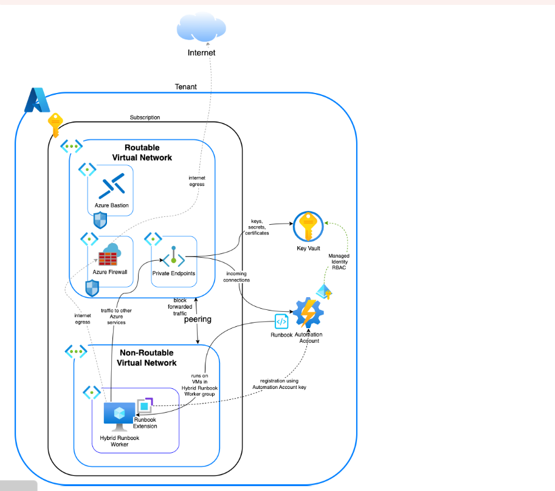

        

Document Metadata

|  |  |
|----|----|
| Identifier | **`LMP-PAT-0067`** |
| Type | **Technical Design Pattern** |
| Status | **Published** |
| Approvals | LMP Migration Architecture Approval |
| Governance Reference | **** |
| Pattern Source Repo |  |
| Published on | **September 29, 2025** |
| Valid From | **September 29, 2025** |
| Authors |   |
| Tags | Data Management |
| Technology Capabilities | Platform / Data / Data Management |

# Azure Automation<a href="#azure-automation" class="headerlink" title="Permanent link">¶</a>

## Introduction<a href="#introduction" class="headerlink" title="Permanent link">¶</a>

Azure Automation is an automation service, consisting of process automation, configuration management, update management, shared capabilities, and heterogeneous features.

Process Automation in Azure Automation allows the automation of frequent, time-consuming and error-prone management tasks.

Process automation supports the integration of Azure services and other third party systems required in deploying, configuring, and managing end-to-end processes.

## Context and Problem<a href="#context-and-problem" class="headerlink" title="Permanent link">¶</a>

While Crontab is commonly used as a primary scheduling tool, due to its security limitations, executing jobs through an Automation Account is a more secure and feasible alternative.

Below are the scenarios where azure automation account can be feasible

- Create, manage, and update infrastructure resources, such as virtual machines, networks, storage accounts,and so on.

<!-- -->

- Deploy apps, add tags, assign role-based access control all declaratively as code and integrated with your CI\CD tools.

<!-- -->

- Manage multiple environments such as production, nonproduction, and disaster recovery.

<!-- -->

- Deploy resources consistently and reliably at a scale.

## Use Case<a href="#use-case" class="headerlink" title="Permanent link">¶</a>

- **Automated Database Backups** Schedule and run scripts to back up Oracle, PostgreSQL, or SQL databases on Azure or on-prem servers. You can automate storing backups in secure Azure Storage and integrate alerting on backup failures. This ensures consistency and compliance with backup policies.

<!-- -->

- **Log Rotation and System Cleanup** Automate log rotation, archiving, and deletion of temporary files or old data to maintain system hygiene. Scheduled cleanup tasks reduce manual maintenance and ensure consistency across environments.

<!-- -->

- **Secure Credential and Secret Management** Use Azure Key Vault within Automation runbooks to securely retrieve credentials, API keys, and secrets at runtime. This eliminates hardcoded credentials in scripts and aligns with least privilege and enterprise security policies.

<!-- -->

- **Server Health Checks and Monitoring** Schedule periodic health checks to monitor CPU usage, disk space, running services, or failed processes. Results can be logged or sent via email, helping operations teams detect and respond to issues early without manual checks.

<!-- -->

- **Replace Crontab for Job Scheduling** Azure Automation can securely replace traditional crontab for scheduling jobs on Unix/Linux servers using Hybrid Runbook Workers. It centralizes job management, includes built-in logging, RBAC, and integrates with monitoring tools. Ideal for standardizing scheduling across the enterprise.

<!-- -->

- **Infrastructure Provisioning and Patching** Trigger deployments of infrastructure using ARM, Bicep, or Terraform on Azure and hybrid servers. Supports zero-touch deployments and integrates well with CI/CD pipelines for modern DevOps workflows.

<!-- -->

- **Configuration Drift Detection and Remediation** Regularly scan for deviations from security baselines (e.g., firewall rules) and automatically revert unauthorized changes. Helps ensure servers remain compliant with internal policies and external regulatory standards.

<!-- -->

- **Integration with ITSM Tools (e.g., ServiceNow)** Runbooks can be triggered by ITSM tools to automate tasks like restarting services, collecting logs, or applying fixes. This reduces mean time to resolution (MTTR) and supports closed-loop automation for incident handling.

<!-- -->

- **Hybrid and Multi-Cloud Server Management** With Hybrid Runbook Workers, Azure Automation can manage servers across on-prem, Azure, or other cloud platforms. This provides a unified way to apply scripts, perform updates, or gather data across hybrid infrastructures.

## Scope<a href="#scope" class="headerlink" title="Permanent link">¶</a>

This document covers:

- Runbook execution overview
- Automation Hybrid Runbook Worker overview
- Azure Automation runbook types
- Azure Automation network configuration details
- Benefits and Monitoring of Azure automation Runbook
- High level architecture
- Cross subscription capability of Automation account
- Steps to Schedule Runbooks in Azure Automation

## Runbook Execution overview<a href="#runbook-execution-overview" class="headerlink" title="Permanent link">¶</a>

Azure Automation enables process automation using **PowerShell**, **PowerShell Workflow**,**python**

### Runbook Execution<a href="#runbook-execution" class="headerlink" title="Permanent link">¶</a>

- Starting a runbook in Azure Automation initiates a **job**,which represents a single execution instance.
- If a runbook is interrupted (e.g., due to a transient issue), it restarts from the beginning.
- Therefore, runbooks should be designed to support safe restarts.

### Job Access and Scope<a href="#job-access-and-scope" class="headerlink" title="Permanent link">¶</a>

- Each job connects to your Azure subscription to access required resources.
- It can only access on-premises datacenter resources if those resources are accessible from the public cloud.

### Workers and Isolation<a href="#workers-and-isolation" class="headerlink" title="Permanent link">¶</a>

- Azure Automation assigns a **worker** to run each job. Workers are shared across multiple Automation accounts, but jobs remain isolated between accounts.
- You cannot select which worker executes a specific job.

### Monitoring and Logging<a href="#monitoring-and-logging" class="headerlink" title="Permanent link">¶</a>

- The Azure portal shows the status of jobs associated with each runbook.
- Azure Automation retains job logs for **up to 30 days**.

## Automation Hybrid Runbook Worker overview<a href="#automation-hybrid-runbook-worker-overview" class="headerlink" title="Permanent link">¶</a>

- Runbooks in Azure Automation might not have access to resources in other clouds or on-premises environments because they run on the Azure cloud platform.
- You can use the Hybrid Runbook Worker feature of Azure Automation to run runbooks directly on the machine hosting the role and against resources in the environment to manage those local resources.
- Runbooks are stored and managed in Azure Automation and then delivered to one or more assigned machines.
- The extension-based approach is approved by LSEG and aims to simplify the installation and management of the Hybrid Runbook Worker role.

### Benefits of Extension-Based User Hybrid Workers<a href="#benefits-of-extension-based-user-hybrid-workers" class="headerlink" title="Permanent link">¶</a>

- The extension-based approach greatly simplifies the installation and management of the User Hybrid Runbook Worker, removing the complexity of the agent-based setup.
- Seamless onboarding
- Ease of Manageability
- Microsoft Entra ID-based authentication
- Unified experience
- Multiple onboarding channels
- Default automatic upgrade

## Azure Automation runbook types<a href="#azure-automation-runbook-types" class="headerlink" title="Permanent link">¶</a>

Azure Automation supports several types of runbooks through its Process Automation feature:

- **PowerShell (recommended)**

This is a textual runbook based on Windows PowerShell scripting. The currently supported versions are **PowerShell 7.4** and **PowerShell 5.1**. It is recommended to create runbooks using the long-term supported version, **PowerShell 7.4**.

- **PowerShell Workflow**

A textual runbook based on Windows PowerShell Workflow scripting. This type is primarily used for complex automation scenarios that require checkpoints and parallel execution.

- **Python (recommended)**

This is a textual runbook based on Python scripting. The currently supported version is **Python 3.10**. Note: Python 2.7 and 3.8 are no longer supported by the parent product Python. It is recommended to use **Python 3.10** for creating runbooks.

- Azure Automation does not support writing Bash scripts directly, so you can write a Python runbook (or PowerShell), and that runbook will run the Bash script for you on a Linux VM that you’ve connected to Azure Automation

<!-- -->

- In Azure Automation, you create a Python runbook like this: This below line runs the shell script on the Linux VM

<table class="highlighttable">
<colgroup>
<col style="width: 50%" />
<col style="width: 50%" />
</colgroup>
<tbody>
<tr>
<td class="linenos">

<pre><code>1
2
3</code></pre>

</td>
<td class="code">

<pre><code>    import subprocess
&#10;subprocess.run([&quot;/bin/bash&quot;, &quot;/home/youruser/myscript.sh&quot;])</code></pre>

</td>
</tr>
</tbody>
</table>

- This script is Python, but it tells Linux to run your .sh (shell) script using bash.

<!-- -->

- What Happens When You Run the Runbook is that the Azure sends your Python script to your Linux VM. Your Linux VM runs the Python code. The Python code calls your Bash script using subprocess. Your Bash script runs locally on that Linux server. The output is sent back to Azure Automation so you can view logs.

## Azure Automation network configuration details<a href="#azure-automation-network-configuration-details" class="headerlink" title="Permanent link">¶</a>

This section outlines the networking requirements for key Azure Automation features: **Hybrid Runbook Worker**, **State Configuration**, **Update Management**, and **Change Tracking and Inventory**.

### Firewall Configuration<a href="#firewall-configuration" class="headerlink" title="Permanent link">¶</a>

If outbound access is restricted by a firewall:

- Ensure access to the port and URLs listed above.
- For region-specific Automation accounts, communication can be restricted to the regional datacenter.
- Refer to Azure Automation DNS documentation for region-specific DNS records.

### Private Network Configuration for DSC<a href="#private-network-configuration-for-dsc" class="headerlink" title="Permanent link">¶</a>

For nodes located in a private network:

- Ensure required ports and URLs are accessible.
- If using **DSC resources** that communicate between nodes (e.g., `WaitFor`), intra-node communication must be allowed.
- All communication requires support for **TLS 1.2 or higher**.

### Best Practices<a href="#best-practices" class="headerlink" title="Permanent link">¶</a>

- Use **service tags** like `GuestAndHybridManagement` and `AzureMonitor` when defining NSG or Azure Firewall rules to simplify management.
- For private and secure access from Azure VMs, consider using **Azure Private Link**.

## **Benefits of Azure automation Runbook**<a href="#benefits-of-azure-automation-runbook" class="headerlink" title="Permanent link">¶</a>

We can use Azure automation Runbook It provides several befenits like

- Centralized Access Control : Azure Automation supports role-based access control (RBAC) via Azure Active Directory, so permissions can be tightly managed and audited.
- No Credential Exposure: Secrets and credentials can be securely stored in Azure Key Vault.
- Secure Networking: Runbooks can be configured to run inside private virtual networks, reducing exposure to public internet.
- Built-in Logging and Diagnostics: Every execution is logged automatically with status, output, and errors — ideal for security audits.
- Unified Job Management: All scheduled jobs are managed from a single UI/portal, reducing the sprawl and inconsistencies that arise from managing crons on multiple servers.
- Version Control: Runbooks can be versioned and integrated with GitHub
- Flexible Scheduling: Supports complex schedules (recurrence, time zones, exceptions) natively.
- Retry Policies and Alerts: Built-in retry logic and integration with Azure Monitor.
- High Availability : Azure Automation is a managed service with high availability, unlike cron jobs tied to single VMs or hosts.

## High Level Architecture<a href="#high-level-architecture" class="headerlink" title="Permanent link">¶</a>

- To enable local or hybrid automation scenarios using Azure Automation, a runbook can be deployed and executed through an extension-based Hybrid Runbook Worker.

<!-- -->

- This configuration allows for seamless management of on-premises, Azure VM

<!-- -->

- A runbook is authored and managed within an Azure Automation Account. For local execution, the runbook must be associated with a Hybrid Runbook Worker group consisting of one or more extension-based workers.

<!-- -->

- These workers are typically Azure VMs configured via the Azure VM extension mechanism.

<!-- -->

- Once the Hybrid Worker is added to the group, the Automation Account can dispatch jobs to these workers for execution in their local environment.

<!-- -->

- To support secure access to Azure resources, the Automation Account should have its managed identity enabled.

<!-- -->

- This identity must then be granted appropriate RBAC roles—such as Contributor or Virtual Machine Contributor—on the target VM or other resources it interacts with.

<!-- -->

- For scenarios requiring access to secrets (e.g., credentials or API keys), Azure Key Vault is integrated.

<!-- -->

- The Automation Account’s identity must be granted the **Key Vault Secrets User** role to retrieve these secrets securely during runbook execution.

<!-- -->

- Additionally, the Hybrid Worker VM itself must have access to the same managed identity if it directly interacts with Key Vault.

<!-- -->

- The Bash script or automation logic is authored directly in the runbook editor under the Automation Account.

<!-- -->

- This script must include the appropriate logic and permissions to perform file operations or any other resource-level task.

<!-- -->

- After development, the runbook is published and linked to a schedule to enable automated, recurring execution—for example, daily log cleanup at midnight.

<!-- -->

- While runbooks run under a secure execution context, they operate within the boundaries of the Hybrid Worker's capabilities.

<!-- -->

- This makes them ideal for long-running tasks, scripts requiring elevated permissions, or interactions with private networks and local services.

<!-- -->

- This setup provides a scalable, manageable, and secure way to automate infrastructure tasks across hybrid and multi-cloud environments using Azure-native tools and governance controls.

<!-- -->

- You create just one shared Automation Account in a "common" subscription. Create a User-Assigned Managed Identity (UAMI) in Azure.

<!-- -->

- Assign this identity to your Automation Account.

<!-- -->

- In each of the 50 subscriptions, give that identity access via RBAC Example Give it “Virtual Machine Contributor” role so it can manage VMs.

<!-- -->

- This way, your central Automation Account can control resources in all 50 subscriptions

### **Monitoring of Azure Automation**<a href="#monitoring-of-azure-automation" class="headerlink" title="Permanent link">¶</a>

- Implement logging within your housekeeping service to track the success or failure of each task.
- Set up alerts to notify administrators of any issues Azure Automation integrates with Azure Monitor
- Enables Log Analytics workspace integration for centralized log collection and querying
- Alerts based on runbook jobs, errors, or custom log queries.

## Steps to Schedule Runbooks in Azure Automation<a href="#steps-to-schedule-runbooks-in-azure-automation" class="headerlink" title="Permanent link">¶</a>

- Go to your Automation Account,Open the Azure Portal Navigate to your Automation Account.
- Create or Open a Runbook if you have already created runbooks for these tasks then Go to Runbooks under your Automation Account.
- Click on the runbook if it hasn't been created yet create a new runbook publish it before proceeding.
- Inside the runbook click the **“Link to schedule”** button at the top.
- Click **“Create a new schedule”** fill out the following details like **Name** **Start Time**,**Recurrence** Select **Recurring**,**Recur Every** click **Create**.
- The schedule is now linked to the runbook.
- Repeat for the other Task Go to your second runbook click **“Link to schedule”**.
- Create a new schedule with the following details **Name:**,**Start Time:**,**Recurrence:** **Daily**.

## Running Runbook in parallel in Azure Automation<a href="#running-runbook-in-parallel-in-azure-automation" class="headerlink" title="Permanent link">¶</a>

- Azure Automation supports running multiple runbooks **in parallel**, allowing you to optimize workflows and reduce execution time.
- Each runbook, when started, runs as a **separate job**.
- You can manually or programmatically start multiple runbooks simultaneously.
- Azure Automation queues and executes each job in its own **sandbox environment** (for cloud-based execution) or on **Hybrid Runbook Workers** (for on-premises or custom execution environments).
- We can run runbooks in parallel through manually via Portal and through Azure CLI.

## Limitations<a href="#limitations" class="headerlink" title="Permanent link">¶</a>

- The number of concurrent jobs is limited based on the number of Job Runtime Minutes purchased.
- You can scale up concurrency by increasing Hybrid Runbook Worker count or linking more automation accounts.
- For Hybrid Worker Requires on-prem or VM infrastructure.
- You’re responsible for maintaining and updating the hybrid worker VM.
- Supports only PowerShell 5.1,PowerShell 7.1,Python 3.
- Automation accounts run with a Managed Identity, but you must explicitly assign the required roles.

## Document and Review the Process<a href="#document-and-review-the-process" class="headerlink" title="Permanent link">¶</a>

- **Documentation**: Maintain comprehensive documentation detailing each housekeeping task, its purpose, execution steps, and any database-specific considerations.

<!-- -->

- **Review**: Regularly review and update your housekeeping processes to adapt to changes in database schemas, business requirements, or performance considerations.

## Further Reading<a href="#further-reading" class="headerlink" title="Permanent link">¶</a>

- <https://learn.microsoft.com/en-us/azure/automation/automation-hybrid-runbook-worker>
- <https://gitlab.dx1.lseg.com/app/app-51285/cloud-security-controls/azure-clear-listing/-/blob/main/azure/services/Microsoft.Automation/automationAccounts/v2.0.0/markdown/serviceControls.md?ref_type=heads>

    October 29, 2025      September 29, 2025 

 Previous 

Oracle DB Backup Strategy

 Next 

AWS to Azure Data Migration

Made with <a href="https://squidfunk.github.io/mkdocs-material/" target="_blank" rel="noopener">Material for MkDocs</a>

