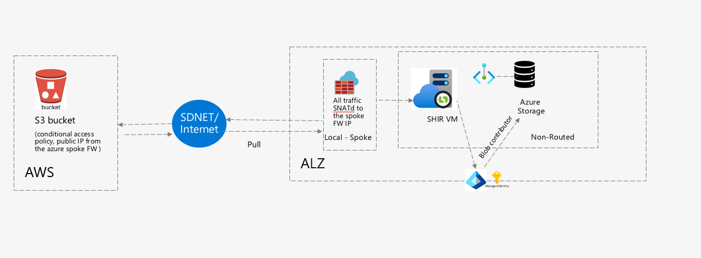

<span class="md-content__button md-icon md-status--published" href="#" title="Status: Published">  </span> <span class="md-content__button md-icon .md-status--published" title="Valid from 2025-03-01">  </span> <span class="md-content__button md-icon actions-date" title="Published on 2025-03-01"></span> <a href="https://gitlab.dx1.lseg.com/app/app-51723/migration-patterns/mig-pat-source-to-target/edit/main/docs/patterns/data-management/0068-aws-to-azure.md" class="md-content__button md-icon" title="Edit this page"></a> <a href="https://gitlab.dx1.lseg.com/app/app-51723/migration-patterns/mig-pat-source-to-target/blob/main/docs/patterns/data-management/0068-aws-to-azure.md" class="md-content__button md-icon" title="View source of this page"></a>

Document Metadata

|  |  |
|----|----|
| Identifier | **`LMP-PAT-0068`** |
| Type | **Technical Design Pattern** |
| Status | **Published** |
| Approvals | <span class="md-tag">LMP Migration Architecture Approval</span> |
| Governance Reference | **[]()** |
| Pattern Source Repo | []() |
| Published on | **March 01, 2025** |
| Valid From | **March 01, 2025** |
| Authors | <span class="md-source-file__fact"> </span> |
| Tags | <span class="md-tag">Data Management</span> |
| Technology Capabilities | <span class="md-tag">Platform / Data / Data Management</span> |

# AWS to Azure Data Migration<a href="#aws-to-azure-data-migration" class="headerlink" title="Permanent link">¶</a>

## Introduction<a href="#introduction" class="headerlink" title="Permanent link">¶</a>

This document provides a structured approach for securely transferring data from AWS to Azure.

### Context and Problem<a href="#context-and-problem" class="headerlink" title="Permanent link">¶</a>

Organizations often need to migrate data from AWS to Azure for cost optimization, compliance. Ensuring secure, efficient, and scalable data transfer is critical, especially for sensitive information.

## Scope<a href="#scope" class="headerlink" title="Permanent link">¶</a>

This guide outlines:

- Copy Methods: Handling LSEG data kept in Amazon S3 bucket or syncing the data between AWS S3 bucket and Azure hosted application.
- AzCopy Steps: Command-line-based efficient data transfer.
- Security Considerations: Encryption, access controls and compliance.
- Alternative Approaches: Other migration options for specific use cases.
- Reference Links: Azure Wiki for additional details.

## Use Cases<a href="#use-cases" class="headerlink" title="Permanent link">¶</a>

- Cloud Migration: Moving datasets from AWS S3 to Azure Blob Storage.
- Data Sync: Syncing the data between AWS S3 bucket and Azure hosted application.
- Regulatory Compliance: Ensuring secure data transfer for sensitive information.
- Cost Optimization: Shifting workloads for better cost management.
- Disaster Recovery & Backup: Replicating data across cloud environments.
- This document ensures a secure, efficient, and structured data transfer approach between AWS and Azure.

## Consideration while moving the data<a href="#consideration-while-moving-the-data" class="headerlink" title="Permanent link">¶</a>

- Data classification
- Data Size
- Security considerations for using presigned URLs/ Access Keys and IDs.
- Cut over window/timeline.

## How to Transfer data from AWS to Azure<a href="#how-to-transfer-data-from-aws-to-azure" class="headerlink" title="Permanent link">¶</a>



### Scenario 1: One-Time Data Transfer Using AzCopy (Internet-Based)<a href="#scenario-1-one-time-data-transfer-using-azcopy-internet-based" class="headerlink" title="Permanent link">¶</a>

In scenarios involving AWS S3 buckets, AzCopy requires internet access to interact with the public S3 endpoints, and appropriate firewall and bucket policy configurations must be in place to allow such communication

- Ensure the AWS S3 bucket has public access completely disabled.
- Deploy a VM in a non-routable VNet within Azure.
- Install AzCopy on the VM if not already present.
- Create and assign a User Assigned Managed Identity to the VM.
- Grant Blob Contributor Access to the Azure Storage Account.
- Submit a request to add FQDN rules to the spoke firewall: - For internet-based transfer: Use the S3 bucket's public endpoint URL.
- Whitelist the public IP addresses of the Azure Spoke Firewall in the S3 bucket policy to allow point-to-point connection.
- Ensure all controls are in place to securely copy data using AzCopy.
- Once migration is complete, decommission the Jump VM.

### Scenario 2: SDNET-Based Data Transfer<a href="#scenario-2-sdnet-based-data-transfer" class="headerlink" title="Permanent link">¶</a>

- For continuous sync, use application-level integration.

- Use SDKs to establish federation between AWS and Azure for authentication and authorisation (AuthN/AuthZ).

- Submit a request to add FQDN rules to the spoke firewall: - For SDNET/private transfer: Use the S3 bucket's VPC endpoint URL.

- Do not update the S3 bucket policy with public IPs, as SDNET handles secure private connectivity.  

  **Note**

<!-- -->

- Azure and AWS CLI SDKs can be downloaded from [Enterprise Artifactory](https://artifactory.lseg.com/ui/repos/tree/General/200048-docker-dev).

## Data Transfer Methods<a href="#data-transfer-methods" class="headerlink" title="Permanent link">¶</a>

AzCopy supports direct **cloud-to-cloud** transfers using **federated Tokens**, AWS S3 **pre-signed URLs** and Azure SAS tokens. These methods eliminates the need to store data locally, ensuring **faster and more secure transfers**. The Azcopy command runs from an Azure VM which should have a system/user defined identity with **Storage Account Blob Contributor Access** assigned to the storage account.

### Long Lived Data Transfer<a href="#long-lived-data-transfer" class="headerlink" title="Permanent link">¶</a>

Leveraging Entra ID Managed Identity for this process eliminates the need for hardcoded credentials, enhancing both security and automation. This approach uses identity federation via **OpenID Connect** (OIDC) to enable a **User Assigned Managed Identity** (UAMI) in Azure to assume an AWS IAM role, granting temporary access to S3 resources. Once federated, tools like AzCopy can be used to transfer data directly from AWS S3 to Azure Blob Storage, with authentication handled entirely through managed identities.

- Create and attach a **User Assigned Managed Identity** (UAMI) to the VM which has **Storage Account Blob Contributor Access** to the Storage Account.

- Install Azure CLI and AWS CLI, Azcopy in the VM.

- Submit a request for the below steps since it requires elevated access permission. - Create an Entra application (Service Principal) for your application. - Under "Expose an API", define a custom Application ID URI like. e.g.

  <div class="language-text highlight">

  <table class="highlighttable">
  <colgroup>
  <col style="width: 50%" />
  <col style="width: 50%" />
  </colgroup>
  <tbody>
  <tr>
  <td class="linenos"><div class="linenodiv">
  <pre><code>1
  2
  3</code></pre>
  </div></td>
  <td class="code"><div>
  <pre><code>```powershell
  URN://AWSOIDCFederationTarget
  ```</code></pre>
  </div></td>
  </tr>
  </tbody>
  </table>

  </div>

  \- Create an App Role and Assign It to the UAMI. Use PowerShell to grant the UAMI permission to call the API.

  <div class="language-text highlight">

  <table class="highlighttable">
  <colgroup>
  <col style="width: 50%" />
  <col style="width: 50%" />
  </colgroup>
  <tbody>
  <tr>
  <td class="linenos"><div class="linenodiv">
  <pre><code>1
  2
  3
  4
  5
  6
  7</code></pre>
  </div></td>
  <td class="code"><div>
  <pre><code>```powershell
  New-AzureADServiceAppRoleAssignment `
  -ObjectId &lt;object id of your managed identity&gt; `
  -Id &lt;id of the app role defined in the app&gt; `
  -PrincipalId &lt;object id of your managed identity again&gt; `
  -ResourceId &lt;object id of the app registration&#39;s service principal&gt;
  ```</code></pre>
  </div></td>
  </tr>
  </tbody>
  </table>

  </div>

  \- Create an OpenID Connect (OIDC) identity provider in AWS with the following example - \*\*\*\*Provider URL\*\*\*\*: `sts.windows.net/<Azure_Tenant_ID>/` - \*\*\*\*Audience\*\*\*\*: `URN://AWSOIDCFederationTarget` (created as per) - Create an AWS IAM Role for the OpenID Connect (OIDC) identity provider with Get,Set,List access to S3 bucket with the audience set as the exposed AI of the service principal created e.g `URN://AWSOIDCFederationTarget` - Whitelist the URLs on AFW policy - management.azure.com - login.microsoftonline.com - aadcdn.msftauth.net,login.windows.net - secure.aadcdn.microsoftonline-p.com -sts.windows.net - .blob.core.windows.net - azcopyvnextrelease.z22.web.core.windows.net - .s3.dualstack..amazonaws.com or the URL of the VPC endpoint - sts.amazonaws.com - Data sync or data movement over the private or public connection.

#### Data transfer over internet<a href="#data-transfer-over-internet" class="headerlink" title="Permanent link">¶</a>

- This approach can be used for both azcopy and data syncing between AWS and Azure. 

<!-- -->

- The virtual machine initiates a data transfer using the azcopy tool to move data to or from Azure Storage.

- The outbound request is routed through Azure Firewall for inspection and policy enforcement.

- The VM uses its attached managed identity to request an access token from Entra ID.

- The token request specifies the Service Principal Name (SPN) as the audience, which is validated by the OpenID Connect (OIDC) provider.

- Access is granted based on the IAM role assigned to the managed identity, allowing it to interact with the target resource

- Run the below commands to initiate data copy using Azcopy.

  `` powershell az login --identity azcopy login --identity --identity-client-id "<your-uami-client-id>" cd '<AZ COPY PATH>' $audience = "<SPN_URI>" $clientId = "<UAMI_CLIENTID>" $awsArn = "<OIDC_ROLE_ARN>" $response = Invoke-RestMethod -Uri "http://169.254.169.254/metadata/identity/oauth2/token?api-version=2018-02-01&resource=$audience&client_id=$clientId" ` -Headers @{Metadata="true"} -Method GET $token =$response.access_token $acknowledgement = aws sts assume-role-with-web-identity ` --role-arn $awsArn ` --role-session-name "azureSession" ` --web-identity-token $token ` --duration-seconds <time_in_seconds> $value = $acknowledgement | ConvertFrom-Json $env:AWS_ACCESS_KEY_ID  = $value.Credentials.AccessKeyId.ToString() $env:AWS_SECRET_ACCESS_KEY = $value.Credentials.SecretAccessKey.ToString() $env:AWS_SESSION_TOKEN   = $value.Credentials.SessionToken .\azcopy.exe copy 'https://<S3 endpoint>/<file/folder>' "https://<storage_account>.blob.core.windows.net/<container>" --recursive=true ``

<!-- -->

- The time in seconds can be varied from 1 hour to 12 hours where, the minimum lifespan is 1 hour and the maximum is 12.

#### Data transfer over a private connection<a href="#data-transfer-over-a-private-connection" class="headerlink" title="Permanent link">¶</a>

- This approach is suitable for data syncing between AWS and Azure over a private channel.

  

<!-- -->

- The virtual machine/ application initiates a data transfer to sync the data between Azure and AWS.
- The outbound request is routed through Azure Firewall for inspection and policy enforcement
- The request is re-routed privately to the VPC endpoint and then to the S3 bucket via SDnet
- The VM uses its attached managed identity to request an access token from Entra ID.
- The token request specifies the Service Principal Name (SPN) as the audience, which is validated by the OpenID Connect (OIDC) provider.
- Access is granted based on the IAM role assigned to the managed identity, allowing it to interact with the target resource
- Data sync between S3 bucket and blob

### Short Lived Data Transfer<a href="#short-lived-data-transfer" class="headerlink" title="Permanent link">¶</a>

#### Using a Presigned URL<a href="#using-a-presigned-url" class="headerlink" title="Permanent link">¶</a>

- This approach is suitable for short-term data transfers, as AWS S3 pre-signed URLs have a maximum lifespan of 7 days when generated using the AWS SDK, and is suitable only for public data transfer, where the public transfer is done via internet.  
  **Steps** - Generate a Pre-Signed URL from AWS S3: - This URL provides temporary read access to your S3 objects. s3://your-source-bucket/your-file --expires-in : - The **--expires-** in parameter defines **how long** the URL remains valid. - This can be set as per the data size. - The generated **pre-signed URL** should be kept in a secure credential store and communicated via a secured channel. - The signed URL **includes authentication**, ensuring **only authorized access**. - Submit a request to whitelist the .s3.dualstack..amazonaws.com in the spoke AFW. - Submit a request to add and permit the public IP addresses of the spoke firewall to the S3 bucket policy, if migrating the data over internet else omit this request(migration using azcopy). - Use AzCopy to Transfer Data to Azure - .\azcopy.exe copy "<https://s3.amazonaws.com/your-bucket/your-file?AWS-Signed-URL>" "<https://yourstorageaccount.blob.core.windows.net/your-container?sas-token%22>" - The **AWS pre-signed URL** ensures **secure, time-limited access** to the source file. - The **Azure SAS token** restricts access to the target container.

## **Encryption**<a href="#encryption" class="headerlink" title="Permanent link">¶</a>

- **In Transit**: - Data is transferred over **HTTPS (TLS 1.2)** to **encrypt data in motion**. - AWS **pre-signed URLs** and **Azure SAS tokens** provide **temporary, controlled access**. - Data will be securely transferred over HTTPS using the user's credentials, specifically the **access_key and** **access_id**, with **GET** and **PUT** access to the designated S3 bucket. - After the successful migration, this user will be decommissioned, and the corresponding access will be revoked.
- **At Rest**: - AWS S3 supports **SSE-S3, SSE-KMS, and SSE-C** encryption. - Azure Blob Storage supports **Storage Service Encryption (SSE)**. **Access Control**
- AWS **IAM roles & policies** ensure only authorized users generate pre-signed URLs.
- Azure **RBAC & SAS tokens** restrict access to destination storage.
- Using **Azure Private Link & AWS Direct Connect**, the exposure to the Public network can be avoided.

## Alternative Approaches<a href="#alternative-approaches" class="headerlink" title="Permanent link">¶</a>

### Migration Using Azure Data Factory<a href="#migration-using-azure-data-factory" class="headerlink" title="Permanent link">¶</a>

ADF offers a serverless architecture that allows parallelism at different levels, which allows developers to build pipelines to fully utilize your network bandwidth and storage IOPS and bandwidth to maximize data movement throughput for LSEG environment.


- Deploy Azure Data Factory: - CPF already has a module to deploy Azure Data Factory. - While deploying the SHIR on an EC2 instance is an available option, the proposed and recommended solution is to use a Windows Server 2022 virtual machine on Azure.
- Configure and Register SHIR: - Once deployed, the SHIR should be configured and registered to the ADF studio using the access key.
- Create ADF Pipelines: - Once the setup is completed and the SHIR is onboarded, ADF pipelines can be created. - The source is an S3 bucket, and the data type should be Binary. - The target is an Azure Storage account.
- Authenticate to S3 Bucket: - The authentication to the S3 bucket is done by federated tokens pre-signed URL or a user account with access key and access ID. - Ensure GET-PUT access to the S3 bucket.

### MFT<a href="#mft" class="headerlink" title="Permanent link">¶</a>

- MFT can be used for moving smaller data chunks, more information can be found on [MFT](https://lsegroup.sharepoint.com/sites/InfrastructureandApplicationService/SitePages/GoAnyWhere---MFT.aspx?web=1).

## Further Reading<a href="#further-reading" class="headerlink" title="Permanent link">¶</a>

- [AWS to Azure History data migration design options](https://dev.azure.com/LSEGroup/Migration/_wiki/wikis/Migration.wiki/7605/AWS-to-Azure-History-data-migration-design-options)
- [Azure Blob to AWS S3 Sync](https://dev.azure.com/LSEGroup/Migration/_wiki/wikis/Migration.wiki/7582/Azure-Blob-to-AWS-S3-Sync)
- [AWS S3 to Azure Blob Sync](https://dev.azure.com/LSEGroup/Migration/_wiki/wikis/Migration.wiki/7581/AWS-S3-to-Azure-Blob-Sync)
- [AWS to Azure: Cross region Routing of traffic from RDP and PDG to CIAM IA](https://dev.azure.com/LSEGroup/Migration/_wiki/wikis/Migration.wiki/7526/AWS-to-Azure-Cross-region-Routing-of-traffic-from-RDP-and-PDG-to-CIAM-IA)
- [Azure to AWS - AAA Entitlement API over Public Internet](https://dev.azure.com/LSEGroup/Migration/_wiki/wikis/Migration.wiki/7507/Azure-to-AWS-AAA-Entitlement-API-over-Public-Internet)
- [Data Platform Migration Approach](https://dev.azure.com/LSEGroup/Migration/_wiki/wikis/Migration.wiki/217/Data-Platform-Migration-Approach-Technical-)
- [Data Migration](https://dev.azure.com/LSEGroup/Migration/_wiki/wikis/Migration.wiki/810/Data-Migration)
- [Setting up a federated Identity](https://dev.azure.com/LSEGroup/Migration/_wiki/wikis/Migration.wiki/7875/AWS-to-Azure-Data-Migration-Steps)
- [Storage Account Security Controls](https://gitlab.dx1.lseg.com/app/app-51285/cloud-security-controls/azure-clear-listing/-/blob/main/azure/services/Microsoft.Storage/storageAccounts/v2.2.0/markdown/serviceControls.md#-control-title-shared-access-signatures-sas-where-approved-for-external-access-must-apply-resource-and-permission-restrictions-in-accordance-with-the-principle-of-least-privilege-and-ip-address-restrictions-where-possible-to-apply)

<span class="md-source-file__fact"> <span class="md-icon" title="Last update">  </span> <span class="git-revision-date-localized-plugin git-revision-date-localized-plugin-date" title="September 30, 2025 14:35:37 UTC">September 30, 2025</span> </span> <span class="md-source-file__fact"> <span class="md-icon" title="Created">  </span> <span class="git-revision-date-localized-plugin git-revision-date-localized-plugin-date" title="July 22, 2025 07:29:01 UTC">July 22, 2025</span> </span>

<a href="../0067-db-housekeeping/" class="md-footer__link md-footer__link--prev" aria-label="Previous: Azure Automation"></a>

<div class="md-footer__button md-icon">


</div>

<div class="md-footer__title">

<span class="md-footer__direction"> Previous </span>

<div class="md-ellipsis">

Azure Automation

</div>

</div>

<a href="../0069-oracle-to-azure/" class="md-footer__link md-footer__link--next" aria-label="Next: Oracle Exadata / Oracle RAC to Azure Oracle on VM Migration"></a>

<div class="md-footer__title">

<span class="md-footer__direction"> Next </span>

<div class="md-ellipsis">

Oracle Exadata / Oracle RAC to Azure Oracle on VM Migration

</div>

</div>

<div class="md-footer__button md-icon">


</div>

<div class="md-footer-meta md-typeset">

<div class="md-footer-meta__inner md-grid">

<div class="md-copyright">

Made with <a href="https://squidfunk.github.io/mkdocs-material/" target="_blank" rel="noopener">Material for MkDocs</a>

</div>

</div>

</div>

<div class="md-dialog" md-component="dialog">

<div class="md-dialog__inner md-typeset">

</div>

</div>
