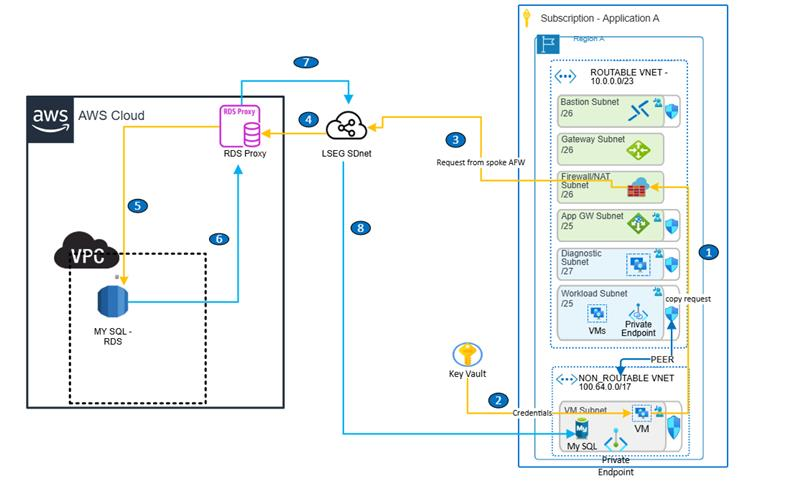

        

Document Metadata

|  |  |
|----|----|
| Identifier | **`LMP-PAT-0076`** |
| Type | **Technical Design Pattern** |
| Status | **Published** |
| Approvals | LMP Migration Architecture Approval |
| Governance Reference | **** |
| Pattern Source Repo |  |
| Published on | **April 20, 2026** |
| Valid From | **April 20, 2026** |
| Authors |   |
| Tags | Data ManagementDatabase |
| Technology Capabilities | Platform / Data / Data ManagementPlatform / Data / Database |

# AWS MySQL to Azure MySQL Database Migration<a href="#aws-mysql-to-azure-mysql-database-migration" class="headerlink" title="Permanent link">¶</a>

## Introduction<a href="#introduction" class="headerlink" title="Permanent link">¶</a>

This pattern document covers setting up the required tools and migrating a MySQL database from LSEG's AWS to Azure using mydumper and myloader.

## Context and Problem<a href="#context-and-problem" class="headerlink" title="Permanent link">¶</a>

Traditional migration methods may involve significant downtime or complex replication setups. This pattern provides a streamlined approach using mydumper and myloader, which are high-performance parallel backup and restore tools for MySQL databases.

## Use Cases<a href="#use-cases" class="headerlink" title="Permanent link">¶</a>

- Moving MySQL databases from AWS RDS/EC2 to Azure Database for MySQL, especially when the data size is greater than 1 TB and parallel data movement is required. This approach uses multi-threaded dumping and loading, allowing multiple tables and table chunks to be processed concurrently. This enables efficient utilization of CPU, disk I/O, and network bandwidth, significantly reducing migration time for large datasets.
- Teams can perform a dump and load operation, then configure binlog-based replication to synchronize any changes (delta) that occurred during the migration. This allows the source database to be taken offline for the final cutover. Alternatively if you are looking for near zero downtime and a fully online migration, then this method should not be used and can be achieved using Azure Database Migration Service (DMS) for MySQL,which handles continuous data synchronization without requiring downtime until cutover.

## Scope<a href="#scope" class="headerlink" title="Permanent link">¶</a>

This documentation outlines:

- Prerequisites: Required Azure resources and tool installations
- Tool setup: Installing and configuring mydumper and myloader
- Infrastructure setup: Mounting additional storage for backup files
- Connectivity: Establishing secure connection from Azure to AWS MySQL via proxy
- Backup process: Creating MySQL backups using mydumper
- Restore process: Loading backups into Azure MySQL using myloader
- Security considerations: Using Azure Key Vault for credential management

## Comparison: mydumper/myloader vs Azure DMS<a href="#comparison-mydumpermyloader-vs-azure-dms" class="headerlink" title="Permanent link">¶</a>

| **Feature/Aspect** | **mydumper/myloader** | **Azure Database Migration Service (DMS)** |
|----|----|----|
| Type | Open-source CLI tools | Managed Azure service |
| Migration Mode | Logical dump and load (offline, parallel) | Online (continuous sync), offline, full/incremental |
| Parallelism | High (multi-threaded, table/chunk level) | Limited (task-based, not true parallel load) |
| Downtime | Typically requires downtime for cutover | Minimal downtime (with continuous sync) |
| Use Case Suitability | Large, bulk migrations; best for \>1TB | Ongoing replication, homogeneous sources |
| Setup Complexity | Manual setup, scripting, infra required | Managed, portal/wizard-driven |
| Monitoring | Manual (logs, scripts) | Built-in monitoring, alerts |
| Error Handling | Manual intervention | Automated retries, error reporting |
| Security | Credentials managed externally (e.g., Key Vault) | Azure AD, Key Vault integration |
| Cost | VM/infra and ops cost only | Service charges per migration/replication |
| Flexibility | Full control over process and tuning | Limited tuning, Azure-managed |
| Supported Targets | Any MySQL-compatible | Azure DBs, SQL Server, MySQL, PostgreSQL |
| Data Validation | Manual (row count, checksums) | Some built-in validation |
| Use in Azure Migration | Yes, with custom infra and scripts | Yes, natively supported |

## Considerations While Moving Data<a href="#considerations-while-moving-data" class="headerlink" title="Permanent link">¶</a>

- Data classification and sensitivity level
- Database size and migration duration
- Network bandwidth and transfer speeds
- Cutover window or timeline and acceptable downtime
- Application dependency mapping
- Post-migration validation requirements

## AWS to Azure Network Connectivity<a href="#aws-to-azure-network-connectivity" class="headerlink" title="Permanent link">¶</a>

This architecture supports large-scale MySQL migration from AWS RDS to Azure using MyDumper and MyLoader. It is designed to maintain strict network isolation and strong security controls.

MyDumper and MyLoader authenticate directly against the MySQL engine and require database-native credentials (username and password). These tools do not support cloud-federated authentication mechanisms such as Azure AD, AWS IAM federation, or cross-cloud token exchange. Therefore, database access must be authorized using a local database administrator or a dedicated service account. To address this constraint without compromising security, the architecture separates responsibilities across layers:

- **Network isolation**: The AWS RDS instance should be in private subnets without public accessibility. The Azure migration VM should reside in a non-routable workload VNet.
- **Private connectivity**: Ensure database traffic never traverses the public internet. Route traffic through controlled network paths and inspect it with Azure Firewall before it reaches AWS.
- **Credential security**: Store database credentials in Azure Key Vault and retrieve them at runtime on the migration VM. Do not embed credentials in code or configuration files.
- **Database-level authorization**: Keep MySQL authentication independent of cloud identity systems. MySQL validates connections using local authentication mechanisms only.

This approach enables use of high-performance, parallel tools such as MyDumper and MyLoader while preserving a strong security posture. Network access is tightly controlled and authentication is limited to the minimum required database privileges.

Note: AWS RDS subnet CIDRs should be whitelisted on the Azure firewall for outbound traffic. Use TCP port 3306 for MySQL traffic.

## Prerequisites<a href="#prerequisites" class="headerlink" title="Permanent link">¶</a>

Before beginning the migration process, ensure the following actions are coordinated with the appropriate teams:

- **Azure Database for MySQL Server**
- **Azure Database for MySQL Server** This will serve as the target for the database migration.

<!-- -->

- **Azure Virtual Machine (VM) Running Linux**

<!-- -->

- **Azure Virtual Machine (VM) Running Linux** Provision a VM (preferably Ubuntu) that will be used to run the backup and restore operations.

<!-- -->

- **Sufficient Storage**
- **Sufficient Storage** Attach additional disk storage to the VM based on the size of the source database.

<!-- -->

- **Required Packages Installation**

- **Required Packages Installation** Install the following tools on the Linux VM:

  

  <table class="highlighttable">
  <colgroup>
  <col style="width: 50%" />
  <col style="width: 50%" />
  </colgroup>
  <tbody>
  <tr>
  <td class="linenos">

  <pre><code>1
  2
  3
  4
  5</code></pre>
  
</td>
  <td class="code">

  <pre><code>sudo apt update
  sudo apt install mysql-client
  sudo apt install zstd
  sudo apt install jq
  sudo apt-get install libatomic1</code></pre>
  
</td>
  </tr>
  </tbody>
  </table>

  

<!-- -->

- **Credential management** Store source MySQL server credentials in Azure Key Vault as a secret. Assign the migration VM's managed identity the "Key Vault Secrets User" role (or equivalent) so the identity can retrieve the secret at runtime for authentication. Do not embed credentials in code or configuration files.

<!-- -->

- **Download and install Azure CLI from BAMS (Enterprise Artifactory)**

  

  <table class="highlighttable">
  <colgroup>
  <col style="width: 50%" />
  <col style="width: 50%" />
  </colgroup>
  <tbody>
  <tr>
  <td class="linenos">

  <pre><code>1
  2
  3
  4</code></pre>
  
</td>
  <td class="code">

  <pre><code>curl -u s.predanalytic.bams:&lt;pwd&gt; \
    -o mydumper_0.18.1-1.focal_amd64.deb \
    &quot;https://bams-aws.refinitiv.com/artifactory/default.migration.generic.local/sbotest/linux/&quot;\
    &quot;mydumper_0.18.1-1.focal_amd64.deb&quot;</code></pre>
  
</td>
  </tr>
  </tbody>
  </table>

  

<!-- -->

- **Recommended VM sizing and tool specifications** - VM sizing (large migrations): 32 vCPUs (or more), 512 GB RAM, 8+ TB SSD for temporary dumps. Enable network acceleration and ensure at least 1 Gbps network bandwidth for transfer-heavy operations. - Disk encryption: Enable SSE with Customer Managed Keys (CMK) for any disks holding dump files. - Tool version: mydumper/myloader v0.18.1-1 (or later stable release) is recommended for multi-threaded consistent dumps and loads. - Supported MySQL versions: 5.7, 8.0, 8.1. - Performance tuning: Choose `--threads`, `--rows`, and chunk split (`-F`) based on VM CPU, memory, and disk I/O. - Secrets and auth: Store DB credentials in Azure Key Vault and retrieve them from the migration VM using a least-privilege service account or managed identity with controlled access.  

Note: The servers created should be decommissioned after the successful migration.

## Tool Setup and Migration<a href="#tool-setup-and-migration" class="headerlink" title="Permanent link">¶</a>

### Installation Steps<a href="#installation-steps" class="headerlink" title="Permanent link">¶</a>

- Download the appropriate `.deb` package from BAMS (Business Artifact Management System).
- Install the downloaded package.
- Verify installation

### Infrastructure Setup: Mount Additional Disk for Backup Storage<a href="#infrastructure-setup-mount-additional-disk-for-backup-storage" class="headerlink" title="Permanent link">¶</a>

This section outlines how to partition, format, and mount a newly attached disk (for example `/dev/sdc`) on your Azure VM to store database backup files.

- Create a partition table and partition the disk.
- Verify the partition.
- Format the partition.
- Create a mount point.
- Mount the partition.
- Make the mount persistent.
- Confirm the mount.

### Backup: Create a MySQL Backup Using Mydumper<a href="#backup-create-a-mysql-backup-using-mydumper" class="headerlink" title="Permanent link">¶</a>

- A backup of the source MySQL database using mydumper with optimal settings for large-scale migrations.
- This [guide](https://confluence.refinitiv.com/pages/viewpage.action?pageId=1417666525&spaceKey=APPA&title=Mydumper%2BMyloader%2Btool%2Bset%2Bup%2Bon%2BAzure%2BLinux%2BVM) explains a step by step execution of the process.

## Using Amazon RDS Proxy<a href="#using-amazon-rds-proxy" class="headerlink" title="Permanent link">¶</a>

RDS Proxy is used when multiple concurrent connections originate from Azure over private connectivity. It is used with the same RDS or Aurora database to pool and reuse connections, helping to prevent connection exhaustion and startup bottlenecks on the database or cluster. RDS Proxy does not increase query throughput or overall query performance.

[Amazon RDS Proxy](https://docs.aws.amazon.com/AmazonRDS/latest/UserGuide/rds-proxy.html) enables applications to pool and share database connections to improve scalability.

RDS Proxy increases resilience to database failures by connecting to a standby DB instance while preserving application connections. RDS Proxy supports AWS Identity and Access Management (IAM) authentication for proxy clients and can connect to databases using either IAM database authentication or credentials stored in AWS Secrets Manager.

Example endpoint: `<name>.proxy-<random_string>.eu-north-1.rds.amazonaws.com`

### Proxy Security and Credentials<a href="#proxy-security-and-credentials" class="headerlink" title="Permanent link">¶</a>

- The proxy contains secrets with user credentials stored securely.
- Only users with valid credentials are permitted to connect via this proxy.
- Credentials are managed through Azure Key Vault for enhanced security.
- Connections are established over encrypted channels.

Note: AWS RDS Proxy subnet CIDRs or the proxy endpoint should be whitelisted on the Azure firewall for outbound traffic. Use TCP port 3306 for MySQL traffic.

## Best Practices and Recommendations<a href="#best-practices-and-recommendations" class="headerlink" title="Permanent link">¶</a>

### Delta changes<a href="#delta-changes" class="headerlink" title="Permanent link">¶</a>

- Replicate delta changes to the target database in alignment with the customer's Recovery Time Objective (RTO) and Recovery Point Objective (RPO) requirements.

### Performance Optimization<a href="#performance-optimization" class="headerlink" title="Permanent link">¶</a>

- Adjust `--threads` parameter based on CPU cores available on the VM.
- Use `--compress` to reduce network transfer time.
- Monitor disk I/O during backup and restore operations.
- Consider splitting very large tables for parallel processing.

### Security Considerations<a href="#security-considerations" class="headerlink" title="Permanent link">¶</a>

- Store all credentials in Azure Key Vault.
- Use Managed Identity for authentication to Azure services.
- Enable SSL/TLS for database connections.
- Restrict network access using Azure NSGs and firewall rules.
- Audit all migration activities and maintain logs.

### Validation Steps<a href="#validation-steps" class="headerlink" title="Permanent link">¶</a>

After migration completion:

- Verify row counts match between source and target.
- Run checksum validation on critical tables.
- Test application connectivity and functionality.
- Validate data integrity and foreign key relationships.
- Compare performance metrics between source and target.

### Troubleshooting<a href="#troubleshooting" class="headerlink" title="Permanent link">¶</a>

Common issues and resolutions:

- **Connection timeouts**: Increase `--long-query-guard` value.
- **Disk space**: Monitor available space on `/mnt/data` during backup.
- **Memory issues**: Reduce `--threads` parameter.
- **Character set issues**: Ensure matching collation between source and target.
- **Permission errors**: Verify Azure MySQL user has sufficient privileges.

## Further Reading<a href="#further-reading" class="headerlink" title="Permanent link">¶</a>

- [Mydumper Documentation](https://github.com/mydumper/mydumper)
- [Azure Database for MySQL Documentation](https://learn.microsoft.com/en-us/azure/mysql/)
- [Azure Key Vault Documentation](https://learn.microsoft.com/en-us/azure/key-vault/)
- [MySQL Migration Best Practices](https://dev.mysql.com/doc/refman/8.0/en/migration.html)
- [Enterprise Artifactory](https://artifactory.lseg.com/)
- [Proxy Creation](https://docs.aws.amazon.com/AmazonRDS/latest/UserGuide/rds-proxy-creating.html)

    April 20, 2026      February 2, 2026 

 Previous 

Oracle Exadata / Oracle RAC to Azure Oracle on VM Migration

 Next 

Azure Relational Database Selection

Made with <a href="https://squidfunk.github.io/mkdocs-material/" target="_blank" rel="noopener">Material for MkDocs</a>

