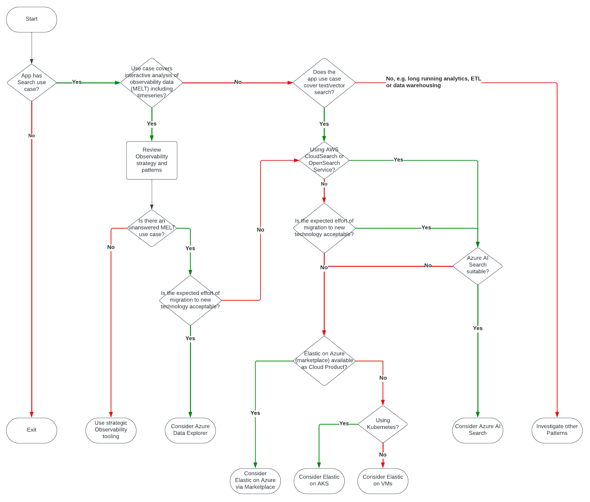

        

Document Metadata

|  |  |
|----|----|
| Identifier | **`LMP-PAT-0007`** |
| Type | **Technology Selection Pattern** |
| Status | **Published** |
| Approvals | LMP Migration Architecture Approval |
| Published on | **May 13, 2024** |
| Valid From | **June 08, 2024** |
| Authors |   |
| Tags | Search |
| Technology Capabilities | Platform / Application / Search |

# Full-Text Document Indexing and Search<a href="#full-text-document-indexing-and-search" class="headerlink" title="Permanent link">¶</a>

## Compatibility<a href="#compatibility" class="headerlink" title="Permanent link">¶</a>

Apps migrating to Azure under LMP have a variety of use cases for data search and indexing.

Telemetry analytics is one of the most common, but some application may also have Apache Lucene-style text (or vector) search requirements. This pattern covers both.

It does not cover security use cases (e.g. SIEM).

## Recommended Target<a href="#recommended-target" class="headerlink" title="Permanent link">¶</a>

- For telemetry analytics, where strategic tooling is unsuitable, Azure Data Explorer is an Azure-native equivalent
- For full text or vector search<a href="#fn:10" class="footnote-ref">1</a><a href="#fn:11" class="footnote-ref">2</a> use cases (e.g. for semantic similarity), Azure AI Search is an Azure-native equivalent that is suitable for many use cases
- For applications that cannot adopt new technology, Elasticsearch is available in either managed or self-managed guises, but - at the time of writing - work will be required to adopt the managed Elasticsearch offering

## Decision Tree Diagram<a href="#decision-tree-diagram" class="headerlink" title="Permanent link">¶</a>

## Notable Differences<a href="#notable-differences" class="headerlink" title="Permanent link">¶</a>

<table>
<colgroup>
<col style="width: 20%" />
<col style="width: 20%" />
<col style="width: 20%" />
<col style="width: 20%" />
<col style="width: 20%" />
</colgroup>
<thead>
<tr>
<th>Considerations</th>
<th>Elastic Search (Managed)</th>
<th>Elastic Search (Unmanaged)</th>
<th>Azure AI Search</th>
<th>Azure Data Explorer</th>
</tr>
</thead>
<tbody>
<tr>
<td>Typical Use Case</td>
<td>Flexible product that covers a variety of Observability, Security and Search use cases.</td>
<td>See Elastic Search (managed)</td>
<td>PaaS that helps developers create their own text/vector search solutions. 
 
Supports integrated chunking and vectorization and sophisticated vector, text and hybrid search queries. 
 
Provides an index on top of an un-indexed data store (such as a database or object storage)</td>
<td>Fully managed data analytics service for real-time analysis on large volumes of data streaming from applications, websites, IoT devices, and more</td>
</tr>
<tr>
<td>Client Experience</td>
<td>Elastic APIs (REST or SDK)</td>
<td>See Elastic Search (managed)</td>
<td>Azure AI Search APIs (REST or SDK)</td>
<td>KQL</td>
</tr>
<tr>
<td>Integrations</td>
<td>Many including Azure services, Kubernetes, message queues, databases <a href="#fn:5" class="footnote-ref">6</a> 
 
SDKs for Java, JavaScript, .NET, Python and others</td>
<td>See Elastic Search (managed)</td>
<td>SDKs for .NET, Python, JavaScript</td>
<td>Many e.g. Logstash, Open Telemetry, Azure Functions, Power Apps, JDBC/ODBC, Apache Spark, Kusto Explorer, Jupyter</td>
</tr>
<tr>
<td>Data ingestion</td>
<td>Via Elastic Integrations, Beats, Elastic Agent, Logstash.</td>
<td>See Elastic Search (managed)</td>
<td>Native indexing of Cosmos, SQL DB, Blob Storage, SQL Server on VMs. 
 
Native support for Office, PDF, PNG, JSON, HTML, XML, RTF</td>
<td>Native support for ApacheAvro, Avro, CSV, JSON, MultiJSON, ORC, Parquet, PSV, RAW, SCsv, SOHsv, TSV, TSVE, TXT, W3CLOGFILE</td>
</tr>
<tr>
<td>Tiers</td>
<td>Offered as e.g. "Elastic Observability" or "Elastic Search" 
 
Standard, Gold, Platinum, Enterprise<a href="#fn:4" class="footnote-ref">7</a></td>
<td>N/A</td>
<td>Basic (shared infra), Standard (dedicated), Storage Optimized (greater storage, bandwidth and memory)</td>
<td>Production and Dev/Test</td>
</tr>
<tr>
<td>Deployment model</td>
<td>Elasticsearch Service is offered as a managed service via Azure Marketplace, including OS updates/patches, OS hardening, in-flight encryption, built-in resiliency, etc. 
 
Offered as Search, Observability and Security variants.</td>
<td>Virtual Machines or Kubernetes<a href="#fn:9" class="footnote-ref">8</a></td>
<td>Charged by Search Unit ("SU") which is a function of no. replicas and no. partitions<a href="#fn:1" class="footnote-ref">9</a></td>
<td>By cluster and database(s)</td>
</tr>
<tr>
<td>Pricing</td>
<td>Example $622/month<a href="#fn:2" class="footnote-ref">10</a>: 105GB hot storage over 3 zones, 800GB warm over 2 zones, 1 zone Kibana (the minimum), 1 zone integration server (the minimum)</td>
<td>N/A</td>
<td>Non-linear, difficult to estimate. Examples: 
 
1 x "Standard S1" unit per month $245 
1 x "Standard S2" unit per month $980</td>
<td>By data ingested, retained. Capacity reservations available. 
 
Example $500: 100GB/day, 7 day hot retention, 4.5M read/writes, 1 year reservation, 2 x Engine instances and 2 x Data Management instances</td>
</tr>
<tr>
<td>Security, Licensing &amp; Legal</td>
<td>Likely to be considered as material outsourcing for regulated products. Vendor security assessment required followed by Procurement.</td>
<td>N/A</td>
<td>N/A</td>
<td>N/A</td>
</tr>
<tr>
<td>Scaling</td>
<td>Based on preset Azure VM SKUs</td>
<td>N/A</td>
<td>Manual, can take up to an hour</td>
<td>Vertical or Horizontal (automatic by e.g. CPU, cache/ingestion utilization)</td>
</tr>
<tr>
<td>Region availability</td>
<td>Some regions unavailable, e.g. UK West, Canada East<a href="#fn:3" class="footnote-ref">11</a></td>
<td>N/A</td>
<td>Some features not available in UK West and Canada East</td>
<td>Wide availability</td>
</tr>
<tr>
<td>SLA</td>
<td>Appears to be limited to support ticket response times. 
 
Presumably also limited by underlying Azure infrastructure.</td>
<td>N/A</td>
<td>10% service credit for error rate &gt;= 99.9%</td>
<td>10% service credit for uptime &lt;= 99.9%</td>
</tr>
</tbody>
</table>

## Considerations<a href="#considerations" class="headerlink" title="Permanent link">¶</a>

- **Managed/Self-Managed trade-off**: There are clear benefits to adoption of a managed service: many architectural and operational concerns are taken care<a href="#fn:6" class="footnote-ref">3</a>, but there are concerns in that (a) data will be held in a third-party Subscription and (b) there are known limitations<a href="#fn:7" class="footnote-ref">4</a> that may necessitate a self-managed instance. Before we adopt it, these concerns must be addressed.

## Alternatives<a href="#alternatives" class="headerlink" title="Permanent link">¶</a>

- **Serverless Elastic Cloud**: *"[Serverless instances](https://docs.elastic.co/serverless) are fully-managed, autoscaled, and automatically upgraded by Elastic"*. They are currently in Preview.
- **OpenSearch**: *"[OpenSearch](https://github.com/opensearch-project) is a community-driven, Apache 2.0-licensed open source search and analytics suite"*. The software started in 2021 as a fork of Elasticsearch and Kibana, with development led by AWS<a href="#fn:8" class="footnote-ref">5</a>. Whilst available as [AWS OpenSearch](https://aws.amazon.com/opensearch-service/), there is no native Azure Service, and nor is there a compelling marketplace option.

## Further Reading<a href="#further-reading" class="headerlink" title="Permanent link">¶</a>

- [AWS CloudSearch](https://aws.amazon.com/cloudsearch/): A *"simple and cost-effective to set up, manage, and scale a search solution for your website or application"*
- [Azure Data Explorer documentation](https://learn.microsoft.com/en-us/azure/data-explorer/)
- [Azure AI Search documentation](https://learn.microsoft.com/en-us/azure/search/)
- [Elastic on Microsoft Azure documentation](https://www.elastic.co/guide/en/cloud/current/ec-azure-marketplace-native.html)
- [Superlinked Vector DB Comparison](https://superlinked.com/vector-db-comparison)
- [Microsoft Sponsored comparison of BigQuery, Snowflake and ADX](https://gigaom.com/report/log-data-analytics-testing/)

------------------------------------------------------------------------

1.  

    [Wikipedia: Vector Databases](https://en.wikipedia.org/wiki/Vector_database) <a href="#fnref:10" class="footnote-backref" title="Jump back to footnote 1 in the text">↩︎</a>

    

2.  

    [Vectors in Azure AI Search](https://learn.microsoft.com/en-us/azure/search/vector-search-overview) <a href="#fnref:11" class="footnote-backref" title="Jump back to footnote 2 in the text">↩︎</a>

    

3.  

    [Elastic: Our Shared Responsibility](https://www.elastic.co/cloud/shared-responsibility) <a href="#fnref:6" class="footnote-backref" title="Jump back to footnote 3 in the text">↩︎</a>

    

4.  

    [Elastic Cloud Limitations](https://www.elastic.co/guide/en/cloud/current/ec-restrictions.html) <a href="#fnref:7" class="footnote-backref" title="Jump back to footnote 4 in the text">↩︎</a>

    

5.  

    [OpenSearch](https://en.wikipedia.org/wiki/OpenSearch_(software)) <a href="#fnref:8" class="footnote-backref" title="Jump back to footnote 5 in the text">↩︎</a>

    

6.  

    [Elastic integrations](https://www.elastic.co/integrations/data-integrations) <a href="#fnref:5" class="footnote-backref" title="Jump back to footnote 6 in the text">↩︎</a>

    

7.  

    [Elastic Pricing Tiers](https://www.elastic.co/pricing) <a href="#fnref:4" class="footnote-backref" title="Jump back to footnote 7 in the text">↩︎</a>

    

8.  

    [Running Elastic Cloud on Kubernetes from Azure Kubernetes Service](https://www.elastic.co/blog/how-to-run-elastic-cloud-on-kubernetes-from-azure-kubernetes-service) <a href="#fnref:9" class="footnote-backref" title="Jump back to footnote 8 in the text">↩︎</a>

    

9.  

    [Azure AI Search Capacity Planning](https://learn.microsoft.com/en-us/azure/search/search-capacity-planning#partition-and-replica-combinations) <a href="#fnref:1" class="footnote-backref" title="Jump back to footnote 9 in the text">↩︎</a>

    

10. 

    [Elastic Pricing Calculator](https://cloud.elastic.co/pricing) <a href="#fnref:2" class="footnote-backref" title="Jump back to footnote 10 in the text">↩︎</a>

    

11. 

    [Elastic Region Availability](https://www.elastic.co/guide/en/cloud/current/ec-reference-regions.html) <a href="#fnref:3" class="footnote-backref" title="Jump back to footnote 11 in the text">↩︎</a>

    

    May 30, 2025      May 28, 2024 

 Previous 

Azure Relational Database Selection

 Next 

Document Databases

Made with <a href="https://squidfunk.github.io/mkdocs-material/" target="_blank" rel="noopener">Material for MkDocs</a>

