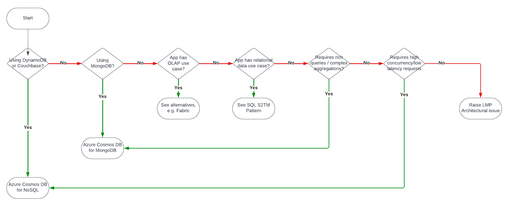

        

Document Metadata

|  |  |
|----|----|
| Identifier | **`LMP-PAT-0008`** |
| Type | **Technology Selection Pattern** |
| Status | **Published** |
| Approvals | LMP Migration Architecture Approval |
| Published on | **May 21, 2024** |
| Valid From | **May 21, 2024** |
| Authors |   |
| Tags | Database |
| Technology Capabilities | Platform / Data / Database / NoSQL DatabasePlatform / Data / Database / Unstructured Datastore |

# Document Databases<a href="#document-databases" class="headerlink" title="Permanent link">¶</a>

## Compatibility<a href="#compatibility" class="headerlink" title="Permanent link">¶</a>

This advice pertains to the choice of NoSQL database in Azure, particularly for migrations from AWS DynamoDB.

## Recommended Targets<a href="#recommended-targets" class="headerlink" title="Permanent link">¶</a>

- Azure Cosmos DB for NoSQL
- Azure Cosmos DB for MongoDB

## Decision Tree Diagram<a href="#decision-tree-diagram" class="headerlink" title="Permanent link">¶</a>

## Notable Differences - NoSQL & MongoDB<a href="#fn:3" class="footnote-ref">1</a><a href="#notable-differences-nosql-mongodb" class="headerlink" title="Permanent link">¶</a>

| Similarity | Consideration | DynamoDB | Cosmos DB for NoSQL | Cosmos DB for MongoDB |
|----|----|----|----|----|
| 🟢 | Data Model | Document (JSON) | Document (JSON) | Document (BSON) |
| 🟢 | Data Structure | Table:Item:Attribute | Database:Collection:Document:Field | Database:Collection:Document:Field |
| 🟡 | Query Language Support | SDKs | SQL, SDKs | MQL, SDKs |
| 🟢 | Transaction support | Yes | Yes | Yes |
| 🟢 | Data Migration | Export as Dynamo JSON or Ion | Java/.NET SDK<a href="#fn:8" class="footnote-ref">5</a>, Striim<a href="#fn:9" class="footnote-ref">6</a> | mongodump, mongorestore |
|  | Max size | Unlimited | 20 GB/partition, unlimited per container<a href="#fn:6" class="footnote-ref">7</a> | 20 GB/partition, unlimited per container<a href="#fn:6" class="footnote-ref">7</a> |
| 🟡 | Scaling | Read Units, Compute Units | Provisioned or Serverless, see below | Request Units or vCore, see below |
|  | Pricing model | By storage, write rate, read rate | See tables, below | See tables, below |
| 🟢 | SLA | e.g. Standard Tables 10% credit at \< 99.99%, \> 99.0%<a href="#fn:6" class="footnote-ref">7</a> | e.g. 10% credit at \< 99.99%<a href="#fn:7" class="footnote-ref">8</a> | e.g. 10% credit at \< 99.99%<a href="#fn:7" class="footnote-ref">8</a> |
|  | Community | 500+ Stack Overflow results | 230+ Stack Overflow results | 500+ Stack Overflow results |
|  | DR/High Availability | Availability Zones | Global distribution | Global distribution |
| 🟡 | Consistency Model | Eventual or Strong | Eventual, Consistent Prefix, Session, Bounded Staleness, Strong<a href="#fn:4" class="footnote-ref">9</a> | Mapping of 3 Cosmos levels to Mongo Read and Write concerns<a href="#fn:5" class="footnote-ref">10</a> |

## Notable Differences - NoSQL Provisioned & Serverless<a href="#fn:11" class="footnote-ref">2</a><a href="#notable-differences-nosql-provisioned-serverless" class="headerlink" title="Permanent link">¶</a>

| Similarity | Consideration | Provisioned | Serverless |
|----|----|----|----|
| 🟢 | Query Suitability | All database operations | All database operations |
| 🟡 | Availability | Global | Regional |
| 🟡 | Provisioning | Configured | Automatic |
| 🟡 | Storage<a href="#fn:1" class="footnote-ref">11</a> | Unlimited | \<= 1 TB |
| 🟢 | Latency | \< 10ms point read/writes | \< 10 ms point reads; \< 30 ms point writes |
| 🟡 | Pricing | Per *provisioned* RU/hour | Per *consumed* RU/hour |

### Notable Differences - MongoDB RU & vCore<a href="#fn:13" class="footnote-ref">3</a><a href="#notable-differences-mongodb-ru-vcore" class="headerlink" title="Permanent link">¶</a>

| Similarity | Consideration | Azure Cosmos DB for MongoDB (RU) | Azure Cosmos DB for MongoDB (vCore) |
|----|----|----|----|
| 🟡 | Query Suitability | Mostly point reads | Mostly long-running, complex queries |
| 🟡 | Scaling model | Horizontal, instantaneous | Horizontal and vertical |
| 🟡 | Availability | 99.999% | 99.995% |
| 🔴 | Vector support | N/A | Yes |
| 🟡 | Provisioning | Multi-tenant | Dedicated |
| 🟡 | Pricing | By no. RUs, storage | By CPU, memory, nodes, storage |

## Considerations<a href="#considerations" class="headerlink" title="Permanent link">¶</a>

- For applications that require a NoSQL store, but are not migrating from an existing technology, consider Cosmos DB for NoSQL. According to the documentation: *It offers the best end-to-end experience as we have full control over the interface, service, and the SDK client libraries. Any new feature that is rolled out to Azure Cosmos DB is first available on API for NoSQL accounts*
- The best target in Azure is Cosmosdb. Now Cosmosdb comes with different inbuilt supported APIs for different sources. - NoSQL API: This is native to Azure Cosmos DB and stores data in document format. - MongoDB API: This API implements the wire protocol of MongoDB, an open-source document-oriented database. - PostgreSQL API: This API implements the wire protocol of PostgreSQL, an open-source relational database. - Cassandra API: This API implements the wire protocol of Cassandra, an open-source wide column store. - Gremlin API: This API implements the wire protocol of Gremlin, an open-source graph database. - Table API: This API implements the wire protocol of Azure Table Storage, a service that stores structured NoSQL data.

## Alternatives<a href="#alternatives" class="headerlink" title="Permanent link">¶</a>

- [Mongo Atlas](https://www.mongodb.com/products/platform/atlas-database)<a href="#fn:2" class="footnote-ref">4</a>
- [Apache Cassandra on Azure](https://learn.microsoft.com/en-gb/azure/cosmos-db/cassandra/choose-service)

## References<a href="#references" class="headerlink" title="Permanent link">¶</a>

------------------------------------------------------------------------

1.  

    [Migrate your application from Amazon DynamoDB to Azure Cosmos DB](https://learn.microsoft.com/en-us/azure/cosmos-db/nosql/dynamo-to-cosmos) <a href="#fnref:3" class="footnote-backref" title="Jump back to footnote 1 in the text">↩︎</a>

    

2.  

    [How to choose between provisioned throughput and serverless](https://learn.microsoft.com/en-us/azure/cosmos-db/throughput-serverless) <a href="#fnref:11" class="footnote-backref" title="Jump back to footnote 2 in the text">↩︎</a>

    

3.  

    [What is RU-based and vCore-based Azure Cosmos DB for MongoDB?](https://learn.microsoft.com/en-us/azure/cosmos-db/mongodb/choose-model) <a href="#fnref:13" class="footnote-backref" title="Jump back to footnote 3 in the text">↩︎</a>

    

4.  

    [Azure Cosmos DB for MongoDB vs MongoDB Atlas](https://learn.microsoft.com/en-us/azure/cosmos-db/mongodb/cosmos-db-vs-mongodb-atlas) <a href="#fnref:2" class="footnote-backref" title="Jump back to footnote 4 in the text">↩︎</a>

    

5.  

    [Cosmos DB Bulk Ingestion Library](https://github.com/Azure-Samples/azure-cosmosdb-bulkingestion) <a href="#fnref:8" class="footnote-backref" title="Jump back to footnote 5 in the text">↩︎</a>

    

6.  

    [Migrate data to Azure Cosmos DB for NoSQL account using Striim](https://learn.microsoft.com/en-us/azure/cosmos-db/nosql/migrate-data-striim) <a href="#fnref:9" class="footnote-backref" title="Jump back to footnote 6 in the text">↩︎</a>

    

7.  

    [Amazon DynamoDB Service Level Agreement](https://aws.amazon.com/dynamodb/sla/) <a href="#fnref:6" class="footnote-backref" title="Jump back to footnote 7 in the text">↩︎</a><a href="#fnref2:6" class="footnote-backref" title="Jump back to footnote 7 in the text">↩︎</a><a href="#fnref3:6" class="footnote-backref" title="Jump back to footnote 7 in the text">↩︎</a>

    

8.  

    [Microsoft SLAs for Online Services](https://www.microsoft.com/licensing/docs/view/Service-Level-Agreements-SLA-for-Online-Services?lang=1) <a href="#fnref:7" class="footnote-backref" title="Jump back to footnote 8 in the text">↩︎</a><a href="#fnref2:7" class="footnote-backref" title="Jump back to footnote 8 in the text">↩︎</a>

    

9.  

    [Consistency levels in Azure Cosmos DB](https://learn.microsoft.com/en-us/azure/cosmos-db/consistency-levels) <a href="#fnref:4" class="footnote-backref" title="Jump back to footnote 9 in the text">↩︎</a>

    

10. 

    [Consistency levels for Azure Cosmos DB and the API for MongoDB](https://learn.microsoft.com/en-us/azure/cosmos-db/mongodb/consistency-mapping) <a href="#fnref:5" class="footnote-backref" title="Jump back to footnote 10 in the text">↩︎</a>

    

11. 

    [Azure Cosmos DB Limits](https://learn.microsoft.com/en-us/azure/cosmos-db/concepts-limits) <a href="#fnref:1" class="footnote-backref" title="Jump back to footnote 11 in the text">↩︎</a>

    

    May 30, 2025      July 3, 2024 

 Previous 

Full-Text Document Indexing and Search

 Next 

Graph Databases

Made with <a href="https://squidfunk.github.io/mkdocs-material/" target="_blank" rel="noopener">Material for MkDocs</a>

