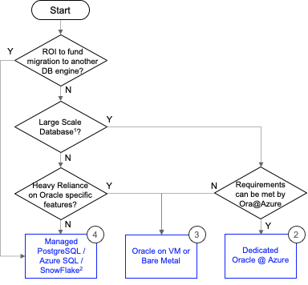

        

Document Metadata

|  |  |
|----|----|
| Identifier | **`LMP-PAT-0010`** |
| Type | **Technology Selection Pattern** |
| Status | **Published** |
| Approvals | LMP Migration Architecture Approval |
| Published on | **June 03, 2024** |
| Valid From | **June 03, 2024** |
| Authors |   |
| Tags | Database |
| Technology Capabilities | Platform / Data / Database / Relational (SQL) Database |

# Use of Oracle on Cloud<a href="#use-of-oracle-on-cloud" class="headerlink" title="Permanent link">¶</a>

## Compatibility<a href="#compatibility" class="headerlink" title="Permanent link">¶</a>

This pattern summarises the decisions outlined by *Database Strategy Update: Update to Oracle Guidance*<a href="#fn:1" class="footnote-ref">1</a>:

> "While transitioning from Oracle is technically desirable, it is becoming clear that one-size “like for like” migration to alternative database engines is not an effective approach. If we can reduce commercial complexity and cost of migrating and running Oracle in public cloud, we should not eliminate the option of migrating Oracle to Cloud"

## Recommended Target<a href="#recommended-target" class="headerlink" title="Permanent link">¶</a>

- Multi-tenant Oracle@Azure
- Dedicated Oracle@Azure
- Oracle on VMs or bare metal

## Decision Tree Diagram<a href="#decision-tree-diagram" class="headerlink" title="Permanent link">¶</a>

## Considerations<a href="#considerations" class="headerlink" title="Permanent link">¶</a>

- For Oracle Database@Azure, the minimum purchase is a ‘Quarter Rack’. Requirements are gathered by Oracle and passed on to Microsoft for provisioning. The ability to expand the infrastructure horizontally and vertically (storage, compute, extra rack, etc.) when required is quick but not immediate (hours) and requires a discussion with Oracle to provision. In that sense, this is not a ‘true PaaS’, but it is close enough.
- Multi-tenant instances would therefore be more cost-effective, but opportunities to share are limited by regional availability (at the time of writing, East US, Germany West Central, UK South, France Central, with other regions " coming soon")<a href="#fn:2" class="footnote-ref">2</a>
- Unless the workload will be decommissioned before 30 Apr 2026, it should be upgraded to Oracle 23c to maintain long term support and avoid extended support charges

## Alternatives<a href="#alternatives" class="headerlink" title="Permanent link">¶</a>

- For non-Oracle databases, see [Azure Database Selection](../0005-relational-databases/)
- In situations where Database@Azure is unavailable or unsuitable, consider the following:

------------------------------------------------------------------------

1.  

    [Database Strategy: Update to Oracle Guidance](https://lsegroup.sharepoint.com/:w:/r/teams/TechnologyStrategy-Private/Shared%20Documents/Private/2024/Oracle%20Strategy/Q1%202024%20Database%20Strategy%20Update%20-%20v0.6.docx?d=wce03b502f7784d0fba545bc29d9bcc57&csf=1&web=1&e=eLvRf1&isSPOFile=1) <a href="#fnref:1" class="footnote-backref" title="Jump back to footnote 1 in the text">↩︎</a>

    

2.  

    [Oracle Database@Azure](https://www.oracle.com/cloud/azure/oracle-database-at-azure/) <a href="#fnref:2" class="footnote-backref" title="Jump back to footnote 2 in the text">↩︎</a>

    

    May 30, 2025      June 18, 2024 

 Previous 

Graph Databases

 Next 

Azure Database for PostgreSQL Service Pattern

Made with <a href="https://squidfunk.github.io/mkdocs-material/" target="_blank" rel="noopener">Material for MkDocs</a>

