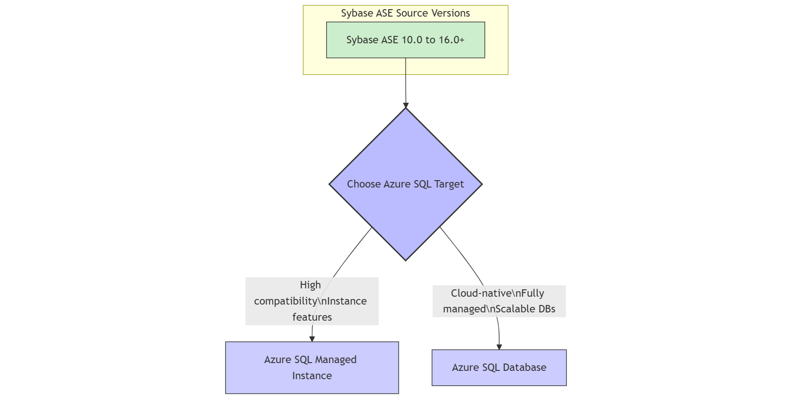

 ![](data:image/svg+xml;base64,PHN2ZyB4bWxucz0iaHR0cDovL3d3dy53My5vcmcvMjAwMC9zdmciIHZpZXdib3g9IjAgMCA1MTIgNTEyIj48IS0tISBGb250IEF3ZXNvbWUgRnJlZSA3LjAuMCBieSBAZm9udGF3ZXNvbWUgLSBodHRwczovL2ZvbnRhd2Vzb21lLmNvbSBMaWNlbnNlIC0gaHR0cHM6Ly9mb250YXdlc29tZS5jb20vbGljZW5zZS9mcmVlIChJY29uczogQ0MgQlkgNC4wLCBGb250czogU0lMIE9GTCAxLjEsIENvZGU6IE1JVCBMaWNlbnNlKSBDb3B5cmlnaHQgMjAyNSBGb250aWNvbnMsIEluYy4tLT48cGF0aCBmaWxsPSJjdXJyZW50Q29sb3IiIGQ9Im05OS4zIDI1Ni4xIDY5LjQtMTE5LjljLTUuNi0xMi4yLTguOC0yNS44LTguOC00MC4yIDAtNTMgNDMtOTYgOTYtOTZzOTYgNDMgOTYgOTZjMCAxNC4zLTMuMSAyNy45LTguOCA0MC4ybDQ0LjQgNzYuN2MtMjMuMSAyNi01My43IDQ1LjEtODguNCA1My44TDI1NiAxOTEuOWwtNjguMSAxMTcuNmMyMS41IDYuOCA0NC4zIDEwLjUgNjguMSAxMC41IDcwLjcgMCAxMzMuOC0zMi43IDE3NC45LTg0IDExLjEtMTMuOCAzMS4yLTE2IDQ1LTVzMTYgMzEuMiA1IDQ1QzQyOC4yIDM0MS44IDM0NyAzODQgMjU2LjEgMzg0Yy0zNS40IDAtNjkuNC02LjQtMTAwLjctMTguMWwtNTYuNyA5Ny44Yy00LjcgOC4xLTExLjcgMTQuNy0yMC4xIDE4LjlsLTU1LjQgMjcuN2MtNSAyLjUtMTAuOSAyLjItMTUuNi0uN1MwIDUwMS41IDAgNDk2di01NS40YzAtOC40IDIuMi0xNi43IDYuNS0yNC4xbDYwLTEwMy43Yy0xMi44LTExLjItMjQuNi0yMy41LTM1LjMtMzYuOC0xMS4xLTEzLjgtOC44LTMzLjkgNS00NXMzMy45LTguOCA0NSA1YzUuNyA3LjEgMTEuOCAxMy44IDE4LjIgMjAuMXptMjgxLjggMTUxLjhjMzIuNS0xMyA2Mi40LTMxIDg4LjktNTIuOWwzNS42IDYxLjVjNC4yIDcuMyA2LjUgMTUuNiA2LjUgMjQuMVY0OTZjMCA1LjUtMi45IDEwLjctNy42IDEzLjZzLTEwLjYgMy4yLTE1LjYuN2wtNTUuNC0yNy43Yy04LjQtNC4yLTE1LjQtMTAuOC0yMC4xLTE4Ljl6TTI1NiAxMjhhMzIgMzIgMCAxIDAgMC02NCAzMiAzMiAwIDEgMCAwIDY0IiAvPjwvc3ZnPg==)    

Document Metadata

|  |  |
|----|----|
| Identifier | **`LMP-PAT-0077`** |
| Type | **Technology Selection Pattern** |
| Status | **Draft** |
| Published on | **February 26, 2026** |
| Authors |   |
| Tags | Database |
| Technology Capabilities | Platform / Data / Database / Relational (SQL) Database |

# Azure Relational Database Selection<a href="#azure-relational-database-selection" class="headerlink" title="Permanent link">¶</a>

## Compatibility<a href="#compatibility" class="headerlink" title="Permanent link">¶</a>

This advice pertains to the choice of relational database target in Azure, driven by agreements between D&A Engineering architecture, LMP architecture, CPE architecture, LSEG Procurement and Cyber Security.

## Recommended Target<a href="#recommended-target" class="headerlink" title="Permanent link">¶</a>

| Technology | Status | ITC |
|----|----|----|
| Azure Database for PostgreSQL | Adopt | [ITC-90989](https://lseg.leanix.net/lsegprod/factsheet/ITComponent/f0072bff-154a-4b92-8ea5-00edc8b3f2c2) |
| Azure Database for MySQL | Adopt | [ITC-91621](https://lseg.leanix.net/lsegprod/factsheet/ITComponent/3dbb873b-cfbb-4106-9a9f-56f3c6d9fefd) |
| Azure SQL Database | Hold | [ITC-90996](https://lseg.leanix.net/lsegprod/factsheet/ITComponent/b72f9a6e-e50d-4feb-bd42-00546dfdc85d) |
| Azure SQL Managed Instance | Hold | [ITC-91624](https://lseg.leanix.net/lsegprod/factsheet/ITComponent/1a83b850-73f4-4438-adeb-d6201230ec6d) |
| Oracle options | Hold | [oracle](../0010-oracle/) |

Azure Database for PostgreSQL and Azure Database for MySQL are recommended targets for greenfield application builds due to portability, and migrations with higher R-types (Re-factor, Re-architect). Azure SQL Database and Azure SQL Managed Instance are acceptable targets for migrations, especially lower R-types (Re-host, Re-platform). For Oracle options, see separate Technology Selection Pattern for Oracle, but note these are not acceptable for greenfield application builds.

## Decision Tree Diagram<a href="#decision-tree-diagram" class="headerlink" title="Permanent link">¶</a>

As a starting point, review the *Selecting an Azure Data Store* decision tree in the [public Azure documentation](https://learn.microsoft.com/en-us/azure/architecture/guide/technology-choices/data-store-decision-tree). It helps delineate what is available in Azure for relational, semi-structured, time-series, graph and binary data, etc. It is deliberately not republished here since it is likely to change more frequently than this pattern.

Combine the advice from that decision tree with the advice given in [Data Platform Migration Approach](https://dev.azure.com/LSEGroup/Migration/_wiki/wikis/Migration.wiki/217/Data-Platform-Migration-Approach-Technical-). Within, there is guidance for migrations for multiple scenarios including SQL Server to SQL Managed Instances, Maria DB to Azure DB, etc. With each, detailed guidance covers seeding, synchronization, cutover, etc.

## Sybase (SAP ASE) Migration Recommendation<a href="#sybase-sap-ase-migration-recommendation" class="headerlink" title="Permanent link">¶</a>

With SAP's announcement of the end of mainstream maintenance for SAP ASE by 2025, all Sybase (SAP ASE) databases should be migrated to Azure-native relational database services. The recommended targets are:

- **Azure SQL Database**
- **Azure SQL Managed Instance**

This migration ensures continued support, enhanced scalability, and access to modern cloud capabilities. Migrating to Azure SQL services is the expected direction for all Sybase workloads.

For detailed migration steps and considerations, refer to the [Sybase Migration Guidance](https://dev.azure.com/LSEGroup/Migration/_wiki/wikis/Migration.wiki/239/Sybase-Migration).

## Considerations<a href="#considerations" class="headerlink" title="Permanent link">¶</a>

- **Alternative Technology**: The general strategy for relational databases is to prefer portable technologies over Azure-native, for greenfield builds or for major re-architectures. Azure-native is acceptable for migrations, and specifically when addressing Sybase. If alternatives are needed for specific architectural challenges, they will be treated as exceptional. As and when exceptions crop up, and where merited, they will be added to this pattern.

## Further Reading<a href="#further-reading" class="headerlink" title="Permanent link">¶</a>

- [Database Strategy](https://lsegroup.sharepoint.com/:w:/r/teams/TechnologyStrategy-Private/Shared%20Documents/Private/2024/Oracle%20Strategy/Q1%202024%20Database%20Strategy%20Update%20-%20v0.6.docx?d=wce03b502f7784d0fba545bc29d9bcc57&csf=1&web=1&e=eLvRf1&isSPOFile=1)
- [Oracle Strategy - D&A Tech Decision Tree](https://lsegroup-my.sharepoint.com/:w:/g/personal/oli_bage_lseg_com/EUP-w7euY4ZIt1YvglQIL5wBTGQJPQT04WIUVtKa9xjOWQ?e=kM3v7d)

## Flowchart: Supported Sybase Versions to Azure SQL<a href="#flowchart-supported-sybase-versions-to-azure-sql" class="headerlink" title="Permanent link">¶</a>

This flowchart provides a concise visual representation of the Sybase ASE versions generally supported for migration to Azure SQL Database and Azure SQL Managed Instance.

    February 27, 2026      May 16, 2024 

 Previous 

Azure Relational Database Selection

 Next 

Custom VM Image for Application Service Pattern

Made with <a href="https://squidfunk.github.io/mkdocs-material/" target="_blank" rel="noopener">Material for MkDocs</a>

