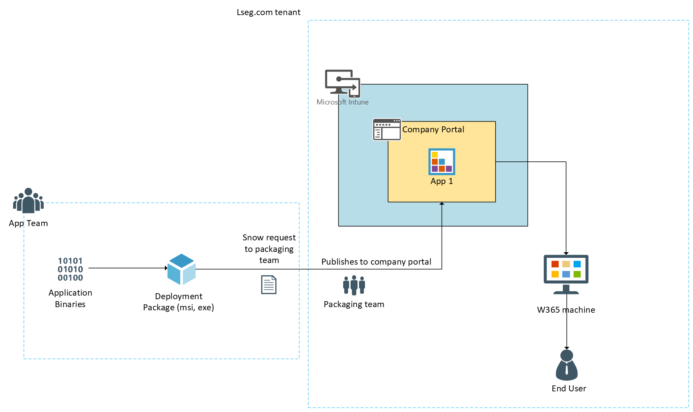

        

Document Metadata

|  |  |
|----|----|
| Identifier | **`LMP-PAT-0073`** |
| Type | **Technical Design Pattern** |
| Status | **Published** |
| Approvals | LMP Migration Architecture Approval |
| Governance Reference | **** |
| Pattern Source Repo |  |
| Published on | **September 17, 2025** |
| Valid From | **September 17, 2025** |
| Authors |   |
| Tags | Deployment & Administration |
| Technology Capabilities | Delivery / Operations / Deployment & Administration |

# Application deployment using Cloud PC W365 and Company Portal Pattern<a href="#application-deployment-using-cloud-pc-w365-and-company-portal-pattern" class="headerlink" title="Permanent link">¶</a>

## Introduction<a href="#introduction" class="headerlink" title="Permanent link">¶</a>

This pattern helps application teams migrating to Azure who relied on Remote Desktop Protocol (RDP) to consume the application from the terminal servers in on-premises to move over to the W365 Cloud PC with Intune company portal option for deploying the application.

### Context<a href="#context" class="headerlink" title="Permanent link">¶</a>

In the current on-premises environment, the end user accesses legacy desktop applications by remotely connecting (via RDP) to Windows Server “terminal servers” (remote desktops). This means users launch a RDP session from their laptops to a central server where the applications are installed. In the current target Azure architecture the same RDP approach is not an efficient / cost effective solution and since the machines are not domain joined it does not provide centralized authentication.

This would require a solution which suffices the application requirements and adhering to LSEG network and security standards.

## Scope<a href="#scope" class="headerlink" title="Permanent link">¶</a>

This pattern helps to work on designing the deployment architecture which includes Cloud PC W365 along with Intune company portal

## Use Cases<a href="#use-cases" class="headerlink" title="Permanent link">¶</a>

- This pattern currently focuses on-premises applications which are deployed on to terminal servers for RDP access.
- The desktop application currently on-premises which runs on windows.
- On-premise WPF desktop (Windows Presentation Foundation) applications.

## Architectural Design<a href="#architectural-design" class="headerlink" title="Permanent link">¶</a>

The pattern suggests to package the application under consideration using any of the suitable packaging options and deploy it to the company portal. End users can be provided with Windows 365 desktops (W365) which is in Azure and the application can be downloaded from the company portal. Users can then use the application from the W365 desktops. The end user will be connecting to the W365 cloud PC using their NWow laptops and from the cloud PC they will be accessing the applications using the company portal. The users should be added to the security groups in the Intune to manage the centralized access.

### Architectural Components<a href="#architectural-components" class="headerlink" title="Permanent link">¶</a>

#### Windows 365 Cloud PCs<a href="#windows-365-cloud-pcs" class="headerlink" title="Permanent link">¶</a>

Every end user is assigned a Windows 365 Cloud PC—an Azure‑hosted, persistent virtual desktop that provides a full Windows experience without the need for traditional on‑prem RDP. This delivers a secure, isolated environment and simplifies management through Azure AD–based identity and conditional access policies.

#### Application Packaging<a href="#application-packaging" class="headerlink" title="Permanent link">¶</a>

Legacy desktop applications are re‑packaged, for example using the MSIX packaging format. This ensures that application dependencies are isolated and the apps can be deployed and updated consistently.

#### Company Portal & Intune Management<a href="#company-portal-intune-management" class="headerlink" title="Permanent link">¶</a>

The Company Portal (the enterprise app store) acts as the secure distribution point, where packaged apps are made available. It is tightly integrated with Microsoft Intune, which handles app deployment, device management, and compliance enforcement. This ensures that only authorized users can access and update the applications while enforcing corporate security policies.

#### Security & Identity Integration<a href="#security-identity-integration" class="headerlink" title="Permanent link">¶</a>

Entra ID authenticates users and enforces conditional access controls (including MFA). This protects resources, ensures that only compliant devices can access apps, and guarantees a consistent user experience across Cloud PC and Company Portal interactions.

#### Workflow Summary<a href="#workflow-summary" class="headerlink" title="Permanent link">¶</a>

In production, the workflow will be:

1.  Application team packages the binaries and connect with Intune team for uploading it to company portal. This can be done by raising a [service now request](https://lseg.service-now.com/esc?id=sc_cat_item&table=sc_cat_item&sys_id=3394bed883e4c290e8c10478beaad391). [Packaging Team DL](mailto:BAU-Packaging-Team@lseg.com).
2.  IT provisions a Cloud PC for the end user via Intune.
3.  IT publishes the required app in Intune (making it available in Company Portal).
4.  The end user opens the Windows 365 client on their laptop and launches their Cloud PC (after Entra ID sign-in and MFA).
5.  On the Cloud PC’s Windows session, the end user opens Company Portal and gets the required desktop application pre-installed by policy.
6.  The application runs on the Cloud PC, but the end user interacts with it through their remote session from the laptop. Data can be saved on the Cloud PC or in cloud storage – nothing is running on the shared servers anymore, and nothing heavyweight is running on the local laptop either, aside from the remote session.

### Key Considerations<a href="#key-considerations" class="headerlink" title="Permanent link">¶</a>

#### Application Packaging & Compatibility<a href="#application-packaging-compatibility" class="headerlink" title="Permanent link">¶</a>

Ensure the legacy applications are fully tested as packaged apps. Validate that dependencies, registry settings, and configurations are adequately captured within the package.

#### Identity & Security<a href="#identity-security" class="headerlink" title="Permanent link">¶</a>

Enforce Entra ID authentication with conditional access, ensuring MFA is in place. Existing Intune policies to manage Cloud PCs, including rule sets should prevent unapproved network connections or data exfiltration.

#### User Experience<a href="#user-experience" class="headerlink" title="Permanent link">¶</a>

Validate that download and application launch times meet user expectations.

## Further Reading<a href="#further-reading" class="headerlink" title="Permanent link">¶</a>

[Application deployment in W365 recomended practices](https://techcommunity.microsoft.com/blog/windows-itpro-blog/application-deployment-in-windows-365-recommended-practices/3915376)

    December 17, 2025      September 16, 2025 

 Previous 

Custom VM Image for Application Service Pattern

 Next 

Patterns for Infra-as-Code and Code Rollback

Made with <a href="https://squidfunk.github.io/mkdocs-material/" target="_blank" rel="noopener">Material for MkDocs</a>

