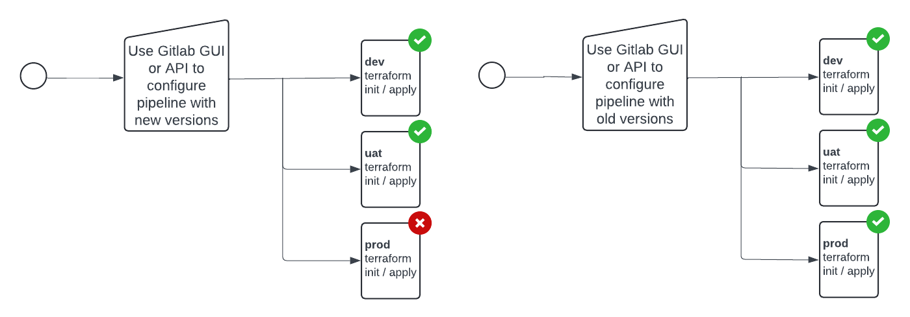

        

Document Metadata

|  |  |
|----|----|
| Identifier | **`LMP-PAT-0032`** |
| Type | **Functional Design Pattern** |
| Status | **Published** |
| Approvals | LMP Migration Architecture Approval |
| Published on | **May 17, 2024** |
| Valid From | **May 17, 2024** |
| Authors |   |
| Tags | Development Platform |
| Technology Capabilities | Delivery / Development / Design & Development / Development Tools & SDKsDelivery / Operations / Deployment & Administration |

# Patterns for Infra-as-Code and Code Rollback<a href="#patterns-for-infra-as-code-and-code-rollback" class="headerlink" title="Permanent link">¶</a>

## Anti-Pattern: "Fix Forward" rollback using single repo for both build & deployment<a href="#anti-pattern-fix-forward-rollback-using-single-repo-for-both-build-deployment" class="headerlink" title="Permanent link">¶</a>

Relevant to e.g. resource creation, resource configuration change or software package deployment

### Pros and Cons of the Anti-Pattern<a href="#pros-and-cons-of-the-anti-pattern" class="headerlink" title="Permanent link">¶</a>

- **Good**, because simple
- **Neutral**, because dependent on good commit message hygiene to keep team up-to-speed with what has happened and why, but commit messages should follow best practice anyway
- **Bad**, because does not provide an acceptable "rollback" procedure that can be included in Change Control requests (an operator cannot always be expected to perform such a rollback without deeper understanding of codebase, Git skills, etc.)
- **Bad**, because does not readily cater for resources with data (other than those that support e.g. soft delete)
- **Bad**, because difficult to rollback if commits have been made to the main branch since the release tag and before the release issue. Alternative approach is to use "release branches", but these, too, lead to a need to merge `release-*` back into main, which can introduce its own operational overhead

### Example using Tags<a href="#example-using-tags" class="headerlink" title="Permanent link">¶</a>

### Example using Release Branches<a href="#example-using-release-branches" class="headerlink" title="Permanent link">¶</a>

## Pattern 1: Build Versioned Artefacts, Deploy Separately<a href="#pattern-1-build-versioned-artefacts-deploy-separately" class="headerlink" title="Permanent link">¶</a>

Use one Project and pipeline to publish a versioned artefact (e.g. generic `.tar`, Terraform module registry, or OCI artifact registry). Use a second Project to configure and deploy the given artefact or collection of artifacts.

For Terraform, implementations include:

- \(1\) publishing a 'generic' Gitlab artefact (e.g. a .tar) and using a before_script to unpack before applying
- \(2\) using GitOps via the Flux Terraform Controller
- \(3\) publishing the Terraform project that is to be installed in multiple environments as a pseudo-module to a module registry

### Pros and Cons of Pattern 1<a href="#pros-and-cons-of-pattern-1" class="headerlink" title="Permanent link">¶</a>

- **Good**, because still simple
- **Good**, because separation of "build" and "release" concerns has nice properties (e.g. shorter pipeline duration, fewer stages, simpler RBAC, no need for optional 'manual' deployment stages)
- **Good**, because rollback procedure is easy to describe and follow ("revert version in this deployment manifest" or "use old version as variable in Gitlab GUI when running pipeline")
- **Bad**, because additional GitLab Projects to create and maintain

### Example of a 'Build' Project Pipeline<a href="#example-of-a-build-project-pipeline" class="headerlink" title="Permanent link">¶</a>

Separate config or manifest-only "deploy" Project (& Pipeline, if not using GitOps)

### Example 'Deploy' Project - Type A (Commit versions in manifest(s))<a href="#example-deploy-project-type-a-commit-versions-in-manifests" class="headerlink" title="Permanent link">¶</a>

Maintain deployment manifest, containing version numbers per environment, as file(s) in repo.

#### Pros and Cons of Example 1<a href="#pros-and-cons-of-example-1" class="headerlink" title="Permanent link">¶</a>

- **Good**, because development team can prepare a Merge Request, in Draft, ahead of a change window & validate pipelines, merge conflicts, etc.
- **Good**, because files in repository listing versions per component, per environment give easily "diff-able" comparison of what version is deployed where
- **Neutral**, because operator may need to become familiar with Gitlab merge request GUI and, on occasion, may need to troubleshoot a failed merge
- **Neutral**, because deployment pipelines are more complex if true artifacts are not used (e.g. cloning a code repo instead of deploying a package, Chart or module), but the latter is preferred for this reason and relatively simple to implement
- **Bad**, because harder to see history of pipelines or to get "current state" of what's deployed in which environment
- **Bad**, because operator needs to be familiar enough with Git and/or Gitlab to be able to revert a version number in a manifest in the event of failure

### Example 'Deploy' Project Type B (Run pipelines, entering version numbers at runtime)<a href="#example-deploy-project-type-b-run-pipelines-entering-version-numbers-at-runtime" class="headerlink" title="Permanent link">¶</a>

Instead of maintaining version numbers as committed files in the repository, use the Gitlab interface or API to handle versions at pipeline execution time.

#### Pros and Cons of Example 2<a href="#pros-and-cons-of-example-2" class="headerlink" title="Permanent link">¶</a>

- **Good**, because very simple for operator, removes need to understand and potentially troubleshoot a Merge Request issue
- **Bad**, because harder to see history of pipelines or to get "current state" of what's deployed in which environment

    May 30, 2025      October 11, 2024 

 Previous 

Application deployment using Cloud PC W365 and Company Portal Pattern

 Next 

Patterns for Managing Versions of Code & Configuration

Made with <a href="https://squidfunk.github.io/mkdocs-material/" target="_blank" rel="noopener">Material for MkDocs</a>

