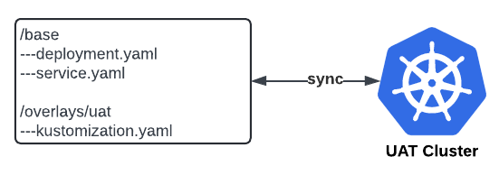

        

Document Metadata

|  |  |
|----|----|
| Identifier | **`LMP-PAT-0033`** |
| Type | **Functional Design Pattern** |
| Status | **Published** |
| Approvals | LMP Migration Architecture Approval |
| Published on | **May 17, 2024** |
| Valid From | **May 17, 2024** |
| Authors |   |
| Tags | Development Platform |
| Technology Capabilities | Delivery / Development / Design & Development / Development Tools & SDKsDelivery / Operations / Deployment & Administration |

# Patterns for Managing Versions of Code & Configuration<a href="#patterns-for-managing-versions-of-code-configuration" class="headerlink" title="Permanent link">¶</a>

## Pattern 1: Config/Code monorepo per Infra Layer<a href="#pattern-1-configcode-monorepo-per-infra-layer" class="headerlink" title="Permanent link">¶</a>

IaC (e.g. Terraform) and IaC config (e.g. `dev.tfvars`, `uat.tfvars`, `prod.tfvars`) in same repo.

### Pros and Cons of Pattern 1<a href="#pros-and-cons-of-pattern-1" class="headerlink" title="Permanent link">¶</a>

- **Good**, because it has simplicity; "everything in one place"
- **Bad**, because it is difficult if environments are widely different (e.g "v1" in prod, "v2" in dev) because code can become difficult to manage, e.g. requiring lots of conditionals
- **Bad**, because it becomes yet more difficult when there are more environments

## Pattern 2: Separate Code Repo & Config Repos<a href="#pattern-2-separate-code-repo-config-repos" class="headerlink" title="Permanent link">¶</a>

IaC in one repo, IaC config in separate repo

### Pros and Cons of Pattern 2<a href="#pros-and-cons-of-pattern-2" class="headerlink" title="Permanent link">¶</a>

- **Good**, because it is easier for an operator, potentially unfamiliar with a code repo, to understand and edit versions for release/rollback
- **Good**, because pipelines can be dedicated to config linting / validation, ignoring code, making them simpler and faster
- **Neutral**, because applications with lots of stacks, components or environments, config files may become numerous, and may need linting, but this is a good practice anyway
- **Neutral**, because may require third "version" number to represent combination of code and config, but this is not required in most cases
- **Bad**, because additional repositories to create and maintain
- **Bad**, because application code and config, kept separately, need stricter versioning (e.g. with semver) to keep aligned (e.g. v2x.x config with v2.x.x code)

### Example - Helm - Deploy via Pipeline - Single Config Repo with Values file per Environment<a href="#example-helm-deploy-via-pipeline-single-config-repo-with-values-file-per-environment" class="headerlink" title="Permanent link">¶</a>

To "deploy", operator could either approve and merge a Merge Request or run a pipeline via either GUI or API, specifying values.

#### Pros and Cons of Example 1<a href="#pros-and-cons-of-example-1" class="headerlink" title="Permanent link">¶</a>

- **Good**, because flat, complete values files easy to diff between environments
- **Neutral**, because requires solution to segregate duties (e.g. preventing developer deployments to production) e.g. CODEOWNERS or Gitlab Protected Environments
- **Bad**, because multiple pipelines to maintain

### Example - Helm - Deploy via Flux GitOps - Single Config Repo with Overlays per Environment<a href="#example-helm-deploy-via-flux-gitops-single-config-repo-with-overlays-per-environment" class="headerlink" title="Permanent link">¶</a>

To "deploy", operator could approve and merge a Merge Request, wait for synchronisation, then verify.

#### Pros and Cons of Example 2<a href="#pros-and-cons-of-example-2" class="headerlink" title="Permanent link">¶</a>

- **Good**, because no pipelines to build, maintain or control with RBAC
- **Good**, because State of repo naturally synchronised with state of cluster
- **Good**, because Available via AKS, used as the mechanism to deploy Foundation add-ons such as ingress-nginx
- **Neutral**, because less easy to diff between environments, but still possible by inspecting kustomization.yaml or by doing --dry-run and then diffing
- **Neutral**, because more difficult in a "git flow" type model (with multiple branches) than in a trunk based flow, but a trunk based flow is generally adequate for config with 'overlays' used instead to "override" config per environment
- **Bad**, because there is a learning curve: operators and developers may be more familiar with pipelines

    May 30, 2025      October 11, 2024 

 Previous 

Patterns for Infra-as-Code and Code Rollback

 Next 

Patterns for Managing Terraform Artefacts

Made with <a href="https://squidfunk.github.io/mkdocs-material/" target="_blank" rel="noopener">Material for MkDocs</a>

