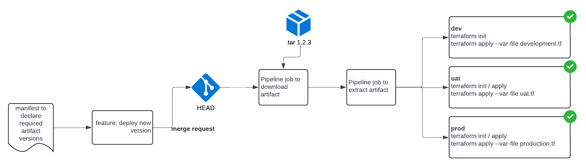

        

Document Metadata

|  |  |
|----|----|
| Identifier | **`LMP-PAT-0034`** |
| Type | **Functional Design Pattern** |
| Status | **Published** |
| Approvals | LMP Migration Architecture Approval |
| Published on | **May 17, 2024** |
| Valid From | **May 17, 2024** |
| Authors |   |
| Tags | Development Platform |
| Technology Capabilities | Delivery / Development / Design & Development / Development Tools & SDKsDelivery / Operations / Deployment & Administration |

# Patterns for Managing Terraform Artefacts<a href="#patterns-for-managing-terraform-artefacts" class="headerlink" title="Permanent link">¶</a>

A Terraform "stack" or "layer" is typically composed of Cloud Product Framework modules, Service Patterns and additional resources.

Stacks or Layers represent infrastructure with different lifecycles and/or blast radii.

Examples might be:

- **Foundational shared services**, e.g. an AKS cluster and Key Vault shared by many components
- **Fundamental services** with a larger or riskier blast radius, e.g. ingress controllers
- **Slow/large services** such as API Management (that may otherwise slow down a pipeline that is used frequently)
- **Component specific infrastructure**, e.g. services or secrets used by one component

Each layer should be represented by a different Gitlab project.

## Pattern - Use Terraform Modules to represent Infrastructure Layers<a href="#pattern-use-terraform-modules-to-represent-infrastructure-layers" class="headerlink" title="Permanent link">¶</a>

In this pattern, a Terraform module, representing the layer, is built and packaged by a "build" pipeline.

The module is then consumed and deployed by a separate project that also contains per-environment `*.tfvars` configuration.

Tags can be used to represent the deployment (the combination of versioned Terraform module and configuration). To rollback, the Gitlab pipeline can be executed for the desired "old" tag.

### Module Build<a href="#module-build" class="headerlink" title="Permanent link">¶</a>

### Module Deployment<a href="#module-deployment" class="headerlink" title="Permanent link">¶</a>

### Pros and Cons of the Terraform Module Pattern<a href="#pros-and-cons-of-the-terraform-module-pattern" class="headerlink" title="Permanent link">¶</a>

- **Good**, because we are packaging an artefact rather than depending on a mutable Git commit reference during deployment
- **Good**, because the packaged artefact can be directly consumed without needing to be cloned or un-tarred
- **Good**, because the packaged artefact has other convenience features provider by Terraform module registries such as usage examples and documentation
- **Neutral**, because whilst there need be no logic in the outermost Terraform module that is published to a registry, it still necessitates redeclaration of the variables, but this is easy to do
- **Bad**, because Terraform providers cannot be included in the published artefact and must instead be supplied by the consuming module, which must be provided separately, meaning the "outer" or "deploying" Terraform project (that consumes the given module) must declare providers, increasing complexity from "just config"

## Pattern - Use Generic Artefacts (e.g. `.tar`) to represent Infrastructure Layers<a href="#pattern-use-generic-artefacts-eg-tar-to-represent-infrastructure-layers" class="headerlink" title="Permanent link">¶</a>

In this pattern, the approach is similar, but the Terraform Module Registry is avoided in favour of a generic artefact type.

This approach should be favoured if a Terraform Module Registry is unavailable or if there is a strong preference for avoiding the redeclaration of Terraform variables (e.g. if the deployable artefact requires a *lot* of configuration).

### Pros and Cons of the `.tar` Pattern<a href="#pros-and-cons-of-the-tar-pattern" class="headerlink" title="Permanent link">¶</a>

- **Good**, because we are packaging an artefact rather than depending on a mutable Git commit reference during deployment
- **Good**, because the artifact can contain all files, including provider and version declarations
- **Neutral**, because the image used for the deployment job will depend on having `tar` or `zip` available, but for many build images this will already be the case
- **Bad**, because the deployment pipeline needs to download the artifact and extract it prior to calling terraform, adding complexity and execution time
- **Bad**, because a bespoke manifest must be developed, validated and maintained (instead of using native Terraform syntax)

    May 30, 2025      October 11, 2024 

 Previous 

Patterns for Managing Versions of Code & Configuration

 Next 

Patterns for Managing Segregation of Duties via Gitlab

Made with <a href="https://squidfunk.github.io/mkdocs-material/" target="_blank" rel="noopener">Material for MkDocs</a>

