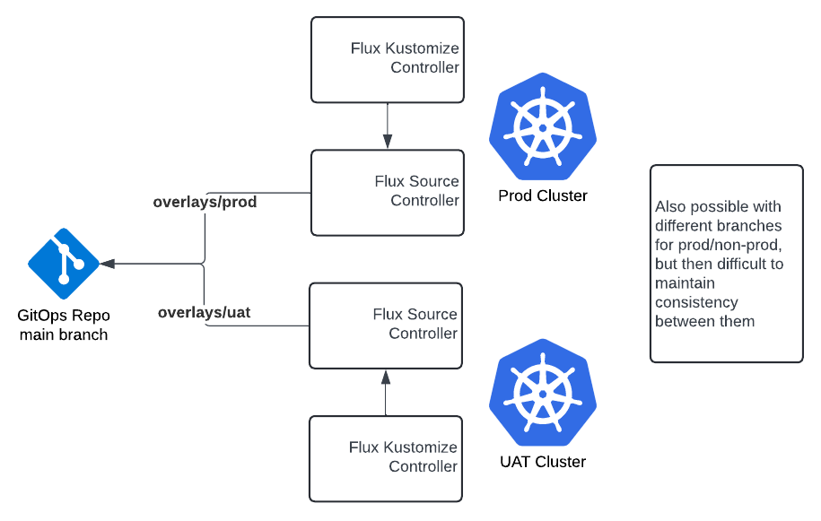

    

Document Metadata

|  |  |
|----|----|
| Identifier | **`LMP-PAT-0035`** |
| Type | **Functional Design Pattern** |
| Status | **Superseded** |
| Approvals | LMP Migration Architecture Approval |
| Published on | **May 20, 2024** |
| Valid From | **May 20, 2024** |
| Valid To | **May 30, 2025** |
| Superseded By | **[LMP-PAT-0065](https://app.pages.dx1.lseg.com/app-51723/migration-patterns/mig-pat-source-to-target/LMP-PAT-0065)** |
| Authors |   |
| Tags | Development Platform |
| Technology Capabilities | Delivery / Development / Design & Development / Development Tools & SDKsDelivery / Operations / Deployment & Administration |

# Patterns for Managing Segregation of Duties via Gitlab<a href="#patterns-for-managing-segregation-of-duties-via-gitlab" class="headerlink" title="Permanent link">¶</a>

In many LMP environments there will be a requirement to segregate the permissions of:

- **"Developers"** - who write code (and infrastructure-as-code), run tests and build packages
- **"Operators"** - who take code packages, deploy them and operate them

Such approaches have their origin in ITIL, ISO 27001, Sarbanes-Oxley, PCI-DSS and other regulations; they are common practice across the Financial Services industry.

## Pattern - Using Gitlab Protected Environments<a href="#pattern-using-gitlab-protected-environments" class="headerlink" title="Permanent link">¶</a>

To achieve natively in Gitlab, use GitLab's [Protected Environments](https://docs.gitlab.com/ee/ci/environments/protected_environments.html) feature.

It allows us to create "approver" and "deployer" rules, preventing deployers from deploying until approvers have approved.

To set it up, we do the following:

- Configure Gitlab *Groups* for (1) approvers and (2) deployers
- Invite the new Groups to your project via **Manage \> Members \> Invite a Group**

> **Note**: **if the "Invite a Group" button is missing,** make sure to uncheck *Projects in "group name" cannot be shared with other groups* in Settings \> General \> Permissions and group features.

- Configure Gitlab *Environments* that model your software's environments, e.g. `production`, `uat` and `development`. See **Operate \> Environments** in Gitlab
- Configure *Protected Environments* (see **Settings \> CI/CD \> Protected Environments**), assigning the approver and deployer groups created above
- Configure an `environment` in the Gitlab Jobs<a href="#fn:1" class="footnote-ref">1</a> that need protection, e.g.:

<table class="highlighttable">
<colgroup>
<col style="width: 50%" />
<col style="width: 50%" />
</colgroup>
<tbody>
<tr>
<td class="linenos">

<pre><code> 1
 2
 3
 4
 5
 6
 7
 8
 9
10</code></pre>

</td>
<td class="code">

<pre><code>stages:
  - deploy
&#10;production:
  stage: deploy
  script:
    - &#39;echo &quot;Deploying to ${CI_ENVIRONMENT_NAME}&quot;&#39;
  environment:
    name: ${CI_JOB_NAME}
    action: start</code></pre>

</td>
</tr>
</tbody>
</table>

Now, when a pipeline runs, manual approval will be required (to be granted in **Operate \> Environments**) prior to deployment being permitted.

### Pros and Cons of Protected Environments<a href="#pros-and-cons-of-protected-environments" class="headerlink" title="Permanent link">¶</a>

- **Good**, because it is native to Gitlab and simple to configure
- **Neutral**, because there have been reports of problems with the "Invite a Group" button being missing, but this seems to be controlled by the '*Projects in "group name" cannot be shared with other groups*' setting
- **Neutral**, because control is Gitlab native, requiring operators to be familiar with Gitlab, but this is the Group's strategic CI/CD tooling
- **Neutral**, because there are additional Gitlab groups to which users must be added, but this will be required by any alternative solution too
- **Neutral**, because a developer could in theory edit a pipeline to remove the `environment`, removing approval, but if this is a concern, then `.gitlab-ci.yml` can be referenced in a different project

## Pattern - Using Flux, GitOps & Codeowners files<a href="#pattern-using-flux-gitops-codeowners-files" class="headerlink" title="Permanent link">¶</a>

In this pattern, Flux GitOps is used to synchronise the contents of a GitOps repository, for example one containing a collection of manifests, with a Kubernetes namespace.

To separate environments:

- A "base" directory contains manifests representative of all environments, but
- "Overlay" directories (e.g. `overlays/uat` and `overlays/prod`) contain files representing environment specific differences, typically expressed as `kustomize.yaml` files containing expressions that replace fragments of manifests in `base` with environment specifics, e.g. domain names, image names, etc.

To separate approval:

- Approvers can approve merge requests into the branch that is being synchronised. Gitlab Merge Request approvals rules can be set to require approval(s) from specific groups on specific branches
- If Merge Requests cannot be pre-prepared prior to a release, `CODEOWNERS` files can be used to limit the groups of users that can change production overlays

To separate deployment:

- This becomes unnecessary, because there is no longer a "deployment" stage or pipeline to run. Once the new code is in the synchronised branch, the Flux GitOps system will synchronise it, deploying it automatically

### Pros and Cons of the GitOps approach<a href="#pros-and-cons-of-the-gitops-approach" class="headerlink" title="Permanent link">¶</a>

- **Good**, because there are no deployment pipelines to build and maintain
- **Good**, because the status of the repository implicitly indicates the status of the given environment (unless there are issues with synchronizing a deployment)
- **Good**, because Kustomize is native to `kubectl` and it is easy to use `--dry-run` to investigate differences between environments
- **Neutral**, because rollback becomes a matter of reverting a merge or applying equal and opposite configuration changes, but some operator teams may not be sufficiently familiar with Git
- **Neutral**, because it requires AKS or Kubernetes, but many teams are using AKS and Flux is already used for some Foundation deployments
- **Bad**, because some scenarios (e.g. resource removal) can require manual intervention
- **Bad**, because there is an additional tool to learn (Flux, Kustomize) and the Kustomize documentation is imperfect for more advanced scenarios

## Anti-Pattern - Using a Separate Project for Deployments<a href="#anti-pattern-using-a-separate-project-for-deployments" class="headerlink" title="Permanent link">¶</a>

An alternative is to use a separate Gitlab project for deployments, controlling access via Gitlab RBAC. For example if a Developer were granted the `Guest` or `Reporter` roles, they would not be able to run a pipeline.

### Pros and Cons of a Separate Project<a href="#pros-and-cons-of-a-separate-project" class="headerlink" title="Permanent link">¶</a>

- **Neutral**, because it doesn't depend on Gitlab-specific features, but Gitlab is the Group's strategic CI/CD tooling
- **Bad**, because it requires an additional repository in addition to those representing code and config
- **Bad**, because although the 'Guest' and 'Reporter' roles would prevent a developer from running a pipeline, they would also restrict access to other features that require at least the Developer role<a href="#fn:2" class="footnote-ref">2</a> such as Merge Request reviews which may be useful in the context of release preparation.

## Further Reading<a href="#further-reading" class="headerlink" title="Permanent link">¶</a>

------------------------------------------------------------------------

1.  

    [Gitlab Deployment Approvals](https://docs.gitlab.com/ee/ci/environments/deployment_approvals.html) <a href="#fnref:1" class="footnote-backref" title="Jump back to footnote 1 in the text">↩︎</a>

    

2.  

    [Gitlab Permissions and roles](https://docs.gitlab.com/ee/user/permissions.html) <a href="#fnref:2" class="footnote-backref" title="Jump back to footnote 2 in the text">↩︎</a>

    

    October 29, 2025      October 11, 2024 

 Previous 

Patterns for Managing Terraform Artefacts

 Next 

Patterns for Managing Segregation of Duties via Gitlab

Made with <a href="https://squidfunk.github.io/mkdocs-material/" target="_blank" rel="noopener">Material for MkDocs</a>

