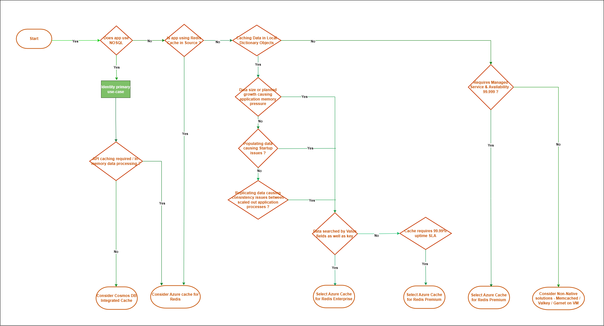

        

Document Metadata

|  |  |
|----|----|
| Identifier | **`LMP-PAT-0062`** |
| Type | **Technology Selection Pattern** |
| Status | **Published** |
| Approvals | LMP Migration Architecture Approval |
| Published on | **May 22, 2025** |
| Valid From | **February 28, 2025** |
| Authors |   |
| Tags | Distributed CacheDatabase |
| Technology Capabilities | Platform / Data / Distributed CachePlatform / Data / Database |

# Caching options in Azure<a href="#caching-options-in-azure" class="headerlink" title="Permanent link">¶</a>

## Compatibility<a href="#compatibility" class="headerlink" title="Permanent link">¶</a>

Apps migrating to Azure under LMP have a variety of use cases for cache.

Data Cache and stream processing are most common use-cases. This pattern covers both with some additional considerations.

It does not cover security use cases (e.g. SIEM).

## Recommended Target<a href="#recommended-target" class="headerlink" title="Permanent link">¶</a>

- For NOSQL database, with Read-heavy workloads, many repeated point reads on large items, many repeated high RU queries - [Azure Cosmos DB integrated cache](https://learn.microsoft.com/en-us/azure/cosmos-db/integrated-cache) is suitable
- For data cache - side cache for a relational database, stream processing/message broker, in-memory data processing( Organizing/searching/categorizing data), API caching; [Azure cache for Redis](https://learn.microsoft.com/en-us/azure/azure-cache-for-redis/cache-overview) is a managed service. The service is operated by Microsoft, hosted on Azure, and usable by any application within or outside of Azure
- For applications that cannot adopt above technologies, [Memcached](https://memcached.org/) is an open store option. It is available in either self-deployment or Azure marketplace offering, but - at the time of writing - work will be required to adopt the marketplace.

## Decision Tree Diagram<a href="#decision-tree-diagram" class="headerlink" title="Permanent link">¶</a>

## Notable Differences<a href="#notable-differences" class="headerlink" title="Permanent link">¶</a>

<table>
<colgroup>
<col style="width: 33%" />
<col style="width: 33%" />
<col style="width: 33%" />
</colgroup>
<thead>
<tr>
<th>Considerations</th>
<th>Azure Cache for Redis</th>
<th>Azure Cosmos DB</th>
</tr>
</thead>
<tbody>
<tr>
<td>Typical Use Case</td>
<td>In-memory datastore/cache- Cache, session store, message broker</td>
<td>Multi-model NoSQL Database with integrated cache - Primary database, session store</td>
</tr>
<tr>
<td>Client Experience</td>
<td>Nearly all (community maintained) including .NET, Java, Node, Python, Go, Rust, C, and PHP.</td>
<td>.NET, Java, Node, Python for SQL (core) API Community maintained SDKs for Cassandra and API for MongoDB</td>
</tr>
<tr>
<td>Data Models</td>
<td>Key-value, stream, time series*, JSON*</td>
<td>See Elastic Search (managed)</td>
</tr>
<tr>
<td>Scale-out</td>
<td><a href="https://learn.microsoft.com/en-us/azure/azure-cache-for-redis/cache-best-practices-scale">Yes, up to 10 shards</a></td>
<td>Yes, unlimited, instant elastic scalability</td>
</tr>
<tr>
<td>Throughput</td>
<td>1M+ simultaneous requests</td>
<td>Depends on the provisioned configuration</td>
</tr>
<tr>
<td>Data Integrity</td>
<td>Data stored in-memory. RDB and AOF data persistence limits potential data loss, but not perfectly.</td>
<td>Data Integrity - Data stored in-memory. RDB and AOF data persistence limits potential data loss, but not perfectly. - Data stored on disk. Lossless data store by design.</td>
</tr>
<tr>
<td>Consistency</td>
<td>Strong eventual consistency (SEC)</td>
<td>Strong, bounded staleness, session, consistent prefix, or eventual consistency</td>
</tr>
<tr>
<td>Key/Value Latency</td>
<td>~1ms or less</td>
<td>P99 under 10ms, P50 as low as 2-3ms</td>
</tr>
<tr>
<td>Pricing</td>
<td>Hourly</td>
<td>Provisioned Throughput- maximum provisioned throughput, database operations/Request Units (RUs) per second, for a given hour and consumed storage Serverless – billed by the Request Units (RUs) consumed by database operations and the storage consumed by data</td>
</tr>
<tr>
<td>Scaling</td>
<td>Based on the provisioned SKU</td>
<td>Provisioned throughput 
- Manual 
Autoscale 
- Serverles</td>
</tr>
<tr>
<td>Region availability</td>
<td><a href="https://learn.microsoft.com/en-us/azure/azure-cache-for-redis/cache-overview#availability-by-region">Available in all regions</a><a href="#fn:2" class="footnote-ref">2</a></td>
<td>Available in all regions</td>
</tr>
<tr>
<td>SLA</td>
<td><a href="https://learn.microsoft.com/en-us/azure/azure-cache-for-redis/cache-high-availability">Up to 99.999%</a><a href="#fn:1" class="footnote-ref">1</a></td>
<td>Up to 99.999%<a href="#fn:3" class="footnote-ref">3</a></td>
</tr>
</tbody>
</table>

## In-Memory Data Dictionary To Azure Redis Cache<a href="#in-memory-data-dictionary-to-azure-redis-cache" class="headerlink" title="Permanent link">¶</a>

| **Considerations** | **In-memory data dictionary** | **Redis Cache Premium on Azure** | **Redis Cache Enterprise/Flash on Azure** |
|----|----|----|----|
| Cost | n/a | By size |  |
| Availability | n/a | 99.9% | 99.99% (up to 99.999% with geo replication) |
| Memory | 2GB Maximum object size | up to 1.2TB | up to 13TB |
| Cache Coherence | Must be maintained by application logic | Single highly available cache ensures consistent view of cached data |  |
| Searchable by Data content | Yes, with LINQ | No | Yes, with Redis Search |
| Programming Model | Data Dictionary of application language | Redis client / RedisOM | Redis client / RedisOM |

## Considerations<a href="#considerations" class="headerlink" title="Permanent link">¶</a>

### Azure Cache for Redis<a href="#azure-cache-for-redis" class="headerlink" title="Permanent link">¶</a>

- Useful data types including Lists, Sets, Hashes, Sorted Sets, HyperLogLogs, Streams, and Geospatial
- Lua scripting
- Search functionality with [RediSearch](https://learn.microsoft.com/en-us/azure/azure-cache-for-redis/cache-overview-vector-similarity)<a href="#fn:1" class="footnote-ref">1</a>
- Bloom, Cuckoo, count-min sketch, and Top-K filters with [RedisBloom](https://learn.microsoft.com/en-us/azure/azure-cache-for-redis/cache-redis-modules)<a href="#fn:1" class="footnote-ref">1</a>
- Time series functionality with [RedisTimeSeries](https://learn.microsoft.com/en-us/azure/azure-cache-for-redis/cache-redis-modules)<a href="#fn:1" class="footnote-ref">1</a>
- Handle JSON formatted data – [RedisJSON](https://learn.microsoft.com/en-us/azure/azure-cache-for-redis/cache-redis-modules)<a href="#fn:1" class="footnote-ref">1</a>

### In-memory Data Dictionary to Azure Redis Cache<a href="#in-memory-data-dictionary-to-azure-redis-cache_1" class="headerlink" title="Permanent link">¶</a>

Redis cache is a highly scalable low-latency in-memory cache for Key,Value data provided as a service within Azure. An external Redis cache supports cloud-friendly application architecture in a number of ways:

- External Redis cache can be shared by a variable number of client processes allowing logic to be elastically scaled
- Single source of cached data eases data management as any data changes need only be made in a single place
- Redis caches are scalable up to terabyte scale, allowing cached data volume to grow without impacting application logic footprint
- Redis caches can be persistent, recovering quickly from infrastructure failures without needing to be repopulated from source systems
- Redis caches can be up to 99.999% available, minimising downtime
- Using a remote data cache imposes a requirement for external connectivity on application services, adding extra elements to their provisioning and observability needs.

### Azure Cosmos DB<a href="#azure-cosmos-db" class="headerlink" title="Permanent link">¶</a>

- Integrated cache that lowers database operations costs in SQL (core) API
- Single-digit latency SLA for reads and writes
- SQL, API for MongoDB, Gremlin, Cassandra, and Table APIs
- Azure Synapse Link for HTAP capability
- Automated global distribution

## Alternatives<a href="#alternatives" class="headerlink" title="Permanent link">¶</a>

- **Garnet**: [Garnet](https://microsoft.github.io/garnet/) is a remote cache store from Microsoft research, MIT licensed open source. The Garnet server is written in modern .NET C#, and runs efficiently on almost any platform. It works equally well on Windows and Linux. There is no compelling marketplace option.
- **Valkey**: [Valkey](https://valkey.io/) is an open source (BSD) high-performance key/value datastore. It supports a variety of workloads such as caching, message queues, and can act as a primary database. Valkey can run as either a standalone daemon or in a cluster, with options for replication and high availability.
- **Memcached**: [Memcached](https://memcached.org/) is an open source, high-performance, distributed memory object caching system, but intended for use in speeding up dynamic web applications by alleviating database load. Memcached is an in-memory key-value store for small chunks of arbitrary data (strings, objects) from results of database calls,API calls, or page rendering.

------------------------------------------------------------------------

1.  

    [Microsoft’s Azure cache for Redis documentation](https://learn.microsoft.com/en-us/azure/azure-cache-for-redis/cache-overview) <a href="#fnref:1" class="footnote-backref" title="Jump back to footnote 1 in the text">↩︎</a><a href="#fnref2:1" class="footnote-backref" title="Jump back to footnote 1 in the text">↩︎</a><a href="#fnref3:1" class="footnote-backref" title="Jump back to footnote 1 in the text">↩︎</a><a href="#fnref4:1" class="footnote-backref" title="Jump back to footnote 1 in the text">↩︎</a><a href="#fnref5:1" class="footnote-backref" title="Jump back to footnote 1 in the text">↩︎</a>

    

2.  

    [Microsoft’s RediSearch documentation](https://learn.microsoft.com/en-us/azure/azure-cache-for-redis/cache-redis-modules#redisearch) <a href="#fnref:2" class="footnote-backref" title="Jump back to footnote 2 in the text">↩︎</a>

    

3.  

    [Redis’ RedisOM documentation](https://redis.io/docs/latest/integrate/redisom-for-net/) <a href="#fnref:3" class="footnote-backref" title="Jump back to footnote 3 in the text">↩︎</a>

    

    October 29, 2025      August 1, 2024 

 Previous 

Azure Cache for Redis Service Pattern

 Next 

Observability (Functional Design Pattern)

Made with <a href="https://squidfunk.github.io/mkdocs-material/" target="_blank" rel="noopener">Material for MkDocs</a>

