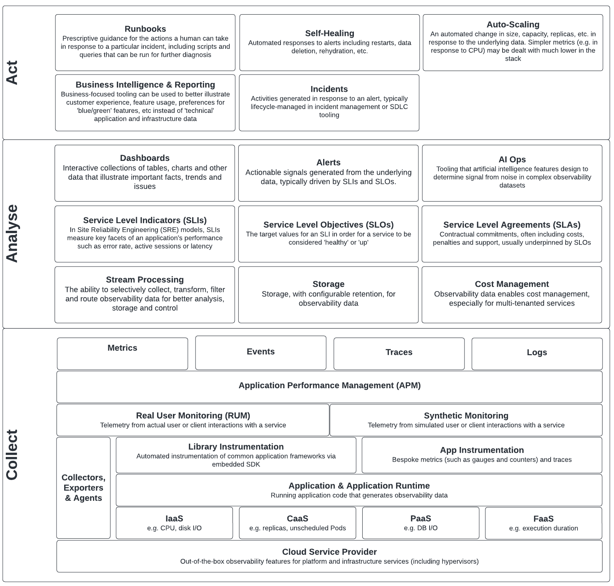

        

Document Metadata

|  |  |
|----|----|
| Identifier | **`LMP-PAT-0003`** |
| Type | **Functional Design Pattern** |
| Status | **Published** |
| Approvals | LMP Migration Architecture Approval |
| Published on | **March 15, 2024** |
| Valid From | **June 08, 2024** |
| Authors |   |
| Tags | Event ManagementApplication Support |
| Technology Capabilities | Delivery / Operations / Event ManagementDelivery / Operations / IT Service Management / Application Monitoring |

# Observability (Functional Design Pattern)<a href="#observability-functional-design-pattern" class="headerlink" title="Permanent link">¶</a>

## Introduction<a href="#introduction" class="headerlink" title="Permanent link">¶</a>

Observability is critical to a modern application. Without it, teams cannot gain insight into an application's performance, availability, reliability, cost or feature effectiveness.

The observability domain has evolved to match the capabilities offered by the cloud. New data sources, emerging vendor-agnostic protocols, advanced collection and analysis tools and the introduction of AI have led to a complex landscape.

The aim of this Functional Design Pattern is to demystify the observability stack without addressing specific tools.

## Scope<a href="#scope" class="headerlink" title="Permanent link">¶</a>

- Application and application infrastructure are in scope
- Security observability (such as threat detection, audit logging and Security Information Event Management) are out of scope (and worthy of a dedicated Functional Design Pattern)

## Use Cases<a href="#use-cases" class="headerlink" title="Permanent link">¶</a>

Use cases are broken down into three broad categories:

**Collect** - covering the the categories of data source from which we might collect telemetry (of different types) and how. This section of the diagram below can be considered as a hierarchy.

**Analyse** - where we take the collected data, route it, store it, enhance it and run analytics upon it

**Act** - where we automatically or manually take action. Some actions - such as auto-scaling - are can be easier to achieve than others. They may not depend on the full stack.

## Functional Requirements<a href="#functional-requirements" class="headerlink" title="Permanent link">¶</a>

## Further Reading<a href="#further-reading" class="headerlink" title="Permanent link">¶</a>

- [CTO: Observability Standard](https://lsegroup.sharepoint.com/:b:/r/sites/ats/Shared%20Documents/Standards/LSEG%20Standards/Infrastructure/Approved/Observability%20Standard%20(v1.0).pdf?csf=1&web=1&e=LrukiD)
- [CTO: Observability Logging Standard](https://lsegroup.sharepoint.com/:b:/r/sites/ats/Shared%20Documents/Standards/LSEG%20Standards/Application%20Development/Approved/Observability%20Logging%20Standard%20(v1.0).pdf?csf=1&web=1&e=HfLhOd)
- [Cloud Central: Cloud Monitoring & Observability](https://lsegroup.sharepoint.com/sites/CloudCentral/SitePages/Cloud-Monitoring-and-Observability.aspx)
- [External: the Google SRE Book](https://sre.google/workbook/table-of-contents/) contains great information on implementing and using SLOs

    May 30, 2025      March 15, 2024 

 Previous 

Caching options in Azure

 Next 

Datadog Integration for Azure Services (Technical Design Pattern)

Made with <a href="https://squidfunk.github.io/mkdocs-material/" target="_blank" rel="noopener">Material for MkDocs</a>

