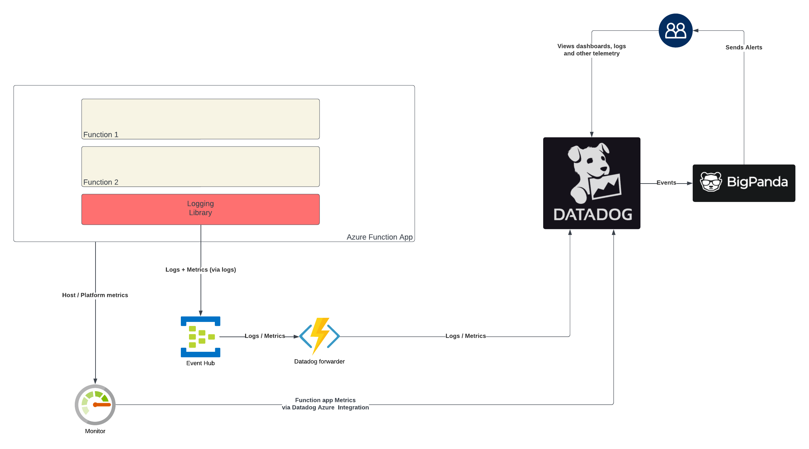

    

Document Metadata

|  |  |
|----|----|
| Identifier | **`LMP-PAT-0004`** |
| Type | **Technical Design Pattern** |
| Status | **Superseded** |
| Approvals | LMP Migration Architecture Approval |
| Governance Reference | **** |
| Pattern Source Repo |  |
| Published on | **April 09, 2024** |
| Valid From | **June 08, 2024** |
| Valid To | **January 29, 2026** |
| Superseded By | **[LMP-PAT-0079](https://app.pages.dx1.lseg.com/app-51723/migration-patterns/mig-pat-source-to-target/LMP-PAT-0079)** |
| Authors |   |
| Tags | Event ManagementApplication Support |
| Technology Capabilities | Delivery / Operations / Event ManagementDelivery / Operations / IT Service Management / Application Monitoring |

# Datadog Integration for Azure Services (Technical Design Pattern)<a href="#datadog-integration-for-azure-services-technical-design-pattern" class="headerlink" title="Permanent link">¶</a>

## Relevant ADRs<a href="#relevant-adrs" class="headerlink" title="Permanent link">¶</a>

- [LMP-ADR-0003: Use Datadog SaaS for Application & Resource monitoring in LMP Greenfield](../../../adrs/event-management/0003-use-datadog-for-application-and-resource-monitoring/)
- [LMP-ADR-0004: Choose OpenTelemetry for Application Telemetry over Proprietary Libraries](../../../adrs/event-management/0004-choose-open-telemetry-for-application-telemetry-over-proprietary-libraries/)

## Principles<a href="#principles" class="headerlink" title="Permanent link">¶</a>

- Datadog as a single sink for all application and infrastructure telemetry, to enable cross-application and service correlation
- BigPanda is automation and incident management platform that drives decisions on actions based on events received from Datadog. Actions include escalate to human, execute automated remediation script etc. Data should flow from Datadog through to BigPanda only if there's an event or alarm condition that requires either a manual or automated intervention.
- Applications not coupled to either Datadog or BigPanda, abstraction used to allow future architectural agility

## Virtual Machines<a href="#virtual-machines" class="headerlink" title="Permanent link">¶</a>

- Datadog agent running as a process on the VM, configured to scrape the system log / journald and any app-specific log file locations. Also configured to listen to OpenTelemetry Line Protocol (OTLP) messages over HTTP via a local TCP socket.
- Log events from application can flow either to system log (if emitted via stdout/stderr streams or console) or directly to one or more application-specific log files.
- Metrics and traces from the application flow to the Datadog agent via OTLP
- Datadog agent scrapes detailed metrics from the host
- Platform-based host metrics (coarse-grained) collected via Azure Monitor and the Datadog Azure integration

Further reading:

- [Datadog Agent configuration on bare-metal / VMs](https://docs.datadoghq.com/agent/configuration/agent-configuration-files/?tab=agentv6v7)
- [Microsoft Azure VM](https://docs.datadoghq.com/integrations/azure_vm/)

## Kubernetes<a href="#kubernetes" class="headerlink" title="Permanent link">¶</a>

- Datadog agent deployed as a Daemonset, with one pod per node, and configured to listen to OTLP events over HTTP
- Agent is configured to collect both node and container logs and forward
- Log events from application flow to the node via the container logs mechanism
- Metrics and traces from the application flow to the Datadog agent via OTLP
- Agent pulls cluster metrics from the kubernetes metrics server
- Agent pulls cluster details from the kubernetes API
- Platform-based host metrics (coarse-grained) collected via Azure Monitor and the Datadog Azure integration

Further reading:

- [Datadog Agent installation on Kubernetes](https://docs.datadoghq.com/containers/kubernetes/)
- [Monitoring Kubernetes performance metrics](https://www.datadoghq.com/blog/monitoring-kubernetes-performance-metrics/)

## Azure Container Applications (ACA)<a href="#azure-container-applications-aca" class="headerlink" title="Permanent link">¶</a>

- Datadog serverless-init wrapper process wraps the application process without the application needing to explicitly depend on Datadog libraries.
- Serverless-init receives and forwards logs from the application
- Serverless-init is also an agent process, so can receive metrics and trace events via OTLP
- Agent can pull platform detailed metrics and forward to Datadog

Further reading:

- [Azure Container Apps](https://docs.datadoghq.com/serverless/azure_container_apps/)

## Azure Functions<a href="#azure-functions" class="headerlink" title="Permanent link">¶</a>

- Logs and metrics collected from the Azure functions app and forwarded to an Azure Event Hub
- Datadog forwarder function app configured to read from eventhub and forward to Datadog
- Datadog can parse metrics from log lines using the "log-based metric" functionality
- Traces not natively supported

Further reading:

- [Datadog Generate Metrics from Ingested Logs](https://docs.datadoghq.com/logs/log_configuration/logs_to_metrics/)
- [Datadog Azure Functions Integration](https://docs.datadoghq.com/integrations/azure_functions/)

    May 11, 2026      May 1, 2024 

 Previous 

Observability (Functional Design Pattern)

 Next 

Application Immutable Audit Logging (Functional Design Pattern)

Made with <a href="https://squidfunk.github.io/mkdocs-material/" target="_blank" rel="noopener">Material for MkDocs</a>

