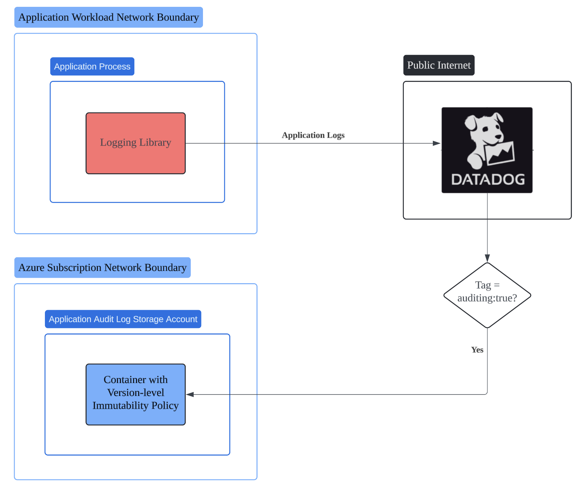

 ![](data:image/svg+xml;base64,PHN2ZyB4bWxucz0iaHR0cDovL3d3dy53My5vcmcvMjAwMC9zdmciIHZpZXdib3g9IjAgMCA1MTIgNTEyIj48IS0tISBGb250IEF3ZXNvbWUgRnJlZSA3LjAuMCBieSBAZm9udGF3ZXNvbWUgLSBodHRwczovL2ZvbnRhd2Vzb21lLmNvbSBMaWNlbnNlIC0gaHR0cHM6Ly9mb250YXdlc29tZS5jb20vbGljZW5zZS9mcmVlIChJY29uczogQ0MgQlkgNC4wLCBGb250czogU0lMIE9GTCAxLjEsIENvZGU6IE1JVCBMaWNlbnNlKSBDb3B5cmlnaHQgMjAyNSBGb250aWNvbnMsIEluYy4tLT48cGF0aCBmaWxsPSJjdXJyZW50Q29sb3IiIGQ9Im05OS4zIDI1Ni4xIDY5LjQtMTE5LjljLTUuNi0xMi4yLTguOC0yNS44LTguOC00MC4yIDAtNTMgNDMtOTYgOTYtOTZzOTYgNDMgOTYgOTZjMCAxNC4zLTMuMSAyNy45LTguOCA0MC4ybDQ0LjQgNzYuN2MtMjMuMSAyNi01My43IDQ1LjEtODguNCA1My44TDI1NiAxOTEuOWwtNjguMSAxMTcuNmMyMS41IDYuOCA0NC4zIDEwLjUgNjguMSAxMC41IDcwLjcgMCAxMzMuOC0zMi43IDE3NC45LTg0IDExLjEtMTMuOCAzMS4yLTE2IDQ1LTVzMTYgMzEuMiA1IDQ1QzQyOC4yIDM0MS44IDM0NyAzODQgMjU2LjEgMzg0Yy0zNS40IDAtNjkuNC02LjQtMTAwLjctMTguMWwtNTYuNyA5Ny44Yy00LjcgOC4xLTExLjcgMTQuNy0yMC4xIDE4LjlsLTU1LjQgMjcuN2MtNSAyLjUtMTAuOSAyLjItMTUuNi0uN1MwIDUwMS41IDAgNDk2di01NS40YzAtOC40IDIuMi0xNi43IDYuNS0yNC4xbDYwLTEwMy43Yy0xMi44LTExLjItMjQuNi0yMy41LTM1LjMtMzYuOC0xMS4xLTEzLjgtOC44LTMzLjkgNS00NXMzMy45LTguOCA0NSA1YzUuNyA3LjEgMTEuOCAxMy44IDE4LjIgMjAuMXptMjgxLjggMTUxLjhjMzIuNS0xMyA2Mi40LTMxIDg4LjktNTIuOWwzNS42IDYxLjVjNC4yIDcuMyA2LjUgMTUuNiA2LjUgMjQuMVY0OTZjMCA1LjUtMi45IDEwLjctNy42IDEzLjZzLTEwLjYgMy4yLTE1LjYuN2wtNTUuNC0yNy43Yy04LjQtNC4yLTE1LjQtMTAuOC0yMC4xLTE4Ljl6TTI1NiAxMjhhMzIgMzIgMCAxIDAgMC02NCAzMiAzMiAwIDEgMCAwIDY0IiAvPjwvc3ZnPg==)    

Document Metadata

|  |  |
|----|----|
| Identifier | **`LMP-PAT-0038`** |
| Type | **Functional Design Pattern** |
| Status | **Draft** |
| Published on | **September 18, 2024** |
| Authors |   |
| Tags | Event Management |
| Technology Capabilities | Delivery / Operations / Event ManagementDelivery / Operations / IT Service Management / Application Monitoring |

# Application Immutable Audit Logging (Functional Design Pattern)<a href="#application-immutable-audit-logging-functional-design-pattern" class="headerlink" title="Permanent link">¶</a>

## Context and Problem<a href="#context-and-problem" class="headerlink" title="Permanent link">¶</a>

In order to provide untampered evidence to auditors when required, there are regulations, business requirements, and LSEG policies which may require certain types of application log to be kept in immutable ways (aka WORM state - Write Once, Read Many), in addition to Observability and Monitoring requirements.

Logs, traces and metrics are known as the 3 pillars of Observability. Audit logs are a subset of the Logs pillar of Observability, and they can be generated from both infrastructure level and the application level, with the latter being more concerned with the events generated from end-user activities or application business logics and broadly split between those are required by SIEM (Security Information and Event Management) requirements, and those are not of SIEM concerns (e.g. business transaction history, change logs etc.). They should be sent to different log destinations according to relavant Guidelines, ADRs and Patterns: 

The aim of this pattern is to:

1.  Demistify the difference and potential overlaps among Observability, SIEM and Audit logging requirements.
2.  Provide a reusable reference architecture to help engineering teams design compliant and efficient solutions for immutable application logging, in addition to the technology choices outlined in existing Guidelines, ADRs and Patterns, including: 1. [LMP-ADR-0003: Use Datadog SaaS for Application & Resource monitoring](https://app.pages.dx1.lseg.com/app-51723/migration-patterns/mig-pat-source-to-target/adrs/event-management/0003-use-datadog-for-application-and-resource-monitoring/) 2. [LMP-ADR-0004: Choose OpenTelemetry for Application Telemetry over Proprietary Libraries](https://app.pages.dx1.lseg.com/app-51723/migration-patterns/mig-pat-source-to-target/adrs/event-management/0004-choose-open-telemetry-for-application-telemetry-over-proprietary-libraries/) 3. LMP-ADR-0011: Use Azure Immutable Storage for Application-level Audit Logging 4. [SP-0024: Security Logging - Applications Log Content Guidance](https://confluence.refinitiv.com/display/PSAR/SP-0024+-+Security+Logging+-+Applications+Log+Content+Guidance)

## Scope<a href="#scope" class="headerlink" title="Permanent link">¶</a>

1.  This pattern is only applicable to Application-level audit logging requirements, with a focus on log event types that are not in-scope to SIEM guidelines.
2.  This pattern is not for infrastructure level logs, which may or may not have immutable storage requirements.
3.  This pattern does not cover the technical reference architecture of sending application log contents to log desitinations, which will be covered by other patterns e.g. [LMP-PAT-0004](https://app.pages.dx1.lseg.com/app-51723/migration-patterns/mig-pat-source-to-target/patterns/event-management/0004-observability-tech-ref-arch/).
4.  This pattern does not cover design considerations around log persistence and corresponding compensation or retry strategy. These should be covered by other dedicated design patterns or system capabilities.
5.  This pattern does not cover audit log consumption or analytical use cases.

## Use Cases<a href="#use-cases" class="headerlink" title="Permanent link">¶</a>

1.  Where there are business or regulatory requirements for the immutable storage of certain application-level event types that are not of security concerns, e.g. end-user activity logs, application transaction logs, etc..
2.  Where there are both observability requirements (e.g. log correlation) and immutability requirements of certain event types, which means the same log contents need support both Observability needs and Auditing requirements.

## Solution<a href="#solution" class="headerlink" title="Permanent link">¶</a>

**Summary**: the pattern provides a reusable template to register audit event types, a set of tailored Azure Immutable Storage configurations, pointers to strategic Datadog documentations, and recommended way for log contents to be filtered and forwarded to immutable storage. Log contents persisted in Azure Immutable Storage can be rehydrated back into Datadog for consumption, but the details are not covered by this pattern. Please refer to the below detailed descriptions:

1.  **Record Keeping for Event Types and Destination Mapping:** Given the potentially overlapping application-level log event types that are subject to SIEM, Observability and Auditing requirements (hereafter is referred as 'logging requirement catetories'), it's a best practice to create and maintain a record of all log event types, their mapping to logging requirement categories, and their required retention periods. The below table can be used to capture the minimal information that can support both an informed solution design and efficient architecture governance assessments:

    | Event Type | Description | Event Requirement Category | Retention Period Requirement |
    |----|----|----|----|
    | *named event types as defined by the application, e.g. transaction log, XYZ resource change, etc.* | *brief description of the scope and coverage of this event type* | *one or multiple choices from **SIEM**, **Observability**, **Audit**, so to help inform required log destinations* | *x years, months, days, or N/A* |

2.  **Create a dedicated Azure Storage Account with Version-level immutability (VLW) policy, as the destination for application audit logs:** The storage account should be configured as follows:

    1\. **Type of Storage Account**: Standard general-purpose v2 2. **kind:** StorageV2. 3. **SKU:** RA-GZRS (read-access geo-zone-redundant storage), or ZRS (zone-redundant storage) if data localization or other constraints apply. 4. **Access Tier:** Cold (or higher access tiers e.g. Cool or Hot, if the audit data will be required for access frequently) 5. **Enable SFTP:** Set to false, as otherwise immutability policy can't be enabled. 6. **Enable network file system (NFS) v3:** Set to false, as otherwise immutability policy can't be enabled. 7. **Enable hierarchical namespace:** Set to false, as otherwise immutability policy can't be enabled. 8. **Enable version-level immutability support:** Set to true, so it allows re-write log files with immutable version histories when needed. Please note, Datadog's Log Archive documentation ask not to set 'Immutability Policy' in the destination Azure storage account, but Azure's version-level immutabiilty policy went to Public Preview on 2021-07-29 after the [corresponding Datadog documentation was created](https://github.com/DataDog/documentation/commit/f99b4edf0f47064498a9bd560442097c7548ed40), and it will allow rewrite of blob objects. 9. For other setup steps please refer to [Datadog Log Archiving to Azure Storage](https://confluence.refinitiv.com/display/PCP/Datadog+Log+Archiving+to+Azure+Storage) in Confluence. 3. **Tagging Audit Log topics with special tags:** Special tag should be applied to all audit log contents falls under those Event Type registered under the 'Audit' Event Requirement Categogry (please refer to the registration table in No.1 above), in order for Datadog's log pipeline determine which logs should be forwarded to Azure immutable storage. Recommendation is to use 'auditing' as the tag name. (TODO: register this tag name with cloud central team) 4. **Configure Datadog Log-Forwarding for Log Contents that need Immutable Storage:** Create and Configure Datadog's Log Archive log pipeilne to forward audit logs to Azure Immutable Storage:\*\* Please follow [Log Forwarding (Archiving) From Datadog to Custom Destinations](https://lsegroup.sharepoint.com/sites/CloudCentral/SitePages/Strategic-Datadog-Log-Management.aspx#log-forwarding(archiving)-from-datadog-to-custom-destinations) in Cloud Central's Sharepoint site.

The below diagram summarize the overall architecture of this pattern: 

## Further Reading<a href="#further-reading" class="headerlink" title="Permanent link">¶</a>

1.  [Route logs to third-party systems with Datadog Log Forwarding](https://www.datadoghq.com/blog/route-logs-with-datadog-log-forwarding/#:~:text=We%20are%20excited%20to%20announce%20that%20Log%20Pipelines%20supports%20Log)
2.  [Version-level write once, read many (WORM) policies for immutable blob data](https://learn.microsoft.com/en-us/azure/storage/blobs/immutable-version-level-worm-policies)
3.  [Log Forwarding (Archiving) From Datadog to Custom Destinations](https://lsegroup.sharepoint.com/sites/CloudCentral/SitePages/Strategic-Datadog-Log-Management.aspx#log-forwarding(archiving)-from-datadog-to-custom-destinations)
4.  [LMP-PAT-0004: Datadog Integration for Azure Services - Technical Design Pattern](https://app.pages.dx1.lseg.com/app-51723/migration-patterns/mig-pat-source-to-target/patterns/event-management/0004-observability-tech-ref-arch/)
5.  [Create an Azure storage account](https://learn.microsoft.com/en-us/azure/storage/common/storage-account-create?toc=%2Fazure%2Fstorage%2Fblobs%2Ftoc.json&bc=%2Fazure%2Fstorage%2Fblobs%2Fbreadcrumb%2Ftoc.json&tabs=azure-portal) from learn.microsoft.com.

    December 17, 2025      November 12, 2024 

 Previous 

Datadog Integration for Azure Services (Technical Design Pattern)

 Next 

Interim Datadog Integration for Microsoft Fabric (Technical Design Pattern)

Made with <a href="https://squidfunk.github.io/mkdocs-material/" target="_blank" rel="noopener">Material for MkDocs</a>

