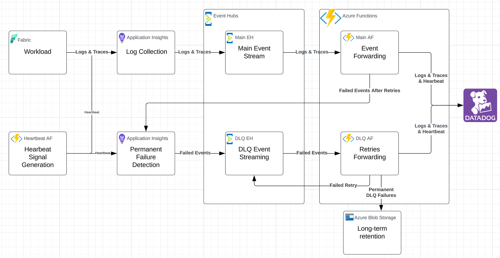

        

Document Metadata

|  |  |
|----|----|
| Identifier | **`LMP-PAT-0040`** |
| Type | **Technical Design Pattern** |
| Status | **Published** |
| Approvals | LMP Migration Architecture Approval |
| Governance Reference | **** |
| Pattern Source Repo |  |
| Published on | **October 01, 2024** |
| Valid From | **October 02, 2024** |
| Authors |   |
| Tags | Event ManagementApplication Support |
| Technology Capabilities | Delivery / Operations / Event ManagementDelivery / Operations / IT Service Management / Application Monitoring |

# Interim Datadog Integration for Microsoft Fabric (Technical Design Pattern)<a href="#interim-datadog-integration-for-microsoft-fabric-technical-design-pattern" class="headerlink" title="Permanent link">¶</a>

## Introduction<a href="#introduction" class="headerlink" title="Permanent link">¶</a>

This document outlines the **technical design pattern** for the interim solution that integrates [**Fabric**](https://www.microsoft.com/en-us/microsoft-fabric) workloads with [**Datadog**](https://www.datadoghq.com/) for observability and monitoring, focusing on logs and traces.

The solution implements [\*\*Application Insights \*\*](https://learn.microsoft.com/en-us/azure/azure-monitor/insights/insights-overview), [**Azure Event Hubs**](https://learn.microsoft.com/en-us/azure/event-hubs/) and [**Azure Functions**](https://azure.microsoft.com/en-us/products/functions) integrations, enabling a resilient and scalable telemetry pipeline to **Datadog**, while also ensuring that failed events are handled and persisted for long-term retention.

The addition of a Dead Letter Queue (DLQ) pathway is an enhancement to the current monitoring pipeline, improving its resilience and reliability.

The architecture supports:

- Collection of Logs and Traces from **Fabric workloads**.
- Automatic retries and failure handling for sending telemetry data to Datadog.
- Long-term storage of failed events to avoid data loss.

## Scope<a href="#scope" class="headerlink" title="Permanent link">¶</a>

This pattern is applicable to the following:

- Telemetry data, fed to **Application Insights**, from **Fabric** workloads that need to be forwarded to **Datadog** for observability and monitoring.
- **Azure Event Hub** and **Azure Function** setups that ensure robust telemetry forwarding.
- Integration of **Application Insights** to detect failed events and push them to a **Dead Letter Queue (DLQ)** for further retries or long-term storage.
- Long-term retention of failed events in **Azure Blob Storage** for future inspection and manual intervention.
- This pattern also covers the following aspects: - Ownership - Heartbeat Monitoring - Applicability

## Pattern Definition<a href="#pattern-definition" class="headerlink" title="Permanent link">¶</a>

To implement this pattern, the following components are set up:

1.  **Main Event Hub and Azure Function**: - The **Main Event Hub** captures logs and traces from **Fabric workloads**. - The **Main Azure Function** processes these events, attempting to forward them to **Datadog**. - **In-code retry logic** is used in the Main Azure Function for transient errors, while **Azure Function's native retry logic** with exponential backoff is configured to handle automatic retries in case of failure.

2.  **Failure Handling and DLQ**: - **Application Insights** detects permanent failures in the **Main Azure Function** after all retries are exhausted. - Failed events are then pushed into the **DLQ Event Hub** for further processing.

3.  **DLQ Event Hub and Azure Function**: - The **DLQ Azure Function** handles events from the **DLQ Event Hub**. - This function tracks retry counts in metadata and applies **in-code retry logic**. If retries are exhausted, events are pushed to **Azure Blob Storage** for long-term retention.

4.  **Long-Term Retention**: - Failed events that cannot be forwarded to **Datadog** after multiple retries are persisted in \*\*Azure Blob Storage \*\* for future analysis or manual reprocessing.

Note 1: a dedicated **Application Insights** instance is recommended to capture permanent failure logs from the Main Azure Function, and thus reducing unnecessary log volumes.

Note 2: instead of a using a continuous export from **Application Insights**, a more granular approach could be taken using a dedicated Azure Function that would issue KQL queries and publish failed events to the DLQ Event Hub.

## Architecture Diagram<a href="#architecture-diagram" class="headerlink" title="Permanent link">¶</a>

## Requirements<a href="#requirements" class="headerlink" title="Permanent link">¶</a>

The solution meets the following requirements:

- **Telemetry Collection**: The architecture collects logs and traces from **Fabric workloads**.
- **Retry Mechanism**: The **Main Azure Function** uses a combination of **in-code retry logic** and **native retry mechanisms** with exponential backoff.
- **Permanent Failure Detection**: Permanent failures in telemetry forwarding are detected using **Application Insights** and pushed to the **DLQ** for controlled retries.
- **Long-Term Storage**: Failed events are persisted in **Azure Blob Storage** after all retry attempts are exhausted.

## Implementation Approach<a href="#implementation-approach" class="headerlink" title="Permanent link">¶</a>

### 1. Main Event Hub and Azure Function<a href="#1-main-event-hub-and-azure-function" class="headerlink" title="Permanent link">¶</a>

- **Main Event Hub**: Receives logs and traces from **Application Insights**.
- **Main Azure Function**: Forwards telemetry data to **Datadog**. Retry attempts are handled via: - **In-code retry logic** for transient failures. See MAX_RETRIES and RETRY_INTERVAL in [Sample Function](https://github.com/DataDog/datadog-serverless-functions/blob/master/azure/activity_logs_monitoring/index.js). - **Native retry logic** (exponential backoff) managed via [`host.json`](https://learn.microsoft.com/en-us/azure/azure-functions/functions-bindings-event-hubs?tabs=isolated-process%2Cextensionv5&pivots=programming-language-javascript#hostjson-settings).
- On permanent failure, the events are forwarded to **Application Insights**. (Setup done through Diagnostic Settings)

### 2. Application Insights and DLQ Setup<a href="#2-application-insights-and-dlq-setup" class="headerlink" title="Permanent link">¶</a>

- **Application Insights**: Detects failures in the Main Azure Function and triggers an alert to push the failed event into the **DLQ Event Hub**.
- **DLQ Event Hub**: Receives failed events for controlled retries.

### 3. DLQ Azure Function<a href="#3-dlq-azure-function" class="headerlink" title="Permanent link">¶</a>

- Processes events from the **DLQ Event Hub**.
- **Retry logic** is handled in code. Retry counts are tracked in the message metadata.
- Failed events that exceed the retry limit are stored in **Azure Blob Storage**.

### 4. Blob Storage for Long-Term Retention<a href="#4-blob-storage-for-long-term-retention" class="headerlink" title="Permanent link">¶</a>

- Events that fail after retries are persisted in **Azure Blob Storage** for indefinite retention.
- This ensures that no events are lost and provides a point of manual intervention if needed.

## Ownership<a href="#ownership" class="headerlink" title="Permanent link">¶</a>

It is important to outline the guiding principles of ownership, outlining the responsibilities for implementing, managing and reusing the infrastructure components within this pattern:

- Reuse instances within the same product domain to streamline monitoring and reduce operational complexity.

<!-- -->

- Use separate instances for different product domains to maintain clear boundaries and avoid cross-domain monitoring noise.

Note that teams who own the implementation of an instance also own the code enabling the instantiation, ensuring accountability and proper management; however, reuse of IaC code between teams is encouraged to promote consistency and efficiency across the organization.

## Heartbeat Monitoring<a href="#heartbeat-monitoring" class="headerlink" title="Permanent link">¶</a>

### 1. Purpose<a href="#1-purpose" class="headerlink" title="Permanent link">¶</a>

To ensure the end-to-end integrity of the observability pipeline, even during periods of low or no activity from the monitored applications, we recommend implementing heartbeat monitoring. These signals serve as controlled, dummy log entries injected into the monitoring pipeline to verify its health and operational status.

### 2. Implementation<a href="#2-implementation" class="headerlink" title="Permanent link">¶</a>

- Implement a heartbeat Azure Function to periodically emit heartbeat signals into Application Insights.
- These signals should be clearly identifiable as synthetic through the use of metadata.
- These heartbeat signals should be included in the main Event Hub and the DLQ Event Hub to ensure that even when failures occur, the system can detect if the DLQ processing is functioning properly.

### 3. Monitoring<a href="#3-monitoring" class="headerlink" title="Permanent link">¶</a>

It is required to configure Datadog to track the presence of heartbeats (using a Threshold-Based Alert), if missing for a specific time window, an alert should be triggered to notify the SRE team of a potential issue in the monitoring pipeline.

## Data Retention<a href="#data-retention" class="headerlink" title="Permanent link">¶</a>

The data retention periods for Application Insights and Event Hubs within this pattern are:

- Application Insights: 30 days
- Event Hubs: 24 hours

These retention periods are expected to be sufficient for the current monitoring requirements.

## Applicability<a href="#applicability" class="headerlink" title="Permanent link">¶</a>

This pattern is intended as an interim solution and will no longer be recommended once the OTEL Collector based target architecture pattern is fully implemented and operational.

## Further Reading<a href="#further-reading" class="headerlink" title="Permanent link">¶</a>

- Related ADRs: - [Release 1 Logging to Datadog 2.0](https://gitlab.dx1.lseg.com/app/app-51783/lmp/-/blob/main/data-platform/docs/adrs/2024-06-18-release-1-logging-to-datadog-v2.md)
- [Azure Event Hubs trigger and bindings for Azure Functions](https://learn.microsoft.com/en-us/azure/azure-functions/functions-bindings-event-hubs?tabs=isolated-process%2Cextensionv5&pivots=programming-language-javascript)
- [Existing IaC for Main Event Hub and Main Azure Function](https://gitlab.dx1.lseg.com/app/app-51783/iac/shared-iac)
- [Azure Event Hubs Documentation](https://learn.microsoft.com/en-us/azure/event-hubs/)
- [Azure Functions Retry Policies](https://learn.microsoft.com/en-us/azure/azure-functions/functions-bindings-error-pages?tabs=csharp)
- [Application Insights Documentation](https://learn.microsoft.com/en-us/azure/azure-monitor/)

    May 30, 2025      November 13, 2024 

 Previous 

Application Immutable Audit Logging (Functional Design Pattern)

 Next 

Target Datadog Integration for Microsoft Fabric (Technical Design Pattern)

Made with <a href="https://squidfunk.github.io/mkdocs-material/" target="_blank" rel="noopener">Material for MkDocs</a>

