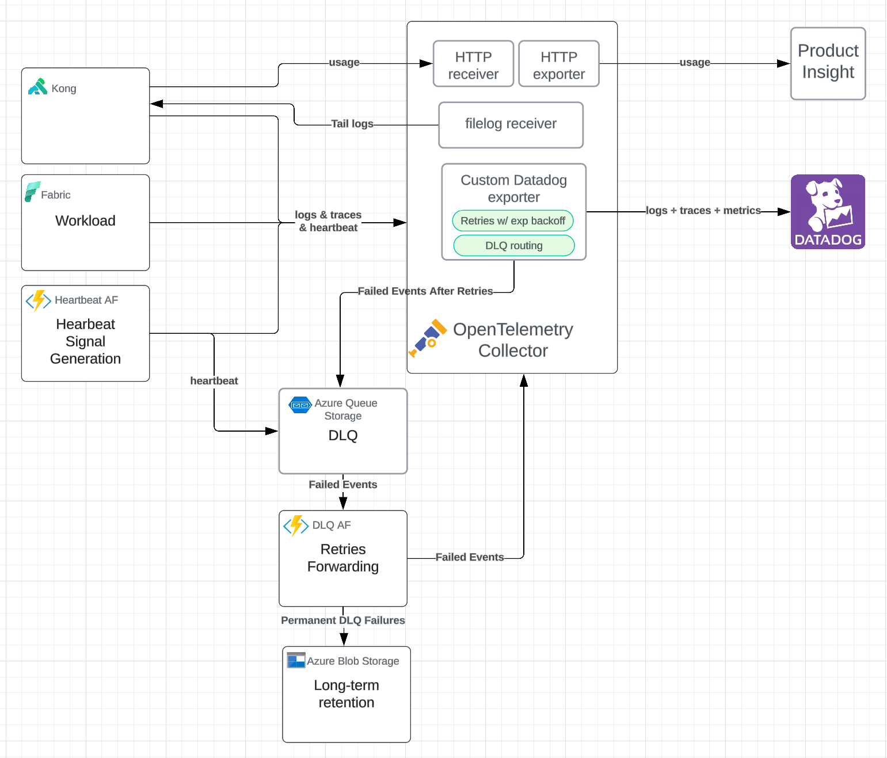

        

Document Metadata

|  |  |
|----|----|
| Identifier | **`LMP-PAT-0041`** |
| Type | **Technical Design Pattern** |
| Status | **Published** |
| Approvals | LMP Migration Architecture Approval |
| Governance Reference | **** |
| Pattern Source Repo |  |
| Published on | **October 09, 2024** |
| Valid From | **October 09, 2024** |
| Authors |   |
| Tags | Event ManagementApplication Support |
| Technology Capabilities | Delivery / Operations / Event ManagementDelivery / Operations / IT Service Management / Application Monitoring |

# Target Datadog Integration for Microsoft Fabric (Technical Design Pattern)<a href="#target-datadog-integration-for-microsoft-fabric-technical-design-pattern" class="headerlink" title="Permanent link">¶</a>

## Introduction<a href="#introduction" class="headerlink" title="Permanent link">¶</a>

This document outlines the **technical design pattern** for the target solution that integrates [**Fabric**](https://www.microsoft.com/en-us/microsoft-fabric) workloads with [**Datadog**](https://www.datadoghq.com/) using [**OpenTelemetry (OTEL) Collector**](https://opentelemetry.io/docs/collector/) for observability and monitoring.

The proposed architecture replaces the interim approach, moving away from Application Insights and Event Hubs toward a more generic solution.

This solution introduces a **Custom Datadog Exporter** within OTEL Collector, providing a resilient and scalable telemetry pipeline to **Datadog**, with automatic retries and **Dead Letter Queue (DLQ)** handling for failures.

The architecture supports:

- Collection of Logs, Traces, and Metrics from **Fabric workloads**.
- Automatic retries and failure handling within the OTEL Collector pipeline.
- DLQ and long-term storage of permanently failed events.

## Scope<a href="#scope" class="headerlink" title="Permanent link">¶</a>

This pattern is applicable to the following:

- Telemetry data, fed to **OTEL Collector**, from **Fabric** workloads that need to be forwarded to **Datadog** for observability and monitoring.
- **OTEL Collector-based solution** with custom retry and DLQ logic.
- **Custom Datadog Exporter** designed to handle retries with exponential backoff and DLQ routing (needed as the default Datadog exporter only supports retries but not DLQ).
- **Azure Queue Storage (AQS) DLQ** for failed events and **Azure Blob Storage** for permanent retention of failures.
- This pattern also covers the following aspects: - Ownership - Heartbeat Monitoring - Applicability

## Rationale<a href="#rationale" class="headerlink" title="Permanent link">¶</a>

### 1. In scope scenarios<a href="#1-in-scope-scenarios" class="headerlink" title="Permanent link">¶</a>

We are considering the following two operational scenarios to help us shape the requirements for our Fabric to Datadog integration pattern.

<table>
<colgroup>
<col style="width: 33%" />
<col style="width: 33%" />
<col style="width: 33%" />
</colgroup>
<thead>
<tr>
<th></th>
<th><strong>Auditing Scenario</strong></th>
<th><strong>Diagnostics Scenario</strong></th>
</tr>
</thead>
<tbody>
<tr>
<td><strong>Purpose</strong></td>
<td>Ensuring that <strong>all events are recorded and stored</strong> for compliance, regulatory, or security purposes.</td>
<td>Monitoring system performance, <strong>identifying issues</strong>, and <strong>debugging</strong>.</td>
</tr>
<tr>
<td><strong>Requirements</strong></td>
<td>- <strong>High Reliability:</strong> Zero tolerance for data loss; all events must be captured and retained. 
- <strong>Data Integrity:</strong> Accurate and complete data is critical. 
- <strong>Compliance:</strong> Must meet legal or industry standards for data retention and traceability.</td>
<td>- <strong>Timeliness:</strong> Quick access to data for real-time analysis. 
- <strong>Acceptable Data Loss:</strong> Some data loss is acceptable; focus is on trends rather than complete data. 
- <strong>Simplicity:</strong> Prefer simpler systems with minimal overhead.</td>
</tr>
<tr>
<td><strong>Implications for DLQ</strong></td>
<td>- <strong>Necessity of DLQ:</strong> Essential to handle any data that cannot be processed immediately, ensuring no loss of events. 
- <strong>Persistent Storage:</strong> Failed events must be stored persistently for later analysis and reprocessing.</td>
<td>- <strong>Built-in Retries Suffice:</strong> The built-in exponential backoff retries may be adequate. 
- <strong>Resource Optimization:</strong> Avoid the complexity and resource consumption of a DLQ if not necessary.</td>
</tr>
</tbody>
</table>

`Knowing that the telemetry pipeline into Datadog forms the basis of the Resilience Hub, which comes with clear` `regulatory constraints (e.g. DORA), we recommend the introduction of the Custom Datadog Exporter with support for a DLQ.`

### 2. Default Exporter limitations<a href="#2-default-exporter-limitations" class="headerlink" title="Permanent link">¶</a>

The default Datadog Exporter in the OTEL Collector implementation supports both in-memory and file-based queue retries, enhancing reliability against transient failures.

`But to achieve a more robust handling of both transient and permanent failures, the introduction of a Custom Datadog` `Exporter is required to support the DLQ feature.`

Let's compare the default OTEL Datadog Exporter built-in retries with a Custom DLQ approach.

|  | **Built-in In-Memory Retries** | **Built-in File-Based Persistent Queue** | **Custom Dead-Letter Queue (DLQ)** |
|----|----|----|----|
| **Purpose** | Handle transient failures via in-memory retries | Increase reliability by persisting retries to disk | Persistently store failed data after retries are exhausted |
| **Failure Types Handled** | Temporary/transient errors | Temporary/transient errors across restarts | Both transient and permanent errors |
| **Data Persistence** | In-memory (volatile) | Disk-based persistence for retry queue | Persistent storage separate from retry mechanism |
| **Data Loss Risk** | Possible on persistent failures or restarts | Reduced risk due to disk persistence | Minimizes risk by storing failed data separately |
| **Resource Consumption** | May consume memory during retries | Uses disk space; potential disk I/O impact | Offloads failed data, optimizing resources in main pipeline |
| **Visibility into Failures** | Limited | Limited; primarily for retry purposes | Full access to failed data and error details |
| **Reprocessing Capabilities** | Limited or manual | Automatic retries upon restart; no separate reprocessing | Designed for reprocessing failed data separately |
| **Impact on Main Pipeline** | May cause bottlenecks or delays | Can cause delays if queue grows large | Decouples failures from main pipeline, preventing blockage |
| **Handling Permanent Failures** | Not handled; data may be dropped | May endlessly retry permanently failed data | Moves unprocessable data to DLQ after retries |
| **Monitoring and Alerts** | Basic failure logs | Basic logs; limited alerting on queue growth | Enables monitoring and alerting on DLQ activity |
| **Compliance Support** | Minimal | Improved due to persistence, but not full audit trail | Supports audit and compliance needs with complete data retention |

In essence, adding a DLQ feature to our Datadog Exporter will bring the following benefits:

- Reduced data loss risks (e.g. resistance to both transient and permanent errors)
- Increased visibility into failures (e.g. enabled by monitoring of DLQ activity)
- Support compliance needs (e.g. complete data retention)
- Greater efficiency and scalability (e.g. by offloading failure handling to a separate process)

## Pattern Definition<a href="#pattern-definition" class="headerlink" title="Permanent link">¶</a>

To implement this pattern, the following components are set up:

1.  **OpenTelemetry (OTEL) Collector**: - **OTLP/HTTP Receiver**: Receives logs, traces, and metrics from Fabric workloads and other sources. - **Filelog Receiver**: Handles log collection from sources that require file-based ingestion. - **Custom Datadog Exporter**: Sends telemetry data (logs, traces, metrics) to Datadog, and handles **retries with exponential backoff** and **DLQ routing** features, e.g. once retries are exhausted, events are sent to the \*\*DLQ \*\* for further handling.

2.  **DLQ and Azure Queue Storage (AQS)**: - **DLQ AQS**: Receives failed events from the **Custom Datadog Exporter**. - **DLQ Azure Function**: Consumes the DLQ and processes failed events, applying custom retry logic up to a maximum number of retries (using metadata injection, e.g. `retry_count`).

3.  **Long-Term Retention**: - Failed events that cannot be forwarded to **Datadog** after multiple DLQ retries are persisted in **Azure Blob Storage** for future analysis or manual reprocessing.

4.  **Heartbeat Monitoring**: - A dedicated **Heartbeat Azure Function** periodically sends synthetic telemetry (heartbeat signals) to the pipeline to ensure end-to-end health. These signals are used to verify that the monitoring pipeline is operational, even in low-activity periods.

## Architecture Diagram<a href="#architecture-diagram" class="headerlink" title="Permanent link">¶</a>

## Requirements<a href="#requirements" class="headerlink" title="Permanent link">¶</a>

The solution meets the following requirements:

- **Telemetry Collection**: The architecture collects logs, traces, and metrics from **Fabric workloads**.
- **Retry Mechanism**: The **Custom Datadog Exporter** includes exponential backoff and retry logic for forwarding telemetry to Datadog.
- **DLQ Pathway**: Events that exhaust retries are routed to the **DLQ in Azure Queue Storage** for further processing.
- **Long-Term Storage**: Failed DLQ events are persisted in **Azure Blob Storage** after all DLQ retry attempts are exhausted.
- **Heartbeat Monitoring**: Heartbeat signals ensure the health of the monitoring pipeline, with alerts configured in Datadog for missing heartbeats.

## Implementation Approach<a href="#implementation-approach" class="headerlink" title="Permanent link">¶</a>

### 1. OpenTelemetry Collector<a href="#1-opentelemetry-collector" class="headerlink" title="Permanent link">¶</a>

- Configured to receive telemetry (logs, traces, metrics) from Fabric workloads and other sources using OTLP/HTTP and filelog receivers.
- The custom Datadog exporter manages sending telemetry to Datadog, with retries handled by the retry processor.
- When retries fail, events are routed to the **DLQ**.

### 2. DLQ Handling<a href="#2-dlq-handling" class="headerlink" title="Permanent link">¶</a>

- **DLQ Azure Function** picks up failed events from Azure Queue Storage, injects retry metadata, and resends events through the OTEL Collector for retry.

### 3. **Blob Storage for Long-Term Retention**<a href="#3-blob-storage-for-long-term-retention" class="headerlink" title="Permanent link">¶</a>

- Events that fail after retries are persisted in **Azure Blob Storage** for permanent retention.
- This ensures that no events are lost and provides a point of manual intervention if needed.

### 4. Heartbeat Monitoring<a href="#4-heartbeat-monitoring" class="headerlink" title="Permanent link">¶</a>

- **Heartbeat Function** sends synthetic logs and traces to the pipeline, providing a continuous signal to verify the health of the observability pipeline.

### 5. Capacity<a href="#5-capacity" class="headerlink" title="Permanent link">¶</a>

Whilst the OTEL Collector **does not automatically apply sampling** when overloaded, data loss may occur if queues are full and incoming events cannot be processed in time.

Let's review the built-in mechanisms used by OTEL Collector to handle high volume of data:

- Batch Processor: groups telemetry data into batches to optimize processing and exporting.
- Memory Limiting: configurable limits to prevent excessive memory usage.
- Queue Settings: adjustable queue sizes for processors and exporters to match available resources.
- Retry and Timeout Settings: control over how long to retry sending data before dropping it (e.g. exponential backoff).

Let's review additional recommended approaches to scaling:

- Horizontal Scaling: - Load Balancing: distribute incoming telemetry data across multiple OTEL Collector instances. - Auto-Scaling: use orchestration tools (e.g. Kubernetes) to scale OTEL Collector instances based on load.
- Optimize OTEL Collector Configuration: - Adjust batch sizes and flush intervals to increase throughput. - Adjust queue sizes for processors and exporters to handle burst of data. - Adjust resources allocation to the OTEL Collector (e.g. CPU, memory, disk)
- Backpressure Signaling: - Leverage the OTEL SDKs in applications to respect backpressure signals (e.g. SimpleSpanProcessor instead of BatchSpanProcessor). - Leverage gRPC built-in flow control mechanisms. - Optimize the telemetry data volume: where applicable, apply sampling or filtering to reduce the volume of data to critical data only.

These recommendations are not developed further in this reference architecture, but will be refined as a PoC is completed and real world return on experience is gathered.

## Ownership<a href="#ownership" class="headerlink" title="Permanent link">¶</a>

It is important to outline the guiding principles of ownership, outlining the responsibilities for implementing, managing and reusing the infrastructure components within this pattern:

- Reuse instances within the same product domain to streamline monitoring and reduce operational complexity.

<!-- -->

- Use separate instances for different product domains to maintain clear boundaries and avoid cross-domain monitoring noise.

Note that teams who own the implementation of an instance also own the code enabling the instantiation, ensuring accountability and proper management; however, reuse of IaC code between teams is encouraged to promote consistency and efficiency across the organization.

## Heartbeat Monitoring<a href="#heartbeat-monitoring" class="headerlink" title="Permanent link">¶</a>

### 1. **Purpose**<a href="#1-purpose" class="headerlink" title="Permanent link">¶</a>

To ensure the end-to-end integrity of the observability pipeline, even during periods of low or no activity from the monitored applications, we recommend implementing heartbeat monitoring. These signals serve as controlled, dummy log entries injected into the monitoring pipeline to verify its health and operational status.

### 2. **Implementation**<a href="#2-implementation" class="headerlink" title="Permanent link">¶</a>

- Implement a heartbeat Azure Function to periodically emit heartbeat signals into OTEL Collector.
- These signals should be clearly identifiable as synthetic through the use of metadata.
- These heartbeat signals should also be included in the DLQ AQS to ensure that even when failures occur, the system can detect if the DLQ processing is functioning properly.

### 3. **Monitoring**<a href="#3-monitoring" class="headerlink" title="Permanent link">¶</a>

It is required to configure Datadog to track the presence of heartbeats (using a Threshold-Based Alert), if missing for a specific time window, an alert should be triggered to notify the SRE team of a potential issue in the monitoring pipeline.

## Data Retention<a href="#data-retention" class="headerlink" title="Permanent link">¶</a>

- **Azure Queue Storage (DLQ)**: Failed events are held in the queue for 7 days.
- **Azure Blob Storage**: Permanently failed events are stored indefinitely for long-term retention.

## Data Latency<a href="#data-latency" class="headerlink" title="Permanent link">¶</a>

- This solution must achieve similar or lower latency compared to the interim solution, e.g. less than 10 seconds.

## Applicability<a href="#applicability" class="headerlink" title="Permanent link">¶</a>

This pattern is designed to be the **target reference architecture** for telemetry collection and forwarding from **Fabric workloads** to **Datadog**. Once this target state is fully operational, the **interim solution** will no longer be recommended.

## OpenSource Considerations<a href="#opensource-considerations" class="headerlink" title="Permanent link">¶</a>

The OTEL Collector implementation being OpenSource Software, we must decide to either contribute back to the OSS community or fork the code, which depends on multiple factors, here are some key points to consider:

| **Aspect** | **Contributing Back** | **Forking the Code** |
|----|----|----|
| **Control Over Code** | Moderate control; must align with community standards | Full control over modifications and features |
| **Maintenance Effort** | Shared with the community | Sole responsibility of your team |
| **Community Support** | Access to community support and collaboration | Limited to internal resources |
| **Innovation and Features** | Benefit from community innovations; may need to wait for acceptance | Immediate implementation of desired features |
| **Compliance and Legal** | Simplified compliance; aligns with community practices | Requires careful license management and legal oversight |
| **Reputation and Goodwill** | Enhances company reputation as a contributor | Neutral or potentially negative if community perceives fragmentation |
| **Resource Allocation** | Lower long-term maintenance costs due to shared efforts | Higher long-term costs due to independent maintenance |

**In the long run, contributing back to the community provides a more sustainable and legally straightforward path:** `It would allow us to benefit from community contributions, simplifies compliance with open-source licenses, and` `enhances LSEG's standing in the developer community`

**However, for time to market reasons, it is recommended to follow a staggered approach:**

1.  Fork the code and deliver our Custom Datadog Exporter quickly to meet urgent business requirements.
2.  Align with Community Standards and legal constraints.
3.  Seek Community Acceptance and get our code merged.

## Further Reading<a href="#further-reading" class="headerlink" title="Permanent link">¶</a>

- Related ADRs: - [Target Logging to Datadog](https://gitlab.dx1.lseg.com/app/app-51783/lmp/-/blob/main/data-platform/docs/adrs/2024-06-24-target-logging-to-datadog.md)
- [Azure Functions Retry Policies](https://learn.microsoft.com/en-us/azure/azure-functions/functions-bindings-error-pages?tabs=csharp)
- [OpenTelemetry Collector Documentation](https://opentelemetry.io/docs/collector/)
- [Default OTEL Datadog Exporter](https://github.com/open-telemetry/opentelemetry-collector-contrib/tree/main/exporter/datadogexporter)
- [Azure Queue Storage Documentation](https://learn.microsoft.com/en-us/azure/storage/queues/)
- [Azure Blob Storage Documentation](https://learn.microsoft.com/en-us/azure/storage/blobs/)

    May 30, 2025      November 13, 2024 

 Previous 

Interim Datadog Integration for Microsoft Fabric (Technical Design Pattern)

 Next 

Event Grid Pattern

Made with <a href="https://squidfunk.github.io/mkdocs-material/" target="_blank" rel="noopener">Material for MkDocs</a>

