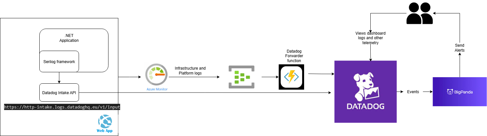

        

Document Metadata

|  |  |
|----|----|
| Identifier | **`LMP-PAT-0079`** |
| Type | **Technical Design Pattern** |
| Status | **Published** |
| Approvals | LMP Migration Architecture Approval |
| Governance Reference | **** |
| Pattern Source Repo |  |
| Published on | **April 14, 2026** |
| Valid From | **April 14, 2026** |
| Authors |   |
| Tags | Event ManagementApplication Support |
| Technology Capabilities | Delivery / Operations / Event ManagementDelivery / Operations / IT Service Management / Application Monitoring |

# Datadog Integration for Azure Services (Technical Design Pattern)<a href="#datadog-integration-for-azure-services-technical-design-pattern" class="headerlink" title="Permanent link">¶</a>

## Relevant ADRs<a href="#relevant-adrs" class="headerlink" title="Permanent link">¶</a>

- [LMP-ADR-0003: Use Datadog SaaS for Application & Resource monitoring in LMP Greenfield](../../../adrs/event-management/0003-use-datadog-for-application-and-resource-monitoring/)
- [LMP-ADR-0004: Choose OpenTelemetry for Application Telemetry over Proprietary Libraries](../../../adrs/event-management/0004-choose-open-telemetry-for-application-telemetry-over-proprietary-libraries/)

## Principles<a href="#principles" class="headerlink" title="Permanent link">¶</a>

- Datadog as a single sink for all application and infrastructure telemetry, to enable cross-application and service correlation
- BigPanda is automation and incident management platform that drives decisions on actions based on events received from Datadog. Actions include escalate to human, execute automated remediation script etc. Data should flow from Datadog through to BigPanda only if there's an event or alarm condition that requires either a manual or automated intervention.
- Applications not coupled to either Datadog or BigPanda, abstraction used to allow future architectural agility

## Virtual Machines<a href="#virtual-machines" class="headerlink" title="Permanent link">¶</a>

- Datadog agent running as a process on the VM, configured to scrape the system log / journald and any app-specific log file locations. Also configured to listen to OpenTelemetry Line Protocol (OTLP) messages over HTTP via a local TCP socket.
- Log events from application can flow either to system log (if emitted via stdout/stderr streams or console) or directly to one or more application-specific log files.
- Metrics and traces from the application flow to the Datadog agent via OTLP
- Datadog agent scrapes detailed metrics from the host
- Platform-based host metrics (coarse-grained) collected via Azure Monitor and the Datadog Azure integration

Further reading:

- [Datadog Agent configuration on bare-metal / VMs](https://docs.datadoghq.com/agent/configuration/agent-configuration-files/?tab=agentv6v7)
- [Microsoft Azure VM](https://docs.datadoghq.com/integrations/azure_vm/)

## Kubernetes<a href="#kubernetes" class="headerlink" title="Permanent link">¶</a>

- Datadog agent deployed as a Daemonset, with one pod per node, and configured to listen to OTLP events over HTTP
- Agent is configured to collect both node and container logs and forward
- Log events from application flow to the node via the container logs mechanism
- Metrics and traces from the application flow to the Datadog agent via OTLP
- Agent pulls cluster metrics from the kubernetes metrics server
- Agent pulls cluster details from the kubernetes API
- Platform-based host metrics (coarse-grained) collected via Azure Monitor and the Datadog Azure integration

Further reading:

- [Datadog Agent installation on Kubernetes](https://docs.datadoghq.com/containers/kubernetes/)
- [Monitoring Kubernetes performance metrics](https://www.datadoghq.com/blog/monitoring-kubernetes-performance-metrics/)

## Azure Container Applications (ACA)<a href="#azure-container-applications-aca" class="headerlink" title="Permanent link">¶</a>

### Recommended Approach: Azure Managed OpenTelemetry Agent<a href="#recommended-approach-azure-managed-opentelemetry-agent" class="headerlink" title="Permanent link">¶</a>

**When to use:**

- Applications already using OTEL SDKs
- All new applications (REQUIRED)
- Considering the 'LMP-ADR-0004: Choose OpenTelemetry for Application Telemetry over Proprietary Libraries' mentioned in 'Relevant ADRs' section above, assuming the application is already leveraging OTEL SDKs this would be the preferred option, considering cost and management.
- Azure Container Apps provides a **managed OpenTelemetry agent** at the Container Apps Environment level, provisioned and managed by Microsoft at no additional compute cost.
- Configuration is done at the **application container environment level** (not per container app), and all apps in the environment automatically benefit from the telemetry routing.
- Application code must be instrumented with OpenTelemetry SDK to emit telemetry data over OTLP; the managed agent handles routing to destinations.
- Application should configure the SDK to use the values injected into the environment variables by the platform for the OTLP endpoint. These are at `CONTAINERAPP_OTEL_TRACING_GRPC_ENDPOINT`, `CONTAINERAPP_OTEL_METRIC_GRPC_ENDPOINT` and `CONTAINERAPP_OTEL_LOGGING_GRPC_ENDPOINT`. Only GRPC protocol is currently supported by the platform, so ensure SDK is configured to use gRPC OTLP exporter with the provided endpoint.
- To tag telemetry on datadog with the required side, set the OTLP resource attributes in the application code using the OpenTelemetry SDK, for example: - `datadog.container.tag.mnd-applicationid` = application ID - `env` = environment (e.g., production, staging) - `version` = application version
- Configuration requires Datadog site URL (e.g., `datadoghq.eu`) and API key (recommended to store in Azure Key Vault).
- The native `azurerm` provider does at the point of writing this document does not support the OpenTelemetry configuration for Azure Container Apps Environments. Hence can use the **AzAPI provider**.

### Alternative Approaches<a href="#alternative-approaches" class="headerlink" title="Permanent link">¶</a>

**Note**: Only consider these alternatives approaches when the above recommended approach has been validated and cannot be used:

**Diagnostic Settings** - Use ONLY when application cannot be instrumented

- In this approach Logs and Metrics are collected sent to Event Hub through diagnostic settings.
- Datadog Forwarder function forwards logs from Event Hub to Datadog.
- The eventhub + forwarder function is already setup as part of platform which is deployed by Policy in LMP, if not via SRE to enable.
- Only works for logs, can be latency between log generation and availability in Datadog (a few seconds to minutes), not suitable for real-time monitoring or alerting.

**Sidecar Container** - AVOID unless if you requires custom log file access as last resort for any legacy applications.

- Datadog Agent runs as sidecar container which shares the volume with application where log files are written.
- Datadog Agent tails the logs files and send logs,metrics and traces to Datadog
- Platform metrics are sent to Datadog using Diagnostic Settings through Event Hub.
- This should only be considered in case if application is not OTEL instrumented, since it runs as additional container in the pod which costs and more complex to setup and extra management overhead.

 

### Comparison Table – Datadog Integration Approaches for ACA<a href="#comparison-table-datadog-integration-approaches-for-aca" class="headerlink" title="Permanent link">¶</a>

| Feature / Aspect | Azure Managed OTEL Agent | Datadog Agent (sidecar) | Azure Diagnostic Settings |
|----|----|----|----|
| **Configuration Level** | Container Apps Environment (all apps) | Per container app | Per resource (app or environment) |
| **Where it runs** | Azure platform (Microsoft-managed) | Separate container in same ACA environment | Azure platform level (no Datadog container) |
| **Setup complexity** | Low (environment-level ARM/CLI config) | High (configure sidecar container, volumes, env vars) | Low (just configure in Azure Portal/CLI) |
| **Requires code instrumentation** | Yes (OpenTelemetry SDK) | Optional (Agent can collect logs without instrumentation) | No |
| **Log types captured** | App logs via OTLP from instrumented code | App logs from stdout/stderr, plus integrations (syslog, files) | ACA platform logs (AppConsole, SystemLogs, HTTPLogs, FunctionAppLogs) |
| **Real-time streaming** | Yes | Yes | Near real-time (a few seconds/minutes delay possible) |
| **Traces/APM support** | Yes (full support) | Yes (full APM) | No |
| **Metrics support** | Yes (full support for Datadog) | App-level & integration checks | Metrics sent via Diagnostic Settings go to Monitor, not Datadog directly |
| **Infrastructure visibility** | No | Limited in ACA (no node metrics) | Azure Monitor platform metrics (if enabled) |
| **Access to custom log files** | No (OTLP only) | Yes (Agent can tail files if mounted) | No |
| **Compute cost** | No additional cost (Microsoft-managed) | Additional container (vCPU/memory costs) | Event Hub + Forwarder Function costs |
| **Azure dependency** | Medium (environment-level config) | Minimal | Heavy (requires Azure Monitor + Event Hub pipeline) |
| **Best suited for** | Multiple apps in same environment needing centralized telemetry routing without container modifications | Full Datadog features for app logs, custom metrics, traces | Centralized platform log collection without container changes |

Further reading:

- [Azure Container Apps](https://docs.datadoghq.com/serverless/azure_container_apps/)
- [Azure OpenTelemetry Agents](https://learn.microsoft.com/en-us/azure/container-apps/opentelemetry-agents)

## Azure Functions<a href="#azure-functions" class="headerlink" title="Permanent link">¶</a>

Azure Functions Datadog setup done in two ways:

Using Diagnostic Settings:

- Logs and metrics from the Azure Function App are collected and forwarded to an Azure Event Hub via Diagnostic Settings.
- A Datadog forwarder Function App reads from the Event Hub and sends data to Datadog.
- Datadog can extract metrics from log lines using its log-based metrics feature.
- Traces can be captured by enabling Application Insights during Function App creation.

Direct Logging to Datadog:

- Logs can be sent directly to Datadog using the HTTP Intake API, bypassing Diagnostic Settings and Event Hub entirely.
- Platform metrics are sent to Datadog using Diagnostic Settings through Event Hub.

 

Further reading:

- [Datadog Generate Metrics from Ingested Logs](https://docs.datadoghq.com/logs/log_configuration/logs_to_metrics/)
- [Datadog Azure Functions Integration](https://docs.datadoghq.com/integrations/azure_functions/)

## Azure Web App Service<a href="#azure-web-app-service" class="headerlink" title="Permanent link">¶</a>

Application logs for Azure Web App Service Can be ingested into Datadog using following methods:

Diagnostic Settings:

- Logs and metrics from the Azure Function App are collected and forwarded to an Azure Event Hub via Diagnostic Settings.
- A Datadog forwarder Function App reads from the Event Hub and sends data to Datadog.

Datadog Intake API:

- Application logs are directly send to Datadog Intake API (<https://http-intake.logs.datadoghq.eu/v1/input>) using Serilog sink
- Platform metrics are sent to Datadog using Diagnostic Settings through Event Hub.

 

    May 11, 2026      April 13, 2026 

 Previous 

Event Grid Pattern

 Next 

Internal Web Authentication / SSO using OIDC and Microsoft Entra

Made with <a href="https://squidfunk.github.io/mkdocs-material/" target="_blank" rel="noopener">Material for MkDocs</a>

