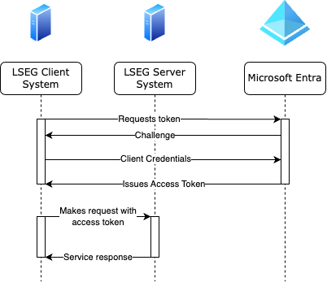

        

Document Metadata

|  |  |
|----|----|
| Identifier | **`LMP-PAT-0024`** |
| Type | **Technical Design Pattern** |
| Status | **Published** |
| Approvals | LMP Migration Architecture Approval |
| Governance Reference | **** |
| Pattern Source Repo |  |
| Published on | **June 28, 2024** |
| Valid From | **June 28, 2024** |
| Authors |   |
| Tags | Identity & Access Management |
| Technology Capabilities | Delivery / Security & Compliance / Identity & Access Management |

# Internal Web Authentication / SSO using OIDC and Microsoft Entra<a href="#internal-web-authentication-sso-using-oidc-and-microsoft-entra" class="headerlink" title="Permanent link">¶</a>

## Introduction<a href="#introduction" class="headerlink" title="Permanent link">¶</a>

This pattern describes the model of using Microsoft Entra to provide single sign-on (SSO) authentication capabilities for internal users of applications in a web context.

The pattern is based on the group-wide [SP-0013 - Workforce User Authentication Pattern](https://confluence.refinitiv.com/display/PSAR/SP-0013+-+Authentication%3A+Workforce+User+Authentication+-+DRAFT) and [SP-0014 - Authentication - Component-to-Component Pattern](https://confluence.refinitiv.com/display/PSAR/SP-0014+-+Authentication+-+Component-to-Component+-+Full+Pattern+-+DRAFT).

The [cybersecurity MEC](https://lsegroup.sharepoint.com/:x:/r/teams/LMFoundationFM/_layouts/15/Doc.aspx?sourcedoc=%7BA885D426-5FF8-405B-9516-37F2EB533E2F%7D&file=Foundation%20Pillar-MinimumEntryCriteria-v0_2.xlsx&action=default&mobileredirect=true) item `SEC.MEC6.2` states that:

> Internally Exposed APIs: Internally consumed APIs are subject to positive authentication and authorisation with granular decisions for each consumer.

Item `SEC.MEC6.2` states that:

> Applications accessed by LSEG staff from within the LSEG network - the Application is using LSEG Approved Single Sign On capabilities using Modern Authentication Methods.

In this context, Microsoft Entra is the "LSEG Approved Single Sign On" system.

## Scope<a href="#scope" class="headerlink" title="Permanent link">¶</a>

As per the MEC, this scope includes any application that is looking to interactively authenticate internal staff users when providing functionality to those users in an interactive web-based context. The scope also includes LSEG-managed server systems requiring authentication before providing service to other LSEG-managed systems.

Authenticating internal users when they're part of a wider identity pool that includes external users is *out of scope*.

## Use Cases<a href="#use-cases" class="headerlink" title="Permanent link">¶</a>

> As an application engineer, I would like to require that incoming requests to my system from both human and system actors are strongly authenticated against a common identity domain so that I can reliably use that identity to make authorisation and entitlement decisions.

## Functional Requirements<a href="#functional-requirements" class="headerlink" title="Permanent link">¶</a>

The standard approach here is to use OpenID Connect (OIDC) to establish trust between the system ("relying party" or " RP") and the end-user, provided by MS Entra ("identity provider", or "IdP"). OIDC is based on the [OAuth 2.0 Framework](https://datatracker.ietf.org/doc/html/rfc6749).

If the application is required to persist data related to the authenticated user, they *SHOULD* use the user's employee ID, which is returned as the value of the claim named `employeeid` in the user's identity token.

### Pre-requisites<a href="#pre-requisites" class="headerlink" title="Permanent link">¶</a>

- The end-user has an active account & identity in the LSEG tenant of Microsoft Entra
- The relying party has been configured as an application in the IdP, and posseses both a "client identifier" and a " client secret" credential
- In the case where the end-user is a human, they are able to access both the relying party and the IdP either via the internet or via ZScaler Private Access (ZPA).
- In the case of human / interactive authentication, the relying party is able to access the IdP via the internet.
- In the case of system / system authentication, the system acting as the client is able to access the IdP via the internet.

### Context Diagram<a href="#context-diagram" class="headerlink" title="Permanent link">¶</a>

### Deployment Diagram<a href="#deployment-diagram" class="headerlink" title="Permanent link">¶</a>

Example for Kubernetes with Nginx Ingress Controller, with connectivity to Entra back outbound via the internet

### OIDC Flows<a href="#oidc-flows" class="headerlink" title="Permanent link">¶</a>

The OIDC specification describes a number of different flows, depending on what's needed by the relying party. In general, the most commonly-applicable flows are the Authorization Code Flow and the Client Credentials Flow.

#### Authorization Code Flow<a href="#authorization-code-flow" class="headerlink" title="Permanent link">¶</a>

This flow is primarily for humans in a context where they can interact with an authentication challenge from Entra. Typically, this will be a web browser.

The general principle is that the relying party detects an unauthenticated user (or user without a valid session), redirects that user to log into the IdP. On successful authentication to the IdP, the IdP issues an opaque code back to the user which the user then uses to send to the relying party. Finally, the relying party contacts the IdP with the code, exchanging it for a JWT-formatted *ID token*, an opaque *access token*, and (optionally) an opaque *refresh token*.

One of the main characteristics of this flow is that the RP is granted the ability to call other services on behalf of the end user. This is the purpose of the access token ends up with an access token that can be used to make requests of other services on behalf of the end user.

Key factors in this flow are:

- The relying party is entirely responsible for session management. This includes detecting requests without a valid session and creating / storing sessions for users once they have been authenticated.
- The relying party *MUST* protect against cross-site request forgery (XSRF) by including a cryptographically-secure random state token when redirecting to the IdP. This state should be persisted and validated when the client returns from the IdP with an authorization code.
- The ID token returned from the IdP is a Javascript Web Token (JWT) that represents the authenticated user's identity. This *MUST* be validated. Specifically, the signature should be checked, the signature algorithm should be checked against a whitelist, the audience (`aud`) claim must be the same as the RP's client identity, and the expiry timestamp `exp` must be in the future.
- The access token returned from the IdP is for allowing the RP to call other services on behalf of the client. As such, it's effectively a sensitive credential, so should be treated as such. More details about the specific access tokens returned from Entra are available [from Microsoft](https://learn.microsoft.com/en-us/entra/identity-platform/access-tokens).
- If requested, the token exchange endpoint can also return a refresh token which can be used by the RP to request new access tokens for this end user if they expire. Access tokens typically have a fairly short lifetime, so if the RP needs to make requets to other services on behalf of the end user beyond the access token lifetime, the refresh token can be used against the IdP to issue a new access token. More details about refresh tokens from Entra are available [from Microsoft](https://learn.microsoft.com/en-us/entra/identity-platform/refresh-tokens).

#### Client Credentials Flow<a href="#client-credentials-flow" class="headerlink" title="Permanent link">¶</a>

This flow is useful mainly for system/system communication and authentication, where a service call is not being made on behalf of another user. It is simpler than the authorization code flow.

The main principles are the same as the authorization code flow. The primary difference is that the client system itself holds a set of credentials that it uses to fetch an *access token* directly from the Entra token endpoint. That access token can then be directly used against the server system.

Key factors in this flow are:

- In the Microsoft Entra platform implementation, the server is capable of introspecting the supplied access token directly. The OIDC specification doesn't prescribe a method for validating the access token, and some implementations rely on the server passing the supplied access token to an "introspection endpoint". Microsoft chose to use JWTs as an access token format, allowing the server to parse and validate the access token with no request-time dependency on the IdP.
- The access token *can* be re-used for subsequent requests between the same client / server pair, assuming its constraints are still valid (e.g. not expired).

## Implementation<a href="#implementation" class="headerlink" title="Permanent link">¶</a>

It's highly recommended to use the [Microsoft Authentication Library](https://learn.microsoft.com/en-us/entra/identity-platform/msal-overview) which is available for a number of commonly-used ecosystems, including .NET, Java, Javascript, Python, Golang, Android and iOS.

In the event that MSAL isn't used, there are other libraries available that can help developers implement OIDC within their applications. It's recommended that these are used rather than trying to hand-roll the authentication process, but developers should study the documentation for these libraries carefully.

Authentication is a critical process, where small mistakes in implementation can easily turn into large security incidents.

## Further Reading<a href="#further-reading" class="headerlink" title="Permanent link">¶</a>

- [How OpenID Connect Works](https://openid.net/developers/how-connect-works/)
- [RFC6749 - The Oauth 2.0 Authorization Framework](https://datatracker.ietf.org/doc/html/rfc6749)
- [Access tokens in the Microsoft Identity Platform](https://learn.microsoft.com/en-us/entra/identity-platform/access-tokens)
- [Refresh tokens in the Microsoft Identity Platform](https://learn.microsoft.com/en-us/entra/identity-platform/refresh-tokens)
- [Microsoft identity platform and OAuth 2.0 authorization code flow](https://learn.microsoft.com/en-us/entra/identity-platform/v2-oauth2-auth-code-flow)
- [Microsoft identity platform and the OAuth 2.0 client credentials flow](https://learn.microsoft.com/en-us/entra/identity-platform/v2-oauth2-client-creds-grant-flow)

    May 30, 2025      September 12, 2024 

 Previous 

Datadog Integration for Azure Services (Technical Design Pattern)

 Next 

External System Authentication Patterns

Made with <a href="https://squidfunk.github.io/mkdocs-material/" target="_blank" rel="noopener">Material for MkDocs</a>

