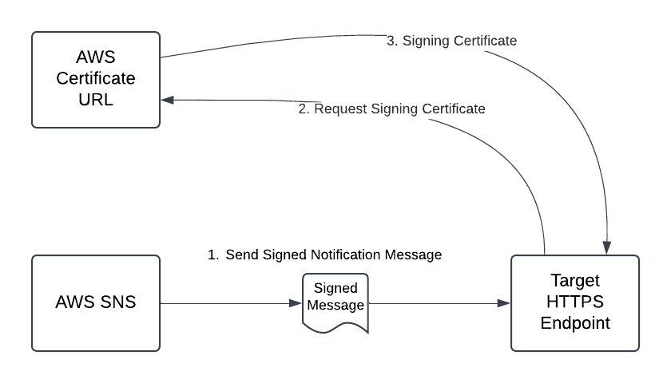

        

Document Metadata

|  |  |
|----|----|
| Identifier | **`LMP-PAT-0061`** |
| Type | **Functional Design Pattern** |
| Status | **Published** |
| Approvals | LMP Migration Architecture Approval |
| Published on | **December 04, 2024** |
| Valid From | **December 16, 2024** |
| Authors |   |
| Tags | Identity & Access Management |
| Technology Capabilities | Delivery / Security & Compliance / Identity & Access Management |

# External System Authentication Patterns<a href="#external-system-authentication-patterns" class="headerlink" title="Permanent link">¶</a>

## Introduction<a href="#introduction" class="headerlink" title="Permanent link">¶</a>

There are a number of scenarios where non-Azure components need to access Azure resources, and these interactions need to be authenticated. Often the type of authentication that can be supported is limited by the underlying technologies of the external components. This document defines a range of authentication patterns that can be used in scenarios standard approaches - such as Managed Identity within an Azure tenant - are not available.

The broad range of possible source systems means limited client implementation guidance is provided.

## Scope<a href="#scope" class="headerlink" title="Permanent link">¶</a>

This pattern is applicable to various components outside of Azure authenticating to a range of Azure services. It outlines a range of approved authentication approaches, including:

- examples of circumstances where they are applicable
- implementation and operational considerations

The patterns described are not exhaustive and will be supplemented as new scenarios are encountered.

## Pattern Definitions<a href="#pattern-definitions" class="headerlink" title="Permanent link">¶</a>

### 1. Service Principal Authentication<a href="#1-service-principal-authentication" class="headerlink" title="Permanent link">¶</a>

The default approach to authentication to Azure services from external systems is the use of Service Principals. While Fabric did not initially support service principal based authentication to (all of) its APIs, they are supported by the vast majority of Azure services.

Two main forms of Service Principal authentication are supported:

- [Secret Based Authentication](https://learn.microsoft.com/en-us/entra/identity-platform/v2-oauth2-client-creds-grant-flow#first-case-access-token-request-with-a-shared-secret) uses a shared secret to authenticate to Entra/AD to obtain OAuth 2.0 service tokens for use with specific target resources.

<!-- -->

- [Certificate Based Authentication](https://learn.microsoft.com/en-us/entra/identity-platform/v2-oauth2-client-creds-grant-flow#second-case-access-token-request-with-a-certificate) uses public key cryptography to sign the request for an OAuth 2.0, which again is used in subsequent interactions with the target resources.

These authentication flows are illustrated in Figure 1 below.

Figure 1 - Service Principal Authentication Flow

#### 1.1 Applicable Use Cases<a href="#11-applicable-use-cases" class="headerlink" title="Permanent link">¶</a>

As the default mechanism, service principal based authentication is applicable in a wide range of scenarios. In particular long term ongoing interactions between systems outside Azure connecting to Azure services, or LSEG applications hosted in Azure. The external systems must support the required authentication exchanges, which require interactions with both the Entra identity system and the target resource.

Cases where service principal based authentication may not be applicable include:

- where the calling component does not support the required authentication flows
- where some other authentication mechanisms are involved (for example the standard use of Ping authentication for Customer Identity and Access Management)

#### 1.2 Implementation and Operational Considerations<a href="#12-implementation-and-operational-considerations" class="headerlink" title="Permanent link">¶</a>

- **Protection of secrets**: The service principal secret must be protected in transit and when stored on the client application. Key vaults should be used where clients are implemented on cloud. Operating system controls should be used for on-premise clients. The private key for certificate based authentication must also be protected, typically embedded as part of the client certificate store.

<!-- -->

- **Expiry/rotation**: Care must be taken to rotate credentials without interrupting service. Client secrets must be updated synchronously between Entra and the client code, and so an automated process is required. Certificate expiry times should be understood by client code to trigger warnings about imminent expiry.

Where the authentication exchange needs to be implemented in LSEG code, then the use of [Azure Identity Client Library](https://learn.microsoft.com/en-us/azure/storage/blobs/authorize-access-azure-active-directory#azure-identity-client-library) or the [Microsoft Auth Libraries](https://learn.microsoft.com/en-us/entra/identity-platform/reference-v2-libraries#service--daemon) are recommended.

### 2. Shared Access Signatures<a href="#2-shared-access-signatures" class="headerlink" title="Permanent link">¶</a>

[Shared Access Signature (SAS) tokens](https://learn.microsoft.com/en-us/azure/storage/common/storage-sas-overview) are a convenient mechanism to grant read or write access to specific Azure storage locations, as shown in Figure 2 below.

Figure 2 - SAS Token Access Flow

They support a range of additional controls such as start and expiry times, permissions restrictions or allowed source IP addresses. While the use of SAS tokens removes the need for other authentication mechanisms, they do need to be treated as a secret which needs to be protected at the client and in transit.

SAS Tokens are also available for other Azure services including EventHub and ServiceBus to allow external services to write or read messages to specific topics.

#### 2.1 Applicable Use Cases<a href="#21-applicable-use-cases" class="headerlink" title="Permanent link">¶</a>

Use cases which can use SAS token based approaches to authentication include:

1.  On premises or AWS based systems writing Change Data Capture events to Azure storage, EventHub or ServiceBus
2.  LSEG.com hosted VMs writing SDI files to LSEG SaaS tenant storage
3.  AWS Lambda functions or DataSync processes writing data to Azure
4.  Customers downloading bulk feed files from Azure

SAS tokens are an approved solution approach for these, although in some cases other authentication mechanisms are also possible including service principal authentication.

Some benefits of using Shared Access Signatures include:

- simpler implementation as SAS token can be used without any additional authentication flows
- a single SAS token can be shared by multiple instances (e.g. multiple regional failover instances)
- does not require identities to be managed in Entra (e.g. for customer identities an API using Ping Authentication can be used to retrieve a short-lived SAS token)
- can provide short expiry times to support ad-hoc activities
- simpler secret rotation - as multiple SAS tokens can be valid at the same time

#### 2.2 Implementation and Operational Considerations<a href="#22-implementation-and-operational-considerations" class="headerlink" title="Permanent link">¶</a>

When implementing SAS token based data access the following considerations must be addressed:

##### 2.2.1 Protection of secrets<a href="#221-protection-of-secrets" class="headerlink" title="Permanent link">¶</a>

A SAS token needs to be treated like any other secret key and protected in transit and when stored on the client application. Key vaults should be used where clients are implemented on cloud. Operating system controls should be used for on-premises clients.

##### 2.2.2 Expiry/rotation<a href="#222-expiryrotation" class="headerlink" title="Permanent link">¶</a>

SAS tokens should have an expiry time set to limit the exposure should it be compromised. Client code should check the validity times of a SAS token and trigger warning messages as the expiry date approaches. New SAS tokens can be created ahead of the expiry time and distributed to clients in advance, eliminating the need to synchronise the updates on the clients and the storage. Secure operational processes must be used to distribute the SAS tokens to prevent exposure.

##### 2.2.3 Revocation<a href="#223-revocation" class="headerlink" title="Permanent link">¶</a>

An operational process must be defined to revoke a SAS token should it be compromised. It is recommended that [Stored Access Policies](https://learn.microsoft.com/en-us/azure/storage/common/storage-stored-access-policy-define-dotnet?toc=%2Fazure%2Fstorage%2Fblobs%2Ftoc.json&bc=%2Fazure%2Fstorage%2Fblobs%2Fbreadcrumb%2Ftoc.json) are used when generating SAS token to simplify revocation - which can then be done my modifying the access policy. If permissions are included directly in the SAS token, the access key used to sign the SAS token will itself need to be revoked, which may affect other tokens signed with the same key. Note that Stored Access Policies are only supported with [Service SAS](https://learn.microsoft.com/en-us/azure/storage/common/storage-sas-overview#service-sa) tokens.

##### 2.2.4 Permissions<a href="#224-permissions" class="headerlink" title="Permanent link">¶</a>

The permissions provided to the SAS token should be restricted either within the stored access policy or the token itself. In particular read-only or write-only access restrictions should be considered depending on the application requirements.

##### 2.2.5 IP address restrictions<a href="#225-ip-address-restrictions" class="headerlink" title="Permanent link">¶</a>

It is possible to encode allowed source IP addresses into the SAS token. Tokens will then be rejected if the source IP of the connection does not correspond to the address ranges in the token. While this provides an additional layer of security, it can also cause service failures if the IP address of the client application changes (e.g. because of routing and NATing changes).

##### 2.2.6 Tracking of Issued SAS Tokens<a href="#226-tracking-of-issued-sas-tokens" class="headerlink" title="Permanent link">¶</a>

Where similar SAS tokens are issued to multiple services or users/customers, the identity to which the tokens are issued should be tracked, so allow the source of a compromised token to be identified. To prevent additional exposure vectors for valid tokens, such a store should not contain the full signed token. But rather a hash of the token or selected unsigned fields within the token to allow it to be identified.

SAS tokens can be generated in a number of ways including [via the Azure Portal](https://learn.microsoft.com/en-us/azure/ai-services/translator/document-translation/how-to-guides/create-sas-tokens?tabs=Containers#create-sas-tokens-in-the-azure-portal) or programmatically via REST APIs for both [Storage](https://learn.microsoft.com/en-us/rest/api/storageservices/create-service-sas) and [Event Hub](https://learn.microsoft.com/en-us/rest/api/eventhub/generate-sas-token).

### 3. Message Signature Authentication<a href="#3-message-signature-authentication" class="headerlink" title="Permanent link">¶</a>

In some cases it is not possible to authenticate the client application using specific application authentication credentials, nor rely on the network/IP address to limit the sources to trusted systems. An example is the use of public cloud messaging and notification systems in particular AWS SNS notifications. In such cases it message signature authentication can be used to authenticate the contents of the message payload itself.

#### 3.1 Applicable Use Cases<a href="#31-applicable-use-cases" class="headerlink" title="Permanent link">¶</a>

The specific use case encountered in Release 1 of DaaS is the use of the AWS Simple Notification Service (SNS) to deliver update provisioning update messages from Customer Identity and Access Management (CIAM) to DaaS components in Fabric/Azure, as shown in Figure 3 below.

Figure 3 - Message Validation from AWS SNS

In AWS, there are a range of ways to consume SNS notifications. Such as the triggering of specific AWS lambda functions, or consuming from a queue. However, to minimise or eliminate any additional AWS components, it was decided to configure AWS to call an Azure API/Function to process the notifications.

It is not possible to restrict the IP address ranges from which a particular SNS notification is generated, nor is it possible to configure the SNS notification call to engage in any authentication exchange.

#### 3.2 Implementation and Operational Considerations<a href="#32-implementation-and-operational-considerations" class="headerlink" title="Permanent link">¶</a>

When implementing message signature authentication the following considerations must be addressed:

##### 3.2.1 Encryption in Transit<a href="#321-encryption-in-transit" class="headerlink" title="Permanent link">¶</a>

HTTPS should be used for the endpoint subscribing to the AWS SNS notification to ensure the messages are encrypted in transit. This will require a server side certificate, which will also need to be upgraded prior to expiry to prevent the subscription being terminated.

##### 3.2.2 Certificate Retrieval<a href="#322-certificate-retrieval" class="headerlink" title="Permanent link">¶</a>

To validate the signature the AWS signing certificate must be accessed securely and itself validated. In particular, the SigningCertURL from which the certificate is downloaded must be a legitimate SNS domain name ( `sns.{region}.amazonaws.com`). The server certificate for this connection must be validated (typically using the underlying TLS libraries).

Details of the how to implement signature validation are available from [Amazon SNS documentation](https://docs.aws.amazon.com/sns/latest/dg/sns-verify-signature-of-message.html). Various reference implementations are available including a [Python library for SNS signature validation](https://pypi.org/project/aws-sns-message-validator/).

Note that there is additional Cloud Security guidance on the use of [AWS SNS](https://confluence.refinitiv.com/display/PSAR/LSEG+AWS+SNS+Security+Requirements).

    May 30, 2025      December 17, 2024 

 Previous 

Internal Web Authentication / SSO using OIDC and Microsoft Entra

 Next 

TIBCO Rendezvous, Messaging & Event Distribution

Made with <a href="https://squidfunk.github.io/mkdocs-material/" target="_blank" rel="noopener">Material for MkDocs</a>

