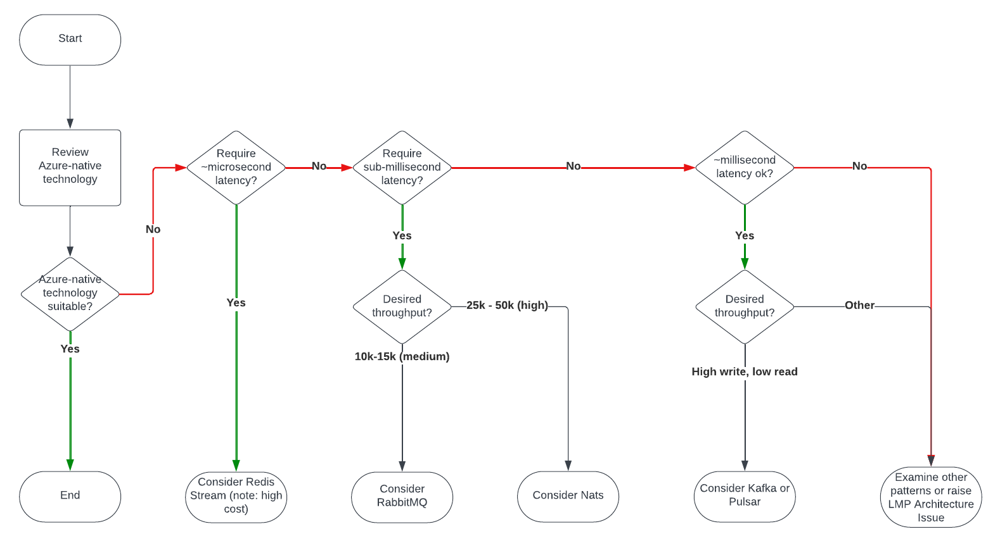

        

Document Metadata

|  |  |
|----|----|
| Identifier | **`LMP-PAT-0006`** |
| Type | **Technology Selection Pattern** |
| Status | **Published** |
| Approvals | LMP Migration Architecture Approval |
| Published on | **April 30, 2024** |
| Valid From | **April 30, 2024** |
| Authors |   |
| Tags | Message Bus & Integration |
| Technology Capabilities | Platform / Application / Message Bus & IntegrationPlatform / Data / Data Management / Integration & Distribution |

# TIBCO Rendezvous, Messaging & Event Distribution<a href="#tibco-rendezvous-messaging-event-distribution" class="headerlink" title="Permanent link">¶</a>

## Compatibility<a href="#compatibility" class="headerlink" title="Permanent link">¶</a>

The advice in this pattern pertains to the use of messaging and event distribution solutions, including TIBCO Rendezvous.

## Recommended Targets<a href="#recommended-targets" class="headerlink" title="Permanent link">¶</a>

As with other technology selections, guidance is towards Azure-native services if there is appetite for adoption of newer technology.

In this case, recommendations are:

- Azure Event Grid
- Azure Service Bus
- plus alternatives (see decision trees) in more specialist use cases

## Decision Tree Diagram<a href="#decision-tree-diagram" class="headerlink" title="Permanent link">¶</a>

## Notable Differences<a href="#notable-differences" class="headerlink" title="Permanent link">¶</a>

| Similarity |  | Event Hubs | Queue Storage | Service Bus | Event Grid |
|----|----|----|----|----|----|
| 🟢 | **Consumer** | Pub/Sub | Polling | Polling and "push-style API"<a href="#fn:3" class="footnote-ref">2</a> | Pub/Sub |
| 🟡 | **Protocols** | Kafka, AMQP, HTTP | HTTP | HTTP, AMQP 1.0 | HTTP/MQTT |
| 🔴 | **Retention** | 90 days, 1TB/CU | 500 TB (single Storage Account) | 1 GB to 80 GB | 7 day retention |
| 🟡 | **Message Size** | 1 MB (Premium) | 64 KB (\<=200 GB if combined with Blobs) | 256 KB (100 MB with 'large message support') | 512 KB |
| 🟡 | **Queue/Topic/Partition Size** | 5GB-80GB, 10k/ns | Unlimited | 10,000 topics/queues per namespace | 100 namespace topics per TU |
| 🟡 | **Number of clients** | 5,000 (AMQP)/ns | Unlimited | 5,000 concurrent receive requests | 10,000 sessions per TU |
| 🟡 | **Achievable Bandwidth** | Per Capacity Unit | 2,000 messages/sec/queue (1KB messages) | Per Messaging Unit | 1,000 messages per second per TU (inbound MQTT) |
| 🟢 | **Delivery guarantee** | At least once | At least once | At least once or at most once | At least once |
| 🟢 | **Transactions** | No | No | Yes | No |
| 🔴 | **Ordering** | Per Partition | No | FIFO | No |
| 🟡 | **Tiers/Cost** | Basic, Standard, Premium, Dedicated | By Capacity, Redundancy & Operations | Basic, Standard, Premium (MUs, Partitions) | Basic, Standard (TUs) |
| \- | **Additional Features** | \- | \- | Duplicate detection, state management | \- |

## Considerations<a href="#considerations" class="headerlink" title="Permanent link">¶</a>

### Use of TIBCO Rendezvous<a href="#use-of-tibco-rendezvous" class="headerlink" title="Permanent link">¶</a>

TIBCO Rendezvous is supported<a href="#fn:2" class="footnote-ref">1</a> on virtualised and public cloud environments, provided operating system and capacity requirements are suitable, and **provided multicast/broadcast features are not being used**.

Provided those characteristics are met, and if the application in question is not being rearchitected, it should remain suitable on cloud.

TIBCO's documentation suggests the following for Rendezvous:

### Choice of Azure Native Service<a href="#choice-of-azure-native-service" class="headerlink" title="Permanent link">¶</a>

As with other technology choices, consider whether a managed Azure service is beneficial (considering the operational impact of running bespoke software on IaaS including software and OS installation, upgrades, patching, threat management, etc.).

Azure-native services can be difficult to differentiate. See the table that follows for the key differences<a href="#fn:3" class="footnote-ref">2</a>.

> Note that the Azure documentation uses the terms "commands" and "events"<a href="#fn:1" class="footnote-ref">4</a> to help differentiate services:
>
> - If the producer expects an action from the consumer, that message is a *command*
> - If the message informs the consumer that an action has taken place, then the message is an *event*.

| Service | Purpose | Strapline | Type | When to use |
|----|----|----|----|----|
| **Event Hubs** | Big data pipeline | *Receive telemetry from millions of devices*<a href="#fn:6" class="footnote-ref">7</a> | Event streaming (series) | Telemetry and distributed data streaming |
| **Queue Storage** | Large volumes of messages | *Durable queues for large-volume cloud services*<a href="#fn:8" class="footnote-ref">8</a> | Message | Basic functionality, large volumes |
| **Service Bus** | High-value enterprise messaging | *For high-value messages that can't be lost or duplicated*<a href="#fn:7" class="footnote-ref">9</a> | Message | Order processing and financial transactions |
| **Event Grid** | Reactive programming | *Reliable event delivery at massive scale*<a href="#fn:5" class="footnote-ref">10</a> | Event distribution (discrete events) | React to status changes |

> Note: For most telemetry use cases, Datadog is preferred over Event Hubs
>
> LSEG's strategic observability platform is Datadog<a href="#fn:9" class="footnote-ref">5</a>. Use of Event Hubs for application telemetry would be discouraged, although Event Hubs may be a viable option for telemetry in cases where application functionality is impacted by the data appearing in telemetry logs.

## Alternatives<a href="#alternatives" class="headerlink" title="Permanent link">¶</a>

In cases where Azure-native technology is unsuitable, many third party options are available, including:

- RabbitMQ
- Nats &
- Nats JetStream
- Kafka
- EventHubs
- Pulsar
- Redis Stream & pub-sub
- Solace VMR
- Solace Appliance
- Aeron (Brokerless)
- ZeroMQ (end of life)

A summary, driven by internal research<a href="#fn:11" class="footnote-ref">3</a>, is as follows:

<table style="width:100%;">
<colgroup>
<col style="width: 10%" />
<col style="width: 10%" />
<col style="width: 10%" />
<col style="width: 10%" />
<col style="width: 10%" />
<col style="width: 10%" />
<col style="width: 10%" />
<col style="width: 10%" />
<col style="width: 10%" />
<col style="width: 10%" />
</colgroup>
<thead>
<tr>
<th></th>
<th>RabbitMQ</th>
<th>Nats &amp; Nats JetStream</th>
<th>Kafka</th>
<th>EventHubs</th>
<th>Pulsar</th>
<th>Redis Stream &amp; pub-sub</th>
<th>Solace VMR</th>
<th>Solace Appliance</th>
<th>Aeron (Brokerless)</th>
</tr>
</thead>
<tbody>
<tr>
<td><strong>Consumer</strong></td>
<td>Push</td>
<td>Push, Pull</td>
<td>Pull</td>
<td>Pull</td>
<td>Push</td>
<td>-</td>
<td>Push</td>
<td>-</td>
<td>-</td>
</tr>
<tr>
<td><strong>Complexity</strong></td>
<td>Medium</td>
<td>Medium</td>
<td>Medium/Hard</td>
<td>-</td>
<td>Medium/High</td>
<td>Simplest</td>
<td>-</td>
<td>-</td>
<td>Highest</td>
</tr>
<tr>
<td><strong>Cost of Running</strong></td>
<td>-</td>
<td>-</td>
<td>Medium</td>
<td>Low</td>
<td>Low/Medium</td>
<td>High</td>
<td>-</td>
<td>-</td>
<td>-</td>
</tr>
<tr>
<td><strong>Maintainability</strong> 
(admin/monitoring)</td>
<td>Medium</td>
<td>-</td>
<td>Medium/High</td>
<td>Low</td>
<td>Medium/High</td>
<td>Medium</td>
<td>-</td>
<td>-</td>
<td>-</td>
</tr>
<tr>
<td><strong>Community</strong> 
(1 = highest, 3 = lowest)</td>
<td>1</td>
<td>-</td>
<td>1</td>
<td>⅔</td>
<td>1</td>
<td>2</td>
<td>3</td>
<td>N/A</td>
<td>3</td>
</tr>
<tr>
<td></td>
<td></td>
<td></td>
<td></td>
<td></td>
<td></td>
<td></td>
<td></td>
<td></td>
<td></td>
</tr>
<tr>
<td><strong>FEATURES</strong></td>
<td></td>
<td></td>
<td></td>
<td></td>
<td></td>
<td></td>
<td></td>
<td></td>
<td></td>
</tr>
<tr>
<td><strong>Stream Processing</strong></td>
<td>✗</td>
<td>✗</td>
<td>✓</td>
<td>✓</td>
<td>✓</td>
<td>-</td>
<td>-</td>
<td>-</td>
<td>-</td>
</tr>
<tr>
<td><strong>Durability</strong></td>
<td>✓</td>
<td>✗</td>
<td>✓</td>
<td>✓</td>
<td>✓ (Retention policy configurable per group of Topics)</td>
<td>-</td>
<td>-</td>
<td>-</td>
<td>-</td>
</tr>
<tr>
<td><strong>Message Replay</strong></td>
<td>✗</td>
<td>✓</td>
<td>✓</td>
<td>✓</td>
<td>✓</td>
<td>-</td>
<td>-</td>
<td>-</td>
<td>-</td>
</tr>
<tr>
<td><strong>Delivery Guarantee</strong></td>
<td>At most, least once</td>
<td>At most once, at least once, exactly once</td>
<td>At most once, at least once, exactly once</td>
<td>at least once, exactly once</td>
<td>At most once, at least once, exactly once</td>
<td>-</td>
<td>-</td>
<td>-</td>
<td>-</td>
</tr>
<tr>
<td><strong>Order of Delivery</strong></td>
<td>Guaranteed out-of-the-box</td>
<td>Not guaranteed</td>
<td>Guaranteed only per partition</td>
<td>Not guaranteed</td>
<td>Guaranteed (per message key or per producer)</td>
<td>-</td>
<td>-</td>
<td>-</td>
<td>-</td>
</tr>
<tr>
<td><strong>Schema Registry</strong></td>
<td>✗</td>
<td>✗</td>
<td>✓</td>
<td>✓</td>
<td>✓</td>
<td>-</td>
<td>-</td>
<td>-</td>
<td>-</td>
</tr>
<tr>
<td></td>
<td></td>
<td></td>
<td></td>
<td></td>
<td></td>
<td></td>
<td></td>
<td></td>
<td></td>
</tr>
<tr>
<td><strong>MESSAGING PATTERN</strong></td>
<td></td>
<td></td>
<td></td>
<td></td>
<td></td>
<td></td>
<td></td>
<td></td>
<td></td>
</tr>
<tr>
<td><strong>Point-to-point</strong></td>
<td>✓</td>
<td>✓</td>
<td>✗</td>
<td>✗</td>
<td>✓</td>
<td>✓ (Exclusive)</td>
<td>-</td>
<td>-</td>
<td>-</td>
</tr>
<tr>
<td><strong>Pub-sub</strong></td>
<td>✓</td>
<td>✓</td>
<td>✓</td>
<td>✓</td>
<td>✓</td>
<td>✓ (Shared)</td>
<td>-</td>
<td>-</td>
<td>-</td>
</tr>
<tr>
<td><strong>Req-Reply</strong></td>
<td>✓</td>
<td>✓</td>
<td>✗</td>
<td>✗</td>
<td>✗</td>
<td>-</td>
<td>-</td>
<td>-</td>
<td>-</td>
</tr>
<tr>
<td><strong>Built-in Routing functionality</strong></td>
<td>✓</td>
<td>✗</td>
<td>✗</td>
<td>-</td>
<td>✗</td>
<td>-</td>
<td>-</td>
<td>-</td>
<td>-</td>
</tr>
<tr>
<td><strong>Advanced Patterns</strong></td>
<td>Most extensive support for advanced patterns and routing support 
It has pluggable exchange type support that can be used to implement complex patterns.</td>
<td>load-balanced queue subscriber patterns 
Dynamic request permissioning 
request subject obfuscation</td>
<td>Topic partitioning for parallel consumption</td>
<td>-</td>
<td>Topic partitioning for parallel consumption 
Retry and Dead Letter topics 
Serverless Functions</td>
<td>-</td>
<td>-</td>
<td>-</td>
<td>-</td>
</tr>
</tbody>
</table>

## Further Reading<a href="#further-reading" class="headerlink" title="Permanent link">¶</a>

### Kafka<a href="#kafka" class="headerlink" title="Permanent link">¶</a>

- [Apache Kafka migration to Azure - Azure Architecture Center \| Microsoft Learn](https://learn.microsoft.com/en-us/azure/architecture/guide/hadoop/apache-kafka-migration)
- [Migrate Kafka to Azure infrastructure as a service (IaaS)](https://learn.microsoft.com/en-us/azure/architecture/guide/hadoop/apache-kafka-migration#migrate-kafka-to-azure-infrastructure-as-a-service-iaas)
- [Migrate Kafka to Azure Event Hubs for Kafka](https://learn.microsoft.com/en-us/azure/architecture/guide/hadoop/apache-kafka-migration#migrate-kafka-to-azure-event-hubs-for-kafka)
- [Migrate Kafka on Azure HDInsight](https://learn.microsoft.com/en-us/azure/architecture/guide/hadoop/apache-kafka-migration#migrate-kafka-on-azure-hdinsight)
- [Use AKS with Kafka on HDInsight](https://learn.microsoft.com/en-us/azure/architecture/guide/hadoop/apache-kafka-migration#use-aks-with-kafka-on-hdinsight)

### RabbitMQ<a href="#rabbitmq" class="headerlink" title="Permanent link">¶</a>

- [Integration options for RabbitMQ with Azure Service Bus](https://learn.microsoft.com/en-us/azure/service-bus-messaging/service-bus-integrate-with-rabbitmq)
- [Migrating/Displacing the transport to Service Bus from RabbitMQ](https://programmingwithwolfgang.com/replace-rabbitmq-azure-service-bus-queue/)
- [RabbitMQ Server on Windows Server on Marketplace](https://cloudinfrastructureservices.co.uk/how-to-setup-rabbitmq-on-windows-server-in-azure-aws-gcp/)

### TIBCO Enterprise Message Service on Azure Marketplace<a href="#tibco-enterprise-message-service-on-azure-marketplace" class="headerlink" title="Permanent link">¶</a>

- [TIBCO Enterprise Message Service on Azure Marketplace](https://portal.azure.com/#view/Microsoft_Azure_Marketplace/GalleryItemDetailsBladeNopdl/id/tibco-software.enterprise-message-service/selectionMode~/false/resourceGroupId//resourceGroupLocation//dontDiscardJourney~/false/selectedMenuId/home/launchingContext~/%7B%22galleryItemId%22%3A%22tibco-software.enterprise-message-serviceems840-linux-template%22%2C%22source%22%3A%5B%22GalleryFeaturedMenuItemPart%22%2C%22VirtualizedTileDetails%22%5D%2C%22menuItemId%22%3A%22home%22%2C%22subMenuItemId%22%3A%22Search%20results%22%2C%22telemetryId%22%3A%22db9d9015-e384-4300-964a-46234f46c385%22%7D/searchTelemetryId/cf970bc2-8af4-490c-8271-966a7f9f5d4d)

### Azure Relay<a href="#azure-relay" class="headerlink" title="Permanent link">¶</a>

- **Azure Relay**<a href="#fn:10" class="footnote-ref">6</a> - "Securely expose services that run in your corporate network without opening a port on your firewall, or making intrusive changes to your corporate network infrastructure." Can be used in conjunction with Service Bus

------------------------------------------------------------------------

1.  

    [TIBCO Support Guide](https://docs.tibco.com/pub/tibco-support-guide/html/Default.htm?_ga=2.102578753.1338020770.1681169651-862170277.1636594297#virtualized-and-public-cloud-environment-support.htm?TocPath=Support%2520Policies%257C_____4) <a href="#fnref:2" class="footnote-backref" title="Jump back to footnote 1 in the text">↩︎</a>

    

2.  

    [Compare Messaging Services](https://learn.microsoft.com/en-us/azure/service-bus-messaging/compare-messaging-services) <a href="#fnref:3" class="footnote-backref" title="Jump back to footnote 2 in the text">↩︎</a><a href="#fnref2:3" class="footnote-backref" title="Jump back to footnote 2 in the text">↩︎</a>

    

3.  

    [Messaging Technology Benchmarking](https://confluence.refinitiv.com/pages/viewpage.action?pageId=1057639104) <a href="#fnref:11" class="footnote-backref" title="Jump back to footnote 3 in the text">↩︎</a>

    

4.  

    [Asynchronous messaging options - Azure Architecture Center](https://learn.microsoft.com/en-us/azure/architecture/guide/technology-choices/messaging) <a href="#fnref:1" class="footnote-backref" title="Jump back to footnote 4 in the text">↩︎</a>

    

5.  

    [ADR: Use Datadog SaaS for Application & Resource monitoring](../../../adrs/event-management/0003-use-datadog-for-application-and-resource-monitoring/) <a href="#fnref:9" class="footnote-backref" title="Jump back to footnote 5 in the text">↩︎</a>

    

6.  

    [Azure Relay Overview](https://learn.microsoft.com/en-us/azure/azure-relay) <a href="#fnref:10" class="footnote-backref" title="Jump back to footnote 6 in the text">↩︎</a>

    

7.  

    [Event Hubs Overview](https://learn.microsoft.com/en-us/azure/event-hubs/) <a href="#fnref:6" class="footnote-backref" title="Jump back to footnote 7 in the text">↩︎</a>

    

8.  

    [Storage Queues Introduction](https://learn.microsoft.com/en-gb/azure/storage/queues/storage-queues-introduction) <a href="#fnref:8" class="footnote-backref" title="Jump back to footnote 8 in the text">↩︎</a>

    

9.  

    [Service Bus Overview](https://learn.microsoft.com/en-us/azure/service-bus-messaging/service-bus-messaging-overview) <a href="#fnref:7" class="footnote-backref" title="Jump back to footnote 9 in the text">↩︎</a>

    

10. 

    [Event Grid Overview](https://learn.microsoft.com/en-us/azure/event-grid/overview) <a href="#fnref:5" class="footnote-backref" title="Jump back to footnote 10 in the text">↩︎</a>

    

    May 30, 2025      June 7, 2024 

 Previous 

External System Authentication Patterns

 Next 

Azure API Management Service Pattern

Made with <a href="https://squidfunk.github.io/mkdocs-material/" target="_blank" rel="noopener">Material for MkDocs</a>

