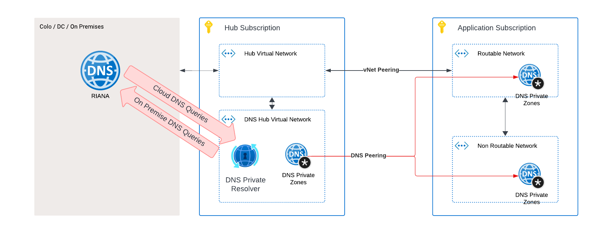

        

Document Metadata

|  |  |
|----|----|
| Identifier | **`LMP-PAT-0023`** |
| Type | **Functional Design Pattern** |
| Status | **Published** |
| Approvals | LMP Migration Architecture Approval |
| Published on | **August 19, 2024** |
| Valid From | **August 19, 2024** |
| Authors |   |
| Tags | NetworkDomain Services |
| Technology Capabilities | Infrastructure / Network / Domain Services |

# Private DNS Resolution<a href="#private-dns-resolution" class="headerlink" title="Permanent link">¶</a>

This pattern is condensed from the [Foundation STAR DA-002](https://lsegroup.sharepoint.com/:w:/r/teams/LMFoundationFM/_layouts/15/Doc.aspx?sourcedoc=%7B837C508D-D1E5-459B-B62C-2BB51C2DFD48%7D)

## Network Architecture Overview<a href="#network-architecture-overview" class="headerlink" title="Permanent link">¶</a>

1.  Application Subscriptions: - Each application subscription has two VNets: a. Routable VNet b. Non-routable VNet - Both VNets have a private DNS zone attached

2.  Hub Networks: - Contain outbound and inbound Azure Private Resolvers

## DNS Resolution Process<a href="#dns-resolution-process" class="headerlink" title="Permanent link">¶</a>

### Within Application Subscription VNets<a href="#within-application-subscription-vnets" class="headerlink" title="Permanent link">¶</a>

- Endpoints use the private IP `168.63.129.16` for DNS resolution within their own VNets. This is the IP address the [Azure private resolver can be reached on](https://learn.microsoft.com/en-us/azure/virtual-network/what-is-ip-address-168-63-129-16)
- Resolves private DNS names, both in cloud and on premise, as well as internet names

### Cross-Premises Resolution<a href="#cross-premises-resolution" class="headerlink" title="Permanent link">¶</a>

1.  Outbound (Azure to On-Premises): - Hub networks use outbound Azure Private Resolvers - These resolvers conditionally forward DNS requests to on-premises servers - Used for resolving names in on-premises networks

2.  Inbound (On-Premises to Azure): - Hub networks have inbound Private Resolvers - On-premises DNS services (RIANA) conditionally forward DNS requests to Azure Private DNS using these resolvers

    May 30, 2025      September 11, 2024 

 Previous 

Outbound Internet Connectivity

 Next 

ZScaler Private Access Connectivity for Internal Access

Made with <a href="https://squidfunk.github.io/mkdocs-material/" target="_blank" rel="noopener">Material for MkDocs</a>

