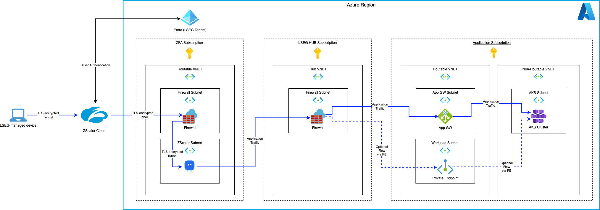

        

Document Metadata

|  |  |
|----|----|
| Identifier | **`LMP-PAT-0026`** |
| Type | **Functional Design Pattern** |
| Status | **Published** |
| Approvals | LMP Migration Architecture Approval |
| Published on | **September 23, 2024** |
| Valid From | **September 23, 2024** |
| Authors |   |
| Tags | Network |
| Technology Capabilities | Infrastructure / Network / Virtual Private Network |

# ZScaler Private Access Connectivity for Internal Access<a href="#zscaler-private-access-connectivity-for-internal-access" class="headerlink" title="Permanent link">¶</a>

This pattern is extracted from [Foundation STAR DA-801 - ZScaler Private Access App Connector Deployment in ALZ](https://lsegroup.sharepoint.com/:w:/r/teams/LMFoundationFM/_layouts/15/Doc.aspx?sourcedoc=%7BA978CABD-79DE-4F79-ACCB-3CBD964E384A%7D&file=STAR%20DA-801%20Zscaler%20Private%20Access%20App%20Connector%20Deployment%20in%20ALZ.docx&action=default&mobileredirect=true).

## Requirement / Story<a href="#requirement-story" class="headerlink" title="Permanent link">¶</a>

> As an application engineer, I would like to be able to allow my application to, at runtime, receive connections from LSEG staff EUC devices so that it can provide service to those users

## Scope<a href="#scope" class="headerlink" title="Permanent link">¶</a>

- Application endpoints that *only* serve IP traffic to LSEG staff on LSEG-managed end-user compute (EUC) devices (e.g. Laptop, VDI etc.) for BAU activities.
- As above, but also for operations / break-glass purposes.

Application endpoints that also serve non-LSEG staff identities (customers, other systems etc.) are out of scope.

This pattern is appropriate for describing how to meet the current [Minimum Entry Criteria](https://lsegroup.sharepoint.com/:x:/s/ats/EVBJWaa7IC1JtYXI-Xa1_iMB0I6_KRiUv9xEVz75HEG40w?e=09KGxB) §MEC-V3_2-18:

> All systems used by Internal users, must use Zscaler Private Access as the method to provide access from LSEG End User Compute devices.

## Background<a href="#background" class="headerlink" title="Permanent link">¶</a>

[ZScaler Private Access](https://help.zscaler.com/zpa/what-zscaler-private-access) is a product from ZScaler that is used by LSEG to enable access from LSEG-managed EUC devices. LSEG-managed devices are configured with a [ZScaler Client Connector](https://www.zscaler.com/products-and-solutions/zscaler-client-connector) agent, which manages the ZScaler configuration of their device and authenticates that user to ZScaler's infrastructure with their LSEG Entra identity.

The ZScaler Client Connector establishes a tunnel connection to ZScaler's private access infrastructure, and then configures the EUC device to route certain requests (via DNS and IP routing) down that tunnel. On the LSEG application side, we deploy a number of [ZScaler App Connectors](https://help.zscaler.com/zpa/about-connectors) within our infrastructure. The ZScaler infrastructure is then configured to route client traffic to the correct App Connector based on the client and requested destination.

## Principles<a href="#principles" class="headerlink" title="Permanent link">¶</a>

- App Connectors are deployed into specific ZPA Azure Subscriptions, with multiple connectors deployed into each region. These are centrally deployed and managed by the Cloud and CyberSec teams.
- The App Connector initiates a connection out to the ZPA Cloud via the ZPA Subscription Firewall.
- Application traffic from the EUC device flows through ZScaler's cloud in a TLS-encrypted tunnel.
- The application's published DNS name should resolve to an endpoint in the application's routable VNET, typically an App GW instance or a private endpoint.
- Once the application URL is onboarded to ZPA, the client connectors will be configured to send traffic through the ZPA Cloud and then to the correct regional App Connector. From there, it is routed through the LSEG HUB firewall and to the endpoint hosted in the application's routable VNET.
- The application team is responsible for: - correctly forwarding the traffic from their App GW or Private Endpoint to the correct infrastructure, - maintaining their DNS name, and - [onboarding their application with ZPA](https://lsegroup.sharepoint.com/sites/CloudCentral/SitePages/ZScaler-Private-Access-(ZPA)-%E2%80%93-Application-Onboarding-Process.aspx).

## Deployment Diagram<a href="#deployment-diagram" class="headerlink" title="Permanent link">¶</a>

    May 30, 2025      September 25, 2024 

 Previous 

Private DNS Resolution

 Next 

SaaS Tenant On-Premise Connectivity for Fabric

Made with <a href="https://squidfunk.github.io/mkdocs-material/" target="_blank" rel="noopener">Material for MkDocs</a>

