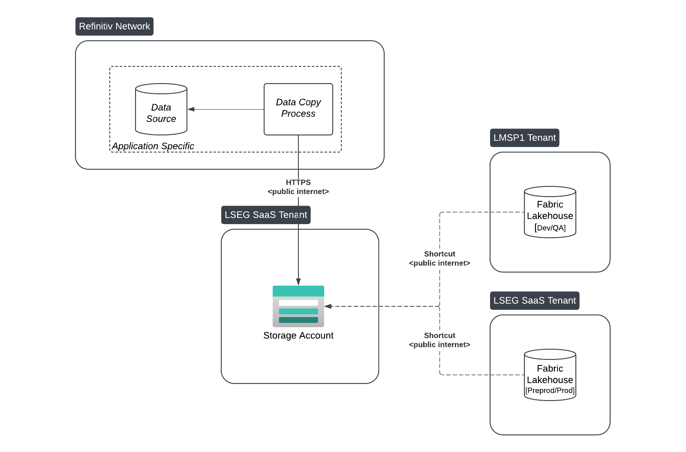

        

Document Metadata

|  |  |
|----|----|
| Identifier | **`LMP-PAT-0039`** |
| Type | **Functional Design Pattern** |
| Status | **Published** |
| Approvals | LMP Migration Architecture Approval |
| Published on | **November 04, 2024** |
| Valid From | **October 16, 2024** |
| Authors |   |
| Tags | Network |
| Technology Capabilities | Infrastructure / Network / Data Network |

# SaaS Tenant On-Premise Connectivity for Fabric<a href="#saas-tenant-on-premise-connectivity-for-fabric" class="headerlink" title="Permanent link">¶</a>

This pattern has been extracted from:

- [Data Intelligence - Data-as-a-Service Release 1](https://lsegroup.sharepoint.com/:w:/r/teams/LMDataPlatform/Shared%20Documents/CH%20-%20Tech%20Architecture/Working%20Docs/Solution%20Designs%20(SADs-STARs-etc)/DaaS%20R1%20Prod%20SAD/Data%20Intelligence%20-%20Data-as-a-Service%20Release%201%20-%20Prod.docx?d=w44fa8c3af29a40c0a187b14ee3b43214&csf=1&web=1&e=OsRjGA)
- [SAD - Data Discovery](https://lsegroup.sharepoint.com/:w:/r/teams/LMDataPlatform/Shared%20Documents/CH%20-%20Tech%20Architecture/Working%20Docs/Solution%20Designs%20(SADs-STARs-etc)/Data%20Discovery/SAD%20-%20Data%20Discovery.docx?d=w94a5d8292c6d478da89d8d6797730b82&csf=1&web=1&e=JMc9w2)

## Introduction<a href="#introduction" class="headerlink" title="Permanent link">¶</a>

The LMP ecosystem comprises multiple tenants, each designated for specific use cases. The LSEG SaaS and LMSP1 tenants support development, preproduction, and production environments for customer-facing workloads. However, neither tenant currently has ExpressRoute connectivity to on-premises infrastructure.

Ensuring connectivity for LSEG SaaS and LMSP1 tenants is crucial as many teams require access to on-premise systems for access to existing content and services.

While the long-term solution involves establishing direct connectivity, this pattern focuses on approved tactical options specifically for on-premises connectivity to support loading existing data into Fabric. These options include routing traffic from the LSEG SaaS and LMSP1 tenants through the LSEG.com tenant, providing a temporary solution until direct connectivity is available.

## Scope<a href="#scope" class="headerlink" title="Permanent link">¶</a>

This pattern is applicable to:

- Sourcing and collection of data from internal on-prem systems to Fabric in LMSP1 or LSEG SaaS tenants

## Pattern Definition<a href="#pattern-definition" class="headerlink" title="Permanent link">¶</a>

There are 4 main components to this pattern:

1.  **On-Premises Data Source**: The data originates from an on-premises system, which can be accessed via API
2.  **Data Copy Process**: A data copy process that connects to the on-prem data source and pulls data for processing and storage
3.  **Azure Storage Account**: The data is stored in an Azure storage account within an LSEG Azure tenant. This storage account acts as a centralized repository that holds the copied data, enabling it to be read by other Azure-based applications
4.  **Fabric Shortcut Creation**: Microsoft Fabric (hosted on LSEG’s LMSP1 or SaaS environment) uses shortcuts to access data in the Azure storage account directly, providing a data access layer for analytics or other services in the Fabric environment

The details for steps 1 & 2 are application specific and outside the scope of this pattern. For steps 3 & 4, two re-usable approaches are described below.

## Implementation Approaches<a href="#implementation-approaches" class="headerlink" title="Permanent link">¶</a>

### 1. 'Push' Content to LSEG SaaS Tenant (Preferred)<a href="#1-push-content-to-lseg-saas-tenant-preferred" class="headerlink" title="Permanent link">¶</a>

In this approach, the data copy process transfers data directly to a storage account in the LSEG SaaS/LMSP1 tenant, making it natively accessible within those Fabric environments.

Process:

- **Data Transfer**: Data is copied to a storage account within the LSEG SaaS tenant, utilizing private endpoints to restrict access, ensuring data transfer security
- **Shortcut Creation in Fabric**: Shortcuts are then created within Fabric (in the LSEG SaaS/LMSP1 environment) to access the data stored in this storage account

Notes:

- Data is natively available in the LSEG SaaS tenant, potentially reducing latency for LSEG SaaS uses
- Simplifies access management within the LSEG SaaS as data is already co-located in the tenant
- Moving data between tenants introduces additional complexity and may require additional compliance considerations, depending on data sensitivity and regulatory requirements
- Suited to applications or teams within LSEG SaaS/LMSP1 that need centralized shared access to staged data, without requiring cross-tenant data pulls from LSEG.com
- Provides a level of abstraction, so that when the network path changes, access by consumers is not impacted

### 2. 'Pull' Content from LSEG.com Tenant (Alternative)<a href="#2-pull-content-from-lsegcom-tenant-alternative" class="headerlink" title="Permanent link">¶</a>

In this approach, the data copy process within the LSEG.com tenant pulls data from the on-premises source and stores it in a storage account within the same tenant (LSEG.com).

Process:

- **Data Transfer**: Data from the on-premises system is transferred to a storage account within the LSEG.com tenant, accessed via private endpoints to ensure secure access
- **Shortcut Creation in Fabric**: Shortcuts are created within LSEG SaaS/LMSP1 Fabric to access data from the LSEG.com storage account. This provides Fabric users direct access to the data while keeping it securely within the LSEG.com environment

Notes:

- Data remains within the LSEG.com tenant, which may simplify management for teams already familiar with this environment
- Minimizes the need for data movement between tenants, reducing complexity
- Suited for use cases where the target architecture doesn't require a shared storage account to stage the data in LSEG SaaS/LMSP1, even if ExpressRoute connectivity is available

### 3. 'Push' from On-Premise (Alternative)<a href="#3-push-from-on-premise-alternative" class="headerlink" title="Permanent link">¶</a>

In this approach, the data copy process runs directly on-premises and pushes data straight to a storage account in the LSEG SaaS/LMSP1 Fabric environment. This allows data to be uploaded directly from on-premises systems to Fabric without needing intermediary storage in the LSEG.com tenant.

Process:

- **Data Transfer**: The on-premises data copy process sends data directly to a designated storage account in LSEG SaaS/LMSP1. ExpressRoute is not available, so this transfer will go via the internet
- **Shortcut Creation in Fabric**: Shortcuts are then created within Fabric (in the LSEG SaaS/LMSP1 environment) to access the data stored in this storage account

Notes:

- Streamlines setup by not needing to deploy components to LSEG.com
- Requires creation and deployment of new components to on-prem infrastructure that has access to the source data
- Transfer of data from on-premise to LSEG SaaS/LMPS1 uses internet connectivity
- Provides a level of abstraction, so that when the network path changes, access by consumers is not impacted
- Security approval has been given for use of outbound connectivity from on-premise infrastructure for select protocols, including HTTPS

## Shared Storage Account Considerations<a href="#shared-storage-account-considerations" class="headerlink" title="Permanent link">¶</a>

Each option above includes a centralized storage account to enable data sharing between LMSP1 and LSEG SaaS Fabric environments. This shared storage account approach is use case-dependent and is particularly relevant for scenarios where multiple environments (e.g., dev, qa, preprod, and prod) all require access to the same production data. By providing a single, shared storage account, this fan-out model minimizes the need to copy data multiple times, reducing the overall cost and decreasing the load on on-prem systems. If fan-out is not desirable, separate storage accounts should be preferred.

## Security Approvals<a href="#security-approvals" class="headerlink" title="Permanent link">¶</a>

All the options described have previously received security approval during SAD/STAR review.

## Shortcut Authorization<a href="#shortcut-authorization" class="headerlink" title="Permanent link">¶</a>

SAS token authorization is required for the creation of cross-tenant shortcuts. The SAS token should be configured with minimum permissions: List and Read.

## Private Endpoint Considerations<a href="#private-endpoint-considerations" class="headerlink" title="Permanent link">¶</a>

Although it’s recommended to use private endpoints for Fabric shortcuts, this setting is applied at the tenant level. Because private endpoints cannot be configured on a per-workspace basis, private endpoint configuration at the LSEG SaaS/LMSP1 level is not feasible.

## Recommendation<a href="#recommendation" class="headerlink" title="Permanent link">¶</a>

Option 1 is recommended

- Does not require deploying new components to legacy infrastructure
- Provides enough abstraction to avoid impacting consumers to future networking changes when ExpressRoute becomes available in LSEG SaaS
- Minimises public network transfers

## Applicability<a href="#applicability" class="headerlink" title="Permanent link">¶</a>

This pattern is intended as an interim solution and will no longer be recommended once ExpressRoute connectivity from LSEG SaaS and LMSP1 tenants is available.

    May 30, 2025      November 14, 2024 

 Previous 

ZScaler Private Access Connectivity for Internal Access

 Next 

Azure Greenfield to Azure non-Greenfield connectivity

Made with <a href="https://squidfunk.github.io/mkdocs-material/" target="_blank" rel="noopener">Material for MkDocs</a>

