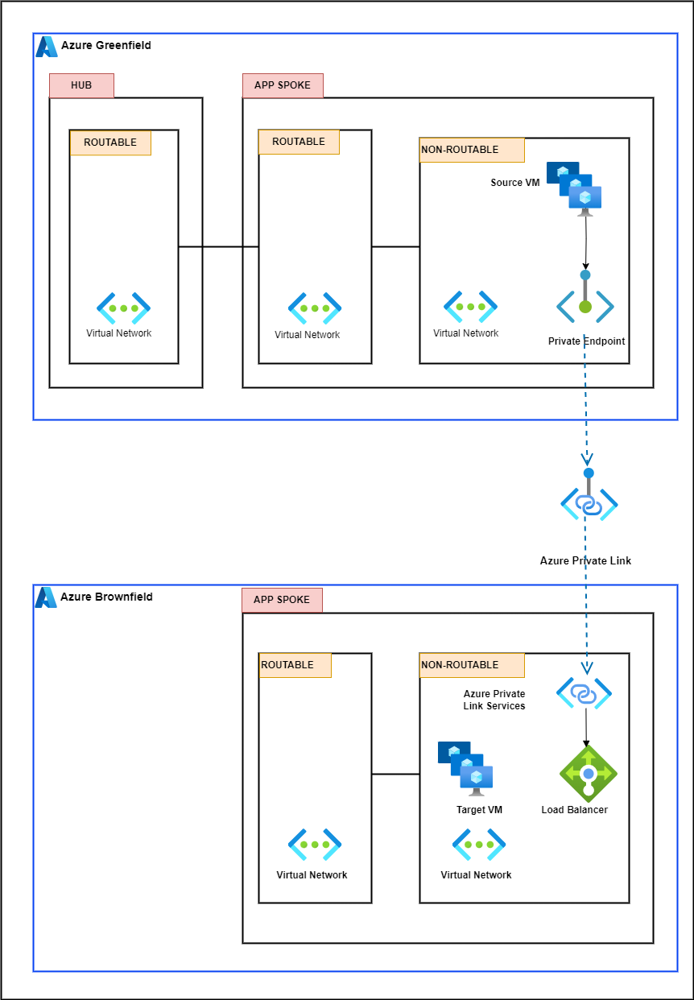

        

Document Metadata

|  |  |
|----|----|
| Identifier | **`LMP-PAT-0042`** |
| Type | **Functional Design Pattern** |
| Status | **Published** |
| Approvals | LMP Migration Architecture Approval |
| Published on | **December 16, 2024** |
| Valid From | **December 16, 2024** |
| Authors |   |
| Tags | NetworkInternet |
| Technology Capabilities | Infrastructure / Network / Data Network |

# Azure Greenfield to Azure non-Greenfield connectivity<a href="#azure-greenfield-to-azure-non-greenfield-connectivity" class="headerlink" title="Permanent link">¶</a>

## Requirement / Story<a href="#requirement-story" class="headerlink" title="Permanent link">¶</a>

> As an application engineer, I need to consume services hosted in an Azure non-Greenfield subscription from my Azure Greenfield subscription, at runtime. I need to initiate the session from Azure Greenfield.

## Scope<a href="#scope" class="headerlink" title="Permanent link">¶</a>

- IP traffic originating from components deployed in either the application’s routable or non-routable Virtual Network ( VNET) within the Azure Greenfield subscription.
- DNS resolution is out of scope.

## Principles<a href="#principles" class="headerlink" title="Permanent link">¶</a>

- In the Azure non-Greenfield subscription, the ‘provider service’ creates an Azure Private Link Service that is associated with an Azure Load Balancer, which is in turn, associated with VM2 or services residing within the providing service VNET.
- The application engineer creates a local Azure Private Endpoint that is 'attached' to the Azure Private Service; this creates a virtual IP in the subnet.
- The application engineer targets the local virtual IP to consume the 'provider service'.
- The traffic flow is forwarded through the Microsoft Azure backbone.
- Traffic can only be established from the Greenfield subscription to the non-Greenfield 'provider service'.
- Overlapping IP addresses of the VNETs are permitted as the Microsoft Private Link service caters for this.

## General ALZ connectivity between Azure subscriptions<a href="#general-alz-connectivity-between-azure-subscriptions" class="headerlink" title="Permanent link">¶</a>

## Scenarios Covered<a href="#scenarios-covered" class="headerlink" title="Permanent link">¶</a>

> As well as Greenfield to non-Greenfield connectivity, this pattern covers all inter/intra Azure connectivity i.e.

- Greenfield to Greenfield
- Non-Greenfield to Greenfield
- Non-Greenfield to Non-Greenfield

    May 30, 2025      November 22, 2024 

 Previous 

SaaS Tenant On-Premise Connectivity for Fabric

 Next 

Customer Connectivity Hub Connectivity (aka Rejoice/DDN)

Made with <a href="https://squidfunk.github.io/mkdocs-material/" target="_blank" rel="noopener">Material for MkDocs</a>

